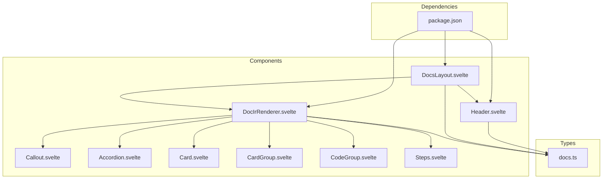
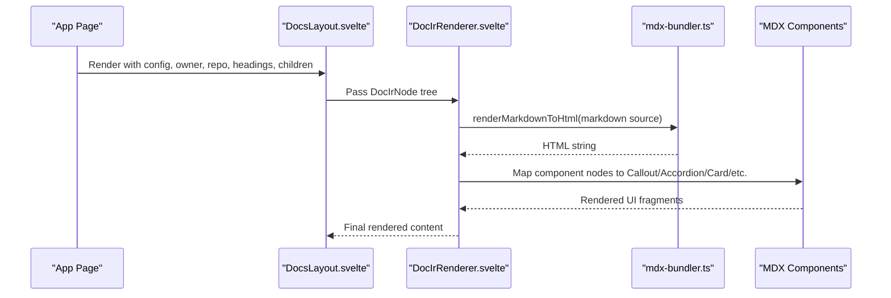
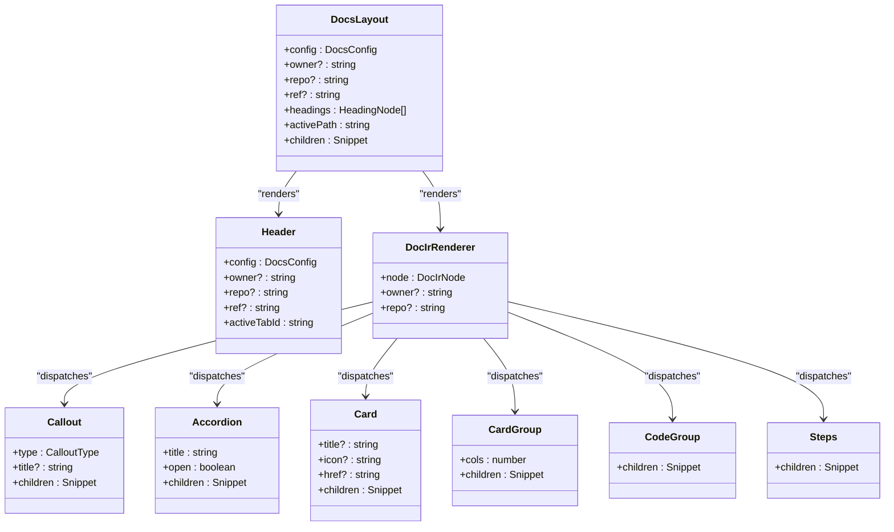

# Components Library

<cite>
**Referenced Files in This Document**
- [DocsLayout.svelte](file://src/lib/components/DocsLayout.svelte)
- [Header.svelte](file://src/lib/components/Header.svelte)
- [DocIrRenderer.svelte](file://src/lib/components/DocIrRenderer.svelte)
- [Callout.svelte](file://src/lib/components/mdx/Callout.svelte)
- [Accordion.svelte](file://src/lib/components/mdx/Accordion.svelte)
- [Card.svelte](file://src/lib/components/mdx/Card.svelte)
- [CardGroup.svelte](file://src/lib/components/mdx/CardGroup.svelte)
- [CodeGroup.svelte](file://src/lib/components/mdx/CodeGroup.svelte)
- [Steps.svelte](file://src/lib/components/mdx/Steps.svelte)
- [docs.ts](file://src/lib/types/docs.ts)
- [package.json](file://package.json)
</cite>

## Table of Contents
1. [Introduction](#introduction)
2. [Project Structure](#project-structure)
3. [Core Components](#core-components)
4. [Architecture Overview](#architecture-overview)
5. [Detailed Component Analysis](#detailed-component-analysis)
6. [Dependency Analysis](#dependency-analysis)
7. [Performance Considerations](#performance-considerations)
8. [Troubleshooting Guide](#troubleshooting-guide)
9. [Conclusion](#conclusion)

## Introduction
This document provides comprehensive documentation for the FractalDocs components library, focusing on layout and MDX components used to render rich documentation pages. It covers:
- DocsLayout as the main page container with sidebar navigation and table of contents
- Header for top-level navigation, search, AI assistant, and theme toggling
- DocIrRenderer for dynamic rendering of MDX content into interactive UI elements
- MDX components: Callout variants (note, info, warning, tip, danger), Accordion, Card, CardGroup, CodeGroup, and Steps

It also includes guidance on props, events, customization, responsive design, accessibility, theming, composition patterns, and integration within the broader FractalDocs ecosystem.

## Project Structure
The components are organized under src/lib/components, with MDX-specific components in a dedicated mdx subfolder. Types and configuration interfaces live in types/docs.ts. The project uses Svelte 5, Tailwind CSS, and Shiki for syntax highlighting.

**Diagram sources**
- [DocsLayout.svelte:1-105](file://src/lib/components/DocsLayout.svelte#L1-L105)
- [Header.svelte:1-161](file://src/lib/components/Header.svelte#L1-L161)
- [DocIrRenderer.svelte:1-117](file://src/lib/components/DocIrRenderer.svelte#L1-L117)
- [Callout.svelte:1-65](file://src/lib/components/mdx/Callout.svelte#L1-L65)
- [Accordion.svelte:1-32](file://src/lib/components/mdx/Accordion.svelte#L1-L32)
- [Card.svelte:1-40](file://src/lib/components/mdx/Card.svelte#L1-L40)
- [CardGroup.svelte:1-18](file://src/lib/components/mdx/CardGroup.svelte#L1-L18)
- [CodeGroup.svelte:1-20](file://src/lib/components/mdx/CodeGroup.svelte#L1-L20)
- [Steps.svelte:1-16](file://src/lib/components/mdx/Steps.svelte#L1-L16)
- [docs.ts:1-82](file://src/lib/types/docs.ts#L1-L82)
- [package.json:1-49](file://package.json#L1-L49)

**Section sources**
- [DocsLayout.svelte:1-105](file://src/lib/components/DocsLayout.svelte#L1-L105)
- [Header.svelte:1-161](file://src/lib/components/Header.svelte#L1-L161)
- [DocIrRenderer.svelte:1-117](file://src/lib/components/DocIrRenderer.svelte#L1-L117)
- [docs.ts:1-82](file://src/lib/types/docs.ts#L1-L82)
- [package.json:1-49](file://package.json#L1-L49)

## Core Components
- DocsLayout: Main page shell providing a sticky header, left sidebar navigation, center content area, and right table of contents. Accepts configuration, owner/repo/ref, headings, activePath, and children snippet.
- Header: Top bar with logo, version badge, tabs, search modal, Ask AI modal, GitHub link, and theme toggle. Supports keyboard shortcuts and resolves links based on repository context.
- DocIrRenderer: Recursively renders an IR node tree into UI, mapping component nodes to MDX components, code blocks to syntax-highlighted figures, markdown to HTML via bundler, and raw HTML directly.

Key behaviors:
- Link resolution adapts to repository context when owner/repo are provided
- Active path detection highlights current sidebar items
- Right TOC is sticky and indented by heading depth
- Code blocks include copy-to-clipboard functionality and optional titles

**Section sources**
- [DocsLayout.svelte:1-105](file://src/lib/components/DocsLayout.svelte#L1-L105)
- [Header.svelte:1-161](file://src/lib/components/Header.svelte#L1-L161)
- [DocIrRenderer.svelte:1-117](file://src/lib/components/DocIrRenderer.svelte#L1-L117)

## Architecture Overview
The rendering pipeline transforms MDX into an intermediate representation (IR) and then renders it using DocIrRenderer, which dispatches to specific MDX components. Layout and navigation are handled by DocsLayout and Header.

**Diagram sources**
- [DocIrRenderer.svelte:1-117](file://src/lib/components/DocIrRenderer.svelte#L1-L117)
- [DocsLayout.svelte:1-105](file://src/lib/components/DocsLayout.svelte#L1-L105)

## Detailed Component Analysis

### DocsLayout
Responsibilities:
- Provides a full-height layout with sticky header and scrollable content
- Renders left sidebar from config.sidebar groups and pages
- Renders right table of contents from headings array
- Resolves relative hrefs to repository-aware paths

Props:
- config: DocsConfig object defining name, logo, tabs, sidebar, etc.
- owner, repo, ref: Optional repository metadata for link resolution and display
- headings: Array of HeadingNode for TOC
- activePath: Current route path for highlighting active sidebar item
- children: Snippet of page content

Behavior:
- Sidebar items are highlighted when activePath matches or ends with page.href
- Links starting with http(s) or # pass through unchanged; otherwise prefixed with /owner/repo
- TOC entries are indented based on heading.depth

Responsive design:
- Sidebar hidden on small screens (md breakpoint)
- TOC hidden until lg breakpoint
- Content area flexes to fill available space

Accessibility:
- Semantic aside/main structure
- Proper link roles and hover states
- Keyboard-friendly navigation

Theming:
- Uses Tailwind semantic tokens (background, foreground, border, muted, primary)
- Dark mode supported via class toggling at root

Usage pattern:
- Wrap your page content inside DocsLayout and pass config/headings/activePath
- Provide children snippet containing DocIrRenderer output

**Section sources**
- [DocsLayout.svelte:1-105](file://src/lib/components/DocsLayout.svelte#L1-L105)
- [docs.ts:29-33](file://src/lib/types/docs.ts#L29-L33)

### Header
Responsibilities:
- Displays logo (light/dark), title, and optional version badge
- Renders tabs configured via config.tabs
- Opens SearchModal and AskAiModal
- Provides theme toggle and GitHub link

Props:
- config: DocsConfig including logo, social, tabs
- owner, repo, ref: Repository metadata
- activeTabId: Currently active tab id or title

Events and interactions:
- Keyboard shortcuts: Cmd/Ctrl+K opens search; Cmd/Ctrl+I opens Ask AI
- Theme toggle adds/removes dark class on documentElement
- Tab selection updates data-active attribute for styling

Link resolution:
- External URLs pass through
- Internal links prefixed with /owner/repo when present

Accessibility:
- aria-label on buttons and links where appropriate
- Keyboard shortcuts documented visually with kbd elements

Theming:
- Uses semantic color tokens and hover states
- Dark mode icons swap automatically

**Section sources**
- [Header.svelte:1-161](file://src/lib/components/Header.svelte#L1-L161)
- [docs.ts:53-74](file://src/lib/types/docs.ts#L53-L74)

### DocIrRenderer
Responsibilities:
- Recursively renders DocIrNode trees
- Maps component nodes to MDX components
- Renders code blocks with syntax highlighting and copy button
- Converts markdown to HTML via bundler
- Renders raw HTML nodes directly

Props:
- node: DocIrNode representing a single IR element
- owner, repo: Optional repository context for link resolution

Rendering logic:
- root: iterates children recursively
- component: dispatches to Callout, Accordion, Card, CardGroup, CodeGroup, Steps
- code: displays language, optional title, copy action, and either highlighted HTML or plain text
- markdown: converts source to HTML using bundler
- html: injects source safely
- thematicBreak: renders horizontal rule

Copy behavior:
- Copies code value to clipboard and shows temporary feedback

Integration points:
- Uses renderMarkdownToHtml from bundler module
- Imports all MDX components for dispatch

**Section sources**
- [DocIrRenderer.svelte:1-117](file://src/lib/components/DocIrRenderer.svelte#L1-L117)
- [docs.ts:9-27](file://src/lib/types/docs.ts#L9-L27)

### Callout
Purpose:
- Display contextual messages with distinct visual styles for note, info, warning, tip, and danger.

Props:
- type: One of note | info | warning | tip | danger (default note)
- title: Optional label shown alongside icon
- children: Snippet of content

Styling:
- Each variant defines background, border, text color, and emoji icon
- Uses prose classes for typography inside content

Accessibility:
- Semantic grouping with clear visual hierarchy
- Icon and title provide context for screen readers

Customization:
- Extend variantStyles map to add new types or adjust colors
- Override prose styles via global CSS or Tailwind utilities

Usage pattern:
- Wrap important notices or tips with Callout and set appropriate type

**Section sources**
- [Callout.svelte:1-65](file://src/lib/components/mdx/Callout.svelte#L1-L65)

### Accordion
Purpose:
- Collapsible content sections with animated indicator.

Props:
- title: Label for summary (default Details)
- open: Controlled open state (synced internally)
- children: Snippet of collapsible content

Behavior:
- Binds native details/open for accessibility
- Syncs controlled open prop with internal state via effect
- Rotates indicator arrow when opened

Accessibility:
- Native 
/
 ensures keyboard and screen reader support

Customization:
- Style summary and content via Tailwind classes
- Adjust transition timings and colors

Usage pattern:
- Use Accordion to hide secondary information or FAQs

**Section sources**
- [Accordion.svelte:1-32](file://src/lib/components/mdx/Accordion.svelte#L1-L32)

### Card
Purpose:
- Visual container for grouped content, optionally acting as a link.

Props:
- title: Optional heading
- icon: Optional emoji/icon displayed before title
- href: Optional URL to make card clickable
- children: Snippet of body content

Behavior:
- Renders as anchor if href provided, otherwise div
- Hover effects highlight title and apply shadow/border changes

Accessibility:
- Semantic heading when title present
- Link semantics when href provided

Customization:
- Adjust hover colors and spacing via Tailwind
- Replace icon with SVG or custom markup

Usage pattern:
- Group related docs or feature cards in a grid

**Section sources**
- [Card.svelte:1-40](file://src/lib/components/mdx/Card.svelte#L1-L40)

### CardGroup
Purpose:
- Responsive grid container for Cards.

Props:
- cols: Number of columns (default 2)
- children: Snippet of Card components

Behavior:
- Uses Tailwind grid-cols-1 with sm:grid-cols-{cols} for responsiveness

Customization:
- Override grid gap and column count via props or wrapper styles

Usage pattern:
- Wrap multiple Cards to create consistent layouts

**Section sources**
- [CardGroup.svelte:1-18](file://src/lib/components/mdx/CardGroup.svelte#L1-L18)

### CodeGroup
Purpose:
- Container for multiple code snippets with tabbed interface.

Props:
- children: Snippet of code block components (e.g., individual code tabs)

Behavior:
- Maintains active tab index state
- Provides a toolbar area for child rendering

Customization:
- Style tabs and container via Tailwind utilities
- Implement tab switching logic in child components

Usage pattern:
- Group related code examples across languages or files

**Section sources**
- [CodeGroup.svelte:1-20](file://src/lib/components/mdx/CodeGroup.svelte#L1-L20)

### Steps
Purpose:
- Vertical procedural list with a left accent line.

Props:
- children: Snippet of step items

Behavior:
- Applies consistent spacing and left border accent

Customization:
- Adjust accent color and spacing via Tailwind classes

Usage pattern:
- Present ordered instructions or workflows

**Section sources**
- [Steps.svelte:1-16](file://src/lib/components/mdx/Steps.svelte#L1-L16)

## Dependency Analysis
Component relationships and external dependencies:

External dependencies:
- Tailwind CSS for styling and responsive utilities
- Shiki for syntax highlighting in code blocks
- FlexSearch for search functionality (via SearchModal)
- Unified/remark/rehype pipeline for MDX processing (via bundler)

**Diagram sources**
- [DocsLayout.svelte:1-105](file://src/lib/components/DocsLayout.svelte#L1-L105)
- [Header.svelte:1-161](file://src/lib/components/Header.svelte#L1-L161)
- [DocIrRenderer.svelte:1-117](file://src/lib/components/DocIrRenderer.svelte#L1-L117)
- [Callout.svelte:1-65](file://src/lib/components/mdx/Callout.svelte#L1-L65)
- [Accordion.svelte:1-32](file://src/lib/components/mdx/Accordion.svelte#L1-L32)
- [Card.svelte:1-40](file://src/lib/components/mdx/Card.svelte#L1-L40)
- [CardGroup.svelte:1-18](file://src/lib/components/mdx/CardGroup.svelte#L1-L18)
- [CodeGroup.svelte:1-20](file://src/lib/components/mdx/CodeGroup.svelte#L1-L20)
- [Steps.svelte:1-16](file://src/lib/components/mdx/Steps.svelte#L1-L16)
- [package.json:1-49](file://package.json#L1-L49)

**Section sources**
- [package.json:1-49](file://package.json#L1-L49)

## Performance Considerations
- Rendering efficiency:
  - DocIrRenderer processes nodes recursively; avoid deeply nested component trees to prevent excessive re-renders
  - Use memoization for expensive computations in parent components when passing derived props
- Syntax highlighting:
  - Shiki generates highlighted HTML; ensure only visible code blocks are highlighted to reduce initial load
- Copy-to-clipboard:
  - Clipboard API usage is lightweight but should be guarded against unsupported environments
- Responsive layout:
  - Tailwind utility classes minimize custom CSS; keep breakpoints consistent to avoid layout thrashing
- Search and AI modals:
  - Lazy-load modal content and debounce search input to maintain responsiveness

[No sources needed since this section provides general guidance]

## Troubleshooting Guide
Common issues and resolutions:
- Links not resolving correctly:
  - Ensure owner and repo are provided when using relative paths; verify resolveHref logic in DocsLayout and Header
- Active sidebar item not highlighted:
  - Confirm activePath matches expected href format; check trailing slashes and prefixing rules
- Code blocks not copying:
  - Verify browser permissions for clipboard access; ensure node.value is present
- Markdown not rendering:
  - Check that renderMarkdownToHtml returns valid HTML; inspect bundler configuration
- Theme toggle not applying:
  - Ensure documentElement has correct class toggled; confirm dark mode CSS variables are defined

Accessibility checks:
- Validate semantic HTML structure (aside, main, details, summary)
- Test keyboard navigation and focus management
- Confirm aria-labels on interactive elements

**Section sources**
- [DocsLayout.svelte:24-33](file://src/lib/components/DocsLayout.svelte#L24-L33)
- [Header.svelte:48-55](file://src/lib/components/Header.svelte#L48-L55)
- [DocIrRenderer.svelte:24-31](file://src/lib/components/DocIrRenderer.svelte#L24-L31)

## Conclusion
The FractalDocs components library provides a robust, accessible, and themable foundation for building documentation sites. DocsLayout and Header establish a consistent navigation experience, while DocIrRenderer enables flexible MDX rendering through composable components. Callout, Accordion, Card, CardGroup, CodeGroup, and Steps offer reusable UI primitives for organizing and presenting content effectively. By following the guidelines for props, events, customization, responsive design, and accessibility, developers can integrate these components seamlessly into the broader FractalDocs ecosystem.

[No sources needed since this section summarizes without analyzing specific files]