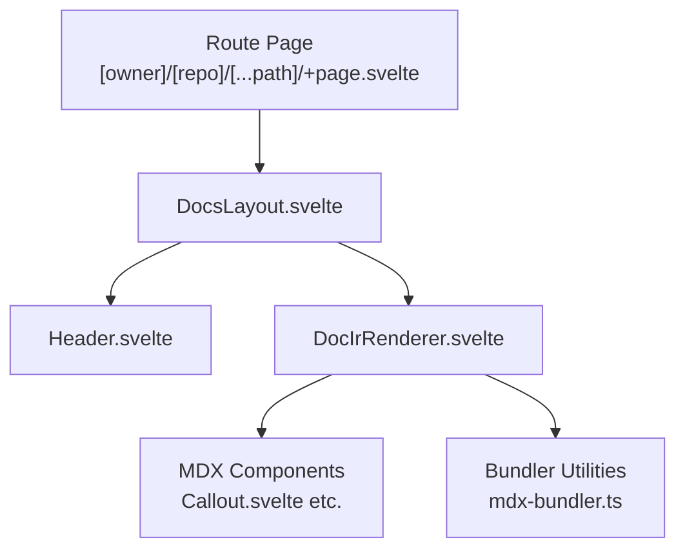
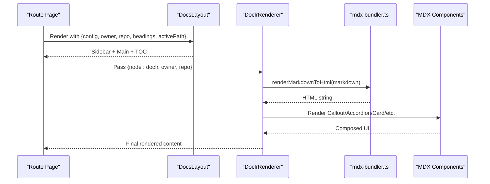
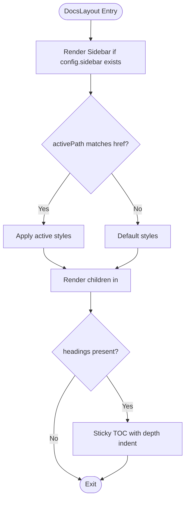
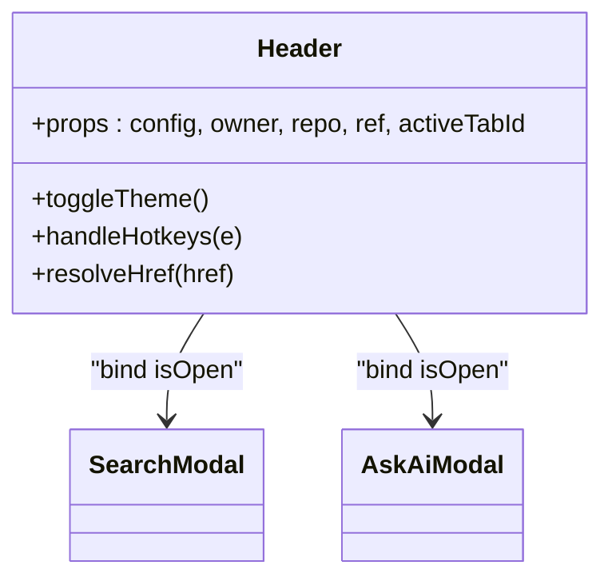
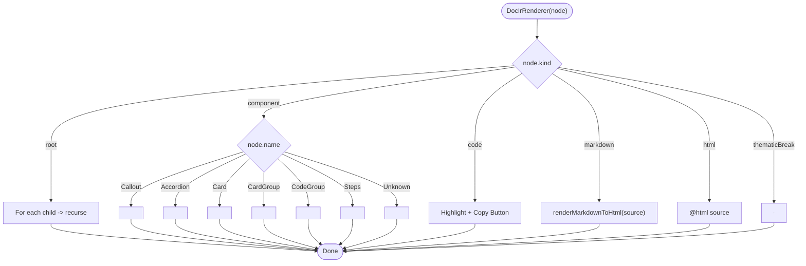
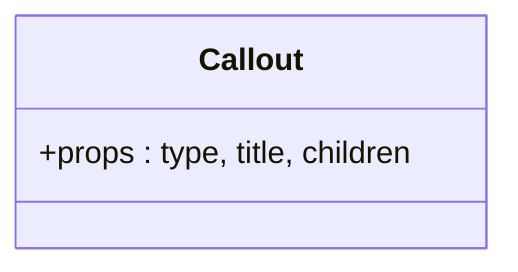
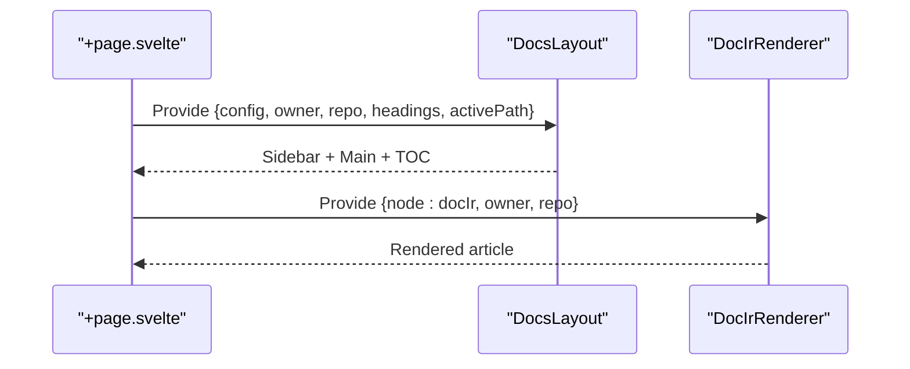
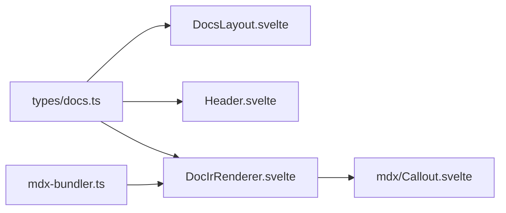

# Layout Components

<cite>
**Referenced Files in This Document**
- [DocsLayout.svelte](file://src/lib/components/DocsLayout.svelte)
- [Header.svelte](file://src/lib/components/Header.svelte)
- [DocIrRenderer.svelte](file://src/lib/components/DocIrRenderer.svelte)
- [Callout.svelte](file://src/lib/components/mdx/Callout.svelte)
- [mdx-bundler.ts](file://src/lib/bundler/mdx-bundler.ts)
- [docs.ts](file://src/lib/types/docs.ts)
- [+page.svelte](file://src/routes/[owner]/[repo]/[...path]/+page.svelte)
- [package.json](file://package.json)
</cite>

## Table of Contents
1. Introduction
2. Project Structure
3. Core Components
4. Architecture Overview
5. Detailed Component Analysis
6. Dependency Analysis
7. Performance Considerations
8. Troubleshooting Guide
9. Conclusion

## Introduction
This document explains the FractalDocs layout components that power the three-column documentation experience: a left sidebar, a central content area, and a right table of contents. It focuses on how DocsLayout composes the page shell, how Header provides branding and navigation, and how DocIrRenderer dynamically renders MDX into interactive UI with robust prop handling and error resilience. It also covers responsive behavior, accessibility features, customization options, integration patterns, and performance considerations.

## Project Structure
The layout system is implemented as Svelte components under src/lib/components, with types defined in src/lib/types/docs.ts and MDX processing utilities in src/lib/bundler/mdx-bundler.ts. The route layer composes these components to render pages for each repository path.

**Diagram sources**
- [+page.svelte:1-17](file://src/routes/[owner]/[repo]/[...path]/+page.svelte#L1-L17)
- [DocsLayout.svelte:1-105](file://src/lib/components/DocsLayout.svelte#L1-L105)
- [Header.svelte:1-161](file://src/lib/components/Header.svelte#L1-L161)
- [DocIrRenderer.svelte:1-117](file://src/lib/components/DocIrRenderer.svelte#L1-L117)
- [mdx-bundler.ts:1-296](file://src/lib/bundler/mdx-bundler.ts#L1-L296)

**Section sources**
- [DocsLayout.svelte:1-105](file://src/lib/components/DocsLayout.svelte#L1-L105)
- [Header.svelte:1-161](file://src/lib/components/Header.svelte#L1-L161)
- [DocIrRenderer.svelte:1-117](file://src/lib/components/DocIrRenderer.svelte#L1-L117)
- [docs.ts:1-82](file://src/lib/types/docs.ts#L1-L82)
- [mdx-bundler.ts:1-296](file://src/lib/bundler/mdx-bundler.ts#L1-L296)
- [+page.svelte:1-17](file://src/routes/[owner]/[repo]/[...path]/+page.svelte#L1-L17)

## Core Components
- DocsLayout: Three-column layout wrapper managing sidebar, main content, and table of contents; handles active path resolution and responsive visibility.
- Header: Site branding, tabs, search, AI assistant, theme toggle, and GitHub link; supports keyboard shortcuts and dynamic repo context.
- DocIrRenderer: Recursively renders an IR tree (root, component, markdown, html, code, thematicBreak) into Svelte components and HTML, with copy-to-clipboard for code blocks.

Key props and responsibilities:
- DocsLayout props include config, owner, repo, ref, headings, activePath, and children snippet.
- Header props include config, owner, repo, ref, and activeTabId.
- DocIrRenderer props include node (IR), owner, and repo.

**Section sources**
- [DocsLayout.svelte:1-105](file://src/lib/components/DocsLayout.svelte#L1-L105)
- [Header.svelte:1-161](file://src/lib/components/Header.svelte#L1-L161)
- [DocIrRenderer.svelte:1-117](file://src/lib/components/DocIrRenderer.svelte#L1-L117)
- [docs.ts:1-82](file://src/lib/types/docs.ts#L1-L82)

## Architecture Overview
The rendering pipeline transforms Markdown/MDX into an intermediate representation (IR), then renders it into Svelte components and HTML. The route page composes DocsLayout and DocIrRenderer, passing configuration and context.

**Diagram sources**
- [+page.svelte:1-17](file://src/routes/[owner]/[repo]/[...path]/+page.svelte#L1-L17)
- [DocsLayout.svelte:1-105](file://src/lib/components/DocsLayout.svelte#L1-L105)
- [DocIrRenderer.svelte:1-117](file://src/lib/components/DocIrRenderer.svelte#L1-L117)
- [mdx-bundler.ts:106-146](file://src/lib/bundler/mdx-bundler.ts#L106-L146)

## Detailed Component Analysis

### DocsLayout: Three-Column Shell
- Responsibilities:
  - Renders Header at the top.
  - Left sidebar displays grouped navigation from config.sidebar with active state based on activePath.
  - Center main area renders children (the article content).
  - Right table of contents shows headings with sticky positioning and depth-based indentation.
- Props:
  - config: DocsConfig for sidebar groups and global settings.
  - owner, repo, ref: Context for resolving internal links and displaying version/ref badge.
  - headings: Array of HeadingNode for TOC generation.
  - activePath: Current page path used to highlight active sidebar items.
  - children: Snippet containing the page’s article content.
- Behavior:
  - Resolves hrefs to include /{owner}/{repo}/ prefix when provided.
  - Responsive: Sidebar hidden below md breakpoint; TOC hidden below lg breakpoint.
  - Accessibility: Semantic aside/main elements, proper heading hierarchy, aria-labels where applicable.

**Diagram sources**
- [DocsLayout.svelte:24-33](file://src/lib/components/DocsLayout.svelte#L24-L33)
- [DocsLayout.svelte:42-68](file://src/lib/components/DocsLayout.svelte#L42-L68)
- [DocsLayout.svelte:77-102](file://src/lib/components/DocsLayout.svelte#L77-L102)

**Section sources**
- [DocsLayout.svelte:1-105](file://src/lib/components/DocsLayout.svelte#L1-L105)
- [docs.ts:29-33](file://src/lib/types/docs.ts#L29-L33)

### Header: Branding and Navigation
- Responsibilities:
  - Displays logo (light/dark), site name, optional ref badge.
  - Provides actions: Ask AI modal, Search modal, GitHub link, theme toggle.
  - Renders tabs row with active tab highlighting based on activeTabId or title normalization.
- Props:
  - config: DocsConfig including logo, social, tabs.
  - owner, repo, ref: Context for links and display.
  - activeTabId: Controls which tab appears active.
- Behavior:
  - Keyboard shortcuts: Cmd/Ctrl+K opens search; Cmd/Ctrl+I opens Ask AI.
  - Theme toggle toggles dark mode class on document root.
  - Resolves internal hrefs similarly to DocsLayout.

**Diagram sources**
- [Header.svelte:1-161](file://src/lib/components/Header.svelte#L1-L161)

**Section sources**
- [Header.svelte:1-161](file://src/lib/components/Header.svelte#L1-L161)

### DocIrRenderer: Dynamic MDX Rendering
- Responsibilities:
  - Recursively traverses DocIrNode tree.
  - Renders known MDX components (Callout, Accordion, Card, CardGroup, CodeGroup, Steps) by mapping node.name to Svelte components.
  - Handles code blocks with syntax highlighting and copy-to-clipboard.
  - Renders raw markdown via renderMarkdownToHtml and raw HTML directly.
  - Renders thematic breaks as horizontal rules.
- Props:
  - node: DocIrNode representing the current subtree.
  - owner, repo: Passed through to sub-renderers and bundler functions.
- Error Handling:
  - Unknown component kinds are wrapped in a fallback container to prevent crashes.
  - Markdown rendering uses try/catch internally in the bundler to return original input on failure.

**Diagram sources**
- [DocIrRenderer.svelte:33-116](file://src/lib/components/DocIrRenderer.svelte#L33-L116)
- [mdx-bundler.ts:106-146](file://src/lib/bundler/mdx-bundler.ts#L106-L146)

**Section sources**
- [DocIrRenderer.svelte:1-117](file://src/lib/components/DocIrRenderer.svelte#L1-L117)
- [mdx-bundler.ts:106-146](file://src/lib/bundler/mdx-bundler.ts#L106-L146)

### MDX Components: Callout Example
- Callout supports multiple variants (note, info, warning, tip, danger) with distinct styling and icons.
- Accepts title and children snippet for flexible content composition.

**Diagram sources**
- [Callout.svelte:1-65](file://src/lib/components/mdx/Callout.svelte#L1-L65)

**Section sources**
- [Callout.svelte:1-65](file://src/lib/components/mdx/Callout.svelte#L1-L65)

### Integration Pattern: Route Composition
- The route page sets document title and composes DocsLayout with data.config, owner, repo, headings, and activePath.
- The article content is rendered via DocIrRenderer using data.docResult.docIr.

**Diagram sources**
- [+page.svelte:1-17](file://src/routes/[owner]/[repo]/[...path]/+page.svelte#L1-L17)
- [DocsLayout.svelte:1-105](file://src/lib/components/DocsLayout.svelte#L1-L105)
- [DocIrRenderer.svelte:1-117](file://src/lib/components/DocIrRenderer.svelte#L1-L117)

**Section sources**
- [+page.svelte:1-17](file://src/routes/[owner]/[repo]/[...path]/+page.svelte#L1-L17)

## Dependency Analysis
- DocsLayout depends on Header and types for DocsConfig and HeadingNode.
- Header depends on SearchModal and AskAiModal (not analyzed here) and uses DocsConfig.
- DocIrRenderer depends on MDX components and the bundler utility for markdown rendering.
- mdx-bundler.ts provides renderMarkdownToHtml, highlightCodeBlocksInIr, mdxToDocIr, and related helpers.

**Diagram sources**
- [docs.ts:1-82](file://src/lib/types/docs.ts#L1-L82)
- [DocsLayout.svelte:1-105](file://src/lib/components/DocsLayout.svelte#L1-L105)
- [Header.svelte:1-161](file://src/lib/components/Header.svelte#L1-L161)
- [DocIrRenderer.svelte:1-117](file://src/lib/components/DocIrRenderer.svelte#L1-L117)
- [mdx-bundler.ts:1-296](file://src/lib/bundler/mdx-bundler.ts#L1-L296)
- [Callout.svelte:1-65](file://src/lib/components/mdx/Callout.svelte#L1-L65)

**Section sources**
- [docs.ts:1-82](file://src/lib/types/docs.ts#L1-L82)
- [mdx-bundler.ts:1-296](file://src/lib/bundler/mdx-bundler.ts#L1-L296)

## Performance Considerations
- Syntax highlighting caching: The bundler caches the Shiki highlighter instance to avoid repeated initialization overhead.
- Parallel highlighting: Code blocks are highlighted in parallel within the IR traversal to minimize latency.
- Conditional rendering: Sidebar and TOC are conditionally rendered only when data is present, reducing unnecessary DOM work.
- Lightweight markdown rendering: Markdown sections are converted synchronously to HTML only when needed, with error fallback returning original input.
- Tailwind classes: Utility-first styling avoids heavy CSS payloads and enables efficient runtime optimizations.

Recommendations:
- Keep MDX component trees shallow to reduce recursion depth in DocIrRenderer.
- Prefer static headings arrays for large documents to avoid recomputation.
- Use lazy loading for modals (Search, Ask AI) to defer non-critical resources.

**Section sources**
- [mdx-bundler.ts:48-58](file://src/lib/bundler/mdx-bundler.ts#L48-L58)
- [mdx-bundler.ts:83-104](file://src/lib/bundler/mdx-bundler.ts#L83-L104)
- [DocIrRenderer.svelte:106-116](file://src/lib/components/DocIrRenderer.svelte#L106-L116)

## Troubleshooting Guide
Common issues and resolutions:
- Links not resolving correctly: Ensure owner and repo are passed to DocsLayout and Header so hrefs can be prefixed. Verify activePath matches expected format.
- Missing TOC entries: Confirm headings array is provided and contains valid id/title/depth values.
- Code blocks not highlighted: Check language aliases and ensure Shiki languages are available; mermaid blocks are intentionally skipped.
- Markdown rendering errors: The bundler returns original markdown on failure; inspect input for malformed content.
- Modal hotkeys not working: Verify keyboard event listeners are attached and no other handlers intercept Cmd/Ctrl+K or Cmd/Ctrl+I.

Accessibility tips:
- Use semantic elements (aside, main, header) as implemented.
- Provide meaningful aria-labels for buttons (theme toggle, GitHub link).
- Ensure sufficient color contrast for active states and hover effects.

**Section sources**
- [DocsLayout.svelte:24-33](file://src/lib/components/DocsLayout.svelte#L24-L33)
- [Header.svelte:33-42](file://src/lib/components/Header.svelte#L33-L42)
- [mdx-bundler.ts:106-146](file://src/lib/bundler/mdx-bundler.ts#L106-L146)

## Conclusion
The FractalDocs layout system combines a structured three-column shell (DocsLayout), a feature-rich navigation header (Header), and a flexible MDX renderer (DocIrRenderer) to deliver a responsive, accessible, and performant documentation experience. By leveraging typed configurations, context-aware link resolution, and robust error handling, it supports customization and scalability across repositories and themes.