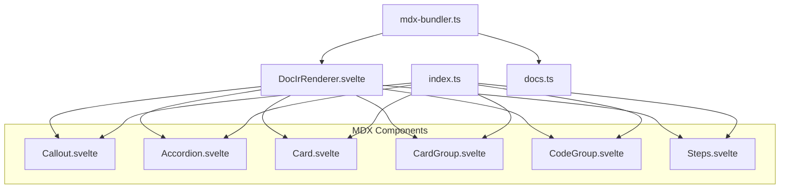
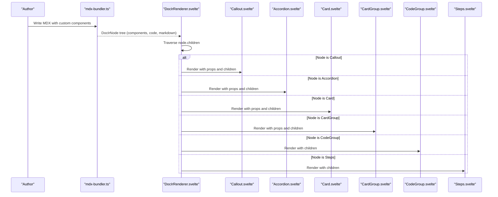
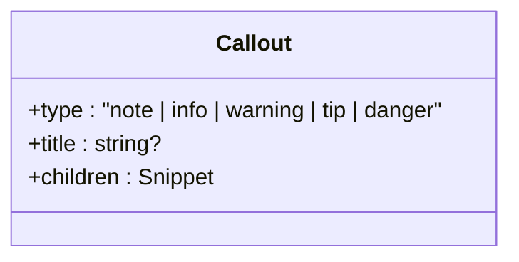
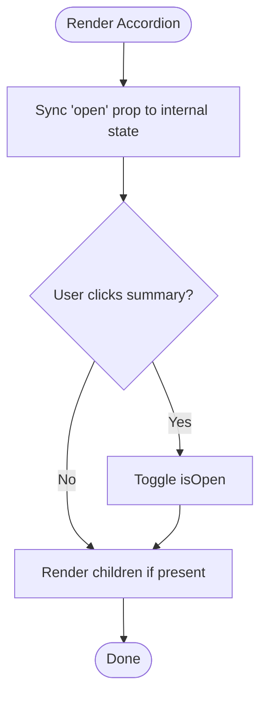
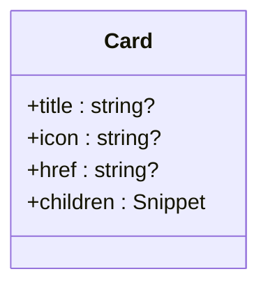
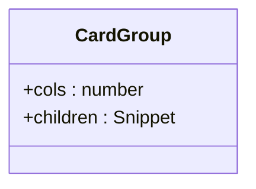
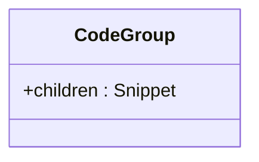
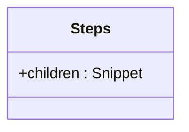
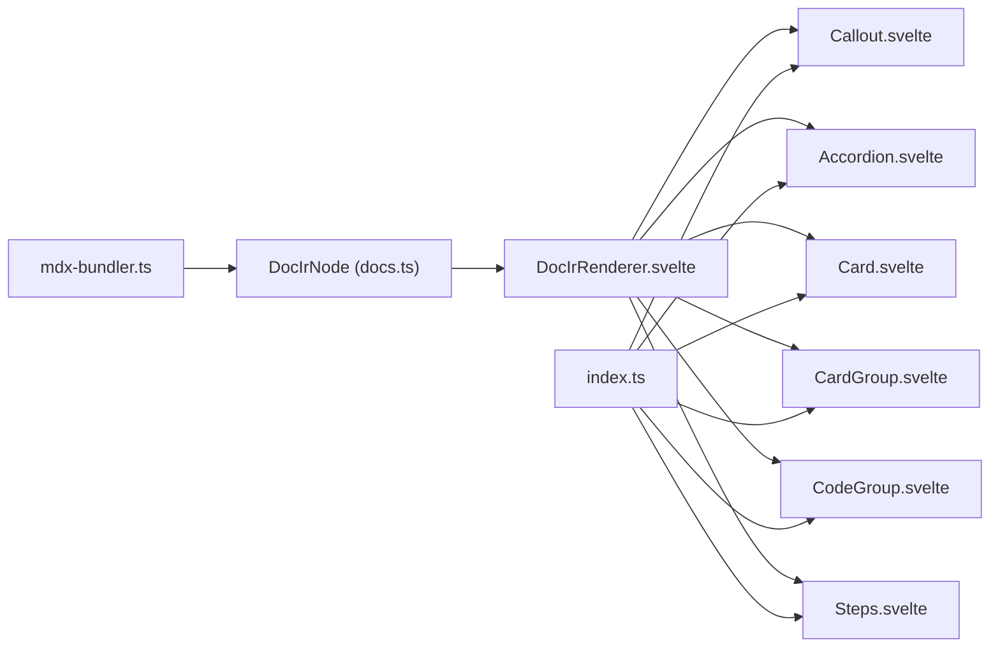

# MDX Components

<cite>
**Referenced Files in This Document**
- [Callout.svelte](file://src/lib/components/mdx/Callout.svelte)
- [Accordion.svelte](file://src/lib/components/mdx/Accordion.svelte)
- [Card.svelte](file://src/lib/components/mdx/Card.svelte)
- [CardGroup.svelte](file://src/lib/components/mdx/CardGroup.svelte)
- [CodeGroup.svelte](file://src/lib/components/mdx/CodeGroup.svelte)
- [Steps.svelte](file://src/lib/components/mdx/Steps.svelte)
- [DocIrRenderer.svelte](file://src/lib/components/DocIrRenderer.svelte)
- [index.ts](file://src/lib/index.ts)
- [docs.ts](file://src/lib/types/docs.ts)
- [mdx-bundler.ts](file://src/lib/bundler/mdx-bundler.ts)
</cite>

## Table of Contents
1. [Introduction](#introduction)
2. [Project Structure](#project-structure)
3. [Core Components](#core-components)
4. [Architecture Overview](#architecture-overview)
5. [Detailed Component Analysis](#detailed-component-analysis)
6. [Dependency Analysis](#dependency-analysis)
7. [Performance Considerations](#performance-considerations)
8. [Troubleshooting Guide](#troubleshooting-guide)
9. [Conclusion](#conclusion)

## Introduction
This document provides comprehensive documentation for the FractalDocs MDX components used within markdown content. It covers the Callout, Accordion, Card, CardGroup, CodeGroup, and Steps components. For each component, you will find usage examples, prop specifications, customization options, and integration patterns with the broader MDX ecosystem. The components are built as Svelte components and are rendered from a Markdown-derived intermediate representation (IR) by the DocIrRenderer.

## Project Structure
The MDX components live under src/lib/components/mdx and are re-exported via src/lib/index.ts. The DocIrRenderer maps MDX component nodes to their corresponding Svelte components during rendering. The MDX bundler transforms markdown into an IR that includes component nodes, code blocks, and markdown segments.

**Diagram sources**
- [DocIrRenderer.svelte:1-117](file://src/lib/components/DocIrRenderer.svelte#L1-L117)
- [index.ts:1-12](file://src/lib/index.ts#L1-L12)
- [mdx-bundler.ts:224-278](file://src/lib/bundler/mdx-bundler.ts#L224-L278)
- [docs.ts:1-82](file://src/lib/types/docs.ts#L1-L82)

**Section sources**
- [DocIrRenderer.svelte:1-117](file://src/lib/components/DocIrRenderer.svelte#L1-L117)
- [index.ts:1-12](file://src/lib/index.ts#L1-L12)
- [mdx-bundler.ts:224-278](file://src/lib/bundler/mdx-bundler.ts#L224-L278)
- [docs.ts:1-82](file://src/lib/types/docs.ts#L1-L82)

## Core Components
FractalDocs exposes six MDX components designed for rich documentation experiences:
- Callout: Contextual callouts with five variants and optional title.
- Accordion: Collapsible sections with controlled open state.
- Card: Visual cards with optional icon, title, and link behavior.
- CardGroup: Responsive grid container for multiple cards.
- CodeGroup: Container for tabbed code snippets (renders children).
- Steps: Numbered procedural steps with visual progress indication.

These components accept Snippet children and are mapped from MDX component nodes by the DocIrRenderer.

**Section sources**
- [Callout.svelte:1-65](file://src/lib/components/mdx/Callout.svelte#L1-L65)
- [Accordion.svelte:1-32](file://src/lib/components/mdx/Accordion.svelte#L1-L32)
- [Card.svelte:1-40](file://src/lib/components/mdx/Card.svelte#L1-L40)
- [CardGroup.svelte:1-18](file://src/lib/components/mdx/CardGroup.svelte#L1-L18)
- [CodeGroup.svelte:1-20](file://src/lib/components/mdx/CodeGroup.svelte#L1-L20)
- [Steps.svelte:1-16](file://src/lib/components/mdx/Steps.svelte#L1-L16)
- [DocIrRenderer.svelte:37-74](file://src/lib/components/DocIrRenderer.svelte#L37-L74)

## Architecture Overview
The MDX pipeline converts markdown into an IR and then renders it using DocIrRenderer, which dispatches component nodes to the appropriate Svelte components.

**Diagram sources**
- [mdx-bundler.ts:224-278](file://src/lib/bundler/mdx-bundler.ts#L224-L278)
- [DocIrRenderer.svelte:37-74](file://src/lib/components/DocIrRenderer.svelte#L37-L74)

## Detailed Component Analysis

### Callout Component
Purpose: Display contextual notes, tips, warnings, or alerts with variant-specific styling and optional titles.

Props:
- type: Variant selector. Allowed values: note, info, warning, tip, danger. Default: note.
- title: Optional heading text displayed alongside an icon.
- children: Snippet content rendered inside the callout body.

Styling and customization:
- Each variant defines background, border, text color, and icon.
- Uses Tailwind utility classes for consistent theming across light/dark modes.

Usage example:
- Use <Callout type="warning" title="Important">...</Callout> to render a warning callout with a title and nested content.

Integration pattern:
- In MDX, write <Callout type="tip" title="Tip">Your content here</Callout>.
- DocIrRenderer maps the component node to the Callout Svelte component, passing props and recursively rendering children.

**Diagram sources**
- [Callout.svelte:1-65](file://src/lib/components/mdx/Callout.svelte#L1-L65)

**Section sources**
- [Callout.svelte:1-65](file://src/lib/components/mdx/Callout.svelte#L1-L65)
- [DocIrRenderer.svelte:38-43](file://src/lib/components/DocIrRenderer.svelte#L38-L43)

### Accordion Component
Purpose: Provide collapsible sections with a header and expandable content.

Props:
- title: Header text. Default: "Details".
- open: Initial open state. Controlled via $state and synced with prop changes.
- children: Snippet content rendered when expanded.

Behavior:
- Uses native details/summary semantics for accessibility.
- Animates the chevron indicator based on open state.

Usage example:
- Use <Accordion title="Advanced Options" open={false}>...</Accordion> to create a collapsed section.

Integration pattern:
- MDX <Accordion title="..." open={...}>...</Accordion> is mapped by DocIrRenderer to the Accordion component.

**Diagram sources**
- [Accordion.svelte:1-32](file://src/lib/components/mdx/Accordion.svelte#L1-L32)

**Section sources**
- [Accordion.svelte:1-32](file://src/lib/components/mdx/Accordion.svelte#L1-L32)
- [DocIrRenderer.svelte:44-49](file://src/lib/components/DocIrRenderer.svelte#L44-L49)

### Card Component
Purpose: Create visually distinct cards with optional icon, title, and link behavior.

Props:
- title: Optional card title.
- icon: Optional icon displayed before the title.
- href: Optional URL; when provided, the card becomes a link.
- children: Snippet content rendered below the header.

Behavior:
- Renders as anchor or div depending on href presence.
- Hover effects highlight borders and shadows.

Usage example:
- Use <Card title="Getting Started" icon="🚀" href="/docs/getting-started">Overview and setup instructions.</Card>.

Integration pattern:
- MDX <Card ...>...</Card> is mapped by DocIrRenderer to the Card component.

**Diagram sources**
- [Card.svelte:1-40](file://src/lib/components/mdx/Card.svelte#L1-L40)

**Section sources**
- [Card.svelte:1-40](file://src/lib/components/mdx/Card.svelte#L1-L40)
- [DocIrRenderer.svelte:50-55](file://src/lib/components/DocIrRenderer.svelte#L50-L55)

### CardGroup Component
Purpose: Organize multiple cards into a responsive grid layout.

Props:
- cols: Number of columns. Default: 2. Applies responsive breakpoints via Tailwind classes.
- children: Snippet containing one or more Card components.

Usage example:
- Use <CardGroup cols={3}><Card .../><Card .../><Card .../></CardGroup> to display three cards per row on medium screens.

Integration pattern:
- MDX <CardGroup cols={...}>...</CardGroup> is mapped by DocIrRenderer to the CardGroup component.

**Diagram sources**
- [CardGroup.svelte:1-18](file://src/lib/components/mdx/CardGroup.svelte#L1-L18)

**Section sources**
- [CardGroup.svelte:1-18](file://src/lib/components/mdx/CardGroup.svelte#L1-L18)
- [DocIrRenderer.svelte:56-61](file://src/lib/components/DocIrRenderer.svelte#L56-L61)

### CodeGroup Component
Purpose: Container for tabbed code snippets. Renders child elements within a bordered panel.

Props:
- children: Snippet containing tab items or code blocks.

Behavior:
- Provides a header bar area for tabs and a content area for selected code.
- Active tab index is managed internally.

Usage example:
- Use <CodeGroup><TabItem title="JavaScript">...</TabItem><TabItem title="TypeScript">...</TabItem></CodeGroup> to group multiple language examples.

Integration pattern:
- MDX <CodeGroup>...</CodeGroup> is mapped by DocIrRenderer to the CodeGroup component.

**Diagram sources**
- [CodeGroup.svelte:1-20](file://src/lib/components/mdx/CodeGroup.svelte#L1-L20)

**Section sources**
- [CodeGroup.svelte:1-20](file://src/lib/components/mdx/CodeGroup.svelte#L1-L20)
- [DocIrRenderer.svelte:62-67](file://src/lib/components/DocIrRenderer.svelte#L62-L67)

### Steps Component
Purpose: Present procedural content with numbered steps and visual progress indication.

Props:
- children: Snippet containing step items.

Behavior:
- Renders a left border line and spaced steps for clear progression.

Usage example:
- Use <Steps><Step>Install dependencies</Step><Step>Run the build</Step><Step>Deploy</Step></Steps>.

Integration pattern:
- MDX <Steps>...</Steps> is mapped by DocIrRenderer to the Steps component.

**Diagram sources**
- [Steps.svelte:1-16](file://src/lib/components/mdx/Steps.svelte#L1-L16)

**Section sources**
- [Steps.svelte:1-16](file://src/lib/components/mdx/Steps.svelte#L1-L16)
- [DocIrRenderer.svelte:68-73](file://src/lib/components/DocIrRenderer.svelte#L68-L73)

## Dependency Analysis
The MDX components are decoupled from the renderer through the IR model. The bundler extracts component nodes and passes them to the renderer, which instantiates the corresponding Svelte components.

**Diagram sources**
- [mdx-bundler.ts:224-278](file://src/lib/bundler/mdx-bundler.ts#L224-L278)
- [docs.ts:1-82](file://src/lib/types/docs.ts#L1-L82)
- [DocIrRenderer.svelte:1-117](file://src/lib/components/DocIrRenderer.svelte#L1-L117)
- [index.ts:1-12](file://src/lib/index.ts#L1-L12)

**Section sources**
- [mdx-bundler.ts:224-278](file://src/lib/bundler/mdx-bundler.ts#L224-L278)
- [docs.ts:1-82](file://src/lib/types/docs.ts#L1-L82)
- [DocIrRenderer.svelte:1-117](file://src/lib/components/DocIrRenderer.svelte#L1-L117)
- [index.ts:1-12](file://src/lib/index.ts#L1-L12)

## Performance Considerations
- Minimal runtime overhead: Components use Svelte’s reactive primitives ($props, $state, $effect, $derived) for efficient updates.
- Lightweight DOM: Most components wrap content in simple containers with Tailwind utilities, avoiding heavy third-party libraries.
- Rendering efficiency: DocIrRenderer traverses the IR once and delegates to specialized components, reducing conditional logic at render time.
- Accessibility: Accordion uses native details/summary for semantic markup and keyboard support.

[No sources needed since this section provides general guidance]

## Troubleshooting Guide
Common issues and resolutions:
- Component not rendering: Ensure the MDX node name matches the expected component name (e.g., Callout, Accordion). DocIrRenderer checks node.name exactly.
- Props not applied: Verify prop types match expectations (e.g., type must be one of the allowed variants for Callout; cols should be a number for CardGroup).
- Children not visible: Confirm that children are passed as Snippets and that the component renders them conditionally.
- Styling conflicts: Tailwind classes are used; ensure your project includes Tailwind configuration and dark mode settings where necessary.

**Section sources**
- [DocIrRenderer.svelte:37-74](file://src/lib/components/DocIrRenderer.svelte#L37-L74)
- [Callout.svelte:16-47](file://src/lib/components/mdx/Callout.svelte#L16-L47)
- [CardGroup.svelte:4-10](file://src/lib/components/mdx/CardGroup.svelte#L4-L10)

## Conclusion
FractalDocs MDX components provide a cohesive set of building blocks for creating rich, accessible documentation. By leveraging the IR-based rendering pipeline, authors can compose complex layouts and interactions directly in markdown while maintaining performance and consistency. Use the prop specifications and integration patterns outlined here to effectively incorporate these components into your documentation workflows.

[No sources needed since this section summarizes without analyzing specific files]