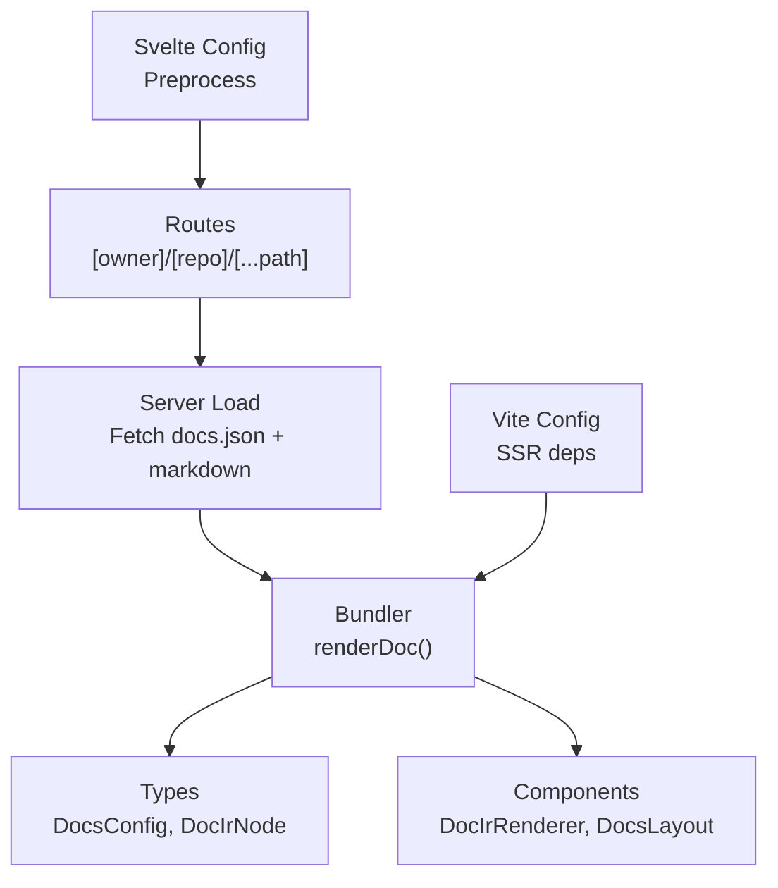
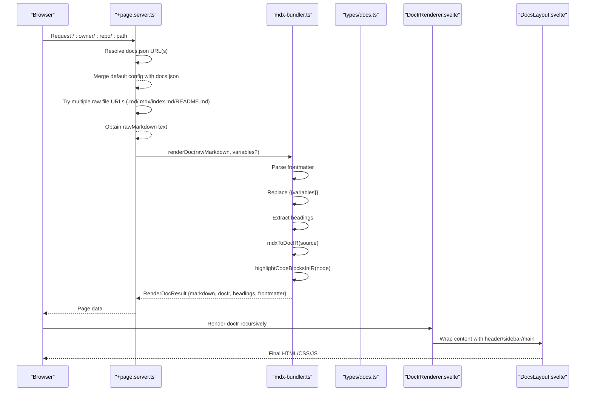
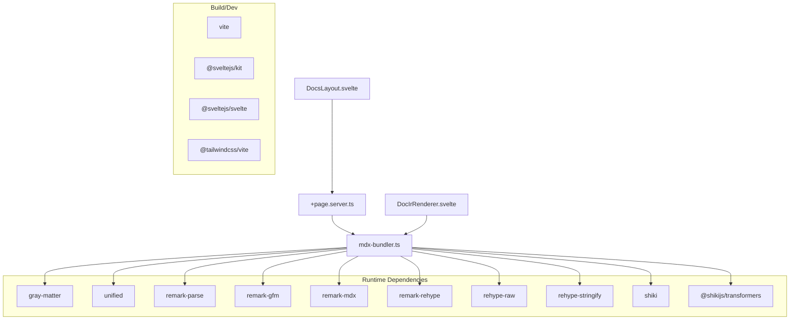

# Content Management

<cite>
**Referenced Files in This Document**
- [package.json](file://package.json)
- [vite.config.ts](file://vite.config.ts)
- [svelte.config.js](file://svelte.config.js)
- [src/routes/[owner]/[repo]/[...path]/+page.server.ts](file://src/routes/[owner]/[repo]/[...path]/+page.server.ts)
- [src/routes/[owner]/[repo]/[...path]/+page.svelte](file://src/routes/[owner]/[repo]/[...path]/+page.svelte)
- [src/lib/bundler/mdx-bundler.ts](file://src/lib/bundler/mdx-bundler.ts)
- [src/lib/types/docs.ts](file://src/lib/types/docs.ts)
- [src/lib/components/DocIrRenderer.svelte](file://src/lib/components/DocIrRenderer.svelte)
- [src/lib/components/DocsLayout.svelte](file://src/lib/components/DocsLayout.svelte)
- [src/lib/styles/globals.css](file://src/lib/styles/globals.css)
</cite>

## Table of Contents
1. Introduction
2. Project Structure
3. Core Components
4. Architecture Overview
5. Detailed Component Analysis
6. Dependency Analysis
7. Performance Considerations
8. Troubleshooting Guide
9. Conclusion

## Introduction
This document explains how FractalDocs manages content: creating, organizing, and rendering documentation from Markdown and MDX files. It covers syntax support, frontmatter metadata and routing, image and asset handling strategies, link resolution mechanisms, the content pipeline from raw files to rendered pages, project structure best practices, common content patterns, performance considerations for large documentation sets, and troubleshooting guidance.

## Project Structure
FractalDocs is a SvelteKit application that fetches documentation content from remote repositories at request time and renders it with a unified Markdown/MDX pipeline. The key directories are:
- src/routes: SvelteKit route handlers and pages that orchestrate fetching and rendering
- src/lib/bundler: Markdown/MDX processing, code highlighting, and IR generation
- src/lib/types: Shared TypeScript types for configuration and content IR
- src/lib/components: UI components including layout and content renderer
- src/lib/styles: Global styles and Tailwind setup

**Diagram sources**
- [src/routes/[owner]/[repo]/[...path]/+page.server.ts:1-L76](file://src/routes/[owner]/[repo]/[...path]/+page.server.ts#L1-L76)
- [src/lib/bundler/mdx-bundler.ts:1-296](file://src/lib/bundler/mdx-bundler.ts#L1-L296)
- [src/lib/types/docs.ts:1-82](file://src/lib/types/docs.ts#L1-L82)
- [src/lib/components/DocIrRenderer.svelte:1-100](file://src/lib/components/DocIrRenderer.svelte#L1-L100)
- [src/lib/components/DocsLayout.svelte:1-100](file://src/lib/components/DocsLayout.svelte#L1-L100)
- [vite.config.ts:1-35](file://vite.config.ts#L1-L35)
- [svelte.config.js:1-13](file://svelte.config.js#L1-L13)

**Section sources**
- [package.json:1-49](file://package.json#L1-L49)
- [vite.config.ts:1-35](file://vite.config.ts#L1-L35)
- [svelte.config.js:1-13](file://svelte.config.js#L1-L13)

## Core Components
- Route loader: Fetches repository configuration (docs.json) and the requested page content (Markdown or MDX), then calls the bundler to render.
- Bundler: Parses frontmatter, processes Markdown/MDX into an intermediate representation (IR), highlights code blocks, extracts headings, and returns structured data for rendering.
- Types: Define configuration schema (DocsConfig), content IR (DocIrNode), and result shape (RenderDocResult).
- Renderer: Recursively renders the IR into Svelte components, mapping MDX components to built-in UI elements.
- Layout: Provides header, tabs, sidebar navigation, and main content area.

Key responsibilities:
- Routing and content discovery via GitHub raw URLs
- Frontmatter parsing and variable substitution
- Markdown/MDX parsing and transformation
- Code block highlighting and title extraction
- Heading extraction for navigation
- Rendering IR to interactive UI

**Section sources**
- [src/routes/[owner]/[repo]/[...path]/+page.server.ts:1-L76](file://src/routes/[owner]/[repo]/[...path]/+page.server.ts#L1-L76)
- [src/lib/bundler/mdx-bundler.ts:1-296](file://src/lib/bundler/mdx-bundler.ts#L1-L296)
- [src/lib/types/docs.ts:1-82](file://src/lib/types/docs.ts#L1-L82)
- [src/lib/components/DocIrRenderer.svelte:1-100](file://src/lib/components/DocIrRenderer.svelte#L1-L100)
- [src/lib/components/DocsLayout.svelte:1-100](file://src/lib/components/DocsLayout.svelte#L1-L100)

## Architecture Overview
The content pipeline transforms raw Markdown/MDX fetched from GitHub into a rendered page through a clear sequence:

**Diagram sources**
- [src/routes/[owner]/[repo]/[...path]/+page.server.ts:1-L76](file://src/routes/[owner]/[repo]/[...path]/+page.server.ts#L1-L76)
- [src/lib/bundler/mdx-bundler.ts:1-296](file://src/lib/bundler/mdx-bundler.ts#L1-L296)
- [src/lib/types/docs.ts:1-82](file://src/lib/types/docs.ts#L1-L82)
- [src/lib/components/DocIrRenderer.svelte:1-100](file://src/lib/components/DocIrRenderer.svelte#L1-L100)
- [src/lib/components/DocsLayout.svelte:1-100](file://src/lib/components/DocsLayout.svelte#L1-L100)

## Detailed Component Analysis

### Content Routing and Discovery
- Configuration discovery: Attempts to load docs.json from main/master branches; merges with defaults if not found.
- Content discovery: Tries multiple raw GitHub URLs to locate the requested page, supporting .md, .mdx, index.md, and README.md fallbacks across main/master branches.
- Error handling: Throws a 404 when no content is found.

Best practices:
- Place your primary documentation under docs/ with index.md for folder routes.
- Keep branch naming consistent (main preferred); master fallback is supported.
- Use docs.json to customize navigation, tabs, social links, and variables.

**Section sources**
- [src/routes/[owner]/[repo]/[...path]/+page.server.ts:1-L76](file://src/routes/[owner]/[repo]/[...path]/+page.server.ts#L1-L76)

### Markdown and MDX Processing Pipeline
- Frontmatter: Parsed using gray-matter; exposed as data in RenderDocResult.
- Variable substitution: Supports {{key}} and nested object access like {{a.b.c}}.
- Headings extraction: Generates slug IDs for anchor links based on heading text.
- MDX parsing: Converts MDX to a typed IR (DocIrNode) with component nodes, code blocks, and markdown segments.
- Code highlighting: Uses Shiki with CSS variables theme; supports meta directives and title extraction from code fences.
- Markdown-to-HTML: For non-MDX contexts, uses remark/rehype pipeline with GFM and raw HTML allowance.

Supported features:
- GFM tables, strikethrough, task lists
- MDX components recognized by PascalCase names
- Code fence meta options (e.g., diff, focus, highlight)
- Mermaid code blocks are preserved without syntax highlighting

**Section sources**
- [src/lib/bundler/mdx-bundler.ts:1-296](file://src/lib/bundler/mdx-bundler.ts#L1-L296)
- [package.json:1-49](file://package.json#L1-L49)

### Data Models and Types
- DocsConfig: Defines name, description, logo, favicon, theme, social links, tabs, sidebar groups/pages, redirects, and variables.
- DocIrNode: Represents root, component, markdown, html, code, and thematicBreak nodes with typed props.
- RenderDocResult: Returns processed markdown, IR, headings, and frontmatter.

Usage:
- Sidebar and tabs are driven by DocsConfig.
- Variables can be injected into content via frontmatter or server-side options.

**Section sources**
- [src/lib/types/docs.ts:1-82](file://src/lib/types/docs.ts#L1-L82)

### Rendering and Component Mapping
- DocIrRenderer maps MDX components to built-in UI elements such as Callout, Accordion, Card, CardGroup, CodeGroup, and Steps.
- Recursive traversal ensures nested structures render correctly.
- Unknown components fall back to generic rendering.

Recommendations:
- Use PascalCase for MDX components to ensure recognition.
- Pass strongly-typed props where possible for clarity.

**Section sources**
- [src/lib/components/DocIrRenderer.svelte:1-100](file://src/lib/components/DocIrRenderer.svelte#L1-L100)

### Layout and Navigation
- DocsLayout provides header, tabs, sidebar, and main content area.
- Sidebar groups and pages are rendered from DocsConfig.sidebar.
- Active path detection highlights current navigation items.

Tips:
- Organize sidebar groups logically and keep titles concise.
- Use hrefs relative to the app base for internal navigation.

**Section sources**
- [src/lib/components/DocsLayout.svelte:1-100](file://src/lib/components/DocsLayout.svelte#L1-L100)

### Link Resolution Mechanisms
- Internal links: When repo context is available, absolute paths starting with "/" are rewritten to include owner/repo prefix for correct routing.
- External links: URLs beginning with http:// or https:// are preserved.
- Anchor links: "#" fragments remain unchanged.
- Heading anchors: Slug IDs are generated from heading text for stable linking.

Guidelines:
- Prefer relative links within docs for portability.
- Use descriptive heading text to generate meaningful anchors.

**Section sources**
- [src/lib/bundler/mdx-bundler.ts:1-296](file://src/lib/bundler/mdx-bundler.ts#L1-L296)

### Image and Asset Handling Strategies
- Images referenced via Markdown images or HTML img tags are treated as external resources unless hosted alongside your documentation.
- Recommended strategies:
  - Host images in your repository and reference them via absolute URLs pointing to the raw content host or a CDN.
  - Use relative paths that resolve correctly from the final deployed base path.
  - Avoid embedding large assets directly in Markdown; prefer external hosting for performance.

Note:
- The pipeline does not bundle local filesystem assets; all assets must be accessible via HTTP(S) at render time.

**Section sources**
- [src/lib/bundler/mdx-bundler.ts:1-296](file://src/lib/bundler/mdx-bundler.ts#L1-L296)

### Frontmatter Configuration for Metadata and Routing
- Frontmatter fields are parsed and included in RenderDocResult.frontmatter.
- Use DocsConfig.variables to inject values into content via {{variable}} placeholders.
- Configure tabs and sidebar via docs.json to control navigation and presentation.

Examples of usage:
- Set variables for versioning or environment-specific content.
- Define redirects to maintain stable URLs after restructuring.

**Section sources**
- [src/lib/types/docs.ts:1-82](file://src/lib/types/docs.ts#L1-L82)
- [src/lib/bundler/mdx-bundler.ts:1-296](file://src/lib/bundler/mdx-bundler.ts#L1-L296)

### Practical Content Patterns
- Folder-based pages: Use docs/feature/index.md to represent a section page.
- Component-rich sections: Embed Callout, Accordion, CardGroup, CodeGroup, and Steps for structured content.
- Code examples: Use fenced code blocks with language hints and meta directives for enhanced visuals.
- Cross-references: Link between pages using relative paths and rely on slug anchors for in-page navigation.

**Section sources**
- [src/lib/components/DocIrRenderer.svelte:1-100](file://src/lib/components/DocIrRenderer.svelte#L1-L100)
- [src/lib/bundler/mdx-bundler.ts:1-296](file://src/lib/bundler/mdx-bundler.ts#L1-L296)

### Best Practices for Maintainable Documentation Structure
- Centralize configuration in docs.json for consistent navigation and branding.
- Keep content modular: split large topics into focused pages.
- Use consistent heading hierarchy (H2-H4) for reliable anchor generation.
- Store assets externally and reference via stable URLs.
- Version variables via DocsConfig.variables to avoid hardcoding.

**Section sources**
- [src/lib/types/docs.ts:1-82](file://src/lib/types/docs.ts#L1-L82)
- [src/lib/bundler/mdx-bundler.ts:1-296](file://src/lib/bundler/mdx-bundler.ts#L1-L296)

## Dependency Analysis
The system relies on a set of well-defined dependencies for parsing, transforming, and rendering content:

**Diagram sources**
- [package.json:1-49](file://package.json#L1-L49)
- [src/lib/bundler/mdx-bundler.ts:1-296](file://src/lib/bundler/mdx-bundler.ts#L1-L296)
- [src/routes/[owner]/[repo]/[...path]/+page.server.ts:1-L76](file://src/routes/[owner]/[repo]/[...path]/+page.server.ts#L1-L76)
- [src/lib/components/DocIrRenderer.svelte:1-100](file://src/lib/components/DocIrRenderer.svelte#L1-L100)
- [src/lib/components/DocsLayout.svelte:1-100](file://src/lib/components/DocsLayout.svelte#L1-L100)

**Section sources**
- [package.json:1-49](file://package.json#L1-L49)
- [vite.config.ts:1-35](file://vite.config.ts#L1-L35)

## Performance Considerations
- SSR dependency optimization: Vite explicitly includes heavy libraries (shiki, unified, remark-* and rehype-*) in SSR noExternal to avoid runtime issues and improve build stability.
- Highlighter caching: A single Shiki highlighter instance is reused across requests to reduce initialization overhead.
- Language subset: Only necessary languages are loaded based on detected code blocks to minimize bundle size.
- Target compatibility: Build targets es2022 for modern environments, improving execution speed.
- Network latency: Content is fetched per-request from GitHub; consider caching strategies at the edge or proxy layer for large documentation sets.

Optimization techniques:
- Cache docs.json and frequently accessed pages at the CDN or reverse proxy level.
- Precompute and cache rendered IR for static-like performance while retaining dynamic capabilities.
- Limit the number of highlighted languages to those actually used in your docs.

**Section sources**
- [vite.config.ts:1-35](file://vite.config.ts#L1-L35)
- [src/lib/bundler/mdx-bundler.ts:1-296](file://src/lib/bundler/mdx-bundler.ts#L1-L296)

## Troubleshooting Guide
Common issues and resolutions:
- 404 Not Found: Occurs when no matching raw file is found across the supported locations and branches. Verify the path, extension (.md/.mdx), and branch name (main/master).
- Links not resolving: Ensure internal links use relative paths; absolute paths will be prefixed with owner/repo automatically. External links must start with http:// or https://.
- MDX components not rendering: Confirm component names are PascalCase; otherwise they may be treated as plain markdown.
- Code highlighting errors: Check language aliases and meta directives; unsupported languages fall back to text rendering.
- Variables not substituted: Ensure variables are provided via DocsConfig.variables or server-side options and use the correct dot notation in placeholders.
- Images not loading: Use publicly accessible URLs; local filesystem paths are not bundled.

Debugging tips:
- Inspect RenderDocResult.headings to verify anchor generation.
- Validate docs.json structure against DocsConfig type definitions.
- Test variable substitution with simple keys before nesting.

**Section sources**
- [src/routes/[owner]/[repo]/[...path]/+page.server.ts:1-L76](file://src/routes/[owner]/[repo]/[...path]/+page.server.ts#L1-L76)
- [src/lib/bundler/mdx-bundler.ts:1-296](file://src/lib/bundler/mdx-bundler.ts#L1-L296)
- [src/lib/types/docs.ts:1-82](file://src/lib/types/docs.ts#L1-L82)

## Conclusion
FractalDocs provides a robust, flexible content management system that transforms Markdown and MDX into richly rendered documentation pages. By leveraging a clear pipeline—from remote content discovery and frontmatter parsing to MDX processing, code highlighting, and component-based rendering—it enables maintainable, scalable documentation projects. Following the recommended structure, asset strategies, and performance optimizations ensures a smooth authoring experience and fast delivery for readers.