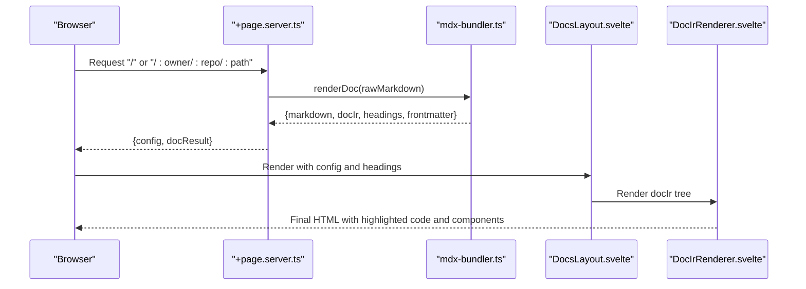
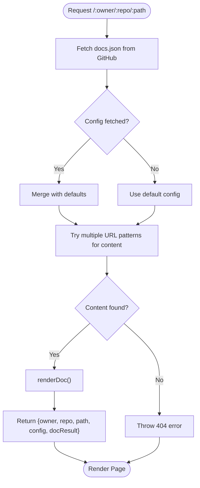
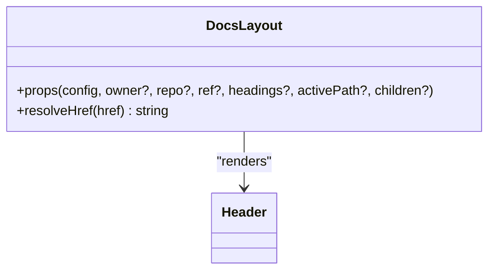
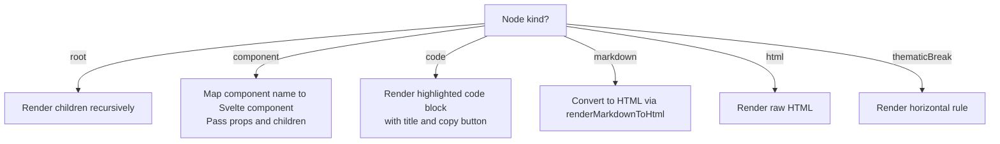
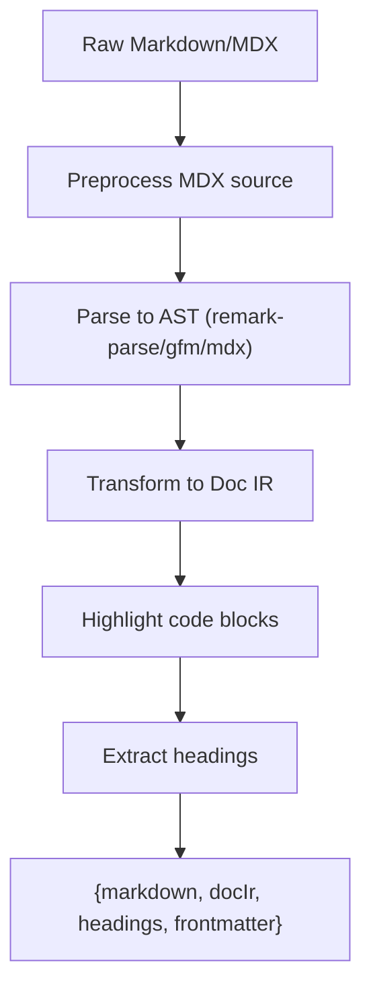
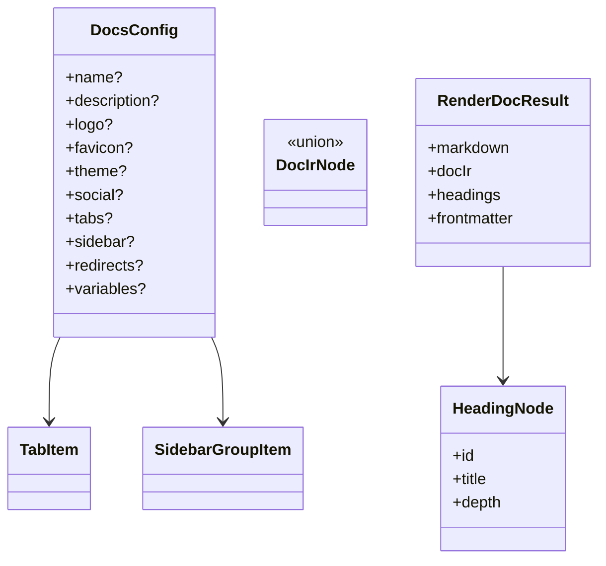

# Content Organization and Structure

<cite>
**Referenced Files in This Document**
- [package.json](file://package.json)
- [svelte.config.js](file://svelte.config.js)
- [vite.config.ts](file://vite.config.ts)
- [tsconfig.json](file://tsconfig.json)
- [app.html](file://src/app.html)
- [+page.server.ts](file://src/routes/+page.server.ts)
- [+page.svelte](file://src/routes/+page.svelte)
- [+layout.svelte](file://src/routes/+layout.svelte)
- [+page.server.ts (repo route)](file://src/routes/[owner]/[repo]/[...path]/+page.server.ts)
- [+page.svelte (repo route)](file://src/routes/[owner]/[repo]/[...path]/+page.svelte)
- [index.ts (lib exports)](file://src/lib/index.ts)
- [mdx-bundler.ts](file://src/lib/bundler/mdx-bundler.ts)
- [docs.ts (types)](file://src/lib/types/docs.ts)
- [DocsLayout.svelte](file://src/lib/components/DocsLayout.svelte)
- [DocIrRenderer.svelte](file://src/lib/components/DocIrRenderer.svelte)
</cite>

## Table of Contents
1. Introduction
2. Project Structure
3. Core Components
4. Architecture Overview
5. Detailed Component Analysis
6. Dependency Analysis
7. Performance Considerations
8. Troubleshooting Guide
9. Conclusion
10. Appendices

## Introduction
This document explains how to organize and structure documentation content in FractalDocs. It covers project structure conventions, file naming patterns, directory organization strategies, hierarchical content structures, breadcrumb navigation, cross-references, organizational patterns (feature-based, topic-based, user journey-driven), scalability for large sets, versioning strategies, maintenance best practices, and guidance for intuitive navigation and discoverability.

FractalDocs is a SvelteKit-native docs-as-code platform that renders Markdown and MDX into an internal representation (Doc IR), highlights code with Shiki, and renders interactive components through a layout and renderer pipeline. Configuration drives the sidebar, tabs, social links, and theme options.

## Project Structure
FractalDocs follows SvelteKit conventions:
- Routes define pages and data loading logic.
- The lib folder contains reusable components, bundler utilities, types, and styles.
- Configuration files control build, preprocessing, and runtime behavior.

Key directories and files:
- src/routes: SvelteKit routes for the home page and repository-scoped documentation pages.
- src/lib: Shared components (DocsLayout, DocIrRenderer), MDX bundler utilities, type definitions, and global styles.
- Root config files: package.json, svelte.config.js, vite.config.ts, tsconfig.json, app.html.

```mermaid
graph TB
A["src/routes"] --> B["+page.server.ts"]
A --> C["+page.svelte"]
A --> D["+layout.svelte"]
A --> E["[owner]/[repo]/[...path]/+page.server.ts"]
A --> F["[owner]/[repo]/[...path]/+page.svelte"]
G["src/lib"] --> H["components/DocsLayout.svelte"]
G --> I["components/DocIrRenderer.svelte"]
G --> J["bundler/mdx-bundler.ts"]
G --> K["types/docs.ts"]
L["Root Config"] --> M["package.json"]
L --> N["svelte.config.js"]
L --> O["vite.config.ts"]
L --> P["tsconfig.json"]
L --> Q["src/app.html"]
```



**Diagram sources**
- [package.json:1-49](file://package.json#L1-L49)
- [svelte.config.js:1-13](file://svelte.config.js#L1-L13)
- [vite.config.ts:1-35](file://vite.config.ts#L1-L35)
- [tsconfig.json:1-15](file://tsconfig.json#L1-L15)
- [app.html:1-13](file://src/app.html#L1-L13)
- [+page.server.ts:1-88](file://src/routes/+page.server.ts#L1-L88)
- [+page.svelte:1-17](file://src/routes/+page.svelte#L1-L17)
- [+layout.svelte:1-8](file://src/routes/+layout.svelte#L1-L8)
- [+page.server.ts (repo route):1-76](file://src/routes/[owner]/[repo]/[...path]/+page.server.ts#L1-L76)
- [+page.svelte (repo route):1-17](file://src/routes/[owner]/[repo]/[...path]/+page.svelte#L1-L17)
- [index.ts (lib exports):1-12](file://src/lib/index.ts#L1-L12)
- [mdx-bundler.ts:1-296](file://src/lib/bundler/mdx-bundler.ts#L1-L296)
- [docs.ts (types):1-82](file://src/lib/types/docs.ts#L1-L82)
- [DocsLayout.svelte:1-105](file://src/lib/components/DocsLayout.svelte#L1-L105)
- [DocIrRenderer.svelte:1-117](file://src/lib/components/DocIrRenderer.svelte#L1-L117)

**Section sources**
- [package.json:1-49](file://package.json#L1-L49)
- [svelte.config.js:1-13](file://svelte.config.js#L1-L13)
- [vite.config.ts:1-35](file://vite.config.ts#L1-L35)
- [tsconfig.json:1-15](file://tsconfig.json#L1-L15)
- [app.html:1-13](file://src/app.html#L1-L13)
- [+page.server.ts:1-88](file://src/routes/+page.server.ts#L1-L88)
- [+page.svelte:1-17](file://src/routes/+page.svelte#L1-L17)
- [+layout.svelte:1-8](file://src/routes/+layout.svelte#L1-L8)
- [+page.server.ts (repo route):1-76](file://src/routes/[owner]/[repo]/[...path]/+page.server.ts#L1-L76)
- [+page.svelte (repo route):1-17](file://src/routes/[owner]/[repo]/[...path]/+page.svelte#L1-L17)
- [index.ts (lib exports):1-12](file://src/lib/index.ts#L1-L12)
- [mdx-bundler.ts:1-296](file://src/lib/bundler/mdx-bundler.ts#L1-L296)
- [docs.ts (types):1-82](file://src/lib/types/docs.ts#L1-L82)
- [DocsLayout.svelte:1-105](file://src/lib/components/DocsLayout.svelte#L1-L105)
- [DocIrRenderer.svelte:1-117](file://src/lib/components/DocIrRenderer.svelte#L1-L117)

## Core Components
- DocsLayout: Provides the shell with header, left sidebar navigation, main content area, and right table-of-contents panel. It resolves relative hrefs based on owner/repo context and highlights active items.
- DocIrRenderer: Recursively renders the Doc IR tree, mapping nodes to UI components (Callout, Accordion, Card, CardGroup, CodeGroup, Steps), rendering code blocks with syntax highlighting, and converting markdown segments to HTML.
- mdx-bundler: Parses Markdown/MDX into Doc IR, extracts headings, highlights code blocks, rewrites internal links for repo-scoped paths, and supports variable substitution via mustache-style placeholders.
- Types: Define Doc IR node shapes, heading nodes, configuration schema (tabs, sidebar groups/pages, social, redirects, variables), and render result shape.

How these pieces enable content organization:
- Sidebar and tabs are driven by DocsConfig, allowing flexible grouping and hierarchy.
- Headings extracted from content feed the “On this page” navigation.
- Internal link rewriting ensures cross-page references work within repository-scoped routes.

**Section sources**
- [DocsLayout.svelte:1-105](file://src/lib/components/DocsLayout.svelte#L1-L105)
- [DocIrRenderer.svelte:1-117](file://src/lib/components/DocIrRenderer.svelte#L1-L117)
- [mdx-bundler.ts:1-296](file://src/lib/bundler/mdx-bundler.ts#L1-L296)
- [docs.ts (types):1-82](file://src/lib/types/docs.ts#L1-L82)

## Architecture Overview
The rendering pipeline transforms raw Markdown/MDX into a structured Doc IR, then renders it into Svelte components with syntax highlighting and interactive elements.



**Diagram sources**
- [+page.server.ts:1-88](file://src/routes/+page.server.ts#L1-L88)
- [+page.server.ts (repo route):1-76](file://src/routes/[owner]/[repo]/[...path]/+page.server.ts#L1-L76)
- [mdx-bundler.ts:1-296](file://src/lib/bundler/mdx-bundler.ts#L1-L296)
- [DocsLayout.svelte:1-105](file://src/lib/components/DocsLayout.svelte#L1-L105)
- [DocIrRenderer.svelte:1-117](file://src/lib/components/DocIrRenderer.svelte#L1-L117)

## Detailed Component Analysis

### Routing and Data Loading
- Home route loads sample configuration and renders a default document using renderDoc.
- Repository route dynamically fetches docs.json and markdown from GitHub (main/master branches), supporting multiple file locations and fallbacks. It throws a 404 when no content is found.



**Diagram sources**
- [+page.server.ts (repo route):1-76](file://src/routes/[owner]/[repo]/[...path]/+page.server.ts#L1-L76)

**Section sources**
- [+page.server.ts:1-88](file://src/routes/+page.server.ts#L1-L88)
- [+page.server.ts (repo route):1-76](file://src/routes/[owner]/[repo]/[...path]/+page.server.ts#L1-L76)

### DocsLayout: Navigation and TOC
- Renders left sidebar from DocsConfig.sidebar groups and pages.
- Highlights active item based on activePath.
- Renders right-side “On this page” TOC from headings array.
- Resolves relative hrefs to absolute paths when owner/repo are provided.



**Diagram sources**
- [DocsLayout.svelte:1-105](file://src/lib/components/DocsLayout.svelte#L1-L105)

**Section sources**
- [DocsLayout.svelte:1-105](file://src/lib/components/DocsLayout.svelte#L1-L105)

### DocIrRenderer: Node Mapping and Rendering
- Maps Doc IR nodes to Svelte components: Callout, Accordion, Card, CardGroup, CodeGroup, Steps.
- Renders code blocks with syntax highlighting and copy-to-clipboard.
- Converts markdown segments to HTML using renderMarkdownToHtml, which adds slug IDs to headings and rewrites internal links for repo-scoped contexts.



**Diagram sources**
- [DocIrRenderer.svelte:1-117](file://src/lib/components/DocIrRenderer.svelte#L1-L117)
- [mdx-bundler.ts:106-146](file://src/lib/bundler/mdx-bundler.ts#L106-L146)

**Section sources**
- [DocIrRenderer.svelte:1-117](file://src/lib/components/DocIrRenderer.svelte#L1-L117)
- [mdx-bundler.ts:106-146](file://src/lib/bundler/mdx-bundler.ts#L106-L146)

### MDX Bundler: Parsing, Highlighting, and Link Rewriting
- Extracts headings and builds Doc IR from MDX/Markdown.
- Highlights code blocks using Shiki with CSS variables theme and transformers.
- Rewrites internal links for repository-scoped routing.
- Supports variable substitution with mustache-style placeholders.



**Diagram sources**
- [mdx-bundler.ts:1-296](file://src/lib/bundler/mdx-bundler.ts#L1-L296)

**Section sources**
- [mdx-bundler.ts:1-296](file://src/lib/bundler/mdx-bundler.ts#L1-L296)

### Types and Configuration Schema
- DocsConfig defines tabs, sidebar groups/pages, social links, theme, redirects, and variables.
- Doc IR node types describe root, component, markdown, html, code, and thematicBreak nodes.
- HeadingNode captures id, title, and depth for TOC generation.



**Diagram sources**
- [docs.ts (types):1-82](file://src/lib/types/docs.ts#L1-L82)

**Section sources**
- [docs.ts (types):1-82](file://src/lib/types/docs.ts#L1-L82)

## Dependency Analysis
FractalDocs composes several libraries for parsing, transformation, and rendering:
- unified ecosystem (remark-parse, remark-gfm, remark-mdx, remark-rehype)
- rehype plugins (rehype-raw, rehype-stringify)
- Shiki for syntax highlighting
- gray-matter for frontmatter extraction
- Zod for validation (declared dependency)
- FlexSearch for search (declared dependency)

Build-time considerations:
- Vite config excludes certain packages from SSR externalization to ensure correct bundling.
- Tailwind CSS integration via PostCSS plugin.

```mermaid
graph TB
subgraph "Parsing & Transform"
U["unified"] --> RP["remark-parse"]
U --> RG["remark-gfm"]
U --> RM["remark-mdx"]
U --> RR["remark-rehype"]
RR --> RH["rehype-raw"]
RR --> RS["rehype-stringify"]
end
subgraph "Frontmatter"
GM["gray-matter"]
end
subgraph "Highlighting"
SH["shiki"]
ST["@shikijs/transformers"]
end
subgraph "App"
App["FractalDocs App"]
end
App --> U
App --> GM
App --> SH
App --> ST
```

**Diagram sources**
- [vite.config.ts:1-35](file://vite.config.ts#L1-L35)
- [mdx-bundler.ts:1-296](file://src/lib/bundler/mdx-bundler.ts#L1-L296)
- [package.json:1-49](file://package.json#L1-L49)

**Section sources**
- [vite.config.ts:1-35](file://vite.config.ts#L1-L35)
- [package.json:1-49](file://package.json#L1-L49)
- [mdx-bundler.ts:1-296](file://src/lib/bundler/mdx-bundler.ts#L1-L296)

## Performance Considerations
- Syntax highlighting is performed per code block; consider caching highlighter instances (already implemented) and limiting heavy transformations for large documents.
- Avoid excessive nested components in Doc IR to reduce rendering overhead.
- Prefer concise markdown and avoid deeply nested MDX components where possible.
- Use Tailwind classes efficiently; avoid unnecessary reflows in layouts.
- For large repositories, precompute or cache rendered results server-side if serving many pages.

[No sources needed since this section provides general guidance]

## Troubleshooting Guide
Common issues and resolutions:
- 404 for repository pages: Ensure docs.json and content exist under supported paths (main/master branches). The loader tries multiple URL patterns and falls back to defaults.
- Links not working across pages: Verify internal links start with “/” and rely on the link rewriting logic; for repo-scoped routes, ensure owner/repo are passed correctly.
- Headings missing from TOC: Confirm headings use #2–#4 syntax; extractHeadingNodes only processes those levels.
- Code not highlighted: Check language aliases and meta; unsupported languages fall back to plain text.
- Variables not substituted: Ensure variables object keys match mustache placeholders and values are strings or numbers.

**Section sources**
- [+page.server.ts (repo route):1-76](file://src/routes/[owner]/[repo]/[...path]/+page.server.ts#L1-L76)
- [mdx-bundler.ts:168-185](file://src/lib/bundler/mdx-bundler.ts#L168-L185)
- [mdx-bundler.ts:148-166](file://src/lib/bundler/mdx-bundler.ts#L148-L166)

## Conclusion
FractalDocs provides a robust, SvelteKit-native framework for organizing and rendering documentation. By leveraging DocsConfig for navigation, Doc IR for structured content, and a clear rendering pipeline, you can implement scalable, maintainable documentation sites. Adopt consistent file naming, thoughtful directory organization, and strong cross-linking strategies to improve discoverability and usability.

[No sources needed since this section summarizes without analyzing specific files]

## Appendices

### Organizational Patterns
- Feature-based: Group pages by product features; use sidebar groups to reflect feature modules.
- Topic-based: Organize by conceptual topics (e.g., “Authentication”, “Deployment”); nest related pages under each topic group.
- User journey-driven: Structure content around workflows (e.g., “Get Started”, “Configure”, “Deploy”); use sequential pages and steps components to guide users.

[No sources needed since this section provides general guidance]

### File Naming and Directory Strategies
- Use lowercase, hyphenated names for clarity and consistency.
- Place index files at the root of each section to represent overview pages.
- Keep related assets (images, diagrams) close to their content in dedicated folders.
- Maintain a flat top-level docs directory for small projects; switch to nested sections as content grows.

[No sources needed since this section provides general guidance]

### Hierarchical Structures and Breadcrumbs
- Build hierarchy via DocsConfig.sidebar groups and nested groups/pages.
- Use headings (#2–#4) to generate the “On this page” navigation automatically.
- Implement breadcrumbs by composing parent titles from the sidebar structure and linking to parent hrefs.

**Section sources**
- [docs.ts (types):41-74](file://src/lib/types/docs.ts#L41-L74)
- [DocsLayout.svelte:43-67](file://src/lib/components/DocsLayout.svelte#L43-L67)
- [mdx-bundler.ts:168-185](file://src/lib/bundler/mdx-bundler.ts#L168-L185)

### Cross-References Between Pages
- Use relative paths starting with “/” for internal links; they will be rewritten for repo-scoped routes.
- Anchor links to headings work automatically due to slug ID injection.
- For dynamic content, pass owner/repo context to ensure correct base paths.

**Section sources**
- [mdx-bundler.ts:131-146](file://src/lib/bundler/mdx-bundler.ts#L131-L146)
- [DocsLayout.svelte:24-33](file://src/lib/components/DocsLayout.svelte#L24-L33)

### Scalability and Versioning
- Separate docs by version using branch-based routing (e.g., v1, v2) and configure docs.json per version.
- Cache rendered results for frequently accessed pages to reduce load times.
- Split large docs into multiple repos or microsites linked via tabs and redirects.

[No sources needed since this section provides general guidance]

### Maintenance Best Practices
- Centralize configuration in docs.json for each repository to keep navigation consistent.
- Enforce consistent heading levels and link formats across pages.
- Regularly audit broken links and update deprecated anchors.
- Use shared components for recurring patterns (cards, callouts, steps) to maintain visual consistency.

[No sources needed since this section provides general guidance]

### Creating Intuitive Navigation and Discoverability
- Keep sidebar groups focused and limited in number; use icons sparingly for visual cues.
- Provide clear titles and descriptive hrefs for pages.
- Include search-friendly content and consistent terminology.
- Use redirects to handle moved content and preserve inbound links.

**Section sources**
- [docs.ts (types):53-74](file://src/lib/types/docs.ts#L53-L74)