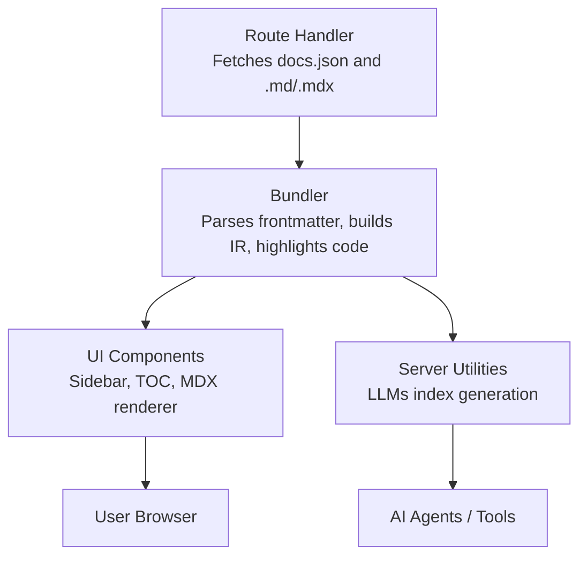
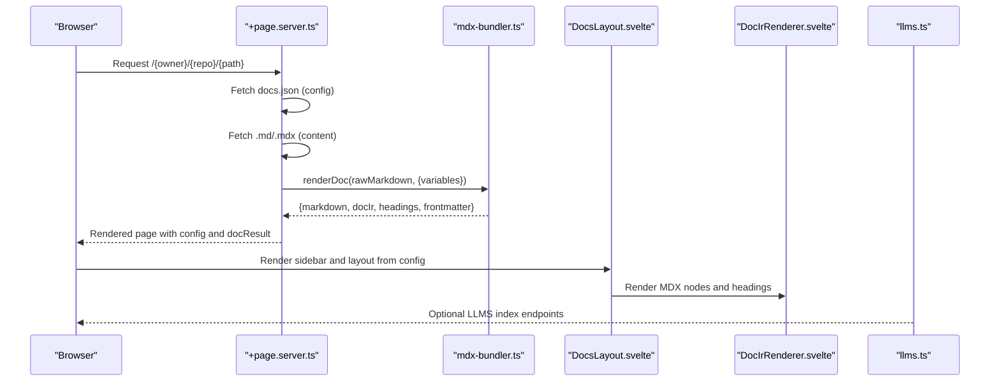
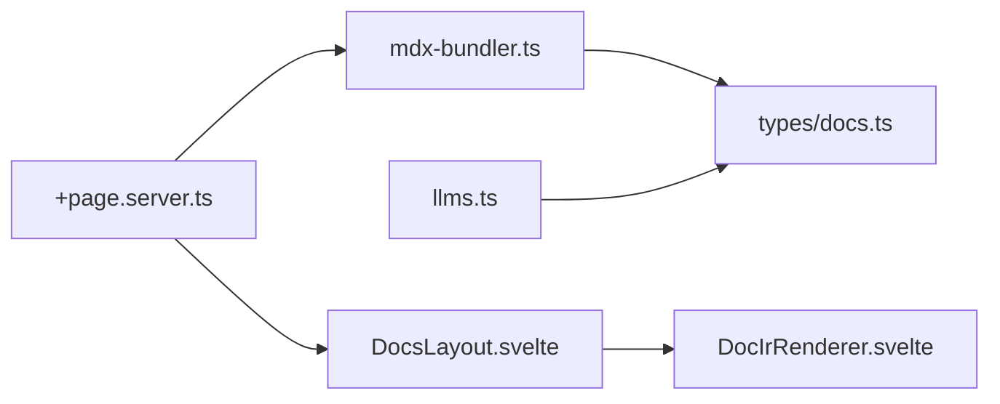

# Frontmatter Configuration

<cite>
**Referenced Files in This Document**
- [mdx-bundler.ts](file://src/lib/bundler/mdx-bundler.ts)
- [docs.ts](file://src/lib/types/docs.ts)
- [+page.server.ts](file://src/routes/[owner]/[repo]/[...path]/+page.server.ts)
- [DocsLayout.svelte](file://src/lib/components/DocsLayout.svelte)
- [DocIrRenderer.svelte](file://src/lib/components/DocIrRenderer.svelte)
- [llms.ts](file://src/lib/server/llms.ts)
</cite>

## Table of Contents
1. Introduction
2. Project Structure
3. Core Components
4. Architecture Overview
5. Detailed Component Analysis
6. Dependency Analysis
7. Performance Considerations
8. Troubleshooting Guide
9. Conclusion

## Introduction
This document explains how FractalDocs handles frontmatter in Markdown and MDX files, what fields are supported, and how they influence routing, search indexing, and component rendering. It also provides best practices for organizing frontmatter across large documentation projects and strategies for maintaining consistency.

Frontmatter is parsed from the top of each document and exposed as a plain object. The bundler extracts headings, builds an internal representation (IR), highlights code blocks, and returns both the processed content and the original frontmatter data for downstream use by UI components and server utilities.

## Project Structure
FractalDocs processes documentation through a clear pipeline:
- Route handlers fetch repository configuration and raw Markdown/MDX content.
- The bundler parses frontmatter, transforms content into an IR, highlights code, and extracts headings.
- UI components render the sidebar, table of contents, and MDX components based on configuration and content.
- Server utilities generate AI-friendly indexes using site-level configuration.

**Diagram sources**
- [+page.server.ts:1-76](file://src/routes/[owner]/[repo]/[...path]/+page.server.ts#L1-L76)
- [mdx-bundler.ts:280-295](file://src/lib/bundler/mdx-bundler.ts#L280-L295)
- [DocsLayout.svelte:36-104](file://src/lib/components/DocsLayout.svelte#L36-L104)
- [DocIrRenderer.svelte:1-117](file://src/lib/components/DocIrRenderer.svelte#L1-L117)
- [llms.ts:1-27](file://src/lib/server/llms.ts#L1-L27)

**Section sources**
- [+page.server.ts:1-76](file://src/routes/[owner]/[repo]/[...path]/+page.server.ts#L1-L76)
- [mdx-bundler.ts:280-295](file://src/lib/bundler/mdx-bundler.ts#L280-L295)

## Core Components
- Frontmatter parsing and exposure: The bundler uses gray-matter to extract frontmatter and returns it alongside processed content.
- Headings extraction: Headings are scanned to build a table of contents used by the UI.
- Code highlighting: Code blocks are highlighted with Shiki; titles can be extracted from block metadata.
- Variable substitution: Moustache-style variables can be replaced in content before processing.
- Site configuration: DocsConfig defines global settings like name, description, tabs, sidebar, redirects, and variables.

Key behaviors:
- Frontmatter is returned as-is (Record<string, unknown>) for consumers to interpret.
- Headings are normalized into slugs for stable anchor links.
- Variables can be injected via options passed to the bundler.

**Section sources**
- [mdx-bundler.ts:1-295](file://src/lib/bundler/mdx-bundler.ts#L1-L295)
- [docs.ts:53-74](file://src/lib/types/docs.ts#L53-L74)

## Architecture Overview
The end-to-end flow for a documentation page:

**Diagram sources**
- [+page.server.ts:1-76](file://src/routes/[owner]/[repo]/[...path]/+page.server.ts#L1-L76)
- [mdx-bundler.ts:280-295](file://src/lib/bundler/mdx-bundler.ts#L280-L295)
- [DocsLayout.svelte:36-104](file://src/lib/components/DocsLayout.svelte#L36-L104)
- [DocIrRenderer.svelte:1-117](file://src/lib/components/DocIrRenderer.svelte#L1-L117)
- [llms.ts:1-27](file://src/lib/server/llms.ts#L1-L27)

## Detailed Component Analysis

### Frontmatter Parsing and Exposure
- The bundler calls gray-matter to split frontmatter and body.
- The result includes:
  - markdown: processed body text after variable substitution
  - docIr: structured representation of content
  - headings: array of heading nodes for navigation
  - frontmatter: original key-value pairs from the document

Implications:
- Any keys present in frontmatter are available to consumers. There is no enforced schema at parse time.
- Consumers should validate and normalize frontmatter according to their needs.

Best practices:
- Use consistent keys across documents (e.g., title, description).
- Keep custom metadata under a dedicated namespace if needed.

**Section sources**
- [mdx-bundler.ts:280-295](file://src/lib/bundler/mdx-bundler.ts#L280-L295)

### Supported Frontmatter Fields
While frontmatter is flexible, the following fields are commonly used or recognized by the system:

- Global site configuration (docs.json):
  - name: string
  - description: string
  - logo: { light: string; dark: string }
  - favicon: string
  - theme: { preset?: string; primary?: string }
  - social: { x?: string; github?: string; discord?: string }
  - tabs: [{ id: string; title: string; href: string }]
  - sidebar: [{ group: string; icon?: string; tab?: string; pages: SidebarPageItem[] | NestedGroup[] }]
  - redirects: Record<string, string>
  - variables: Record<string, unknown>

- Per-document frontmatter (commonly used):
  - title: string (used for display and SEO)
  - description: string (summary for search/indexing)
  - Custom metadata: any additional keys (e.g., tags, authors, version)

Notes:
- The bundler does not enforce these fields; they are consumed by UI and server utilities.
- For per-document overrides, pass variables via the bundler options when available.

**Section sources**
- [docs.ts:53-74](file://src/lib/types/docs.ts#L53-L74)

### Routing Behavior
- Routes resolve to GitHub repositories and attempt multiple file locations for content.
- If no content is found, a 404 error is thrown.
- Frontmatter itself does not alter routing; routing is path-based.

Operational details:
- Config is fetched from docs.json at repository root.
- Content is fetched from several possible paths (.md, .mdx, index.md variants).

**Section sources**
- [+page.server.ts:1-76](file://src/routes/[owner]/[repo]/[...path]/+page.server.ts#L1-L76)

### Search Indexing and AI-Friendly Outputs
- The server exposes LLMS endpoints that generate text indexes using site-level configuration.
- These outputs rely on DocsConfig fields such as name and description.
- Per-document frontmatter is not directly consumed by these generators in the current implementation.

Recommendations:
- Provide meaningful site-level name and description for better indexing.
- Include summaries in your own indexing pipelines if you need per-document summaries.

**Section sources**
- [llms.ts:1-27](file://src/lib/server/llms.ts#L1-L27)

### Component Rendering and Metadata Usage
- The layout renders the sidebar from the configured groups and pages.
- The right-hand table of contents is built from extracted headings.
- MDX components are rendered from the IR; props are typed and cleaned.

How frontmatter affects rendering:
- Frontmatter values can be consumed by higher-level components or templates if passed down.
- Headings drive the “On this page” navigation.
- Code block titles can be derived from block metadata.

**Section sources**
- [DocsLayout.svelte:36-104](file://src/lib/components/DocsLayout.svelte#L36-L104)
- [DocIrRenderer.svelte:1-117](file://src/lib/components/DocIrRenderer.svelte#L1-L117)
- [mdx-bundler.ts:168-185](file://src/lib/bundler/mdx-bundler.ts#L168-L185)

### Navigation Order and Grouping
- Navigation order is controlled by the sidebar configuration in docs.json.
- Groups define sections; pages within a group appear in the order listed.
- Nested groups are supported for deeper hierarchies.

Guidelines:
- Maintain a single source of truth for navigation in docs.json.
- Avoid duplicating navigation logic in per-document frontmatter.

**Section sources**
- [docs.ts:41-51](file://src/lib/types/docs.ts#L41-L51)
- [DocsLayout.svelte:42-67](file://src/lib/components/DocsLayout.svelte#L42-L67)

### Variables Substitution
- Before processing, the bundler replaces moustache placeholders in the content with provided variables.
- Supports dot notation for nested values and only substitutes strings or numbers.

Use cases:
- Inject environment-specific URLs or versions into content.
- Centralize repeated snippets via variables.

**Section sources**
- [mdx-bundler.ts:148-166](file://src/lib/bundler/mdx-bundler.ts#L148-L166)

### Validation Rules, Defaults, and Error Handling
- Frontmatter parsing is lenient; invalid YAML will cause errors during parsing.
- No schema validation is applied automatically; consumers must validate as needed.
- Default site configuration is applied when docs.json is missing or unreachable.
- If content cannot be found, a 404 error is raised.

Recommendations:
- Validate frontmatter in your build step or runtime handler.
- Provide sensible defaults for critical fields.
- Log and surface parsing errors early.

**Section sources**
- [+page.server.ts:10-34](file://src/routes/[owner]/[repo]/[...path]/+page.server.ts#L10-L34)
- [+page.server.ts:62-64](file://src/routes/[owner]/[repo]/[...path]/+page.server.ts#L62-L64)

### Examples of Frontmatter Configurations
Below are conceptual examples illustrating common patterns. Replace placeholders with your actual values.

- API Documentation Page
  - title: "API Reference"
  - description: "Endpoints and schemas for the service"
  - tags: ["api", "reference"]
  - version: "v2"

- Tutorial Page
  - title: "Getting Started"
  - description: "Step-by-step tutorial to set up the project"
  - author: "Team Name"
  - difficulty: "beginner"

- Reference Material
  - title: "Configuration Options"
  - description: "Complete list of configuration keys and defaults"
  - category: "configuration"
  - last_reviewed: "2025-01-01"

Note: These fields are illustrative. Ensure your consumers (components, scripts) expect them.

[No sources needed since this section doesn't analyze specific files]

## Dependency Analysis
The following diagram shows how core modules depend on each other for frontmatter handling and rendering.

**Diagram sources**
- [+page.server.ts:1-76](file://src/routes/[owner]/[repo]/[...path]/+page.server.ts#L1-L76)
- [mdx-bundler.ts:1-295](file://src/lib/bundler/mdx-bundler.ts#L1-L295)
- [docs.ts:1-81](file://src/lib/types/docs.ts#L1-L81)
- [DocsLayout.svelte:36-104](file://src/lib/components/DocsLayout.svelte#L36-L104)
- [DocIrRenderer.svelte:1-117](file://src/lib/components/DocIrRenderer.svelte#L1-L117)
- [llms.ts:1-27](file://src/lib/server/llms.ts#L1-L27)

**Section sources**
- [mdx-bundler.ts:1-295](file://src/lib/bundler/mdx-bundler.ts#L1-L295)
- [docs.ts:1-81](file://src/lib/types/docs.ts#L1-L81)

## Performance Considerations
- Frontmatter parsing is lightweight but occurs per request; cache results where appropriate.
- Heading extraction and code highlighting run per document; consider caching IR for static sites.
- Variable substitution is regex-based; keep variable sets small to minimize overhead.
- Large sidebars increase DOM size; paginate or lazy-load where possible.

[No sources needed since this section provides general guidance]

## Troubleshooting Guide
Common issues and resolutions:
- Malformed frontmatter:
  - Symptom: Build or render fails due to YAML parsing errors.
  - Resolution: Validate YAML syntax; ensure proper delimiters and indentation.

- Missing content:
  - Symptom: 404 error for a requested path.
  - Resolution: Verify file exists in one of the expected locations; check branch names (main/master).

- Unexpected navigation:
  - Symptom: Sidebar order or grouping differs from expectations.
  - Resolution: Update docs.json sidebar configuration; ensure correct nesting and ordering.

- Variables not substituted:
  - Symptom: Placeholders remain in output.
  - Resolution: Ensure variables are provided to the bundler and match the placeholder format.

- Headings not appearing in TOC:
  - Symptom: “On this page” is empty or incomplete.
  - Resolution: Use supported heading levels (#2–#4); verify heading text formatting.

**Section sources**
- [+page.server.ts:62-64](file://src/routes/[owner]/[repo]/[...path]/+page.server.ts#L62-L64)
- [mdx-bundler.ts:168-185](file://src/lib/bundler/mdx-bundler.ts#L168-L185)

## Conclusion
FractalDocs treats frontmatter as a flexible metadata layer. While there is no enforced schema, consistent naming and validation in your pipeline will yield predictable behavior. Use docs.json for site-wide configuration and navigation, and per-document frontmatter for page-level metadata. Leverage variables for dynamic content, and rely on the bundler’s heading extraction and code highlighting for rich, navigable documentation.

[No sources needed since this section summarizes without analyzing specific files]