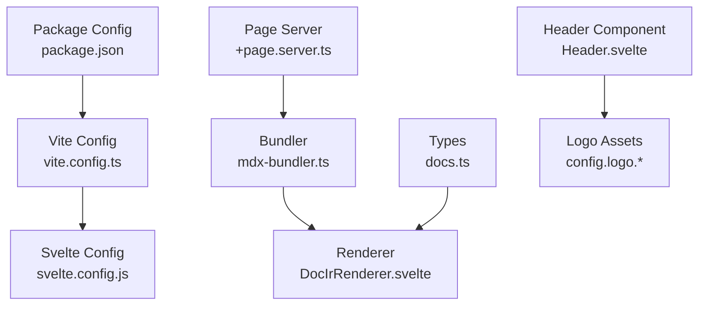
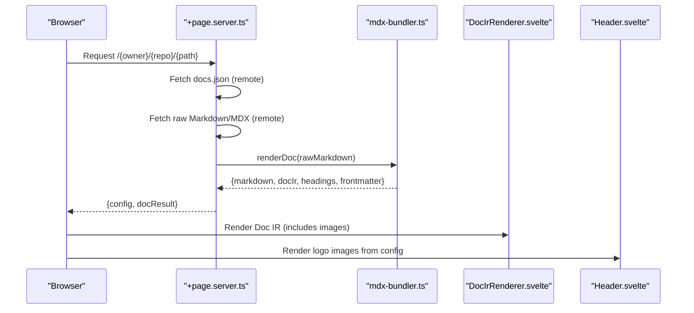
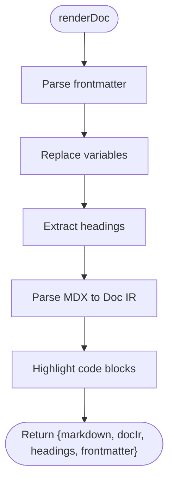
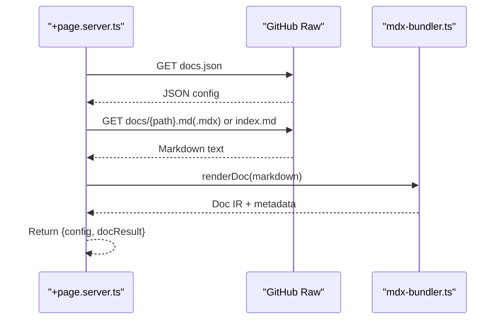
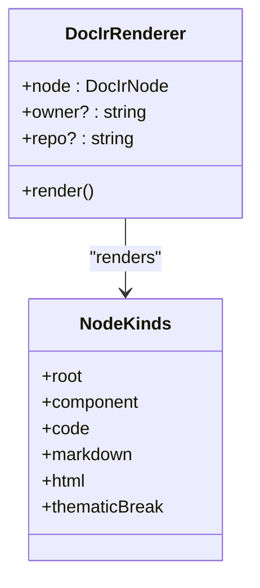
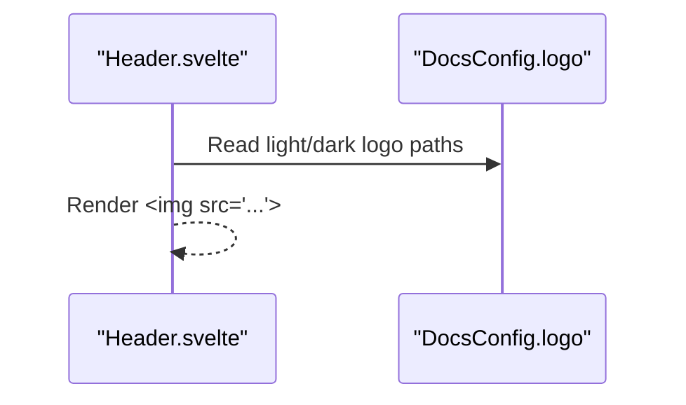
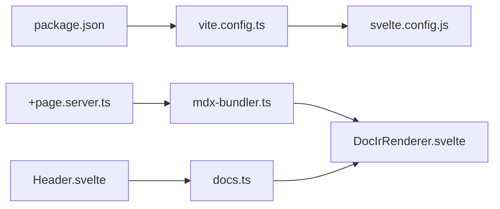

# Image and Asset Handling

<cite>
**Referenced Files in This Document**
- [package.json](file://package.json)
- [vite.config.ts](file://vite.config.ts)
- [svelte.config.js](file://svelte.config.js)
- [mdx-bundler.ts](file://src/lib/bundler/mdx-bundler.ts)
- [+page.server.ts](file://src/routes/[owner]/[repo]/[...path]/+page.server.ts)
- [+page.svelte](file://src/routes/[owner]/[repo]/[...path]/+page.svelte)
- [DocIrRenderer.svelte](file://src/lib/components/DocIrRenderer.svelte)
- [Header.svelte](file://src/lib/components/Header.svelte)
- [docs.ts](file://src/lib/types/docs.ts)
</cite>

## Table of Contents
1. [Introduction](#introduction)
2. [Project Structure](#project-structure)
3. [Core Components](#core-components)
4. [Architecture Overview](#architecture-overview)
5. [Detailed Component Analysis](#detailed-component-analysis)
6. [Dependency Analysis](#dependency-analysis)
7. [Performance Considerations](#performance-considerations)
8. [Troubleshooting Guide](#troubleshooting-guide)
9. [Conclusion](#conclusion)
10. [Appendices](#appendices)

## Introduction
This document explains how FractalDocs handles images and other assets during rendering and display. It focuses on:
- Supported image formats and how they are processed
- Optimization strategies available via the build toolchain
- Responsive image handling patterns
- Organizing assets within documentation projects and resolving relative paths
- Embedding images in Markdown and handling external assets
- Managing large media files, caching strategies, CDN integration options, and performance best practices

FractalDocs renders documentation by fetching raw Markdown/MDX from a repository, transforming it into an intermediate representation (IR), and then rendering that IR into HTML with Svelte components. Images embedded as Markdown or raw HTML pass through this pipeline unchanged, while site-level assets like logos are configured via configuration objects and rendered by UI components.

## Project Structure
The asset-related behavior is primarily implemented in:
- The bundler that transforms Markdown/MDX to HTML and builds the Doc IR
- The page server that fetches content and config from remote repositories
- The renderer component that outputs Markdown and HTML nodes
- Configuration types that define where logo assets are referenced
- Vite/SvelteKit configuration for build-time optimizations

**Diagram sources**
- [package.json:1-49](file://package.json#L1-L49)
- [vite.config.ts:1-35](file://vite.config.ts#L1-L35)
- [svelte.config.js:1-13](file://svelte.config.js#L1-L13)
- [+page.server.ts:1-76](file://src/routes/[owner]/[repo]/[...path]/+page.server.ts#L1-L76)
- [mdx-bundler.ts:1-296](file://src/lib/bundler/mdx-bundler.ts#L1-L296)
- [DocIrRenderer.svelte:1-117](file://src/lib/components/DocIrRenderer.svelte#L1-L117)
- [docs.ts:1-82](file://src/lib/types/docs.ts#L1-L82)
- [Header.svelte:67-70](file://src/lib/components/Header.svelte#L67-L70)

**Section sources**
- [package.json:1-49](file://package.json#L1-L49)
- [vite.config.ts:1-35](file://vite.config.ts#L1-L35)
- [svelte.config.js:1-13](file://svelte.config.js#L1-L13)
- [+page.server.ts:1-76](file://src/routes/[owner]/[repo]/[...path]/+page.server.ts#L1-L76)
- [mdx-bundler.ts:1-296](file://src/lib/bundler/mdx-bundler.ts#L1-L296)
- [DocIrRenderer.svelte:1-117](file://src/lib/components/DocIrRenderer.svelte#L1-L117)
- [docs.ts:1-82](file://src/lib/types/docs.ts#L1-L82)
- [Header.svelte:67-70](file://src/lib/components/Header.svelte#L67-L70)

## Core Components
- Markdown/MDX Bundler: Parses Markdown/MDX, converts to HTML, and builds a Doc IR used by the renderer. It also rewrites internal links when a repository context is provided.
- Page Server: Fetches docs.json and the requested Markdown/MDX from GitHub (main/master branches) and returns them to the page for rendering.
- Renderer: Recursively renders Doc IR nodes, including markdown and html nodes. Images inside these nodes are emitted as-is.
- Types: Define the structure of DocsConfig, including logo fields for light/dark variants.
- Header Component: Renders logo images using values from DocsConfig.

Key responsibilities related to assets:
- Markdown/MDX images are passed through without transformation.
- Site-level assets (logos) are referenced via configuration and rendered by components.
- Internal link rewriting affects navigation but not image URLs directly.

**Section sources**
- [mdx-bundler.ts:106-146](file://src/lib/bundler/mdx-bundler.ts#L106-L146)
- [mdx-bundler.ts:192-207](file://src/lib/bundler/mdx-bundler.ts#L192-L207)
- [mdx-bundler.ts:280-295](file://src/lib/bundler/mdx-bundler.ts#L280-L295)
- [+page.server.ts:1-76](file://src/routes/[owner]/[repo]/[...path]/+page.server.ts#L1-L76)
- [DocIrRenderer.svelte:106-113](file://src/lib/components/DocIrRenderer.svelte#L106-L113)
- [docs.ts:53-74](file://src/lib/types/docs.ts#L53-L74)
- [Header.svelte:67-70](file://src/lib/components/Header.svelte#L67-L70)

## Architecture Overview
The end-to-end flow for a documentation page includes fetching configuration and content, transforming content into HTML/IR, and rendering images and other assets.

**Diagram sources**
- [+page.server.ts:1-76](file://src/routes/[owner]/[repo]/[...path]/+page.server.ts#L1-L76)
- [mdx-bundler.ts:280-295](file://src/lib/bundler/mdx-bundler.ts#L280-L295)
- [DocIrRenderer.svelte:1-117](file://src/lib/components/DocIrRenderer.svelte#L1-L117)
- [Header.svelte:67-70](file://src/lib/components/Header.svelte#L67-L70)

## Detailed Component Analysis

### Markdown/MDX Bundler
Responsibilities:
- Parse Markdown/MDX into an intermediate representation (Doc IR).
- Convert code blocks to highlighted HTML.
- Generate slug IDs for headings.
- Rewrite internal links when owner/repo context is present.
- Pass through Markdown and raw HTML nodes, which include images.

Asset implications:
- Images written as Markdown or raw HTML are preserved and rendered as-is.
- No automatic optimization or format conversion is applied to images in this step.

**Diagram sources**
- [mdx-bundler.ts:280-295](file://src/lib/bundler/mdx-bundler.ts#L280-L295)
- [mdx-bundler.ts:106-146](file://src/lib/bundler/mdx-bundler.ts#L106-L146)
- [mdx-bundler.ts:192-207](file://src/lib/bundler/mdx-bundler.ts#L192-L207)

**Section sources**
- [mdx-bundler.ts:106-146](file://src/lib/bundler/mdx-bundler.ts#L106-L146)
- [mdx-bundler.ts:192-207](file://src/lib/bundler/mdx-bundler.ts#L192-L207)
- [mdx-bundler.ts:280-295](file://src/lib/bundler/mdx-bundler.ts#L280-L295)

### Page Server
Responsibilities:
- Fetch docs.json configuration from remote repository (main/master).
- Fetch raw Markdown/MDX content for the requested path.
- Transform content using the bundler and return data to the page.

Asset implications:
- All assets referenced in docs.json (e.g., logo paths) and Markdown/MDX are treated as strings; no local bundling occurs here.
- Relative paths in Markdown remain relative to the final served URL after link rewriting.

**Diagram sources**
- [+page.server.ts:1-76](file://src/routes/[owner]/[repo]/[...path]/+page.server.ts#L1-L76)
- [mdx-bundler.ts:280-295](file://src/lib/bundler/mdx-bundler.ts#L280-L295)

**Section sources**
- [+page.server.ts:1-76](file://src/routes/[owner]/[repo]/[...path]/+page.server.ts#L1-L76)

### Renderer (DocIrRenderer)
Responsibilities:
- Recursively render Doc IR nodes.
- For markdown nodes, convert source to HTML and inject into DOM.
- For html nodes, render raw HTML.
- For component nodes, render custom MDX components.

Asset implications:
- Images inside markdown/html nodes are emitted as-is.
- No special processing or optimization is applied to images at render time.

**Diagram sources**
- [DocIrRenderer.svelte:1-117](file://src/lib/components/DocIrRenderer.svelte#L1-L117)
- [docs.ts:9-27](file://src/lib/types/docs.ts#L9-L27)

**Section sources**
- [DocIrRenderer.svelte:106-113](file://src/lib/components/DocIrRenderer.svelte#L106-L113)
- [docs.ts:9-27](file://src/lib/types/docs.ts#L9-L27)

### Header Component and Logo Assets
Responsibilities:
- Render logo images based on DocsConfig values for light and dark modes.

Asset implications:
- Logo paths are taken from configuration and rendered directly.
- No automatic optimization is performed in this component.

**Diagram sources**
- [Header.svelte:67-70](file://src/lib/components/Header.svelte#L67-L70)
- [docs.ts:53-74](file://src/lib/types/docs.ts#L53-L74)

**Section sources**
- [Header.svelte:67-70](file://src/lib/components/Header.svelte#L67-L70)
- [docs.ts:53-74](file://src/lib/types/docs.ts#L53-L74)

## Dependency Analysis
- The bundler depends on unified ecosystem packages for parsing and transforming Markdown/MDX.
- The page server depends on network fetch to retrieve configuration and content.
- The renderer depends on the bundler’s output (Doc IR) and renders markdown/html nodes.
- Vite and SvelteKit configurations enable preprocessing and SSR settings for the unified stack.

**Diagram sources**
- [package.json:1-49](file://package.json#L1-L49)
- [vite.config.ts:1-35](file://vite.config.ts#L1-L35)
- [svelte.config.js:1-13](file://svelte.config.js#L1-L13)
- [+page.server.ts:1-76](file://src/routes/[owner]/[repo]/[...path]/+page.server.ts#L1-L76)
- [mdx-bundler.ts:1-296](file://src/lib/bundler/mdx-bundler.ts#L1-L296)
- [DocIrRenderer.svelte:1-117](file://src/lib/components/DocIrRenderer.svelte#L1-L117)
- [docs.ts:1-82](file://src/lib/types/docs.ts#L1-L82)
- [Header.svelte:67-70](file://src/lib/components/Header.svelte#L67-L70)

**Section sources**
- [package.json:1-49](file://package.json#L1-L49)
- [vite.config.ts:1-35](file://vite.config.ts#L1-L35)
- [svelte.config.js:1-13](file://svelte.config.js#L1-L13)
- [+page.server.ts:1-76](file://src/routes/[owner]/[repo]/[...path]/+page.server.ts#L1-L76)
- [mdx-bundler.ts:1-296](file://src/lib/bundler/mdx-bundler.ts#L1-L296)
- [DocIrRenderer.svelte:1-117](file://src/lib/components/DocIrRenderer.svelte#L1-L117)
- [docs.ts:1-82](file://src/lib/types/docs.ts#L1-L82)
- [Header.svelte:67-70](file://src/lib/components/Header.svelte#L67-L70)

## Performance Considerations
- Build-time optimization: Vite/esbuild targets are set to modern JavaScript features, enabling efficient bundling and minification.
- SSR configuration ensures required modules are bundled correctly for server-side rendering.
- Images embedded in Markdown/MDX are not automatically optimized by the bundler; consider pre-optimizing images before embedding.
- Large media files should be hosted externally (CDN) and linked from Markdown to avoid bloating the bundle.
- Use responsive images (e.g., srcset) in Markdown or raw HTML to improve loading across devices.
- Leverage browser caching by setting appropriate cache headers on your hosting platform for static assets.

[No sources needed since this section provides general guidance]

## Troubleshooting Guide
Common issues and resolutions:
- Images not loading:
  - Ensure image paths are correct and accessible from the final served URL.
  - For remote images, verify CORS policies if applicable.
  - For local images, ensure they are placed under a publicly accessible directory if served statically.
- Broken internal links:
  - Internal link rewriting applies to href attributes; confirm that paths align with the expected base path for the repository.
- Logos not displaying:
  - Verify that DocsConfig.logo.light and logo.dark contain valid URLs or paths.
- Slow page loads with large images:
  - Pre-optimize images (resize, compress, use modern formats like WebP/AVIF).
  - Implement responsive images using srcset and sizes attributes.
- Caching problems:
  - Configure CDN or hosting provider cache headers for long-lived caching of static assets.
  - Use versioned asset filenames to bust caches when assets change.

**Section sources**
- [mdx-bundler.ts:132-140](file://src/lib/bundler/mdx-bundler.ts#L132-L140)
- [Header.svelte:67-70](file://src/lib/components/Header.svelte#L67-L70)
- [docs.ts:53-74](file://src/lib/types/docs.ts#L53-L74)

## Conclusion
FractalDocs passes through Markdown and HTML content, including images, without transformation. Site-level assets like logos are configured via DocsConfig and rendered by components. To achieve optimal performance and consistent visual appearance:
- Pre-optimize images and use responsive techniques.
- Host large media on CDNs and reference them from Markdown.
- Configure caching appropriately at your hosting layer.
- Validate asset paths and ensure accessibility from the final served URLs.

[No sources needed since this section summarizes without analyzing specific files]

## Appendices

### Supported Image Formats
- Any format supported by browsers (e.g., PNG, JPEG, GIF, SVG, WebP, AVIF) can be embedded in Markdown or raw HTML.
- Prefer modern formats (WebP, AVIF) for better compression and performance.

[No sources needed since this section provides general guidance]

### Organizing Assets Within Documentation Projects
- Place images alongside Markdown files or in a dedicated assets folder.
- Reference images using relative paths from the Markdown file location.
- For site-wide assets (logos, favicons), configure paths in DocsConfig.

[No sources needed since this section provides general guidance]

### Relative Path Resolution
- Markdown images resolve relative to the current document path.
- Internal link rewriting adjusts href attributes for repository-based routing; image paths are unaffected unless explicitly rewritten.

**Section sources**
- [mdx-bundler.ts:132-140](file://src/lib/bundler/mdx-bundler.ts#L132-L140)

### Asset Bundling Processes
- Images in Markdown/MDX are not bundled by the bundler; they are emitted as-is.
- Site assets referenced in configuration are rendered as static references.

**Section sources**
- [DocIrRenderer.svelte:106-113](file://src/lib/components/DocIrRenderer.svelte#L106-L113)
- [Header.svelte:67-70](file://src/lib/components/Header.svelte#L67-L70)

### Embedding Images in Markdown
- Use standard Markdown image syntax or raw HTML img tags.
- For responsive images, use srcset and sizes attributes in HTML.

[No sources needed since this section provides general guidance]

### Handling External Assets
- Link to external images via absolute URLs.
- Ensure external hosts allow hotlinking and provide adequate caching headers.

[No sources needed since this section provides general guidance]

### Managing Large Media Files
- Host large files on CDNs or object storage.
- Link from Markdown rather than embedding directly to keep bundles small.

[No sources needed since this section provides general guidance]

### Caching Strategies and CDN Integration
- Set long cache lifetimes for immutable assets.
- Use versioned filenames to invalidate caches on updates.
- Configure CDN edge caching for global distribution.

[No sources needed since this section provides general guidance]

### Performance Optimization Techniques
- Pre-compress and resize images.
- Use modern formats and responsive images.
- Minimize critical CSS/JS and defer non-critical resources.

[No sources needed since this section provides general guidance]

### Best Practices for Consistent Visual Appearance
- Maintain consistent image dimensions and aspect ratios.
- Provide alt text for accessibility.
- Test across devices and screen sizes using responsive images.

[No sources needed since this section provides general guidance]