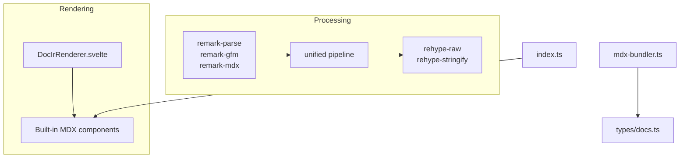
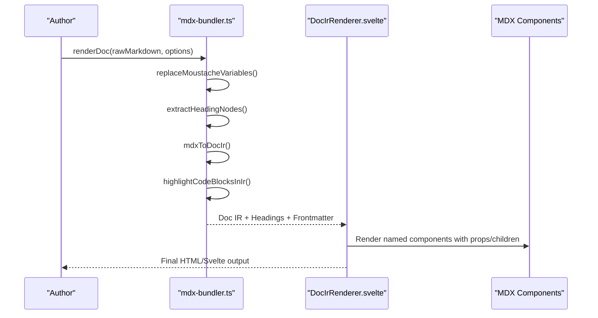
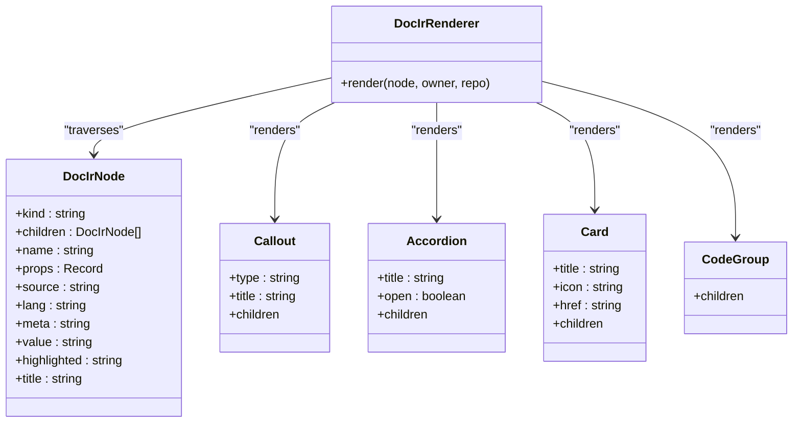
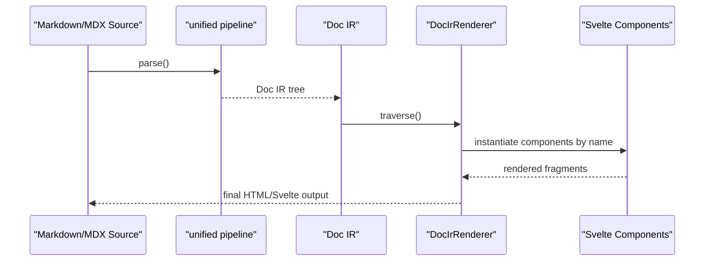
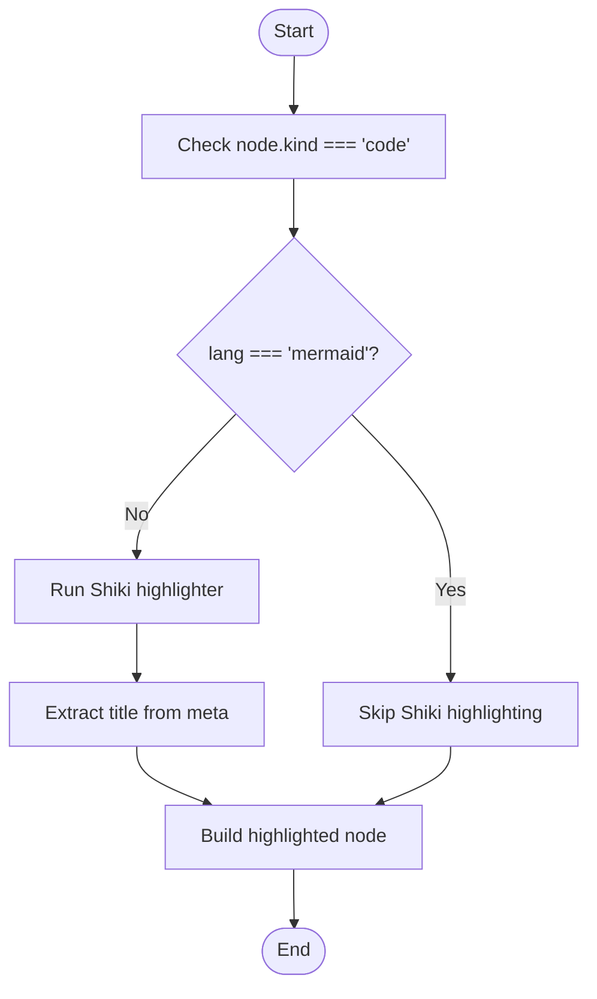
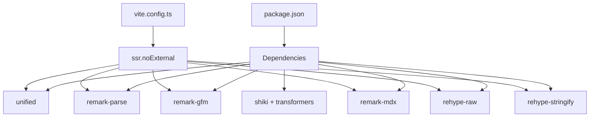

# Markdown and MDX Syntax

<cite>
**Referenced Files in This Document**
- [package.json](file://package.json)
- [vite.config.ts](file://vite.config.ts)
- [index.ts](file://src/lib/index.ts)
- [mdx-bundler.ts](file://src/lib/bundler/mdx-bundler.ts)
- [docs.ts](file://src/lib/types/docs.ts)
- [DocIrRenderer.svelte](file://src/lib/components/DocIrRenderer.svelte)
- [Callout.svelte](file://src/lib/components/mdx/Callout.svelte)
- [Accordion.svelte](file://src/lib/components/mdx/Accordion.svelte)
- [Card.svelte](file://src/lib/components/mdx/Card.svelte)
- [CodeGroup.svelte](file://src/lib/components/mdx/CodeGroup.svelte)
</cite>

## Table of Contents
1. Introduction
2. Project Structure
3. Core Components
4. Architecture Overview
5. Detailed Component Analysis
6. Dependency Analysis
7. Performance Considerations
8. Troubleshooting Guide
9. Conclusion

## Introduction
This document explains how FractalDocs supports Markdown and MDX syntax, including GitHub Flavored Markdown (GFM) extensions, heading levels, lists, tables, code blocks, and links. It also documents MDX component integration patterns: how to import and use custom components within content, and how MDX syntax maps to the component system. Practical examples, best practices, troubleshooting tips, and performance guidance for large documentation sets are included.

## Project Structure
FractalDocs processes Markdown and MDX through a unified pipeline that converts source text into an intermediate representation (IR), highlights code, and renders it with Svelte components. Key modules include:
- Bundler and processor utilities for parsing and transforming Markdown/MDX
- A renderer that interprets the IR and renders Markdown segments and MDX components
- Built-in MDX components exposed via a central index

**Diagram sources**
- [mdx-bundler.ts](file://src/lib/bundler/mdx-bundler.ts)
- [DocIrRenderer.svelte](file://src/lib/components/DocIrRenderer.svelte)
- [index.ts](file://src/lib/index.ts)
- [docs.ts](file://src/lib/types/docs.ts)

**Section sources**
- [package.json](file://package.json)
- [vite.config.ts](file://vite.config.ts)
- [index.ts](file://src/lib/index.ts)

## Core Components
- Unified processing pipeline: Parses Markdown/MDX, enables GFM, and transforms to HTML or IR.
- Code highlighting: Shiki-based highlighter with transformers for diff, focus, and inline highlighting.
- IR model: A typed AST-like structure representing root, component, markdown, html, code, and thematicBreak nodes.
- Renderer: Recursively renders IR nodes to Svelte components and HTML.

Key responsibilities:
- Parse and transform Markdown/MDX into IR and HTML
- Extract headings and frontmatter
- Highlight code blocks and preserve metadata
- Render MDX components by name with props and children

**Section sources**
- [mdx-bundler.ts](file://src/lib/bundler/mdx-bundler.ts)
- [docs.ts](file://src/lib/types/docs.ts)
- [DocIrRenderer.svelte](file://src/lib/components/DocIrRenderer.svelte)

## Architecture Overview
The rendering flow starts with raw Markdown/MDX, which is parsed into an IR. The renderer then traverses the IR and renders either Markdown segments as HTML or MDX components as Svelte elements.

**Diagram sources**
- [mdx-bundler.ts](file://src/lib/bundler/mdx-bundler.ts)
- [DocIrRenderer.svelte](file://src/lib/components/DocIrRenderer.svelte)

## Detailed Component Analysis

### Markdown Feature Support
FractalDocs uses remark-parse with remark-gfm to support standard Markdown plus GFM extensions. The pipeline also allows raw HTML via rehype-raw and sanitization is not enforced by default in this path.

Supported features:
- Headings: h1–h6; slug IDs are generated automatically for anchor links
- Lists: ordered and unordered lists
- Tables: GFM tables
- Links: internal and external links; internal links can be rewritten when repo context is provided
- Emphasis, strikethrough, blockquotes, horizontal rules
- Code blocks: fenced code blocks with language detection and Shiki highlighting
- Inline code
- Images: supported via Markdown image syntax

Notes:
- Heading slug generation ensures stable anchors
- Internal link rewriting is applied during Markdown-to-HTML conversion when owner/repo context is present

**Section sources**
- [mdx-bundler.ts](file://src/lib/bundler/mdx-bundler.ts)

### MDX Component Integration
MDX components are rendered by name from the IR. The renderer recognizes uppercase component names and maps them to Svelte components. Built-in components are exported centrally and used by the renderer.

How it works:
- MDX JSX elements are parsed into IR nodes with kind 'component'
- Each node includes name, props, and children
- The renderer matches component names to built-in Svelte components
- Unknown components are wrapped in a generic container

Built-in MDX components:
- Callout: contextual callouts with types like note, info, warning, tip, danger
- Accordion: collapsible sections
- Card: clickable or static cards with optional icon and href
- CardGroup: grid of cards
- CodeGroup: tabbed code snippets

Usage pattern:
- Import components via the central index if needed elsewhere
- Use MDX syntax in content files to reference components by name
- Pass props and nested content as children

Best practices:
- Keep component names PascalCase to match MDX expectations
- Prefer small, composable components
- Avoid heavy logic inside MDX components; offload to services or hooks

**Section sources**
- [index.ts](file://src/lib/index.ts)
- [DocIrRenderer.svelte](file://src/lib/components/DocIrRenderer.svelte)
- [Callout.svelte](file://src/lib/components/mdx/Callout.svelte)
- [Accordion.svelte](file://src/lib/components/mdx/Accordion.svelte)
- [Card.svelte](file://src/lib/components/mdx/Card.svelte)
- [CodeGroup.svelte](file://src/lib/components/mdx/CodeGroup.svelte)

### Code Blocks and Highlighting
Code blocks are highlighted using Shiki with CSS variables theme and transformers for advanced annotations. Special handling exists for Mermaid blocks to avoid highlighting.

Highlights:
- Language aliases and mapping for common languages
- Meta string parsing for titles and annotations
- Diff, focus, and inline highlighting via transformers
- Copy-to-clipboard functionality in the UI

Mermaid caveat:
- Mermaid code blocks are excluded from Shiki highlighting to allow proper rendering

**Section sources**
- [mdx-bundler.ts](file://src/lib/bundler/mdx-bundler.ts)
- [DocIrRenderer.svelte](file://src/lib/components/DocIrRenderer.svelte)

### Headings and Navigation
Headings are extracted from Markdown to build navigation structures. Slug IDs are derived from heading text and injected into HTML headings.

Behavior:
- Only certain heading depths are captured for navigation
- Slugs are normalized to lowercase, alphanumeric, hyphens, and spaces converted to hyphens

**Section sources**
- [mdx-bundler.ts](file://src/lib/bundler/mdx-bundler.ts)

### Variable Substitution
Content supports mustache-style variable substitution for templating across docs. Variables are replaced before parsing.

Pattern:
- Use double braces with dot notation for nested values
- Non-string or non-number values are left unchanged

**Section sources**
- [mdx-bundler.ts](file://src/lib/bundler/mdx-bundler.ts)

### Class Diagram: IR Model and Renderer

**Diagram sources**
- [docs.ts](file://src/lib/types/docs.ts)
- [DocIrRenderer.svelte](file://src/lib/components/DocIrRenderer.svelte)
- [Callout.svelte](file://src/lib/components/mdx/Callout.svelte)
- [Accordion.svelte](file://src/lib/components/mdx/Accordion.svelte)
- [Card.svelte](file://src/lib/components/mdx/Card.svelte)
- [CodeGroup.svelte](file://src/lib/components/mdx/CodeGroup.svelte)

### Sequence Diagram: Rendering Flow

**Diagram sources**
- [mdx-bundler.ts](file://src/lib/bundler/mdx-bundler.ts)
- [DocIrRenderer.svelte](file://src/lib/components/DocIrRenderer.svelte)

### Flowchart: Code Block Processing

**Diagram sources**
- [mdx-bundler.ts](file://src/lib/bundler/mdx-bundler.ts)

## Dependency Analysis
External dependencies enable Markdown/MDX processing and code highlighting:
- Parsing and transformation: unified, remark-parse, remark-gfm, remark-mdx, remark-rehype, rehype-raw, rehype-stringify
- Code highlighting: shiki and @shikijs/transformers
- Frontmatter: gray-matter
- Utilities: zod for validation, clsx/tailwind-merge for styling

SSR configuration ensures critical packages are bundled correctly.

**Diagram sources**
- [package.json](file://package.json)
- [vite.config.ts](file://vite.config.ts)

**Section sources**
- [package.json](file://package.json)
- [vite.config.ts](file://vite.config.ts)

## Performance Considerations
- Shiki initialization: The highlighter instance is cached to avoid repeated setup costs.
- Parallel processing: Code block highlighting uses Promise.all for child traversal where applicable.
- Target optimization: Build targets set to es2022 for faster execution.
- SSR bundling: Critical packages are marked noExternal to prevent runtime overhead.
- Large sets: Prefer modular content and lazy-loading components; avoid overly complex MDX components that perform heavy computations.

Recommendations:
- Minimize deep nesting of MDX components
- Use simple props and avoid dynamic heavy operations in render paths
- Leverage caching strategies at the application layer for frequently accessed pages

[No sources needed since this section provides general guidance]

## Troubleshooting Guide
Common issues and resolutions:
- MDX components not rendering: Ensure component names are PascalCase and match registered names in the renderer. Verify imports via the central index.
- Code blocks not highlighted: Confirm language aliases are recognized; Mermaid blocks intentionally skip Shiki highlighting.
- Internal links broken: Provide owner/repo context when rendering Markdown to HTML to rewrite relative paths.
- Variables not substituted: Check variable keys and dot notation; only string and number values are substituted.
- Raw HTML rendering: rehype-raw allows raw HTML; ensure content is trusted.

Debugging steps:
- Inspect the generated IR to verify component names and props
- Validate frontmatter and heading extraction
- Review vite SSR configuration for missing external packages

**Section sources**
- [mdx-bundler.ts](file://src/lib/bundler/mdx-bundler.ts)
- [DocIrRenderer.svelte](file://src/lib/components/DocIrRenderer.svelte)

## Conclusion
FractalDocs provides a robust Markdown and MDX pipeline powered by unified and Shiki. It supports GFM features, automatic heading slugs, code highlighting, and flexible MDX component integration. By following best practices for component usage and optimizing for performance, you can create maintainable and high-quality documentation at scale.

[No sources needed since this section summarizes without analyzing specific files]