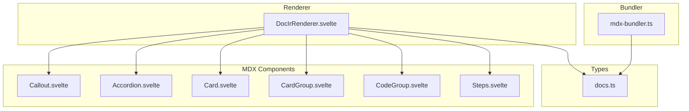
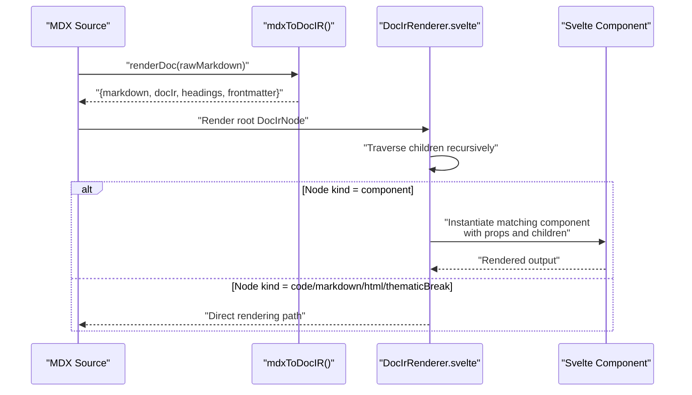
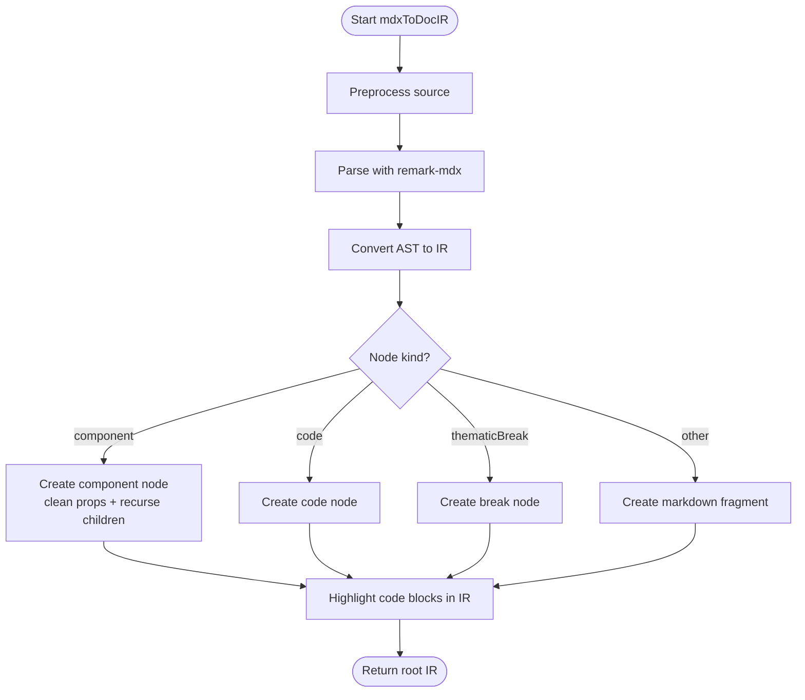
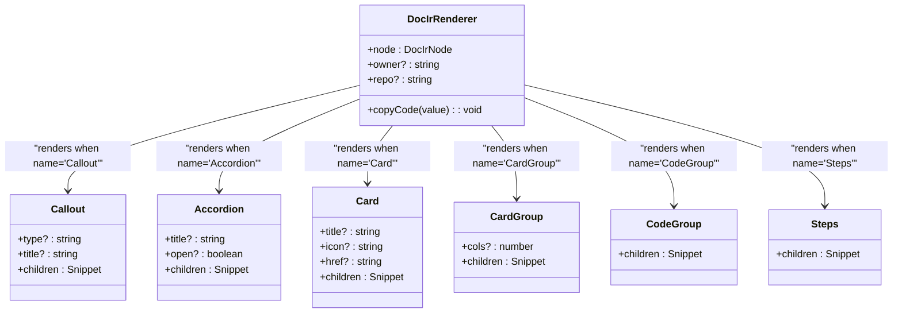
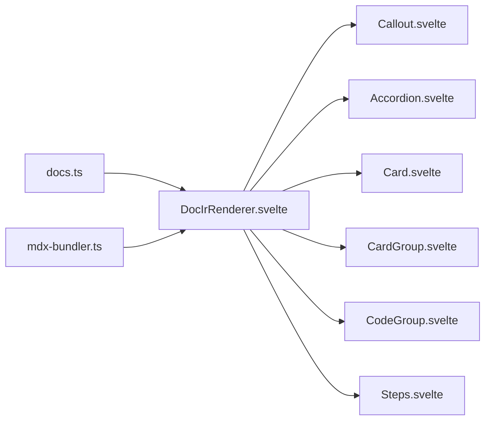

# Component Resolution Mechanism

<cite>
**Referenced Files in This Document**
- [mdx-bundler.ts](file://src/lib/bundler/mdx-bundler.ts)
- [DocIrRenderer.svelte](file://src/lib/components/DocIrRenderer.svelte)
- [docs.ts](file://src/lib/types/docs.ts)
- [Callout.svelte](file://src/lib/components/mdx/Callout.svelte)
- [Accordion.svelte](file://src/lib/components/mdx/Accordion.svelte)
- [Card.svelte](file://src/lib/components/mdx/Card.svelte)
- [CardGroup.svelte](file://src/lib/components/mdx/CardGroup.svelte)
- [CodeGroup.svelte](file://src/lib/components/mdx/CodeGroup.svelte)
- [Steps.svelte](file://src/lib/components/mdx/Steps.svelte)
</cite>

## Table of Contents
1. [Introduction](#introduction)
2. [Project Structure](#project-structure)
3. [Core Components](#core-components)
4. [Architecture Overview](#architecture-overview)
5. [Detailed Component Analysis](#detailed-component-analysis)
6. [Dependency Analysis](#dependency-analysis)
7. [Performance Considerations](#performance-considerations)
8. [Troubleshooting Guide](#troubleshooting-guide)
9. [Conclusion](#conclusion)
10. [Appendices](#appendices)

## Introduction
This document explains the component resolution mechanism that dynamically instantiates MDX components based on an intermediate representation (IR). It covers how the renderer maps IR component nodes to actual Svelte components, handles props and children, manages lifecycle, implements fallback strategies for missing components, documents the component registration approach, prop validation behavior, event handling considerations, and how to integrate custom components. Practical examples and debugging guidance are included.

## Project Structure
The MDX pipeline is implemented across a small set of focused modules:
- IR generation and code highlighting live in the bundler module.
- The IR renderer is a recursive Svelte component that dispatches node kinds to specialized renderers.
- Built-in MDX components are provided as Svelte components under the mdx directory.
- Shared types define the IR shape and related structures.

**Diagram sources**
- [mdx-bundler.ts:192-207](file://src/lib/bundler/mdx-bundler.ts#L192-L207)
- [DocIrRenderer.svelte:1-117](file://src/lib/components/DocIrRenderer.svelte#L1-L117)
- [docs.ts:1-82](file://src/lib/types/docs.ts#L1-L82)
- [Callout.svelte:1-65](file://src/lib/components/mdx/Callout.svelte#L1-L65)
- [Accordion.svelte:1-32](file://src/lib/components/mdx/Accordion.svelte#L1-L32)
- [Card.svelte:1-40](file://src/lib/components/mdx/Card.svelte#L1-L40)
- [CardGroup.svelte:1-18](file://src/lib/components/mdx/CardGroup.svelte#L1-L18)
- [CodeGroup.svelte:1-20](file://src/lib/components/mdx/CodeGroup.svelte#L1-L20)
- [Steps.svelte:1-16](file://src/lib/components/mdx/Steps.svelte#L1-L16)

**Section sources**
- [mdx-bundler.ts:192-207](file://src/lib/bundler/mdx-bundler.ts#L192-L207)
- [DocIrRenderer.svelte:1-117](file://src/lib/components/DocIrRenderer.svelte#L1-L117)
- [docs.ts:1-82](file://src/lib/types/docs.ts#L1-L82)

## Core Components
- IR generator: Converts MDX source into a typed IR tree with support for code blocks, markdown fragments, HTML fragments, thematic breaks, and MDX components. It also highlights code blocks and extracts headings.
- IR renderer: A recursive Svelte component that traverses the IR tree and renders each node appropriately. For component nodes, it dispatches by name to known Svelte components; unknown components fall back to a generic container.
- Built-in MDX components: Small, composable Svelte components that implement common UI patterns like callouts, accordions, cards, card groups, code groups, and steps.

Key responsibilities:
- IR creation and normalization (types, prop coercion, children recursion).
- Rendering strategy per node kind.
- Prop mapping from IR to component props.
- Fallback rendering for unregistered components.

**Section sources**
- [mdx-bundler.ts:192-278](file://src/lib/bundler/mdx-bundler.ts#L192-L278)
- [DocIrRenderer.svelte:1-117](file://src/lib/components/DocIrRenderer.svelte#L1-L117)
- [docs.ts:1-82](file://src/lib/types/docs.ts#L1-L82)

## Architecture Overview
The system follows a two-phase flow:
1. Build-time or runtime conversion of MDX source to IR.
2. Runtime rendering of IR to Svelte components.

**Diagram sources**
- [mdx-bundler.ts:280-296](file://src/lib/bundler/mdx-bundler.ts#L280-L296)
- [DocIrRenderer.svelte:33-80](file://src/lib/components/DocIrRenderer.svelte#L33-L80)

## Detailed Component Analysis

### IR Generation Pipeline
- Preprocessing removes comments and escapes stray tags.
- Parsing uses remark-parse, remark-gfm, and remark-mdx to build an AST.
- AST-to-IR conversion recognizes MDX JSX elements (flow and text), code blocks, and thematic breaks. Non-MDX content is captured as markdown fragments.
- Code blocks are highlighted asynchronously and enriched with metadata such as language and optional title.

Prop value cleaning:
- Booleans, numbers, strings, null/undefined are normalized.
- String values representing booleans or numbers are coerced accordingly.
- Complex objects are stringified if not recognized.

Children recursion:
- Component nodes carry their own children, which are converted recursively.

**Diagram sources**
- [mdx-bundler.ts:187-207](file://src/lib/bundler/mdx-bundler.ts#L187-L207)
- [mdx-bundler.ts:224-278](file://src/lib/bundler/mdx-bundler.ts#L224-L278)
- [mdx-bundler.ts:83-104](file://src/lib/bundler/mdx-bundler.ts#L83-L104)

**Section sources**
- [mdx-bundler.ts:187-207](file://src/lib/bundler/mdx-bundler.ts#L187-L207)
- [mdx-bundler.ts:224-278](file://src/lib/bundler/mdx-bundler.ts#L224-L278)
- [mdx-bundler.ts:83-104](file://src/lib/bundler/mdx-bundler.ts#L83-L104)

### IR Renderer and Component Dispatch
The renderer is a recursive Svelte component that:
- Renders root nodes by iterating children.
- For component nodes, dispatches by name to known components (e.g., Callout, Accordion, Card, CardGroup, CodeGroup, Steps).
- Maps IR props to component props with type coercion where needed.
- Passes children via Svelte snippets to nested components.
- Falls back to a generic bordered div for unknown component names.
- Renders code blocks with syntax highlighting and copy-to-clipboard.
- Renders markdown fragments using a helper that converts to HTML and rewrites internal links when repo context is provided.

**Diagram sources**
- [DocIrRenderer.svelte:1-117](file://src/lib/components/DocIrRenderer.svelte#L1-L117)
- [Callout.svelte:1-65](file://src/lib/components/mdx/Callout.svelte#L1-L65)
- [Accordion.svelte:1-32](file://src/lib/components/mdx/Accordion.svelte#L1-L32)
- [Card.svelte:1-40](file://src/lib/components/mdx/Card.svelte#L1-L40)
- [CardGroup.svelte:1-18](file://src/lib/components/mdx/CardGroup.svelte#L1-L18)
- [CodeGroup.svelte:1-20](file://src/lib/components/mdx/CodeGroup.svelte#L1-L20)
- [Steps.svelte:1-16](file://src/lib/components/mdx/Steps.svelte#L1-L16)

**Section sources**
- [DocIrRenderer.svelte:33-116](file://src/lib/components/DocIrRenderer.svelte#L33-L116)

### Component Registration System
There is no dynamic registry map. Instead, the renderer uses explicit imports and conditional branches to resolve components by name. To add a new component:
- Import the Svelte component at the top of the renderer.
- Add a branch in the component-kind handler to match the component’s name.
- Map IR props to the component’s props and pass children via snippet rendering.

This pattern ensures strong typing and predictable behavior while keeping the resolution logic centralized.

**Section sources**
- [DocIrRenderer.svelte:1-117](file://src/lib/components/DocIrRenderer.svelte#L1-L117)

### Prop Validation and Coercion
- IR prop values are cleaned during parsing to normalize booleans, numbers, and strings.
- The renderer performs minimal additional coercion (e.g., ensuring numeric props like cols are Numbers).
- Unknown or unsupported props are ignored by the target component.

Recommendation:
- Define clear prop contracts in each component’s TypeScript interface.
- Validate critical props inside components using runtime checks or Zod schemas if needed.

**Section sources**
- [mdx-bundler.ts:209-222](file://src/lib/bundler/mdx-bundler.ts#L209-L222)
- [DocIrRenderer.svelte:56-58](file://src/lib/components/DocIrRenderer.svelte#L56-L58)

### Event Handling
- The renderer includes a simple event handler for copying code block content.
- Custom components can handle events internally (e.g., accordion open state changes).
- There is no global event bus; events remain local to components unless explicitly passed down.

Best practices:
- Keep event handlers within components that manage state.
- Avoid passing raw DOM events through IR; instead, model interactions as props or child snippets.

**Section sources**
- [DocIrRenderer.svelte:22-31](file://src/lib/components/DocIrRenderer.svelte#L22-L31)
- [Accordion.svelte:14-18](file://src/lib/components/mdx/Accordion.svelte#L14-L18)

### Lifecycle Management
- Each Svelte component manages its own reactive state and effects.
- The renderer does not impose lifecycle hooks; lifecycle is component-local.
- For complex components, use Svelte’s $state and $effect to synchronize with props.

Example:
- Accordion synchronizes external open prop with internal state via an effect.

**Section sources**
- [Accordion.svelte:14-18](file://src/lib/components/mdx/Accordion.svelte#L14-L18)

### Fallback Strategy for Missing Components
When a component name is not recognized:
- The renderer renders a generic bordered div containing the children.
- This prevents crashes and allows partial rendering.

Guidance:
- Use this fallback to detect typos in component names during development.
- Ensure all intended components are imported and handled in the renderer.

**Section sources**
- [DocIrRenderer.svelte:74-80](file://src/lib/components/DocIrRenderer.svelte#L74-L80)

### Integrating Custom MDX Components
Steps to integrate a new component:
1. Create a Svelte component with well-defined props and children snippet.
2. Import it in the renderer.
3. Add a name-matching branch to instantiate the component with mapped props and children.
4. Optionally add prop validation inside the component.

Practical example outline:
- Define a component with props like title, icon, href, and children.
- In the renderer, match name="Card" and pass props accordingly.
- Render children via snippet to allow nested MDX content.

**Section sources**
- [Card.svelte:1-40](file://src/lib/components/mdx/Card.svelte#L1-L40)
- [DocIrRenderer.svelte:50-55](file://src/lib/components/DocIrRenderer.svelte#L50-L55)

### Handling Complex Prop Structures
- Simple scalar props are supported directly.
- For complex objects or arrays, consider serializing them as JSON strings in MDX and parsing inside the component.
- Alternatively, avoid passing complex props through IR; prefer composition via children snippets.

**Section sources**
- [mdx-bundler.ts:209-222](file://src/lib/bundler/mdx-bundler.ts#L209-L222)

## Dependency Analysis
The renderer depends on:
- Types for IR structure.
- Markdown-to-HTML helper for markdown fragments.
- Built-in MDX components for specific node kinds.

**Diagram sources**
- [docs.ts:1-82](file://src/lib/types/docs.ts#L1-L82)
- [mdx-bundler.ts:192-207](file://src/lib/bundler/mdx-bundler.ts#L192-L207)
- [DocIrRenderer.svelte:1-117](file://src/lib/components/DocIrRenderer.svelte#L1-L117)

**Section sources**
- [docs.ts:1-82](file://src/lib/types/docs.ts#L1-L82)
- [mdx-bundler.ts:192-207](file://src/lib/bundler/mdx-bundler.ts#L192-L207)
- [DocIrRenderer.svelte:1-117](file://src/lib/components/DocIrRenderer.svelte#L1-L117)

## Performance Considerations
- Code highlighting is lazy-initialized and cached to avoid repeated setup costs.
- IR traversal is linear in the size of the tree; keep trees reasonable in depth and breadth.
- Prefer composing content via children snippets rather than large serialized prop payloads.
- Avoid heavy computations in render paths; move work to preprocessing or component initialization.

[No sources needed since this section provides general guidance]

## Troubleshooting Guide
Common issues and resolutions:
- Component not rendering:
  - Verify the component name matches exactly and is imported in the renderer.
  - Check the fallback div appears; if so, the name is unrecognized.
- Props not applied:
  - Ensure prop names match the component’s expected interface.
  - Confirm prop value types are compatible after cleaning/coercion.
- Children not visible:
  - Ensure the component renders children via snippet.
  - Check that the renderer passes children correctly for the component kind.
- Code blocks not highlighted:
  - Verify language metadata and ensure highlighter supports the language.
  - Inspect the IR for highlighted field presence.

Debugging tips:
- Log the IR node being rendered to confirm structure and props.
- Temporarily widen the fallback to include the component name for visibility.
- Use browser dev tools to inspect rendered HTML and identify missing styles or markup.

**Section sources**
- [DocIrRenderer.svelte:74-80](file://src/lib/components/DocIrRenderer.svelte#L74-L80)
- [mdx-bundler.ts:83-104](file://src/lib/bundler/mdx-bundler.ts#L83-L104)

## Conclusion
The component resolution mechanism combines a robust IR pipeline with a deterministic renderer that maps IR nodes to Svelte components. By centralizing resolution logic, enforcing prop normalization, and providing sensible fallbacks, the system offers a stable foundation for extensibility. Adding custom components is straightforward through explicit imports and name-based dispatch. Following the guidelines here will help you create reliable, maintainable MDX components and troubleshoot issues efficiently.

[No sources needed since this section summarizes without analyzing specific files]

## Appendices

### Practical Examples

- Creating a custom MDX component:
  - Define a Svelte component with typed props and children snippet.
  - Import it in the renderer and add a name-matching branch.
  - Map IR props to component props and render children via snippet.

- Handling complex prop structures:
  - Serialize complex data as JSON strings in MDX and parse inside the component.
  - Or prefer composition via children to avoid heavy prop payloads.

- Debugging component resolution:
  - Look for the fallback div to detect unrecognized component names.
  - Log IR nodes to verify prop shapes and children structure.

[No sources needed since this section provides general guidance]