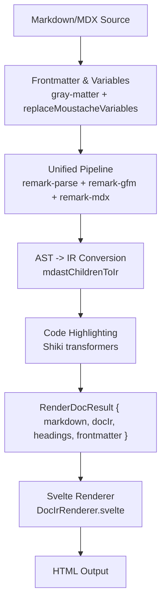
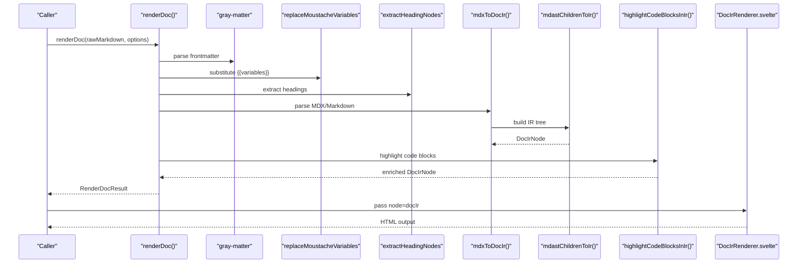
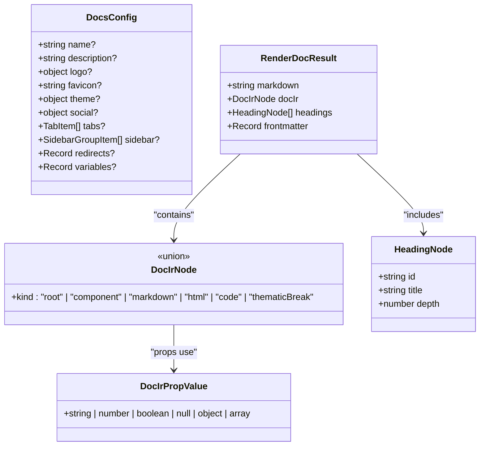
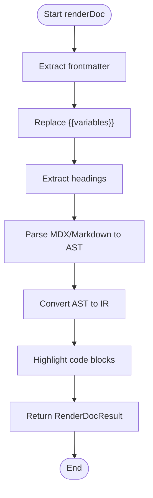
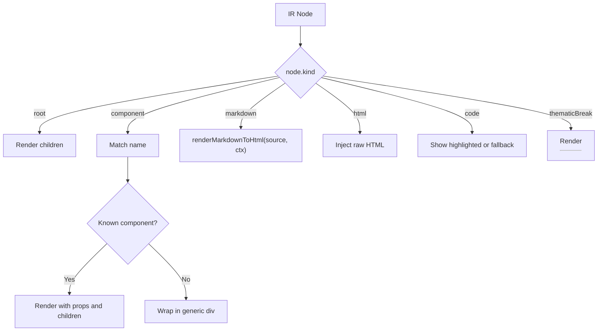
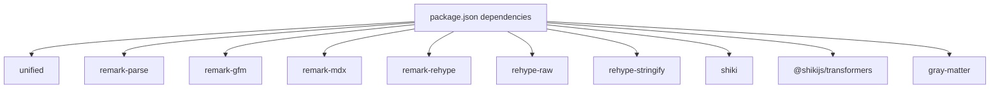

# Core Concepts

<cite>
**Referenced Files in This Document**
- [package.json](file://package.json)
- [index.ts](file://src/lib/index.ts)
- [mdx-bundler.ts](file://src/lib/bundler/mdx-bundler.ts)
- [docs.ts](file://src/lib/types/docs.ts)
- [DocIrRenderer.svelte](file://src/lib/components/DocIrRenderer.svelte)
- [+page.svelte](file://src/routes/[owner]/[repo]/[...path]/+page.svelte)
- [Callout.svelte](file://src/lib/components/mdx/Callout.svelte)
- [Accordion.svelte](file://src/lib/components/mdx/Accordion.svelte)
</cite>

## Table of Contents
1. Introduction
2. Project Structure
3. Core Components
4. Architecture Overview
5. Detailed Component Analysis
6. Dependency Analysis
7. Performance Considerations
8. Troubleshooting Guide
9. Conclusion

## Introduction
This section explains how FractalDocs transforms Markdown and MDX into interactive, rendered documentation. It covers the end-to-end pipeline from source content to final HTML, the Intermediate Representation (IR) that bridges parsing and rendering, and the unified ecosystem integration with remark/rehype processors. It also documents the type system architecture, component resolution mechanisms, and relationships between processing stages. Beginners will find conceptual overviews; experienced developers can dive into IR structure, AST transformations, and plugin architecture.

## Project Structure
FractalDocs is a SvelteKit application that centralizes document processing in a bundler module and renders the result via a recursive Svelte component. Key areas:
- Bundler and processors: mdx-bundler.ts orchestrates parsing, transformation, and code highlighting.
- Types: docs.ts defines the IR and shared interfaces used across the app.
- Rendering: DocIrRenderer.svelte consumes the IR and maps nodes to UI components.
- Route entry: +page.svelte wires layout and renderer with data produced by the server-side render pipeline.
- Exposed API: src/lib/index.ts re-exports core components and types for consumers.

**Diagram sources**
- [mdx-bundler.ts:106-146](file://src/lib/bundler/mdx-bundler.ts#L106-L146)
- [mdx-bundler.ts:192-207](file://src/lib/bundler/mdx-bundler.ts#L192-L207)
- [mdx-bundler.ts:224-278](file://src/lib/bundler/mdx-bundler.ts#L224-L278)
- [mdx-bundler.ts:83-104](file://src/lib/bundler/mdx-bundler.ts#L83-L104)
- [mdx-bundler.ts:280-295](file://src/lib/bundler/mdx-bundler.ts#L280-L295)
- [DocIrRenderer.svelte:1-117](file://src/lib/components/DocIrRenderer.svelte#L1-L117)

**Section sources**
- [package.json:12-30](file://package.json#L12-L30)
- [index.ts:1-12](file://src/lib/index.ts#L1-L12)

## Core Components
- Unified processor pipeline: Uses remark-parse, remark-gfm, remark-mdx, remark-rehype, rehype-raw, and rehype-stringify to convert Markdown/MDX to HTML or an intermediate representation.
- IR builder: Transforms parsed AST children into a typed IR tree with kinds like root, component, markdown, html, code, and thematicBreak.
- Code highlighter: Shiki-based highlighter with CSS variables theme and transformers for diff, focus, and meta highlighting.
- Renderer: A recursive Svelte component that maps IR nodes to UI elements and built-in MDX components.

Key responsibilities:
- Parsing and preprocessing: Extract frontmatter, sanitize comments, escape raw tags when needed.
- Transformation: Convert MDX AST to IR, preserving props and nested children.
- Enhancement: Inject slug IDs into headings, rewrite internal links based on repo context, and highlight code blocks.
- Rendering: Recursively render IR nodes into Svelte components and HTML.

**Section sources**
- [mdx-bundler.ts:106-146](file://src/lib/bundler/mdx-bundler.ts#L106-L146)
- [mdx-bundler.ts:187-207](file://src/lib/bundler/mdx-bundler.ts#L187-L207)
- [mdx-bundler.ts:224-278](file://src/lib/bundler/mdx-bundler.ts#L224-L278)
- [mdx-bundler.ts:67-81](file://src/lib/bundler/mdx-bundler.ts#L67-L81)
- [mdx-bundler.ts:83-104](file://src/lib/bundler/mdx-bundler.ts#L83-L104)
- [DocIrRenderer.svelte:1-117](file://src/lib/components/DocIrRenderer.svelte#L1-L117)

## Architecture Overview
The processing pipeline follows a clear sequence: input normalization, parsing, IR construction, enhancement, and rendering. The IR decouples parsing from rendering, enabling flexible component mapping and consistent styling.

**Diagram sources**
- [mdx-bundler.ts:280-295](file://src/lib/bundler/mdx-bundler.ts#L280-L295)
- [mdx-bundler.ts:148-166](file://src/lib/bundler/mdx-bundler.ts#L148-L166)
- [mdx-bundler.ts:168-185](file://src/lib/bundler/mdx-bundler.ts#L168-L185)
- [mdx-bundler.ts:192-207](file://src/lib/bundler/mdx-bundler.ts#L192-L207)
- [mdx-bundler.ts:224-278](file://src/lib/bundler/mdx-bundler.ts#L224-L278)
- [mdx-bundler.ts:83-104](file://src/lib/bundler/mdx-bundler.ts#L83-L104)
- [DocIrRenderer.svelte:1-117](file://src/lib/components/DocIrRenderer.svelte#L1-L117)

## Detailed Component Analysis

### Type System Architecture
The IR is defined as a discriminated union of node kinds, ensuring strong typing across parsing and rendering:
- root: container with children
- component: named component with props and children
- markdown: raw markdown string segment
- html: raw HTML string segment
- code: code block with language, meta, value, optional highlighted HTML and title
- thematicBreak: horizontal rule

Additional types include HeadingNode for navigation and DocsConfig for site configuration.

**Diagram sources**
- [docs.ts:1-81](file://src/lib/types/docs.ts#L1-L81)

**Section sources**
- [docs.ts:1-81](file://src/lib/types/docs.ts#L1-L81)

### Processing Stages and Data Flow
- Frontmatter extraction: Separates metadata from content.
- Variable substitution: Replaces placeholders like {{key.subkey}} with values.
- Heading extraction: Builds a table of contents from headings.
- MDX/Markdown parsing: Converts source to AST using unified and remark plugins.
- IR conversion: Maps AST nodes to IR, handling components, code, and markdown segments.
- Code highlighting: Enhances code blocks with syntax highlighting and optional titles.
- Final assembly: Produces RenderDocResult consumed by the renderer.

**Diagram sources**
- [mdx-bundler.ts:280-295](file://src/lib/bundler/mdx-bundler.ts#L280-L295)
- [mdx-bundler.ts:148-166](file://src/lib/bundler/mdx-bundler.ts#L148-L166)
- [mdx-bundler.ts:168-185](file://src/lib/bundler/mdx-bundler.ts#L168-L185)
- [mdx-bundler.ts:192-207](file://src/lib/bundler/mdx-bundler.ts#L192-L207)
- [mdx-bundler.ts:224-278](file://src/lib/bundler/mdx-bundler.ts#L224-L278)
- [mdx-bundler.ts:83-104](file://src/lib/bundler/mdx-bundler.ts#L83-L104)

**Section sources**
- [mdx-bundler.ts:106-146](file://src/lib/bundler/mdx-bundler.ts#L106-L146)
- [mdx-bundler.ts:187-207](file://src/lib/bundler/mdx-bundler.ts#L187-L207)
- [mdx-bundler.ts:224-278](file://src/lib/bundler/mdx-bundler.ts#L224-L278)
- [mdx-bundler.ts:83-104](file://src/lib/bundler/mdx-bundler.ts#L83-L104)
- [mdx-bundler.ts:280-295](file://src/lib/bundler/mdx-bundler.ts#L280-L295)

### Component Resolution Mechanisms
DocIrRenderer.svelte resolves IR nodes to Svelte components:
- root: iterates children recursively
- component: matches known names (Callout, Accordion, Card, CardGroup, CodeGroup, Steps) and renders them with props and children
- markdown: renders via renderMarkdownToHtml with repo context
- html: injects raw HTML
- code: displays highlighted HTML or fallback plain text with copy functionality
- thematicBreak: renders a horizontal rule

Unknown components are wrapped in a generic container to preserve nested content.

**Diagram sources**
- [DocIrRenderer.svelte:33-116](file://src/lib/components/DocIrRenderer.svelte#L33-L116)

**Section sources**
- [DocIrRenderer.svelte:1-117](file://src/lib/components/DocIrRenderer.svelte#L1-L117)

### MDX Components Integration
Built-in MDX components are exposed through the library index and mapped in the renderer:
- Callout: supports multiple variants and optional title
- Accordion: collapsible sections with controlled open state
- Card, CardGroup, CodeGroup, Steps: structured content containers

These components accept props derived from IR nodes and render their children via snippets.

**Section sources**
- [index.ts:1-12](file://src/lib/index.ts#L1-L12)
- [Callout.svelte:1-65](file://src/lib/components/mdx/Callout.svelte#L1-L65)
- [Accordion.svelte:1-32](file://src/lib/components/mdx/Accordion.svelte#L1-L32)

### Entry Point and Layout Wiring
The route page composes the layout and renderer, passing config, owner, repo, and headings to DocsLayout and the IR node to DocIrRenderer.

**Section sources**
- [+page.svelte:1-16](file://src/routes/[owner]/[repo]/[...path]/+page.svelte#L1-L16)

## Dependency Analysis
FractalDocs integrates several key libraries:
- unified ecosystem: remark-parse, remark-gfm, remark-mdx, remark-rehype, rehype-raw, rehype-stringify
- Syntax highlighting: shiki with transformers for enhanced code blocks
- Frontmatter parsing: gray-matter
- Utilities: zod for validation (available), clsx/tailwind-merge for class merging

**Diagram sources**
- [package.json:12-30](file://package.json#L12-L30)

**Section sources**
- [package.json:12-30](file://package.json#L12-L30)

## Performance Considerations
- Code highlighting is lazy-initialized and cached to avoid repeated setup costs.
- Parallelization: Children of root/component nodes are processed concurrently during highlighting to reduce latency.
- Minimal AST traversal: IR conversion focuses on relevant node types, skipping unnecessary transformations.
- Fallback paths: Parsing errors fall back to pure Markdown parsing to maintain robustness.
- HTML post-processing: Slug generation and link rewriting occur after stringify to minimize overhead.

[No sources needed since this section provides general guidance]

## Troubleshooting Guide
Common issues and resolutions:
- MDX parsing failures: The pipeline falls back to Markdown-only parsing if MDX parsing throws; ensure component names follow PascalCase to be recognized as components.
- Missing variable substitutions: Verify placeholder keys exist in the provided variables object; nested keys are supported.
- Code not highlighted: Ensure language aliases map correctly; mermaid blocks are intentionally skipped for highlighting.
- Internal links broken: Confirm owner and repo context are passed to renderMarkdownToHtml so relative links are rewritten appropriately.
- Unknown components: Unrecognized component names are wrapped in a generic container; add explicit mappings in the renderer if needed.

**Section sources**
- [mdx-bundler.ts:192-207](file://src/lib/bundler/mdx-bundler.ts#L192-L207)
- [mdx-bundler.ts:148-166](file://src/lib/bundler/mdx-bundler.ts#L148-L166)
- [mdx-bundler.ts:83-104](file://src/lib/bundler/mdx-bundler.ts#L83-L104)
- [mdx-bundler.ts:106-146](file://src/lib/bundler/mdx-bundler.ts#L106-L146)
- [DocIrRenderer.svelte:74-80](file://src/lib/components/DocIrRenderer.svelte#L74-L80)

## Conclusion
FractalDocs employs a clean separation between parsing and rendering through a strongly-typed IR. The unified remark/rehype pipeline ensures compatibility with Markdown and MDX, while Shiki enhances code presentation. The recursive renderer maps IR nodes to Svelte components, enabling a rich, extensible documentation experience. By understanding the pipeline stages, type system, and component resolution, developers can extend and customize FractalDocs effectively.