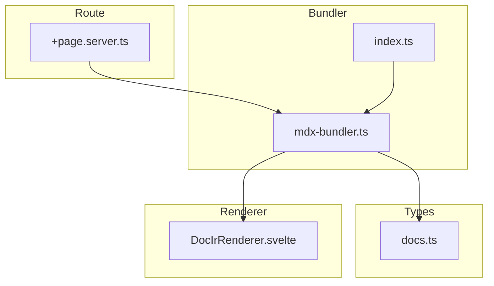
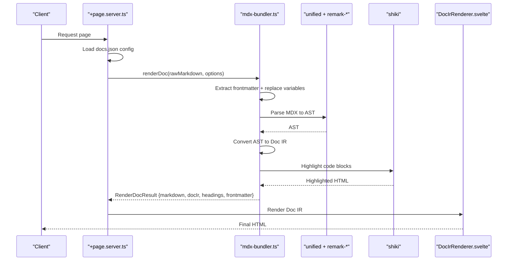
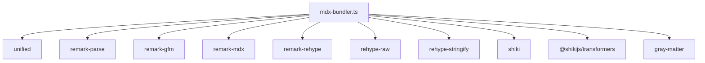
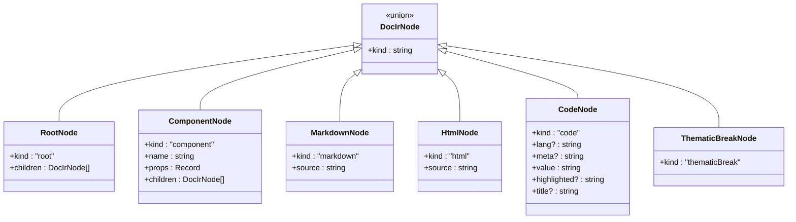

# Document Processing Pipeline

<cite>
**Referenced Files in This Document**
- [package.json](file://package.json)
- [vite.config.ts](file://vite.config.ts)
- [mdx-bundler.ts](file://src/lib/bundler/mdx-bundler.ts)
- [index.ts](file://src/lib/bundler/index.ts)
- [docs.ts](file://src/lib/types/docs.ts)
- [DocIrRenderer.svelte](file://src/lib/components/DocIrRenderer.svelte)
- [+page.server.ts](file://src/routes/[owner]/[repo]/[...path]/+page.server.ts)
</cite>

## Table of Contents
1. [Introduction](#introduction)
2. [Project Structure](#project-structure)
3. [Core Components](#core-components)
4. [Architecture Overview](#architecture-overview)
5. [Detailed Component Analysis](#detailed-component-analysis)
6. [Dependency Analysis](#dependency-analysis)
7. [Performance Considerations](#performance-considerations)
8. [Troubleshooting Guide](#troubleshooting-guide)
9. [Conclusion](#conclusion)
10. [Appendices](#appendices)

## Introduction
This document explains how FractalDocs transforms Markdown and MDX content into rendered documentation. It covers the complete pipeline from raw input through parsing, AST transformation, intermediate representation generation, syntax highlighting integration, component resolution, and final rendering. You will learn how frontmatter is extracted, how MDX is compiled to an internal structure, how code blocks are highlighted, and how components are resolved at render time. The guide also includes error handling strategies, performance considerations, and practical guidance for extending the pipeline with custom processors.

## Project Structure
FractalDocs implements a modular pipeline centered around a bundler module that orchestrates parsing, transformation, and rendering. Key areas:
- Bundler: Parsing and transformation logic for Markdown/MDX to an internal representation (IR).
- Types: Strongly typed definitions for the IR and configuration.
- Renderer: A Svelte component that consumes the IR and renders it to HTML using built-in and custom components.
- Route handler: Loads repository configuration and invokes the renderer pipeline.

**Diagram sources**
- [mdx-bundler.ts](file://src/lib/bundler/mdx-bundler.ts)
- [index.ts](file://src/lib/bundler/index.ts)
- [docs.ts](file://src/lib/types/docs.ts)
- [DocIrRenderer.svelte](file://src/lib/components/DocIrRenderer.svelte)
- [+page.server.ts](file://src/routes/[owner]/[repo]/[...path]/+page.server.ts)

**Section sources**
- [package.json](file://package.json)
- [vite.config.ts](file://vite.config.ts)
- [mdx-bundler.ts](file://src/lib/bundler/mdx-bundler.ts)
- [index.ts](file://src/lib/bundler/index.ts)
- [docs.ts](file://src/lib/types/docs.ts)
- [DocIrRenderer.svelte](file://src/lib/components/DocIrRenderer.svelte)
- [+page.server.ts](file://src/routes/[owner]/[repo]/[...path]/+page.server.ts)

## Core Components
- Markdown/MDX parser and transformer: Uses unified ecosystem (remark-parse, remark-gfm, remark-mdx) to build an AST and convert to Doc IR.
- Syntax highlighter: Shiki-based highlighter with CSS variables theme and transformers for diff/focus/highlight notations.
- IR renderer: Svelte component that maps IR nodes to UI elements and resolves MDX components.
- Configuration loader: Fetches docs.json from a repository and provides context for link rewriting and variable substitution.

Key responsibilities:
- Frontmatter extraction and variable substitution.
- MDX compilation to Doc IR.
- Code block detection and highlighting.
- Heading extraction for navigation.
- Rendering IR to HTML via Svelte components.

**Section sources**
- [mdx-bundler.ts](file://src/lib/bundler/mdx-bundler.ts)
- [docs.ts](file://src/lib/types/docs.ts)
- [DocIrRenderer.svelte](file://src/lib/components/DocIrRenderer.svelte)
- [+page.server.ts](file://src/routes/[owner]/[repo]/[...path]/+page.server.ts)

## Architecture Overview
The pipeline follows a clear sequence:
1. Input: Raw Markdown/MDX string.
2. Frontmatter extraction and variable replacement.
3. MDX parsing to AST and conversion to Doc IR.
4. Code block highlighting within IR.
5. Heading extraction for navigation.
6. Rendering IR to HTML using Svelte components.

**Diagram sources**
- [+page.server.ts](file://src/routes/[owner]/[repo]/[...path]/+page.server.ts)
- [mdx-bundler.ts](file://src/lib/bundler/mdx-bundler.ts)
- [DocIrRenderer.svelte](file://src/lib/components/DocIrRenderer.svelte)

## Detailed Component Analysis

### Stage 1: Frontmatter Extraction and Variable Substitution
- Frontmatter is parsed from the raw input to separate metadata from content.
- Variables are substituted into the content using a simple mustache-like syntax with nested object path support.
- Headings are extracted early to build a table of contents.

Implementation highlights:
- Frontmatter parsing uses gray-matter.
- Variable substitution scans for placeholders and resolves them against provided variables.
- Heading extraction uses regex to capture levels and titles, generating slug IDs.

Error handling:
- If parsing fails, fallback behavior ensures the original markdown is returned or processing continues safely.

**Section sources**
- [mdx-bundler.ts](file://src/lib/bundler/mdx-bundler.ts)
- [docs.ts](file://src/lib/types/docs.ts)

### Stage 2: MDX Compilation to AST and Conversion to Doc IR
- MDX source is preprocessed to remove comments and escape unsafe tags before parsing.
- The unified processor chain applies remark-parse, remark-gfm, and remark-mdx to produce an AST.
- The AST is converted into a Doc IR tree with nodes for root, component, markdown, html, code, and thematicBreak.

Conversion details:
- MDX JSX elements become component nodes with props normalized by a clean-up function.
- Code blocks become code nodes preserving language and meta information.
- Other text segments become markdown nodes containing their original source slices.

Fallback strategy:
- If MDX parsing fails, the system falls back to plain Markdown parsing to ensure robustness.

**Section sources**
- [mdx-bundler.ts](file://src/lib/bundler/mdx-bundler.ts)
- [docs.ts](file://src/lib/types/docs.ts)

### Stage 3: Syntax Highlighting Integration
- Code blocks are identified in the Doc IR and highlighted using Shiki with a CSS variables theme.
- Transformers enable advanced features like diff, focus, and highlight notations.
- Language mapping normalizes aliases and special cases (e.g., nohighlight).
- Mermaid code blocks are skipped to avoid conflicts with diagram rendering.

Output enrichment:
- Each code node receives highlighted HTML and optional title derived from meta.

Error handling:
- If highlighting fails, a safe fallback renders raw code inside a pre/code block.

**Section sources**
- [mdx-bundler.ts](file://src/lib/bundler/mdx-bundler.ts)

### Stage 4: Component Resolution and Rendering
- The Doc IR is consumed by a recursive Svelte component that maps node kinds to UI elements.
- Built-in components include Callout, Accordion, Card, CardGroup, CodeGroup, and Steps.
- Unknown components are wrapped in a generic container to preserve children.
- Markdown nodes are rendered via a helper that converts source to HTML and rewrites links based on repository context.

Rendering flow:
- Root nodes iterate over children recursively.
- Component nodes pass props and children to corresponding Svelte components.
- Code nodes display highlighted HTML or fallback to raw code with copy functionality.
- Markdown nodes use a dedicated HTML renderer with slug IDs and link rewriting.

**Section sources**
- [DocIrRenderer.svelte](file://src/lib/components/DocIrRenderer.svelte)
- [mdx-bundler.ts](file://src/lib/bundler/mdx-bundler.ts)

### Stage 5: Route Integration and Context Provision
- The route handler loads docs.json configuration from a remote repository, providing defaults when unavailable.
- It invokes the render pipeline with the fetched configuration and passes owner/repo context for link rewriting.

Context usage:
- Internal links are rewritten to absolute paths scoped under the repository URL.
- Variables can be supplied to influence content rendering.

**Section sources**
- [+page.server.ts](file://src/routes/[owner]/[repo]/[...path]/+page.server.ts)

## Dependency Analysis
The pipeline depends on a well-defined set of libraries orchestrated by unified and Shiki. Vite configuration ensures these dependencies are bundled correctly for SSR and client-side execution.

**Diagram sources**
- [mdx-bundler.ts](file://src/lib/bundler/mdx-bundler.ts)
- [vite.config.ts](file://vite.config.ts)
- [package.json](file://package.json)

**Section sources**
- [vite.config.ts](file://vite.config.ts)
- [package.json](file://package.json)
- [mdx-bundler.ts](file://src/lib/bundler/mdx-bundler.ts)

## Performance Considerations
- Highlighter caching: A singleton instance of the Shiki highlighter is reused across calls to avoid repeated initialization overhead.
- Parallel processing: Code block highlighting is performed concurrently using Promise.all for child nodes where applicable.
- Minimal parsing: Fallback to Markdown parsing when MDX parsing fails reduces unnecessary retries.
- Target optimization: Build targets are set to es2022 for efficient execution in modern environments.
- SSR bundling: Critical parsing libraries are marked as non-external for SSR to prevent runtime issues and improve startup performance.

Recommendations:
- Limit the number of languages loaded into Shiki to only those required by your content.
- Cache rendered results at the route level if documents are static or infrequently updated.
- Avoid heavy transformations in hot paths; prefer lazy evaluation for expensive operations.

**Section sources**
- [mdx-bundler.ts](file://src/lib/bundler/mdx-bundler.ts)
- [vite.config.ts](file://vite.config.ts)

## Troubleshooting Guide
Common issues and resolutions:
- MDX parsing errors: The pipeline falls back to Markdown parsing automatically. Check for malformed MDX syntax and ensure component names follow PascalCase conventions.
- Missing languages: If a code block language is unsupported, Shiki returns a safe fallback. Add missing languages to the highlighter configuration.
- Link rewriting problems: Ensure repository context (owner/repo) is provided when calling the renderer to rewrite internal links correctly.
- Variable substitution failures: Verify placeholder syntax and nested object paths. Non-string values are ignored during substitution.
- SSR bundling errors: Confirm that critical modules are listed in the SSR noExternal configuration to avoid externalization issues.

Debugging tips:
- Inspect the generated Doc IR to verify correct node types and properties.
- Log heading extraction results to validate table of contents generation.
- Use browser dev tools to inspect rendered HTML and confirm syntax highlighting classes.

**Section sources**
- [mdx-bundler.ts](file://src/lib/bundler/mdx-bundler.ts)
- [DocIrRenderer.svelte](file://src/lib/components/DocIrRenderer.svelte)
- [vite.config.ts](file://vite.config.ts)

## Conclusion
FractalDocs implements a robust and extensible document processing pipeline that transforms Markdown/MDX into rich, interactive documentation. By leveraging unified for parsing, Shiki for syntax highlighting, and Svelte for component-driven rendering, it provides a flexible foundation for building documentation sites. The pipeline’s design emphasizes resilience through fallbacks, performance through caching and parallelism, and extensibility through a clear IR model and component resolution strategy.

## Appendices

### Data Model Overview
The Doc IR defines a small set of node types that represent the structure of processed content. This model enables consistent rendering and easy extension with new node types.

**Diagram sources**
- [docs.ts](file://src/lib/types/docs.ts)

### Extending the Pipeline
To extend the pipeline:
- Add new IR node types in the type definitions.
- Extend the AST-to-IR converter to handle new AST node types.
- Implement rendering logic in the Svelte component for new node kinds.
- Integrate additional Shiki transformers or themes for enhanced code highlighting.
- Modify the route handler to provide additional context or variables.

Best practices:
- Keep transformations idempotent and deterministic.
- Validate inputs at each stage to catch errors early.
- Provide sensible defaults and fallbacks for robustness.
- Document new node types and their expected props clearly.

**Section sources**
- [docs.ts](file://src/lib/types/docs.ts)
- [mdx-bundler.ts](file://src/lib/bundler/mdx-bundler.ts)
- [DocIrRenderer.svelte](file://src/lib/components/DocIrRenderer.svelte)