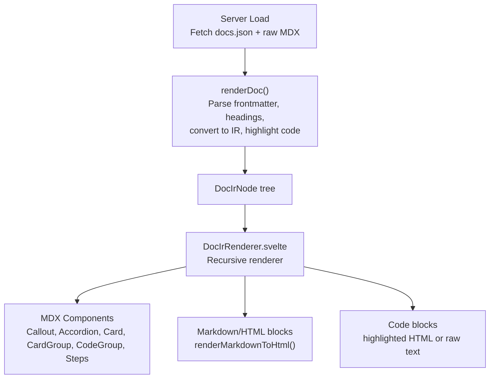
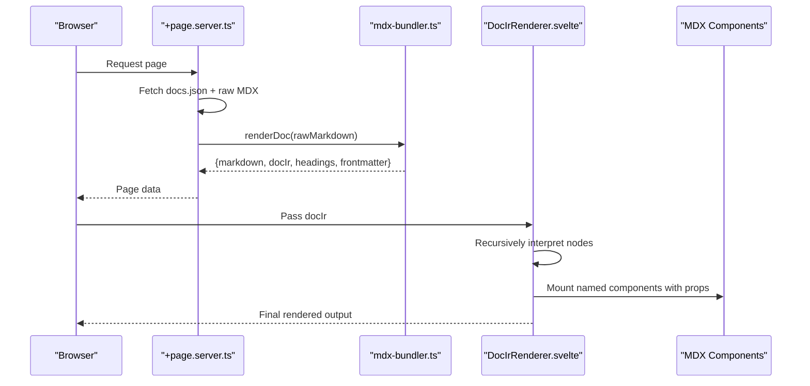
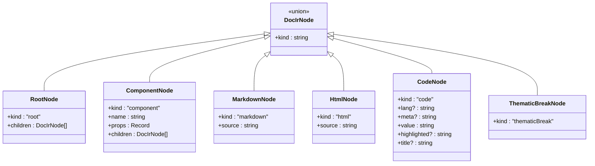
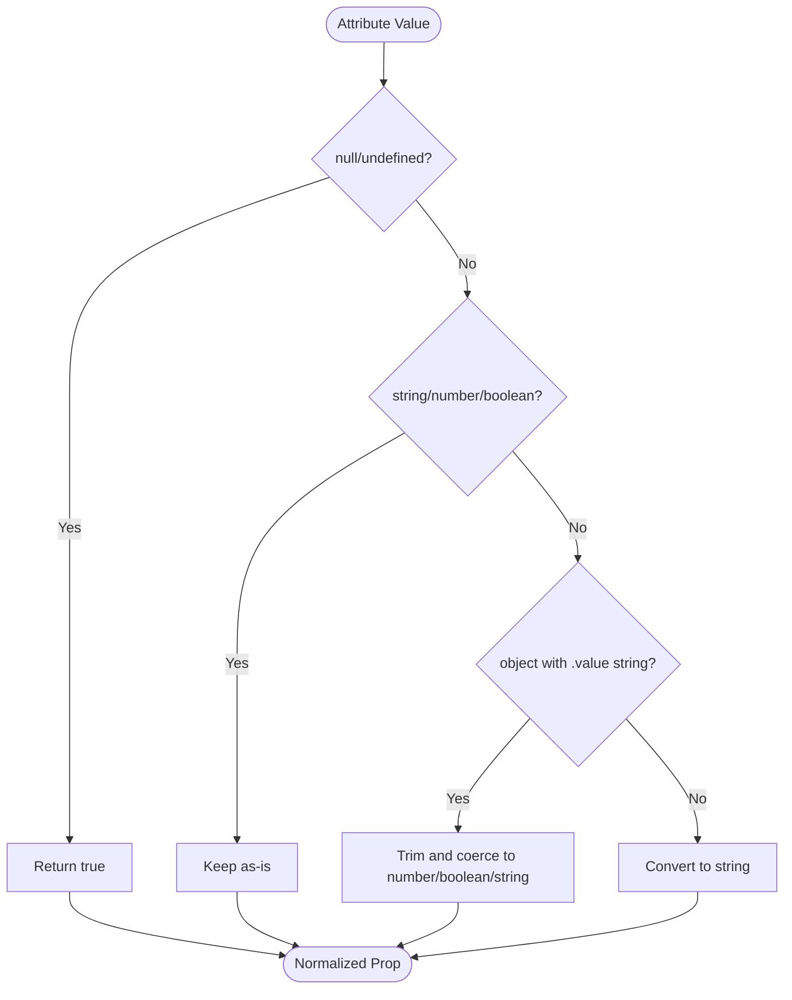
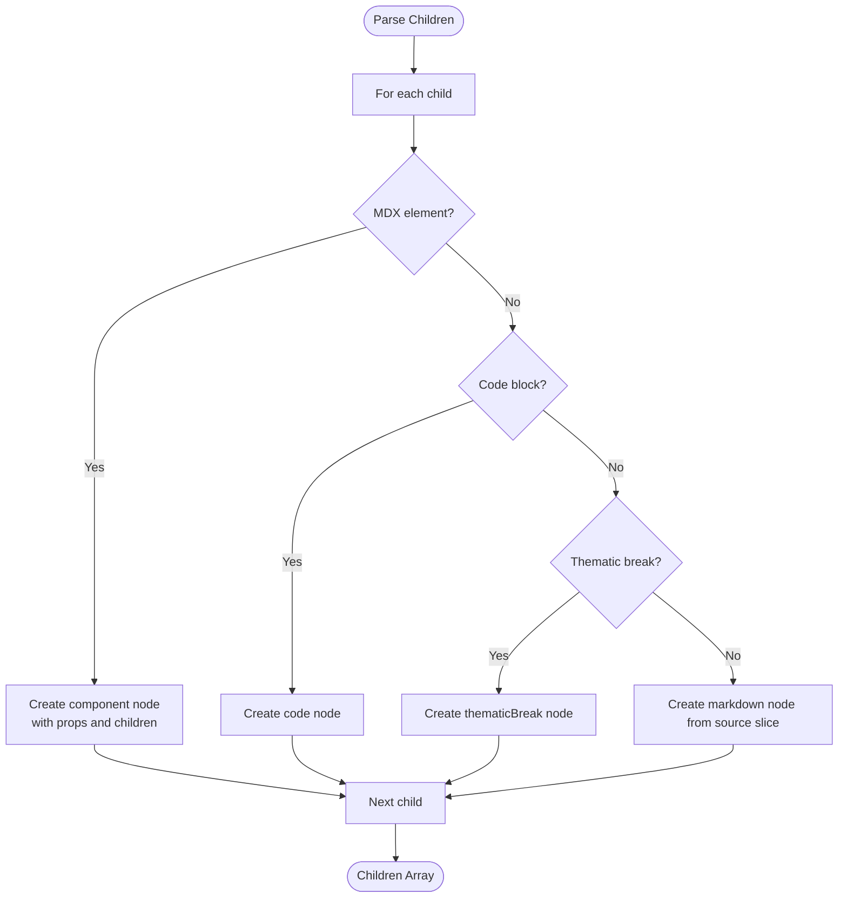
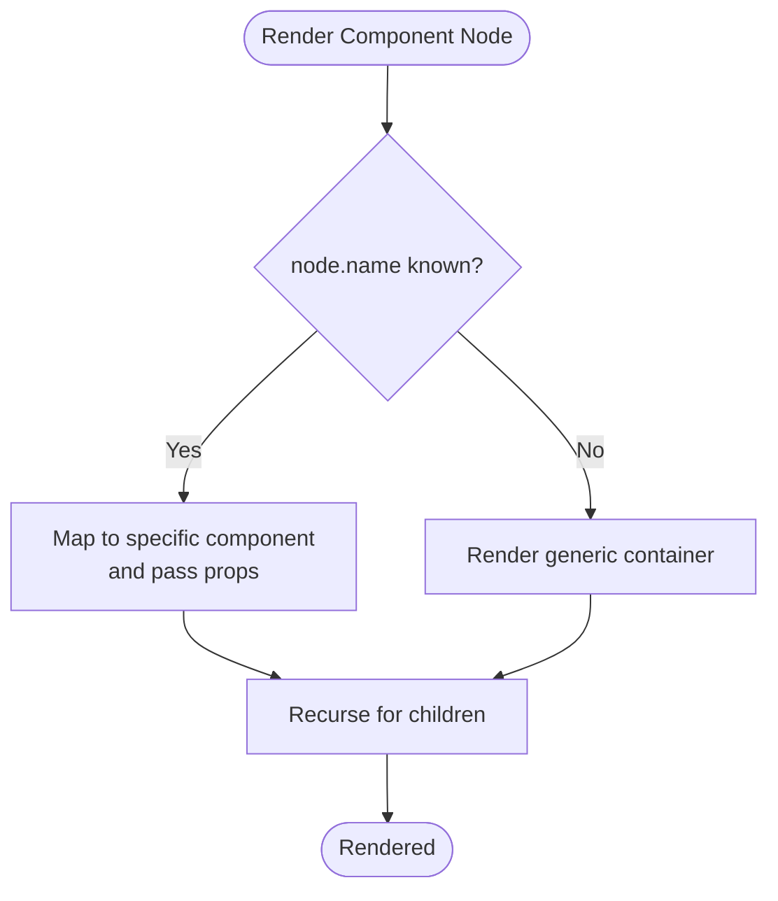
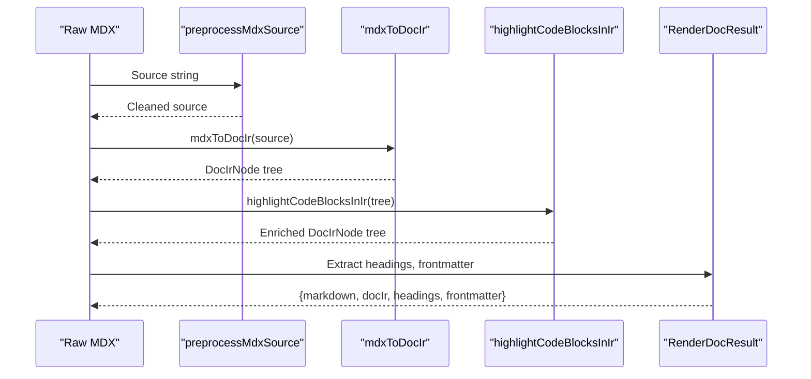
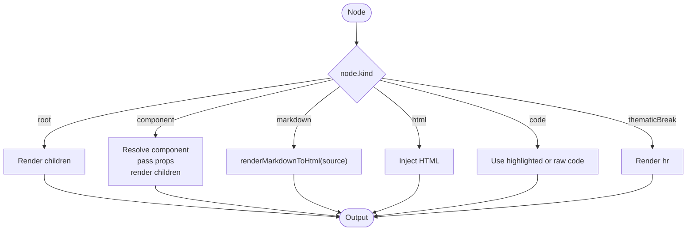
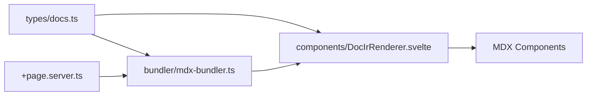

# Intermediate Representation (IR)

<cite>
**Referenced Files in This Document**
- [docs.ts](file://src/lib/types/docs.ts)
- [mdx-bundler.ts](file://src/lib/bundler/mdx-bundler.ts)
- [DocIrRenderer.svelte](file://src/lib/components/DocIrRenderer.svelte)
- [+page.server.ts](file://src/routes/[owner]/[repo]/[...path]/+page.server.ts)
- [+page.svelte](file://src/routes/+page.svelte)
- [+page.svelte](file://src/routes/[owner]/[repo]/[...path]/+page.svelte)
</cite>

## Table of Contents
1. [Introduction](#introduction)
2. [Project Structure](#project-structure)
3. [Core Components](#core-components)
4. [Architecture Overview](#architecture-overview)
5. [Detailed Component Analysis](#detailed-component-analysis)
6. [Dependency Analysis](#dependency-analysis)
7. [Performance Considerations](#performance-considerations)
8. [Troubleshooting Guide](#troubleshooting-guide)
9. [Conclusion](#conclusion)

## Introduction
This document explains the Intermediate Representation (IR) that bridges document parsing and component rendering. The IR is a framework-agnostic tree of nodes describing content structure, semantics, and presentation hints. It enables consistent rendering across different frameworks by decoupling parsing from UI concerns.

The core type DocIrNode defines a discriminated union of node kinds: root, component, markdown, html, code, and thematicBreak. The prop value system supports primitive values, nested objects, and arrays, allowing rich configuration for components. Child relationships are explicit via children arrays, enabling recursive composition. Dynamic component resolution is achieved at render time by mapping component names to concrete UI components.

## Project Structure
The IR spans three layers:
- Types: define the IR schema and related interfaces
- Bundler: transforms Markdown/MDX into IR and enriches it (e.g., syntax highlighting)
- Renderer: interprets the IR and renders UI components

**Diagram sources**
- [+page.server.ts:1-76](file://src/routes/[owner]/[repo]/[...path]/+page.server.ts#L1-L76)
- [mdx-bundler.ts:1-296](file://src/lib/bundler/mdx-bundler.ts#L1-L296)
- [DocIrRenderer.svelte:1-117](file://src/lib/components/DocIrRenderer.svelte#L1-L117)

**Section sources**
- [+page.server.ts:1-76](file://src/routes/[owner]/[repo]/[...path]/+page.server.ts#L1-L76)
- [mdx-bundler.ts:1-296](file://src/lib/bundler/mdx-bundler.ts#L1-L296)
- [DocIrRenderer.svelte:1-117](file://src/lib/components/DocIrRenderer.svelte#L1-L117)

## Core Components
- DocIrPropValue: Supports string, number, boolean, null, nested objects, and arrays. Enables flexible props for components.
- DocIrNode: Discriminated union with kind field:
  - root: container with children array
  - component: named component with props and children
  - markdown: raw markdown source to be converted to HTML
  - html: raw HTML to be injected
  - code: code block with language, meta, value, optional highlighted HTML and title
  - thematicBreak: horizontal rule
- RenderDocResult: Output of renderDoc including markdown, docIr, headings, and frontmatter

These types ensure semantic clarity while remaining framework-agnostic. The renderer maps component names to actual UI components at runtime.

**Section sources**
- [docs.ts:1-82](file://src/lib/types/docs.ts#L1-L82)

## Architecture Overview
The pipeline converts raw Markdown/MDX into an IR tree, then renders it into UI.

**Diagram sources**
- [+page.server.ts:1-76](file://src/routes/[owner]/[repo]/[...path]/+page.server.ts#L1-L76)
- [mdx-bundler.ts:1-296](file://src/lib/bundler/mdx-bundler.ts#L1-L296)
- [DocIrRenderer.svelte:1-117](file://src/lib/components/DocIrRenderer.svelte#L1-L117)

## Detailed Component Analysis

### DocIrNode Type and Node Kinds
DocIrNode is a discriminated union where each variant carries specific fields:
- root: holds children
- component: name, props, children
- markdown: source string
- html: source string
- code: lang, meta, value, highlighted, title
- thematicBreak: no extra fields

This design preserves semantic meaning (e.g., distinguishing code vs markdown) while staying neutral to any rendering framework.

**Diagram sources**
- [docs.ts:1-82](file://src/lib/types/docs.ts#L1-L82)

**Section sources**
- [docs.ts:1-82](file://src/lib/types/docs.ts#L1-L82)

### Prop Value System
DocIrPropValue supports:
- Primitives: string, number, boolean, null
- Objects: nested key-value pairs of DocIrPropValue
- Arrays: sequences of DocIrPropValue

During parsing, attribute values are normalized:
- null/undefined become true
- Strings are coerced to numbers or booleans when appropriate
- Objects with .value strings are unwrapped and coerced
- Everything else becomes a string

This ensures predictable prop types for components without requiring complex parsers.

**Diagram sources**
- [mdx-bundler.ts:209-222](file://src/lib/bundler/mdx-bundler.ts#L209-L222)

**Section sources**
- [mdx-bundler.ts:209-222](file://src/lib/bundler/mdx-bundler.ts#L209-L222)

### Child Node Relationships
Children are represented explicitly via arrays on root and component nodes. During parsing:
- MDX elements become component nodes with recursively parsed children
- Code blocks become code nodes
- Thematic breaks become thematicBreak nodes
- Other content becomes markdown nodes using original source slices

This maintains structural integrity and allows recursive rendering.

**Diagram sources**
- [mdx-bundler.ts:224-278](file://src/lib/bundler/mdx-bundler.ts#L224-L278)

**Section sources**
- [mdx-bundler.ts:224-278](file://src/lib/bundler/mdx-bundler.ts#L224-L278)

### Dynamic Component Resolution
At render time, the renderer inspects node.kind and node.name:
- component nodes map to specific Svelte components based on name
- Known names include Callout, Accordion, Card, CardGroup, CodeGroup, Steps
- Unknown component names fall back to a generic container div
- Each component receives props and recursively renders its children

This approach keeps the IR decoupled from implementation details while enabling extensibility.

**Diagram sources**
- [DocIrRenderer.svelte:37-80](file://src/lib/components/DocIrRenderer.svelte#L37-L80)

**Section sources**
- [DocIrRenderer.svelte:37-80](file://src/lib/components/DocIrRenderer.svelte#L37-L80)

### IR Transformation Pipeline
The bundler performs several transformations:
- Preprocess MDX source to remove comments and escape unsafe tags
- Parse to AST and convert to IR nodes
- Highlight code blocks asynchronously, injecting highlighted HTML and titles
- Extract headings and frontmatter

**Diagram sources**
- [mdx-bundler.ts:187-207](file://src/lib/bundler/mdx-bundler.ts#L187-L207)
- [mdx-bundler.ts:280-295](file://src/lib/bundler/mdx-bundler.ts#L280-L295)

**Section sources**
- [mdx-bundler.ts:187-207](file://src/lib/bundler/mdx-bundler.ts#L187-L207)
- [mdx-bundler.ts:280-295](file://src/lib/bundler/mdx-bundler.ts#L280-L295)

### Concrete IR Examples
Below are conceptual examples illustrating typical IR structures for different content types. These are not code snippets but descriptions of expected shapes.

- Root with mixed content:
  - kind: "root"
  - children: [
      { kind: "markdown", source: "Some paragraph" },
      { kind: "component", name: "Card", props: { title: "Example", href: "/link" }, children: [...] },
      { kind: "code", lang: "typescript", value: "const x = 1;", meta: "title='My Snippet'" },
      { kind: "thematicBreak" }
    ]

- Component with nested children:
  - kind: "component", name: "Accordion", props: { title: "Details" }, children: [
      { kind: "markdown", source: "Content here" },
      { kind: "code", lang: "javascript", value: "console.log('hi');" }
    ]

- Code block with highlighted HTML:
  - kind: "code", lang: "python", meta: "title='Script'", value: "print('hello')", highlighted: "<pre>...</pre>", title: "Script"

- Markdown-only section:
  - kind: "markdown", source: "# Heading\n\nBody text"

- HTML injection:
  - kind: "html", source: "
Injected HTML
"

These examples demonstrate how the IR captures semantics and presentation hints while remaining framework-neutral.

[No sources needed since this section provides conceptual examples]

### Renderer Interpretation
The renderer processes each node kind:
- root: iterate children and render recursively
- component: map name to component, pass props, render children
- markdown: convert to HTML via renderMarkdownToHtml
- html: inject raw HTML
- code: display highlighted HTML if available, otherwise raw code with copy functionality
- thematicBreak: render a horizontal rule

**Diagram sources**
- [DocIrRenderer.svelte:33-116](file://src/lib/components/DocIrRenderer.svelte#L33-L116)

**Section sources**
- [DocIrRenderer.svelte:33-116](file://src/lib/components/DocIrRenderer.svelte#L33-L116)

## Dependency Analysis
Key dependencies and relationships:
- Types define contracts used by both bundler and renderer
- Bundler depends on remark/unified ecosystem and shiki for highlighting
- Renderer imports MDX components and uses markdown-to-HTML conversion
- Server route orchestrates fetching and rendering

**Diagram sources**
- [docs.ts:1-82](file://src/lib/types/docs.ts#L1-L82)
- [mdx-bundler.ts:1-296](file://src/lib/bundler/mdx-bundler.ts#L1-L296)
- [DocIrRenderer.svelte:1-117](file://src/lib/components/DocIrRenderer.svelte#L1-L117)
- [+page.server.ts:1-76](file://src/routes/[owner]/[repo]/[...path]/+page.server.ts#L1-L76)

**Section sources**
- [docs.ts:1-82](file://src/lib/types/docs.ts#L1-L82)
- [mdx-bundler.ts:1-296](file://src/lib/bundler/mdx-bundler.ts#L1-L296)
- [DocIrRenderer.svelte:1-117](file://src/lib/components/DocIrRenderer.svelte#L1-L117)
- [+page.server.ts:1-76](file://src/routes/[owner]/[repo]/[...path]/+page.server.ts#L1-L76)

## Performance Considerations
- Asynchronous code highlighting: highlightCodeBlocksInIr processes code blocks concurrently using Promise.all for children, improving throughput.
- Syntax highlighter caching: getHighlighter caches the Shiki instance to avoid repeated initialization overhead.
- Markdown processing: renderMarkdownToHtml runs synchronously; consider batching or caching for large documents.
- Recursive rendering: DocIrRenderer recurses through the tree; deep nesting may impact performance. Limit depth or virtualize if necessary.
- Copy-to-clipboard: client-side clipboard operations are lightweight but should be debounced if triggered frequently.

[No sources needed since this section provides general guidance]

## Troubleshooting Guide
Common issues and resolutions:
- MDX parsing failures: The parser falls back to plain Markdown parsing when MDX fails; check syntax errors in MDX elements.
- Unknown component names: Unrecognized component names render as generic containers; verify component names match registered ones.
- Prop coercion surprises: Attributes like numeric strings may be coerced to numbers; ensure expected types in components.
- Missing highlighted code: If highlighting fails, raw code is displayed; verify language aliases and meta formatting.
- Internal links not rewritten: Ensure owner/repo context is provided when calling renderMarkdownToHtml for correct link rewriting.

**Section sources**
- [mdx-bundler.ts:192-207](file://src/lib/bundler/mdx-bundler.ts#L192-L207)
- [mdx-bundler.ts:106-146](file://src/lib/bundler/mdx-bundler.ts#L106-L146)
- [DocIrRenderer.svelte:37-80](file://src/lib/components/DocIrRenderer.svelte#L37-L80)

## Conclusion
The IR system provides a robust, framework-agnostic bridge between document parsing and UI rendering. By defining clear node kinds, a flexible prop value system, and explicit child relationships, it enables dynamic component resolution and consistent output. The bundler enriches the IR with syntax highlighting and metadata, while the renderer translates it into interactive UI components. This architecture supports extensibility, maintainability, and performance optimizations suitable for modern documentation platforms.

[No sources needed since this section summarizes without analyzing specific files]