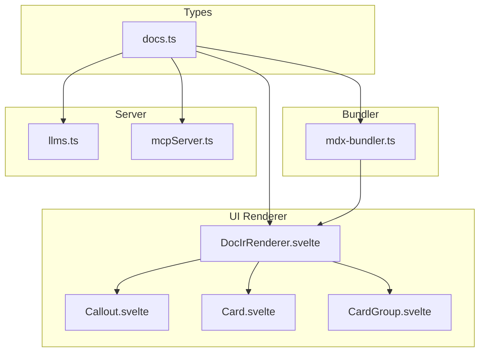
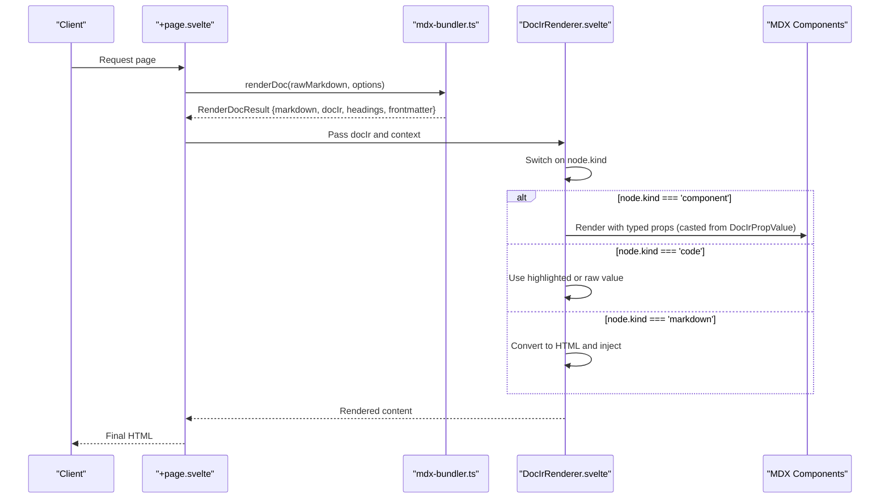
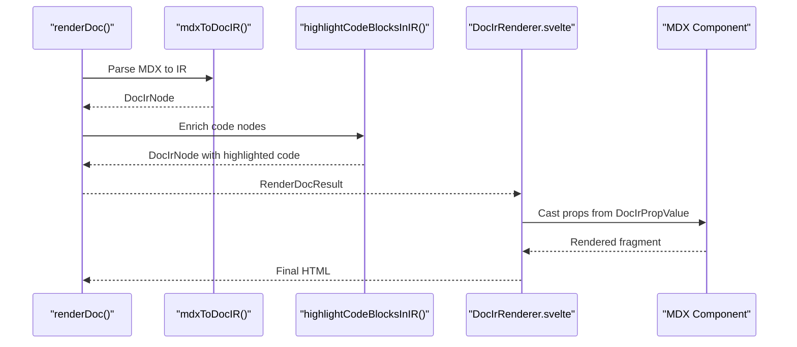
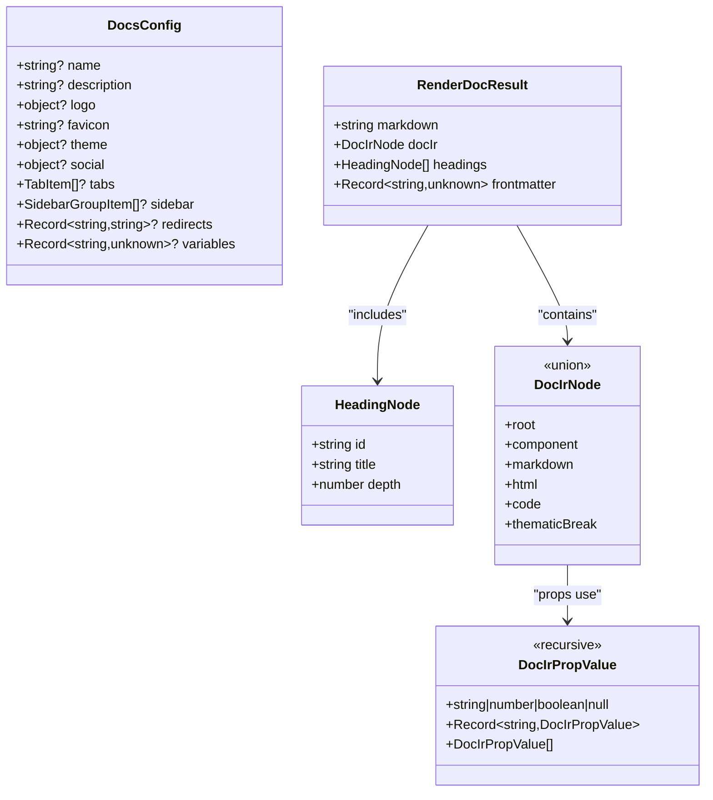
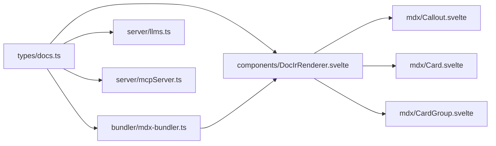

# Type System Architecture

<cite>
**Referenced Files in This Document**
- [docs.ts](file://src/lib/types/docs.ts)
- [mdx-bundler.ts](file://src/lib/bundler/mdx-bundler.ts)
- [DocIrRenderer.svelte](file://src/lib/components/DocIrRenderer.svelte)
- [Callout.svelte](file://src/lib/components/mdx/Callout.svelte)
- [Card.svelte](file://src/lib/components/mdx/Card.svelte)
- [CardGroup.svelte](file://src/lib/components/mdx/CardGroup.svelte)
- [llms.ts](file://src/lib/server/llms.ts)
- [mcpServer.ts](file://src/lib/server/mcpServer.ts)
- [+page.svelte](file://src/routes/+page.svelte)
- [+page.svelte (repo path)](file://src/routes/[owner]/[repo]/[...path]/+page.svelte)
- [tsconfig.json](file://tsconfig.json)
</cite>

## Table of Contents
1. Introduction
2. Project Structure
3. Core Components
4. Architecture Overview
5. Detailed Component Analysis
6. Dependency Analysis
7. Performance Considerations
8. Troubleshooting Guide
9. Conclusion
10. Appendices

## Introduction
This document explains the FractalDocs type system architecture with a focus on TypeScript definitions that enforce type safety across configuration, rendering, and component props. It covers the core interfaces and types such as DocsConfig, RenderDocResult, HeadingNode, and the recursive DocIrPropValue type system. It also shows how these types constrain configuration objects, ensure proper prop validation for MDX components, and provide autocomplete support throughout the application. Practical usage patterns, common type errors and solutions, and guidelines for extending the type system are included.

## Project Structure
The type system is centralized in a single module and consumed by the bundler pipeline, UI renderer, and server utilities:
- Types are defined in a dedicated module.
- The bundler produces typed intermediate representations and results used by the UI.
- Svelte components consume typed nodes and props to render content safely.
- Server utilities rely on typed configuration for consistent behavior.

**Diagram sources**
- [docs.ts](file://src/lib/types/docs.ts)
- [mdx-bundler.ts](file://src/lib/bundler/mdx-bundler.ts)
- [DocIrRenderer.svelte](file://src/lib/components/DocIrRenderer.svelte)
- [Callout.svelte](file://src/lib/components/mdx/Callout.svelte)
- [Card.svelte](file://src/lib/components/mdx/Card.svelte)
- [CardGroup.svelte](file://src/lib/components/mdx/CardGroup.svelte)
- [llms.ts](file://src/lib/server/llms.ts)
- [mcpServer.ts](file://src/lib/server/mcpServer.ts)

**Section sources**
- [docs.ts](file://src/lib/types/docs.ts)
- [mdx-bundler.ts](file://src/lib/bundler/mdx-bundler.ts)
- [DocIrRenderer.svelte](file://src/lib/components/DocIrRenderer.svelte)
- [Callout.svelte](file://src/lib/components/mdx/Callout.svelte)
- [Card.svelte](file://src/lib/components/mdx/Card.svelte)
- [CardGroup.svelte](file://src/lib/components/mdx/CardGroup.svelte)
- [llms.ts](file://src/lib/server/llms.ts)
- [mcpServer.ts](file://src/lib/server/mcpServer.ts)

## Core Components
This section documents the central types and their roles in enforcing constraints and enabling autocomplete.

- DocsConfig: Defines optional metadata, branding, theme, social links, tabs, sidebar structure, redirects, and variables. All fields are optional to allow minimal configurations while preserving full autocomplete where provided.
- RenderDocResult: Represents the output of rendering a doc, including processed markdown, the typed IR tree, extracted headings, and frontmatter.
- HeadingNode: Captures heading metadata with id, title, and depth for navigation and table-of-contents generation.
- DocIrNode: A discriminated union representing the document IR tree with kinds root, component, markdown, html, code, and thematicBreak. Each kind carries specific properties required for rendering.
- DocIrPropValue: A recursive type allowing primitive values, null, nested objects, and arrays, enabling flexible yet safe prop structures for MDX components.

These types collectively ensure:
- Configuration objects are validated at compile time via strict typing.
- Component props are inferred from the IR and cast safely during rendering.
- Autocomplete is available for config fields, node kinds, and known component names.

**Section sources**
- [docs.ts](file://src/lib/types/docs.ts)

## Architecture Overview
The type system underpins the entire rendering pipeline:
- The bundler parses Markdown/MDX into a typed IR (DocIrNode).
- Code blocks are highlighted and enriched within the IR.
- Headings are extracted into HeadingNode[] for navigation.
- The final RenderDocResult is passed to Svelte pages and components.
- Components read typed nodes and cast props appropriately based on node.kind and node.name.

**Diagram sources**
- [mdx-bundler.ts](file://src/lib/bundler/mdx-bundler.ts)
- [DocIrRenderer.svelte](file://src/lib/components/DocIrRenderer.svelte)
- [+page.svelte](file://src/routes/+page.svelte)
- [+page.svelte (repo path)](file://src/routes/[owner]/[repo]/[...path]/+page.svelte)

## Detailed Component Analysis

### DocsConfig Interface
DocsConfig provides a strongly-typed configuration surface:
- Optional branding fields like name, description, logo, favicon.
- Theme settings with preset and primary color.
- Social links for x, github, discord.
- Navigation elements: tabs and sidebar groups/pages.
- Redirects mapping and variables for template substitution.

Usage patterns:
- Provide minimal config for quick starts; TypeScript will still offer autocomplete for any field you include.
- Use variables to inject dynamic content into docs through moustache-style placeholders.

Common pitfalls:
- Forgetting to set required fields for your own extensions; keep fields optional unless strictly necessary.
- Misusing unknown types in variables; prefer explicit schemas when possible.

**Section sources**
- [docs.ts](file://src/lib/types/docs.ts)
- [llms.ts](file://src/lib/server/llms.ts)
- [mcpServer.ts](file://src/lib/server/mcpServer.ts)

### RenderDocResult Interface
RenderDocResult encapsulates the complete output of document rendering:
- markdown: Processed markdown string after variable substitution.
- docIr: Typed IR tree for efficient rendering.
- headings: Array of HeadingNode for navigation.
- frontmatter: Arbitrary key-value pairs parsed from the document.

How it’s produced:
- The bundler extracts frontmatter, substitutes variables, extracts headings, builds the IR, and highlights code blocks.

Typical consumption:
- Pages pass docIr and headings to layout and renderer components.

**Section sources**
- [mdx-bundler.ts](file://src/lib/bundler/mdx-bundler.ts)
- [docs.ts](file://src/lib/types/docs.ts)
- [+page.svelte](file://src/routes/+page.svelte)
- [+page.svelte (repo path)](file://src/routes/[owner]/[repo]/[...path]/+page.svelte)

### HeadingNode Interface
HeadingNode captures essential heading metadata:
- id: Slugified identifier for linking.
- title: Original heading text.
- depth: Numeric level for hierarchy.

Extraction logic:
- Headings are extracted from markdown using a regex that targets levels two through four.
- IDs are generated by lowercasing, stripping non-word characters except hyphens, and collapsing whitespace.

**Section sources**
- [docs.ts](file://src/lib/types/docs.ts)
- [mdx-bundler.ts](file://src/lib/bundler/mdx-bundler.ts)

### DocIrNode Discriminated Union
DocIrNode models the document IR with distinct kinds:
- root: Contains children nodes.
- component: Has name, props (typed map), and children.
- markdown: Holds raw markdown source to be converted to HTML.
- html: Holds raw HTML source.
- code: Includes language, meta, value, optional highlighted HTML, and optional title.
- thematicBreak: Represents horizontal rules.

Rendering flow:
- The renderer switches on node.kind and renders accordingly.
- For component nodes, props are cast from DocIrPropValue to expected component prop types.

**Section sources**
- [docs.ts](file://src/lib/types/docs.ts)
- [DocIrRenderer.svelte](file://src/lib/components/DocIrRenderer.svelte)
- [mdx-bundler.ts](file://src/lib/bundler/mdx-bundler.ts)

### DocIrPropValue Recursive Type
DocIrPropValue allows flexible prop values:
- Primitives: string, number, boolean, null.
- Nested objects: Record<string, DocIrPropValue>.
- Arrays: DocIrPropValue[].

Prop normalization:
- During IR construction, raw attribute values are normalized to primitives or strings.
- Boolean-like strings and numeric strings are coerced appropriately.

Type safety considerations:
- When casting to component props, ensure the target type matches the expected shape.
- Avoid unsafe casts without runtime checks if the component expects stricter types.

**Section sources**
- [docs.ts](file://src/lib/types/docs.ts)
- [mdx-bundler.ts](file://src/lib/bundler/mdx-bundler.ts)
- [DocIrRenderer.svelte](file://src/lib/components/DocIrRenderer.svelte)

### MDX Components and Prop Validation
Components receive props derived from DocIrPropValue and define their own strict prop shapes:
- Callout: Supports typed variants and optional title and children snippet.
- Card: Accepts optional title, icon, href, and children snippet.
- CardGroup: Accepts optional cols and children snippet.

Type enforcement:
- Components declare precise prop types, ensuring autocomplete and compile-time checks.
- The renderer performs targeted casts from DocIrPropValue to component-specific types.

Best practices:
- Keep component props minimal and well-typed.
- Use optional fields to maintain flexibility.
- Validate inputs at runtime when necessary (e.g., numeric bounds).

**Section sources**
- [Callout.svelte](file://src/lib/components/mdx/Callout.svelte)
- [Card.svelte](file://src/lib/components/mdx/Card.svelte)
- [CardGroup.svelte](file://src/lib/components/mdx/CardGroup.svelte)
- [DocIrRenderer.svelte](file://src/lib/components/DocIrRenderer.svelte)

### Rendering Flow Sequence
The sequence below illustrates how a document is rendered with type safety enforced at each step.

**Diagram sources**
- [mdx-bundler.ts](file://src/lib/bundler/mdx-bundler.ts)
- [DocIrRenderer.svelte](file://src/lib/components/DocIrRenderer.svelte)

### Class Diagram of Core Types
A class diagram clarifies relationships among the core types.

**Diagram sources**
- [docs.ts](file://src/lib/types/docs.ts)

## Dependency Analysis
The type system has clear dependencies and integration points:
- Types module is imported by bundler, renderer, and server utilities.
- The bundler depends on parsing libraries but outputs strictly typed structures.
- The renderer consumes typed IR and casts props to component-specific types.
- Server utilities rely on DocsConfig for consistent behavior.

**Diagram sources**
- [docs.ts](file://src/lib/types/docs.ts)
- [mdx-bundler.ts](file://src/lib/bundler/mdx-bundler.ts)
- [DocIrRenderer.svelte](file://src/lib/components/DocIrRenderer.svelte)
- [Callout.svelte](file://src/lib/components/mdx/Callout.svelte)
- [Card.svelte](file://src/lib/components/mdx/Card.svelte)
- [CardGroup.svelte](file://src/lib/components/mdx/CardGroup.svelte)
- [llms.ts](file://src/lib/server/llms.ts)
- [mcpServer.ts](file://src/lib/server/mcpServer.ts)

**Section sources**
- [docs.ts](file://src/lib/types/docs.ts)
- [mdx-bundler.ts](file://src/lib/bundler/mdx-bundler.ts)
- [DocIrRenderer.svelte](file://src/lib/components/DocIrRenderer.svelte)
- [Callout.svelte](file://src/lib/components/mdx/Callout.svelte)
- [Card.svelte](file://src/lib/components/mdx/Card.svelte)
- [CardGroup.svelte](file://src/lib/components/mdx/CardGroup.svelte)
- [llms.ts](file://src/lib/server/llms.ts)
- [mcpServer.ts](file://src/lib/server/mcpServer.ts)

## Performance Considerations
- IR construction and highlighting are performed once per document; caching the highlighter instance avoids repeated initialization overhead.
- Code block highlighting uses a CSS variables theme for efficient styling.
- Headings extraction uses a simple regex scan over markdown, which is fast for typical doc sizes.
- Avoid excessive prop coercion in hot paths; perform casts only when necessary during rendering.

[No sources needed since this section provides general guidance]

## Troubleshooting Guide
Common type errors and resolutions:
- Incorrect prop types in MDX attributes: Ensure attributes match DocIrPropValue expectations; the bundler normalizes values, but components expect specific types. Cast carefully and validate at runtime if needed.
- Missing required fields in DocsConfig: While most fields are optional, custom integrations may require certain keys; add runtime checks or default values.
- Unexpected null or undefined in props: The bundler coerces null/undefined to true or empty strings; verify component handling of falsy values.
- Mismatched node kinds: When adding new node kinds, update both the type definition and the renderer switch logic.

Debugging tips:
- Inspect RenderDocResult in development to verify IR structure and headings.
- Log component prop casts to confirm expected types.
- Use strict TypeScript settings to catch mismatches early.

**Section sources**
- [mdx-bundler.ts](file://src/lib/bundler/mdx-bundler.ts)
- [DocIrRenderer.svelte](file://src/lib/components/DocIrRenderer.svelte)
- [tsconfig.json](file://tsconfig.json)

## Conclusion
The FractalDocs type system ensures robust type safety across configuration, rendering, and component props. By centralizing types and leveraging discriminated unions and recursive prop types, the system enforces constraints, enables autocomplete, and simplifies extension. Following the guidelines here will help maintain consistency and reliability as you add new features or components.

[No sources needed since this section summarizes without analyzing specific files]

## Appendices

### Usage Patterns and Examples
- Configuring DocsConfig:
  - Provide minimal fields for quick setup; leverage autocomplete for optional fields.
  - Use variables to inject dynamic content into docs.
- Rendering documents:
  - Call renderDoc with raw markdown and optional variables.
  - Pass the resulting RenderDocResult to layout and renderer components.
- Using MDX components:
  - Declare component props with strict types.
  - Cast props from DocIrPropValue to component-specific types in the renderer.

[No sources needed since this section provides general guidance]

### Extending the Type System
Guidelines for adding new features or components:
- Add new node kinds to DocIrNode with clearly defined properties.
- Update the renderer to handle new node kinds and cast props appropriately.
- Extend DocsConfig if introducing new configuration surfaces; keep fields optional unless strictly required.
- Define component prop types explicitly to benefit from autocomplete and compile-time checks.
- Ensure the bundler normalizes props to DocIrPropValue-compatible shapes.

[No sources needed since this section provides general guidance]