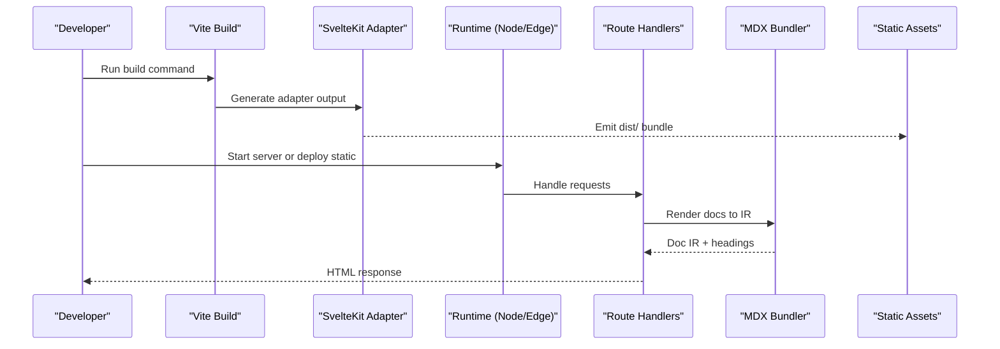
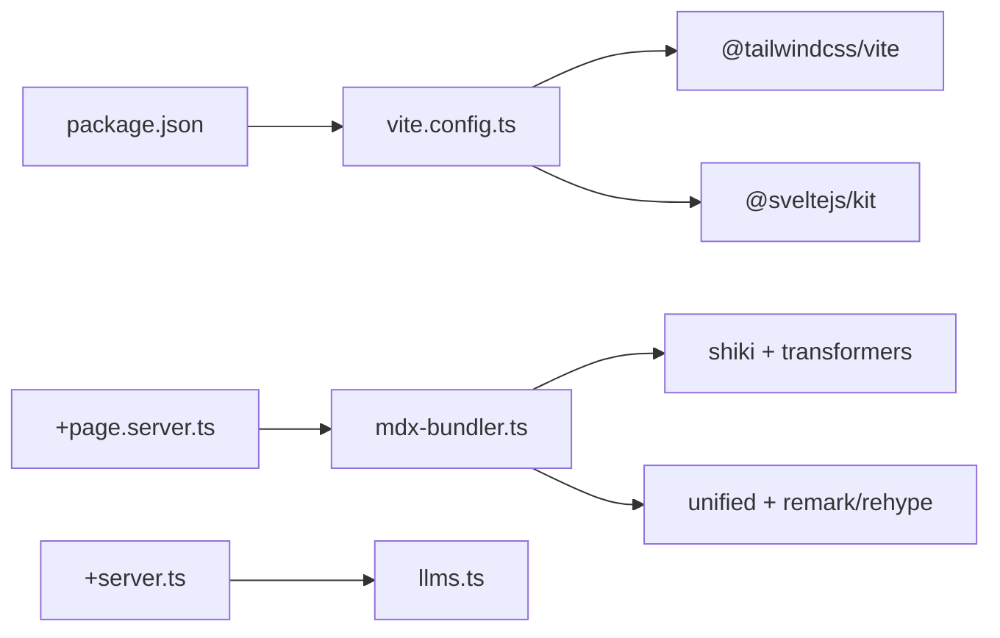

# Deployment and Production

<cite>
**Referenced Files in This Document**
- [package.json](file://package.json)
- [vite.config.ts](file://vite.config.ts)
- [svelte.config.js](file://svelte.config.js)
- [tsconfig.json](file://tsconfig.json)
- [app.html](file://src/app.html)
- [+layout.svelte](file://src/routes/+layout.svelte)
- [+page.server.ts](file://src/routes/+page.server.ts)
- [+server.ts](file://src/routes/llms.txt/+server.ts)
- [index.ts](file://src/lib/index.ts)
- [mdx-bundler.ts](file://src/lib/bundler/mdx-bundler.ts)
- [llms.ts](file://src/lib/server/llms.ts)
</cite>

## Table of Contents
1. Introduction
2. Project Structure
3. Core Components
4. Architecture Overview
5. Detailed Component Analysis
6. Dependency Analysis
7. Performance Considerations
8. Troubleshooting Guide
9. Conclusion
10. Appendices

## Introduction
This document provides comprehensive deployment and production guidance for FractalDocs, a SvelteKit-based documentation platform. It covers build configuration with Vite, environment setup across different targets, performance optimization techniques, caching strategies, asset optimization, monitoring approaches, and practical CI/CD examples. It also explains static hosting, serverless platforms, and containerized deployments, along with scaling considerations to maintain performance under load.

## Project Structure
FractalDocs is a SvelteKit application configured via Vite and the SvelteKit adapter. The build pipeline uses modern JavaScript targets and Tailwind CSS integration. Server-side rendering (SSR) is enabled for Node-compatible environments, while static output can be generated for edge or CDN-friendly hosting.

Key files:
- Build and scripts are defined in package.json.
- Vite configuration sets plugins, SSR externalization, and build targets.
- SvelteKit configuration selects an adapter for target-specific builds.
- TypeScript configuration enables strict checks and source maps.
- Application shell and layout define global styles and preload behavior.
- Route handlers render documentation content and expose endpoints.

```mermaid
graph TB
A["package.json<br/>scripts & dependencies"] --> B["vite.config.ts<br/>plugins, ssr, build targets"]
B --> C["svelte.config.js<br/>adapter selection"]
C --> D["Build Output<br/>dist/"]
E["src/app.html<br/>HTML shell"] --> F["src/routes/+layout.svelte<br/>global styles"]
G["src/routes/+page.server.ts<br/>render docs"] --> H["src/lib/bundler/mdx-bundler.ts<br/>MDX + Shiki"]
I["src/routes/llms.txt/+server.ts<br">LLMs endpoint"] --> J["src/lib/server/llms.ts<br/>text generation"]
```

**Diagram sources**
- [package.json:1-49](file://package.json#L1-L49)
- [vite.config.ts:1-35](file://vite.config.ts#L1-L35)
- [svelte.config.js:1-13](file://svelte.config.js#L1-L13)
- [app.html:1-13](file://src/app.html#L1-L13)
- [+layout.svelte:1-8](file://src/routes/+layout.svelte#L1-L8)
- [+page.server.ts:1-88](file://src/routes/+page.server.ts#L1-L88)
- [mdx-bundler.ts:1-296](file://src/lib/bundler/mdx-bundler.ts#L1-L296)
- [+server.ts:1-18](file://src/routes/llms.txt/+server.ts#L1-L18)
- [llms.ts:1-28](file://src/lib/server/llms.ts#L1-L28)

**Section sources**
- [package.json:1-49](file://package.json#L1-L49)
- [vite.config.ts:1-35](file://vite.config.ts#L1-L35)
- [svelte.config.js:1-13](file://svelte.config.js#L1-L13)
- [tsconfig.json:1-15](file://tsconfig.json#L1-L15)
- [app.html:1-13](file://src/app.html#L1-L13)
- [+layout.svelte:1-8](file://src/routes/+layout.svelte#L1-L8)

## Core Components
- Build system: Vite with SvelteKit plugin and Tailwind CSS integration.
- Adapter strategy: SvelteKit adapter-auto for automatic target detection.
- SSR configuration: Externalization control for heavy libraries during SSR.
- Asset pipeline: HTML template and global layout for consistent styling.
- Documentation rendering: MDX bundler with Shiki syntax highlighting and AST processing.
- Endpoints: LLMs text endpoint for AI agent consumption.

Practical implications:
- Use vite build to generate optimized assets for static hosting or preview locally with vite preview.
- Ensure Node.js runtime availability when using SSR routes; otherwise, configure static adapter for pure static output.
- Tailwind CSS is processed at build time; ensure no runtime dependencies on Tailwind classes beyond what’s included.

**Section sources**
- [vite.config.ts:1-35](file://vite.config.ts#L1-L35)
- [svelte.config.js:1-13](file://svelte.config.js#L1-L13)
- [package.json:1-49](file://package.json#L1-L49)
- [mdx-bundler.ts:1-296](file://src/lib/bundler/mdx-bundler.ts#L1-L296)
- [+server.ts:1-18](file://src/routes/llms.txt/+server.ts#L1-L18)

## Architecture Overview
The application follows a standard SvelteKit architecture:
- Client-side assets are built by Vite and served from dist/.
- Server routes run on Node or compatible runtimes unless static mode is selected.
- Documentation content is rendered server-side into an intermediate representation (IR), then hydrated on the client.
- An LLMs endpoint exposes structured text for AI agents.



**Diagram sources**
- [package.json:1-49](file://package.json#L1-L49)
- [vite.config.ts:1-35](file://vite.config.ts#L1-L35)
- [svelte.config.js:1-13](file://svelte.config.js#L1-L13)
- [+page.server.ts:1-88](file://src/routes/+page.server.ts#L1-L88)
- [mdx-bundler.ts:1-296](file://src/lib/bundler/mdx-bundler.ts#L1-L296)

## Detailed Component Analysis

### Build Configuration with Vite
- Plugins: Tailwind CSS and SvelteKit are integrated via Vite plugins.
- SSR externalization: Heavy libraries are marked as non-external to avoid runtime issues during SSR.
- Targets: es2022 is enforced across build, esbuild, and dependency optimization for modern browsers.
- Output: Standard Vite/SvelteKit dist folder structure.

Recommendations:
- Keep target aligned with your deployment runtime capabilities.
- For static-only deployments, consider switching to a static adapter to eliminate SSR overhead.

**Section sources**
- [vite.config.ts:1-35](file://vite.config.ts#L1-L35)
- [package.json:1-49](file://package.json#L1-L49)

### SvelteKit Adapter Strategy
- Default adapter-auto detects the runtime and configures accordingly.
- For static hosting, switch to a static adapter to produce fully static output.
- For serverless, use an appropriate adapter (e.g., Cloudflare Workers, Vercel, Netlify) if needed.

Operational notes:
- Static builds produce only client assets and pre-rendered pages where applicable.
- SSR-enabled builds require a Node-compatible runtime.

**Section sources**
- [svelte.config.js:1-13](file://svelte.config.js#L1-L13)

### Documentation Rendering Pipeline
- Input: Markdown/MDX content with frontmatter.
- Processing: Unified pipeline parses MDX, transforms to an internal representation, and highlights code blocks using Shiki.
- Output: Structured IR including headings and highlighted code, consumed by UI components.

Performance considerations:
- Highlighter instance is cached to avoid repeated initialization.
- Code block highlighting runs per node; batch operations where possible.
- Mermaid code blocks bypass syntax highlighting to prevent conflicts.

**Section sources**
- [mdx-bundler.ts:1-296](file://src/lib/bundler/mdx-bundler.ts#L1-L296)
- [+page.server.ts:1-88](file://src/routes/+page.server.ts#L1-L88)

### LLMs Endpoint
- Purpose: Exposes a plain-text listing of documentation pages for AI agents.
- Implementation: Server route returns generated text with metadata and summaries.

Usage:
- Integrate with MCP servers or other agent frameworks that consume /llms.txt.

**Section sources**
- [+server.ts:1-18](file://src/routes/llms.txt/+server.ts#L1-L18)
- [llms.ts:1-28](file://src/lib/server/llms.ts#L1-L28)

### Application Shell and Layout
- HTML template includes favicon and viewport settings.
- Global layout imports global styles and renders children.
- Preload data on hover improves perceived performance.

Best practices:
- Keep global styles minimal and tree-shake unused CSS via Tailwind.
- Avoid heavy inline scripts in app.html.

**Section sources**
- [app.html:1-13](file://src/app.html#L1-L13)
- [+layout.svelte:1-8](file://src/routes/+layout.svelte#L1-L8)

## Dependency Analysis
Key runtime and build-time dependencies:
- SvelteKit and Vite for framework and build tooling.
- Tailwind CSS for styling pipeline.
- MDX and Shiki for documentation processing and syntax highlighting.
- Utilities for parsing and transformation (unified, remark, rehype).

Potential risks:
- Large bundles due to Shiki languages/themes; curate language set.
- SSR externalization must include all packages used server-side.



**Diagram sources**
- [package.json:1-49](file://package.json#L1-L49)
- [vite.config.ts:1-35](file://vite.config.ts#L1-L35)
- [+page.server.ts:1-88](file://src/routes/+page.server.ts#L1-L88)
- [mdx-bundler.ts:1-296](file://src/lib/bundler/mdx-bundler.ts#L1-L296)
- [+server.ts:1-18](file://src/routes/llms.txt/+server.ts#L1-L18)
- [llms.ts:1-28](file://src/lib/server/llms.ts#L1-L28)

**Section sources**
- [package.json:1-49](file://package.json#L1-L49)
- [vite.config.ts:1-35](file://vite.config.ts#L1-L35)

## Performance Considerations
- Target alignment: Maintain es2022 target for modern browser features and faster execution.
- Bundle size: Limit Shiki languages to those actually used; avoid loading unnecessary themes.
- Caching: Leverage CDN cache headers for static assets; enable long-lived caching with content hashes.
- Hydration: Prefer static rendering where possible to reduce server load.
- Prefetching: Use SvelteKit’s preload hints judiciously to improve navigation speed.
- Monitoring: Track Time to First Byte (TTFB), Largest Contentful Paint (LCP), and Total Blocking Time (TBT) in production.

Optimization checklist:
- Audit dependencies and remove unused modules.
- Enable compression (gzip/brotli) at the CDN or reverse proxy layer.
- Use HTTP/2 or HTTP/3 for multiplexed asset delivery.
- Monitor memory usage on SSR nodes during peak loads.

[No sources needed since this section provides general guidance]

## Troubleshooting Guide
Common issues and resolutions:
- SSR failures with heavy libraries: Ensure they are listed in ssr.noExternal so they are bundled correctly.
- Missing Tailwind classes: Verify Tailwind plugin is active and styles are imported in the layout.
- Syntax highlighting errors: Validate code block language names; fallback to plain text when unsupported.
- Endpoint not found: Confirm the route file exists and exports the correct handler method.
- Build target mismatch: Align Node.js version and browser targets with es2022 requirements.

Debugging steps:
- Run local preview with vite preview to validate production-like behavior.
- Inspect dist/ output to verify asset paths and chunking.
- Check logs from the runtime for SSR errors and unhandled exceptions.

**Section sources**
- [vite.config.ts:1-35](file://vite.config.ts#L1-L35)
- [+layout.svelte:1-8](file://src/routes/+layout.svelte#L1-L8)
- [mdx-bundler.ts:1-296](file://src/lib/bundler/mdx-bundler.ts#L1-L296)
- [+server.ts:1-18](file://src/routes/llms.txt/+server.ts#L1-L18)

## Conclusion
FractalDocs leverages SvelteKit and Vite to deliver a fast, extensible documentation platform. By configuring adapters appropriately, optimizing assets, and implementing robust caching and monitoring, you can deploy efficiently across static, serverless, and containerized environments. Focus on minimizing bundle size, aligning targets, and measuring performance to maintain reliability under load.

[No sources needed since this section summarizes without analyzing specific files]

## Appendices

### Build Commands and Scripts
- Development: Run the development server with hot module replacement.
- Build: Generate production assets for deployment.
- Preview: Serve the built output locally to simulate production behavior.
- Type checking: Sync SvelteKit types and run type checks.

**Section sources**
- [package.json:1-49](file://package.json#L1-L49)

### Environment Setup for Different Targets
- Static hosting: Switch to a static adapter to produce fully static output suitable for CDNs.
- Serverless platforms: Choose an adapter compatible with the target platform (e.g., Cloudflare Workers, Vercel).
- Containerized deployments: Package the Node.js runtime and serve the built output behind a reverse proxy.

Environment variables:
- Configure any runtime-specific variables through your platform’s environment management.
- Avoid embedding secrets in the build; pass them at runtime.

[No sources needed since this section provides general guidance]

### CI/CD Pipeline Examples
Recommended stages:
- Install dependencies with a lockfile.
- Run type checks and linting.
- Build the project.
- Cache node_modules and build artifacts.
- Deploy static assets to a CDN or push serverless functions to the target platform.

Caching strategies:
- Cache dependency installs based on lockfiles.
- Cache Vite dependency optimization and build outputs.
- Invalidate caches selectively when dependencies change.

[No sources needed since this section provides general guidance]

### Caching Strategies and Asset Optimization
- CDN caching: Set long-lived cache headers for hashed assets.
- Compression: Enable gzip/brotli at the edge.
- Minification: Ensure Vite minifies JS/CSS in production.
- Image optimization: Use modern formats and responsive images where applicable.

[No sources needed since this section provides general guidance]

### Scaling and Load Management
- Horizontal scaling: Scale out SSR instances behind a load balancer.
- Edge caching: Offload static assets and pre-rendered pages to the edge.
- Rate limiting: Protect endpoints like /llms.txt from abuse.
- Observability: Instrument metrics and logs for SSR nodes and edge functions.

[No sources needed since this section provides general guidance]