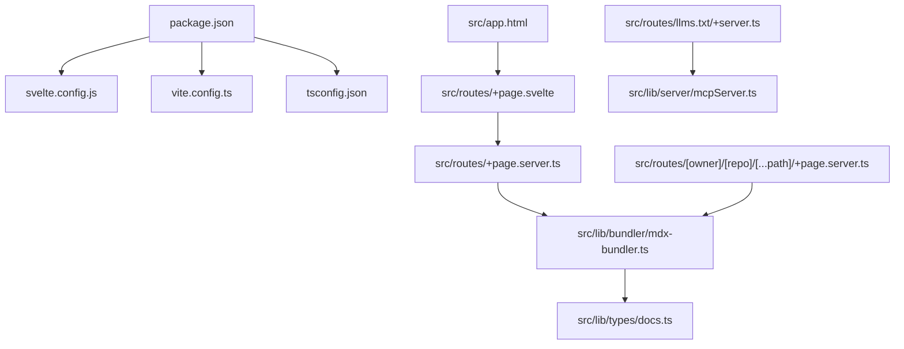
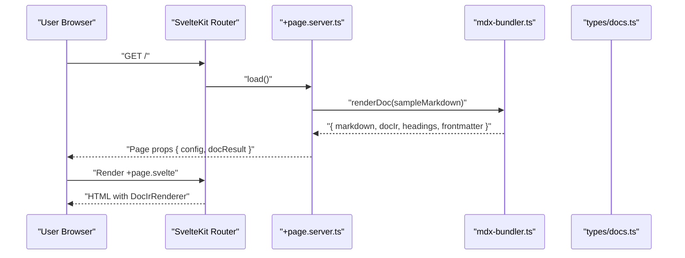
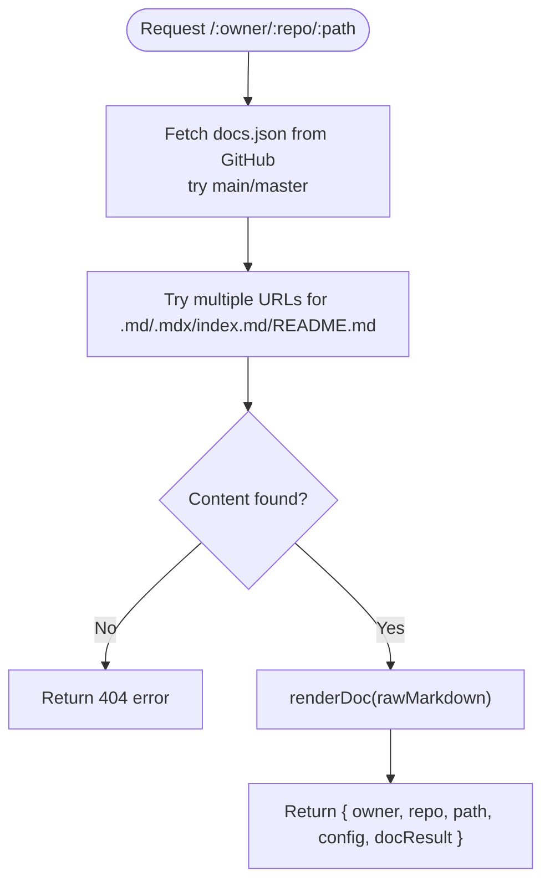
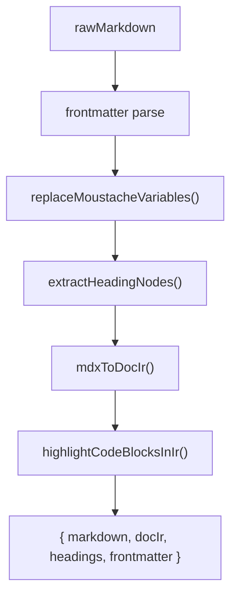
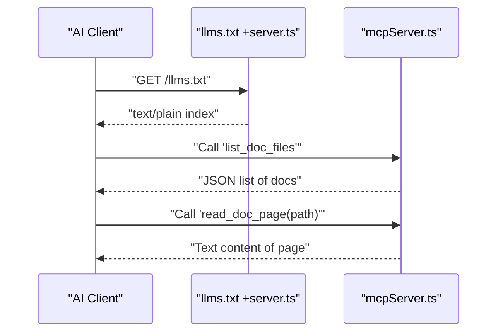
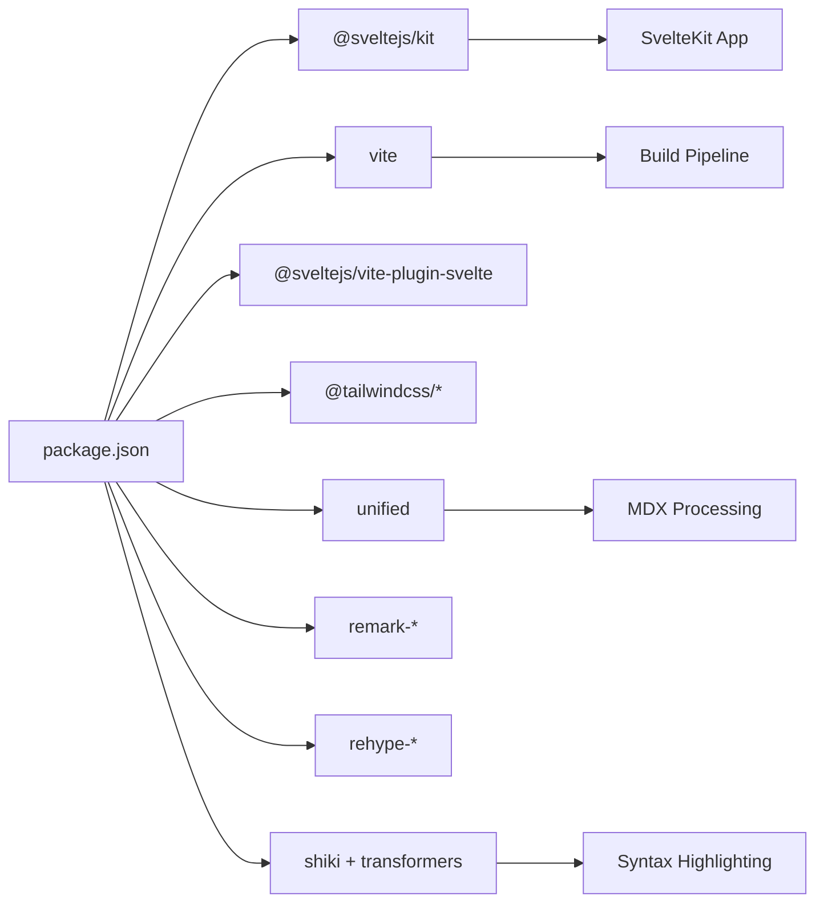

# Getting Started

<cite>
**Referenced Files in This Document**
- [package.json](file://package.json)
- [svelte.config.js](file://svelte.config.js)
- [vite.config.ts](file://vite.config.ts)
- [tsconfig.json](file://tsconfig.json)
- [app.html](file://src/app.html)
- [+page.server.ts](file://src/routes/+page.server.ts)
- [+page.svelte](file://src/routes/+page.svelte)
- [+page.server.ts (GitHub route)](file://src/routes/[owner]/[repo]/[...path]/+page.server.ts)
- [mdx-bundler.ts](file://src/lib/bundler/mdx-bundler.ts)
- [docs.ts](file://src/lib/types/docs.ts)
- [llms.txt +server.ts](file://src/routes/llms.txt/+server.ts)
- [mcpServer.ts](file://src/lib/server/mcpServer.ts)
</cite>

## Table of Contents
1. Introduction
2. Project Structure
3. Core Components
4. Architecture Overview
5. Detailed Component Analysis
6. Dependency Analysis
7. Performance Considerations
8. Troubleshooting Guide
9. Conclusion

## Introduction
FractalDocs is a documentation-as-code platform built with SvelteKit that serves both human readers and AI agents. It processes Markdown and MDX into a structured intermediate representation, renders interactive components, and exposes agent-friendly endpoints such as an LLMs.txt endpoint and a Model Context Protocol (MCP) server. GitHub integration allows you to pull documentation directly from repositories without local content management.

Key capabilities:
- SvelteKit-native rendering with modern Svelte 5 patterns
- MDX processing with syntax highlighting via Shiki
- GitHub-backed docs fetching and configuration discovery
- Agent integrations for AI tooling and automation

## Project Structure
At a high level, the project follows SvelteKit conventions:
- Routes define server-side data loading and page rendering
- Library modules encapsulate bundling, types, and server utilities
- Configuration files set up the build pipeline and adapter

**Diagram sources**
- [package.json](file://package.json)
- [svelte.config.js](file://svelte.config.js)
- [vite.config.ts](file://vite.config.ts)
- [tsconfig.json](file://tsconfig.json)
- [app.html](file://src/app.html)
- [+page.svelte](file://src/routes/+page.svelte)
- [+page.server.ts](file://src/routes/+page.server.ts)
- [mdx-bundler.ts](file://src/lib/bundler/mdx-bundler.ts)
- [docs.ts](file://src/lib/types/docs.ts)
- [llms.txt +server.ts](file://src/routes/llms.txt/+server.ts)
- [mcpServer.ts](file://src/lib/server/mcpServer.ts)

**Section sources**
- [package.json](file://package.json)
- [svelte.config.js](file://svelte.config.js)
- [vite.config.ts](file://vite.config.ts)
- [tsconfig.json](file://tsconfig.json)
- [app.html](file://src/app.html)

## Core Components
- Documentation renderer: Converts raw Markdown/MDX into a typed IR used by the UI.
- GitHub route loader: Fetches docs and config from GitHub on demand.
- LLMs.txt endpoint: Provides a machine-readable index for AI tools.
- MCP server helper: Exposes tools for listing and reading docs programmatically.
- Types: Strongly typed interfaces for configuration and rendered output.

Practical outcomes:
- You can run a dev server locally to preview docs.
- You can point FractalDocs at any public GitHub repository to render its docs.
- You can expose agent endpoints for automated consumption.

**Section sources**
- [mdx-bundler.ts](file://src/lib/bundler/mdx-bundler.ts)
- [+page.server.ts (GitHub route)](file://src/routes/[owner]/[repo]/[...path]/+page.server.ts)
- [llms.txt +server.ts](file://src/routes/llms.txt/+server.ts)
- [mcpServer.ts](file://src/lib/server/mcpServer.ts)
- [docs.ts](file://src/lib/types/docs.ts)

## Architecture Overview
The runtime flow combines SvelteKit routing, server-side loaders, and MDX processing. The default route demonstrates how to render a sample document, while the dynamic GitHub route shows live fetching and rendering.

**Diagram sources**
- [+page.server.ts](file://src/routes/+page.server.ts)
- [+page.svelte](file://src/routes/+page.svelte)
- [mdx-bundler.ts](file://src/lib/bundler/mdx-bundler.ts)
- [docs.ts](file://src/lib/types/docs.ts)

## Detailed Component Analysis

### Installation and Setup
- Requirements: Node.js and a package manager (npm or yarn).
- Install dependencies and start the development server using the scripts defined in the package manifest.
- Build and preview production assets using the provided commands.

What happens under the hood:
- Vite orchestrates the build and dev server.
- SvelteKit adapter is configured for automatic deployment targets.
- TypeScript settings are aligned with SvelteKit’s generated config.

**Section sources**
- [package.json](file://package.json)
- [svelte.config.js](file://svelte.config.js)
- [vite.config.ts](file://vite.config.ts)
- [tsconfig.json](file://tsconfig.json)

### First Documentation Creation Workflow
You can render a sample page immediately using the default route. The server loader prepares a configuration object and a sample Markdown string, then passes them to the renderer. The page component composes the layout and renders the processed document.

Steps:
- Start the dev server.
- Open the root route to see the sample documentation.
- Replace the sample Markdown and configuration with your own content.

**Section sources**
- [+page.server.ts](file://src/routes/+page.server.ts)
- [+page.svelte](file://src/routes/+page.svelte)

### GitHub Integration
The dynamic route fetches documentation and configuration from a GitHub repository at request time. It tries multiple common paths and branches to locate the docs and config, then renders the content.

How it works:
- Resolve owner and repo from URL parameters.
- Attempt to load docs.json from main/master branches.
- Try several Markdown/MDX locations for the requested path.
- Render the found content via the MDX bundler.

**Diagram sources**
- [+page.server.ts (GitHub route)](file://src/routes/[owner]/[repo]/[...path]/+page.server.ts)
- [mdx-bundler.ts](file://src/lib/bundler/mdx-bundler.ts)

**Section sources**
- [+page.server.ts (GitHub route)](file://src/routes/[owner]/[repo]/[...path]/+page.server.ts)

### MDX Processing Pipeline
The bundler transforms Markdown/MDX into a typed intermediate representation suitable for rendering. It also extracts headings and supports variable substitution.

Key behaviors:
- Parse frontmatter and content.
- Substitute variables using a simple placeholder syntax.
- Extract heading nodes for navigation.
- Convert to an IR and highlight code blocks.

**Diagram sources**
- [mdx-bundler.ts](file://src/lib/bundler/mdx-bundler.ts)

**Section sources**
- [mdx-bundler.ts](file://src/lib/bundler/mdx-bundler.ts)

### Agent Integrations (LLMs.txt and MCP)
FractalDocs exposes endpoints designed for AI tooling:
- An LLMs.txt endpoint returns a plain-text index describing available pages.
- An MCP server helper provides tools to list and read documentation pages.

**Diagram sources**
- [llms.txt +server.ts](file://src/routes/llms.txt/+server.ts)
- [mcpServer.ts](file://src/lib/server/mcpServer.ts)

**Section sources**
- [llms.txt +server.ts](file://src/routes/llms.txt/+server.ts)
- [mcpServer.ts](file://src/lib/server/mcpServer.ts)

### Data Models and Configuration
The type definitions describe the shape of configuration, rendered results, and the IR nodes used by the UI. They ensure consistent behavior across routes and components.

Highlights:
- DocsConfig includes name, description, logo, theme, social links, tabs, sidebar, redirects, and variables.
- RenderDocResult contains the processed markdown, IR, headings, and frontmatter.
- DocIrNode models components, markdown, HTML, code blocks, and breaks.

**Section sources**
- [docs.ts](file://src/lib/types/docs.ts)

## Dependency Analysis
The project relies on SvelteKit, Vite, Tailwind CSS, and a rich ecosystem of Markdown/MDX processors. Key runtime and build-time relationships:

**Diagram sources**
- [package.json](file://package.json)
- [vite.config.ts](file://vite.config.ts)

**Section sources**
- [package.json](file://package.json)
- [vite.config.ts](file://vite.config.ts)

## Performance Considerations
- The build targets ES2022 for modern environments, improving runtime performance.
- Certain packages are marked as non-external for SSR to avoid runtime issues during server-side rendering.
- MDX processing is performed per-request in the GitHub route; consider caching strategies if serving many documents.
- Syntax highlighting is integrated into the IR pipeline; ensure only necessary languages are enabled to reduce bundle size.

[No sources needed since this section provides general guidance]

## Troubleshooting Guide
Common setup issues and resolutions:
- Missing Node.js or incompatible version: Ensure a supported Node.js LTS is installed and use npm or yarn consistently.
- Dev server fails to start: Verify dependencies are installed and no port conflicts exist.
- GitHub route returns 404: Confirm the repository is public, the branch exists (main/master), and the expected file paths are present.
- MDX rendering errors: Validate Markdown/MDX syntax and ensure required plugins are available.
- TypeScript checks fail: Run the check script to surface type errors early.

Operational tips:
- Use the preview command to validate production builds locally.
- Inspect network requests when debugging GitHub content fetching.
- Review the LLMs.txt endpoint to confirm indexing is working for AI clients.

**Section sources**
- [package.json](file://package.json)
- [+page.server.ts (GitHub route)](file://src/routes/[owner]/[repo]/[...path]/+page.server.ts)

## Conclusion
You now have the essentials to install, configure, and run FractalDocs. Start with the default route to understand the rendering flow, then integrate your GitHub repository to serve live documentation. Leverage the LLMs.txt and MCP endpoints to enable AI agents to consume your docs programmatically. For advanced customization, explore the configuration model and MDX pipeline to tailor content processing and presentation.

[No sources needed since this section summarizes without analyzing specific files]