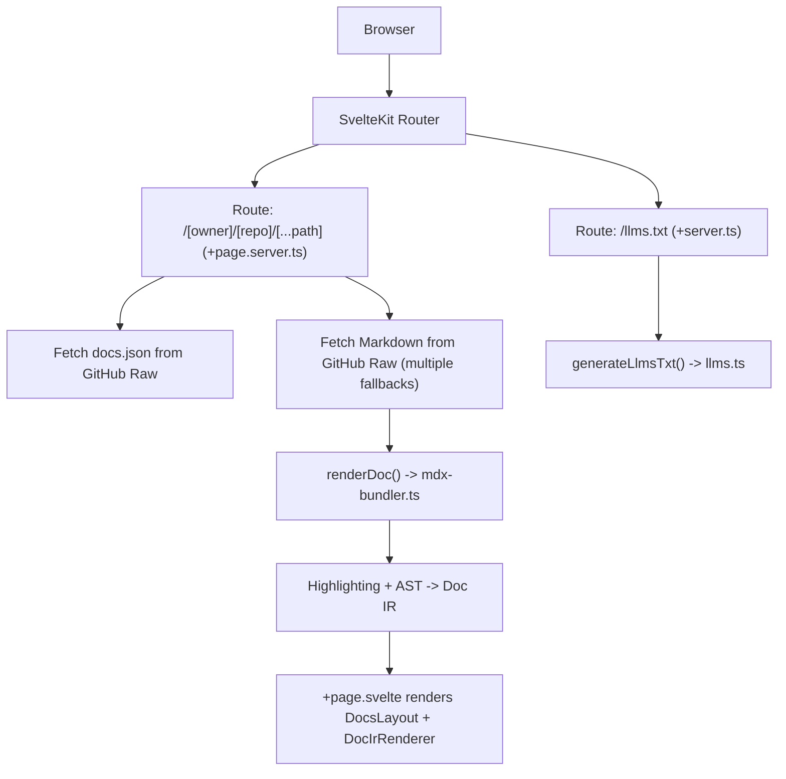
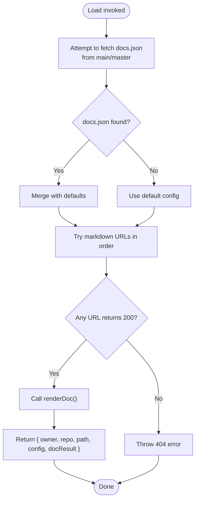
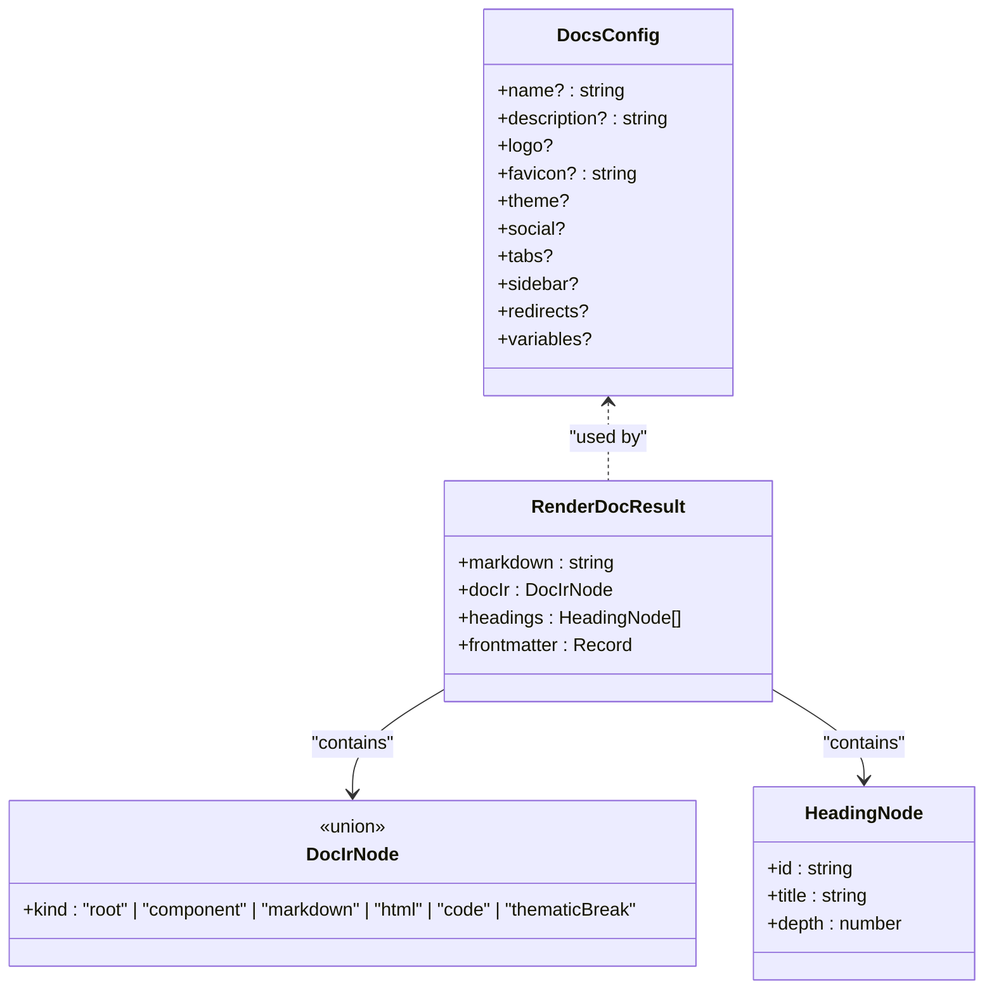
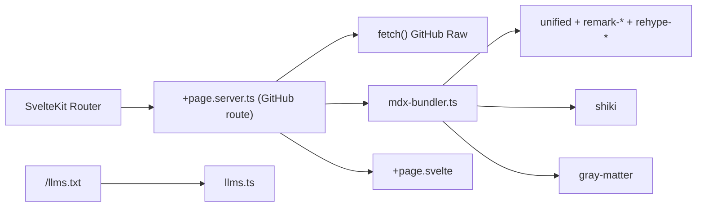

# GitHub Integration

<cite>
**Referenced Files in This Document**
- [package.json](file://package.json)
- [svelte.config.js](file://svelte.config.js)
- [vite.config.ts](file://vite.config.ts)
- [app.html](file://src/app.html)
- [+page.server.ts (GitHub route)](file://src/routes/[owner]/[repo]/[...path]/+page.server.ts)
- [+page.svelte (GitHub route)](file://src/routes/[owner]/[repo]/[...path]/+page.svelte)
- [+page.server.ts (root)](file://src/routes/+page.server.ts)
- [+server.ts (llms.txt)](file://src/routes/llms.txt/+server.ts)
- [index.ts (lib exports)](file://src/lib/index.ts)
- [docs.ts (types)](file://src/lib/types/docs.ts)
- [mdx-bundler.ts](file://src/lib/bundler/mdx-bundler.ts)
- [llms.ts](file://src/lib/server/llms.ts)
</cite>

## Table of Contents
1. Introduction
2. Project Structure
3. Core Components
4. Architecture Overview
5. Detailed Component Analysis
6. Dependency Analysis
7. Performance Considerations
8. Troubleshooting Guide
9. Conclusion

## Introduction
This document explains FractalDocs’ GitHub integration for automatic documentation fetching from repositories. It covers repository configuration via docs.json, path resolution strategies for various markdown structures, dynamic routing that maps GitHub URLs to documentation pages, authentication considerations for private repositories, and caching strategies for improved performance. Practical examples illustrate how different repository layouts map to configurations, along with debugging techniques and best practices for reliable workflows.

## Project Structure
FractalDocs is a SvelteKit application that:
- Exposes a dynamic route for GitHub repositories under /[owner]/[repo]/[...path].
- Fetches docs.json for per-repo configuration and raw markdown content from GitHub’s raw CDN.
- Renders MDX/Markdown into an internal representation (Doc IR), highlights code with Shiki, and renders UI components.
- Provides an /llms.txt endpoint for AI agents to discover documentation.



**Diagram sources**
- [+page.server.ts (GitHub route):1-76](file://src/routes/[owner]/[repo]/[...path]/+page.server.ts#L1-L76)
- [+page.svelte (GitHub route):1-17](file://src/routes/[owner]/[repo]/[...path]/+page.svelte#L1-L17)
- [mdx-bundler.ts:280-296](file://src/lib/bundler/mdx-bundler.ts#L280-L296)
- [+server.ts (llms.txt):1-18](file://src/routes/llms.txt/+server.ts#L1-L18)
- [llms.ts:1-28](file://src/lib/server/llms.ts#L1-L28)

**Section sources**
- [package.json:1-49](file://package.json#L1-L49)
- [svelte.config.js:1-13](file://svelte.config.js#L1-L13)
- [vite.config.ts:1-35](file://vite.config.ts#L1-L35)
- [app.html:1-13](file://src/app.html#L1-L13)

## Core Components
- Dynamic GitHub route loader: fetches docs.json and markdown, applies fallbacks, and returns data for rendering.
- MDX bundler pipeline: parses MDX/Markdown, builds Doc IR, extracts headings, and highlights code blocks.
- Types: strongly typed configuration and render result interfaces used across the app.
- LLMs endpoint: generates a simple index for AI agents.

Key responsibilities:
- Route loader orchestrates network requests and error handling.
- Bundler transforms source into a stable intermediate representation suitable for component rendering.
- Types define DocsConfig, RenderDocResult, and Doc IR nodes.

**Section sources**
- [+page.server.ts (GitHub route):1-76](file://src/routes/[owner]/[repo]/[...path]/+page.server.ts#L1-L76)
- [mdx-bundler.ts:1-296](file://src/lib/bundler/mdx-bundler.ts#L1-L296)
- [docs.ts:1-82](file://src/lib/types/docs.ts#L1-L82)
- [+server.ts (llms.txt):1-18](file://src/routes/llms.txt/+server.ts#L1-L18)
- [llms.ts:1-28](file://src/lib/server/llms.ts#L1-L28)

## Architecture Overview
The GitHub integration follows a clear request-to-render flow:
- The SvelteKit router resolves /[owner]/[repo]/[...path].
- The server-side load function attempts to fetch docs.json from main/master branches.
- It then tries multiple markdown locations as fallbacks.
- If found, renderDoc processes the markdown into Doc IR and headings.
- The page component renders the layout and Doc IR using reusable components.

```mermaid
sequenceDiagram
participant Client as "Client"
participant Router as "SvelteKit Router"
participant Loader as "+page.server.ts"
participant GH as "GitHub Raw API"
participant Bundler as "mdx-bundler.ts"
participant Page as "+page.svelte"
Client->>Router : GET /[owner]/[repo]/[...path]
Router->>Loader : load({ params, fetch })
Loader->>GH : GET https : //raw.githubusercontent.com/{owner}/{repo}/main/docs.json
alt config found
GH-->>Loader : docs.json
Loader->>Loader : merge with defaults
else not found
GH-->>Loader : 404
Loader->>Loader : use default config
end
loop try possible markdown URLs
Loader->>GH : GET raw markdown URL
alt found
GH-->>Loader : markdown text
break
else continue
GH-->>Loader : 404
end
end
Loader->>Bundler : renderDoc(rawMarkdown)
Bundler-->>Loader : { docIR, headings, frontmatter }
Loader-->>Page : { owner, repo, path, config, docResult }
Page-->>Client : Rendered documentation page
```

**Diagram sources**
- [+page.server.ts (GitHub route):1-76](file://src/routes/[owner]/[repo]/[...path]/+page.server.ts#L1-L76)
- [mdx-bundler.ts:280-296](file://src/lib/bundler/mdx-bundler.ts#L280-L296)
- [+page.svelte (GitHub route):1-17](file://src/routes/[owner]/[repo]/[...path]/+page.svelte#L1-L17)

## Detailed Component Analysis

### GitHub Route Loader: Configuration and Content Resolution
Responsibilities:
- Resolve docs.json from main or master branch; merge with defaults if missing.
- Attempt multiple markdown paths to locate content.
- Throw a 404 when no content is found.
- Return structured data for the page component.

Path resolution strategy:
- Tries docs.json at both main and master branches.
- For markdown, tries:
  - docs/<docPath>.md
  - docs/<docPath>.mdx
  - docs/<docPath>/index.md
  - <docPath>.md at root
  - README.md at root
  - Same set under master branch

Fallback behavior:
- If docs.json is missing, uses a sensible default configuration derived from owner/repo.
- If markdown is not found after all attempts, throws a 404 error.

Authentication considerations:
- Uses public GitHub raw URLs; private repositories will return 404 without credentials.
- To support private repos, proxy through a server endpoint that injects authentication headers before fetching raw content.

Caching recommendations:
- Cache docs.json and markdown responses on the server side (e.g., in-memory cache with TTL).
- Use HTTP cache headers where possible and invalidate on deploy hooks.



**Diagram sources**
- [+page.server.ts (GitHub route):1-76](file://src/routes/[owner]/[repo]/[...path]/+page.server.ts#L1-L76)

**Section sources**
- [+page.server.ts (GitHub route):1-76](file://src/routes/[owner]/[repo]/[...path]/+page.server.ts#L1-L76)

### MDX Bundler Pipeline: Rendering and Highlighting
Responsibilities:
- Parse MDX/Markdown into an internal Doc IR.
- Extract headings for navigation.
- Highlight code blocks using Shiki with CSS variables theme.
- Provide utilities for HTML rendering and variable substitution.

Key functions:
- renderDoc: entry point returning markdown, Doc IR, headings, and frontmatter.
- mdxToDocIr: converts parsed MDAST to Doc IR nodes.
- highlightCodeBlocksInIr: async traversal to highlight code nodes.
- extractHeadingNodes: scans markdown for headings and computes slugs.
- replaceMoustacheVariables: substitutes {{ var }} placeholders.

Performance notes:
- Shiki highlighter instance is created once and reused.
- Code highlighting runs asynchronously over the Doc IR tree.



**Diagram sources**
- [docs.ts:1-82](file://src/lib/types/docs.ts#L1-L82)
- [mdx-bundler.ts:280-296](file://src/lib/bundler/mdx-bundler.ts#L280-L296)

**Section sources**
- [mdx-bundler.ts:1-296](file://src/lib/bundler/mdx-bundler.ts#L1-L296)
- [docs.ts:1-82](file://src/lib/types/docs.ts#L1-L82)

### Page Rendering: Layout and Doc IR Renderer
Responsibilities:
- Receive data from the loader (config, owner, repo, path, docResult).
- Set page title from config.name.
- Render DocsLayout with sidebar/tabs and pass Doc IR to DocIrRenderer.

Rendering flow:
- The loader returns docResult.docIR which contains highlighted code and component nodes.
- DocIrRenderer consumes this IR and renders MDX components and markdown sections.

**Section sources**
- [+page.svelte (GitHub route):1-17](file://src/routes/[owner]/[repo]/[...path]/+page.svelte#L1-L17)

### LLMs Endpoint: AI Agent Discovery
Responsibilities:
- Serve /llms.txt with a plain-text index of documentation pages.
- Generate summaries and links based on provided config and docs list.

Usage:
- Useful for AI agents to discover and consume documentation programmatically.

**Section sources**
- [+server.ts (llms.txt):1-18](file://src/routes/llms.txt/+server.ts#L1-L18)
- [llms.ts:1-28](file://src/lib/server/llms.ts#L1-L28)

## Dependency Analysis
Core dependencies relevant to GitHub integration:
- SvelteKit routing and server-side loaders.
- GitHub raw content fetching via standard fetch.
- MDX/Markdown processing with unified, remark, rehype.
- Syntax highlighting with Shiki.
- Frontmatter parsing with gray-matter.

Build-time configuration:
- Vite SSR excludes certain packages to ensure correct runtime behavior.
- Tailwind CSS plugin integrated for styling.



**Diagram sources**
- [vite.config.ts:1-35](file://vite.config.ts#L1-L35)
- [package.json:1-49](file://package.json#L1-L49)
- [+page.server.ts (GitHub route):1-76](file://src/routes/[owner]/[repo]/[...path]/+page.server.ts#L1-L76)
- [mdx-bundler.ts:1-296](file://src/lib/bundler/mdx-bundler.ts#L1-L296)
- [+server.ts (llms.txt):1-18](file://src/routes/llms.txt/+server.ts#L1-L18)

**Section sources**
- [package.json:1-49](file://package.json#L1-L49)
- [vite.config.ts:1-35](file://vite.config.ts#L1-L35)

## Performance Considerations
- Network latency: Multiple fallback URLs are attempted sequentially; consider caching docs.json and markdown responses server-side with TTL.
- Highlighting cost: Shiki highlighter is instantiated once and reused; avoid re-instantiation per request.
- Memory usage: Large markdown files increase Doc IR size; consider streaming or pagination for very large documents.
- Build targets: es2022 target ensures modern optimizations; keep dependencies aligned to avoid polyfills.

Recommendations:
- Implement server-side caching for GitHub raw responses (in-memory or Redis).
- Use conditional fetching: only fetch docs.json once per repo per cache window.
- Precompute headings and Doc IR where feasible for static sites.

## Troubleshooting Guide
Common issues and resolutions:
- Private repositories return 404:
  - Cause: Public raw URLs require public access.
  - Fix: Proxy requests through a server endpoint that adds authentication headers (e.g., GitHub PAT).
- Missing docs.json:
  - Behavior: Defaults are used; verify expected fields like name, description, tabs, sidebar.
- No markdown found:
  - Behavior: 404 thrown; ensure file exists at one of the supported paths.
- Incorrect path resolution:
  - Verify docPath mapping to docs/<path>.md, docs/<path>.mdx, docs/<path>/index.md, or root <path>.md.
- Headings not clickable:
  - Ensure headings exist in markdown; extractHeadingNodes scans for h2-h4.

Debugging tips:
- Log each attempted URL during fetch loops to identify failures.
- Inspect returned docs.json structure against DocsConfig type.
- Validate markdown syntax; malformed MDX may fall back to plain markdown parsing.

Best practices:
- Keep docs.json minimal and explicit; rely on defaults for common cases.
- Maintain consistent naming conventions for markdown files.
- Add redirects in docs.json to handle moved content gracefully.

**Section sources**
- [+page.server.ts (GitHub route):1-76](file://src/routes/[owner]/[repo]/[...path]/+page.server.ts#L1-L76)
- [docs.ts:1-82](file://src/lib/types/docs.ts#L1-L82)
- [mdx-bundler.ts:1-296](file://src/lib/bundler/mdx-bundler.ts#L1-L296)

## Conclusion
FractalDocs provides a robust GitHub integration that automatically fetches and renders documentation from repositories. By leveraging flexible path resolution, configurable docs.json, and a powerful MDX pipeline, it supports diverse repository structures while maintaining performance and reliability. With proper caching, authentication proxies, and adherence to best practices, teams can maintain seamless, up-to-date documentation workflows directly tied to their GitHub repositories.