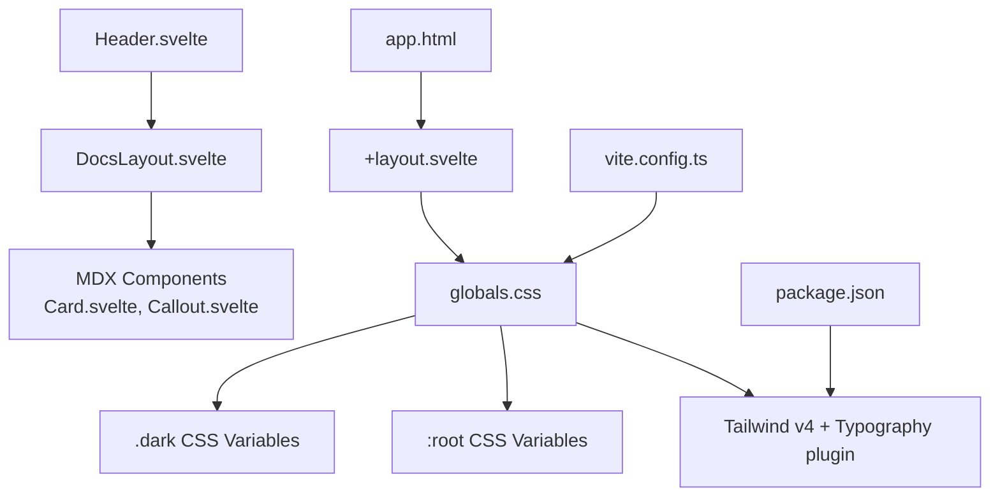
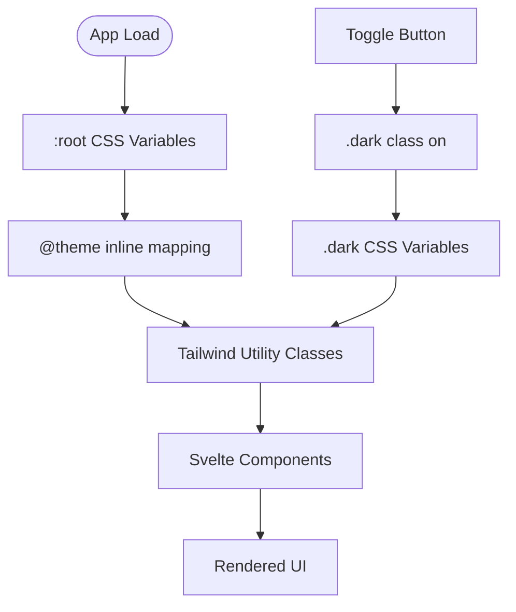
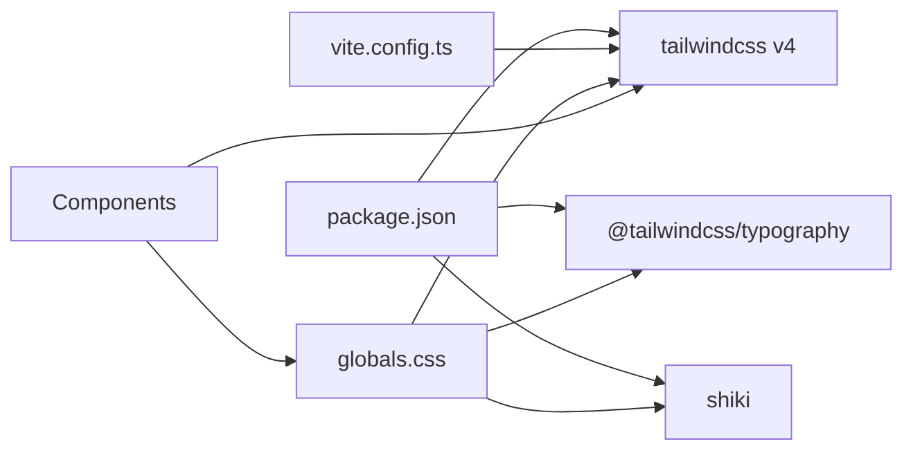
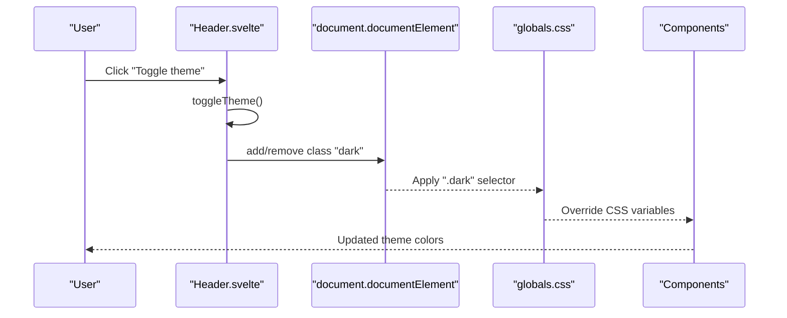
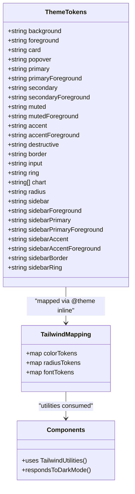

# Theming and Styling

<cite>
**Referenced Files in This Document**
- [globals.css](file://src/lib/styles/globals.css)
- [Header.svelte](file://src/lib/components/Header.svelte)
- [DocsLayout.svelte](file://src/lib/components/DocsLayout.svelte)
- [Card.svelte](file://src/lib/components/mdx/Card.svelte)
- [Callout.svelte](file://src/lib/components/mdx/Callout.svelte)
- [mdx-bundler.ts](file://src/lib/bundler/mdx-bundler.ts)
- [vite.config.ts](file://vite.config.ts)
- [package.json](file://package.json)
- [+layout.svelte](file://src/routes/+layout.svelte)
- [app.html](file://src/app.html)
</cite>

## Table of Contents
1. [Introduction](#introduction)
2. [Project Structure](#project-structure)
3. [Core Components](#core-components)
4. [Architecture Overview](#architecture-overview)
5. [Detailed Component Analysis](#detailed-component-analysis)
6. [Dependency Analysis](#dependency-analysis)
7. [Performance Considerations](#performance-considerations)
8. [Troubleshooting Guide](#troubleshooting-guide)
9. [Conclusion](#conclusion)
10. [Appendices](#appendices)

## Introduction
This document explains how FractalDocs implements theming and styling, focusing on customization and appearance modification. It covers the theme configuration system, CSS variables architecture for consistent styling, dark mode support, and approaches to custom styling. You will learn how to override default styles, create custom themes, integrate with Tailwind CSS, and maintain design consistency across your documentation site. Practical examples include common styling customizations, responsive design patterns, accessibility considerations, performance implications, and best practices for team environments.

## Project Structure
FractalDocs uses a SvelteKit + Vite setup with Tailwind CSS v4 and CSS variables for theming. The global stylesheet defines the theme tokens and base styles, while components apply utility classes that consume these tokens. Dark mode is toggled via a class on the root element.

**Diagram sources**
- [app.html:1-13](file://src/app.html#L1-L13)
- [+layout.svelte:1-8](file://src/routes/+layout.svelte#L1-L8)
- [globals.css:1-179](file://src/lib/styles/globals.css#L1-L179)
- [Header.svelte:1-161](file://src/lib/components/Header.svelte#L1-L161)
- [DocsLayout.svelte:1-105](file://src/lib/components/DocsLayout.svelte#L1-L105)
- [Card.svelte:1-40](file://src/lib/components/mdx/Card.svelte#L1-L40)
- [Callout.svelte:1-65](file://src/lib/components/mdx/Callout.svelte#L1-L65)
- [vite.config.ts:1-35](file://vite.config.ts#L1-L35)
- [package.json:1-49](file://package.json#L1-L49)

**Section sources**
- [globals.css:1-179](file://src/lib/styles/globals.css#L1-L179)
- [vite.config.ts:1-35](file://vite.config.ts#L1-L35)
- [package.json:1-49](file://package.json#L1-L49)
- [+layout.svelte:1-8](file://src/routes/+layout.svelte#L1-L8)
- [app.html:1-13](file://src/app.html#L1-L13)

## Core Components
- Theme token layer: Centralized CSS variables define colors, radii, fonts, and semantic tokens (background, foreground, primary, accent, muted, border, ring, chart series, sidebar). These are exposed to Tailwind utilities via an inline theme mapping.
- Dark mode: A .dark variant overrides the same set of variables, enabling seamless switching without changing component markup.
- Base styles: Global resets and typography enhancements ensure consistent defaults across the app.
- Code highlighting: Shiki is configured to use CSS variables so syntax colors adapt to light/dark themes automatically.

Key responsibilities:
- globals.css: Defines tokens, theme mapping, base layer, and code highlighter variables.
- Header.svelte: Implements the theme toggle by adding/removing the .dark class on the document root.
- DocsLayout.svelte: Applies theme-aware layout using semantic color tokens and responsive utilities.
- MDX components: Use semantic tokens for backgrounds, borders, and text to remain theme-consistent.

**Section sources**
- [globals.css:12-120](file://src/lib/styles/globals.css#L12-L120)
- [globals.css:122-136](file://src/lib/styles/globals.css#L122-L136)
- [globals.css:138-179](file://src/lib/styles/globals.css#L138-L179)
- [Header.svelte:24-31](file://src/lib/components/Header.svelte#L24-L31)
- [DocsLayout.svelte:36-104](file://src/lib/components/DocsLayout.svelte#L36-L104)
- [Card.svelte:17-39](file://src/lib/components/mdx/Card.svelte#L17-L39)
- [Callout.svelte:16-64](file://src/lib/components/mdx/Callout.svelte#L16-L64)

## Architecture Overview
The theming architecture follows a clear separation:
- Tokens: CSS variables under :root and .dark.
- Mapping: Tailwind’s @theme inline maps tokens to utility names (e.g., bg-background, text-foreground).
- Usage: Components use Tailwind utilities; no hard-coded colors.
- Toggle: Runtime class switch on <html> drives theme changes.

**Diagram sources**
- [globals.css:12-120](file://src/lib/styles/globals.css#L12-L120)
- [Header.svelte:24-31](file://src/lib/components/Header.svelte#L24-L31)

## Detailed Component Analysis

### Theme Configuration System
- Token definitions: Semantic variables for background, foreground, cards, popovers, primary/secondary/accent/muted/destructive, borders, inputs, rings, charts, and sidebar elements.
- Radius tokens: Derived from a single --radius variable to keep spacing consistent.
- Font tokens: Headings and monospace fonts mapped to CSS variables.
- Tailwind integration: @theme inline exposes all tokens as Tailwind utilities (e.g., bg-primary, text-muted-foreground, rounded-lg).

How to customize:
- Change any variable under :root or .dark to redefine the theme globally.
- Add new tokens and map them in @theme inline to expose new utilities.

**Section sources**
- [globals.css:12-55](file://src/lib/styles/globals.css#L12-L55)
- [globals.css:57-91](file://src/lib/styles/globals.css#L57-L91)
- [globals.css:93-120](file://src/lib/styles/globals.css#L93-L120)

### CSS Variables Architecture
- Consistency: All colors and radii are defined once as CSS variables and consumed everywhere via Tailwind utilities.
- Extensibility: New semantic tokens can be added and immediately available as utilities.
- Maintainability: Single source of truth reduces duplication and risk of inconsistency.

Best practices:
- Prefer semantic tokens over raw colors.
- Keep hue/saturation/lightness relationships consistent between light and dark variants.
- Use derived radius values to maintain proportional scaling.

**Section sources**
- [globals.css:12-55](file://src/lib/styles/globals.css#L12-L55)
- [globals.css:57-91](file://src/lib/styles/globals.css#L57-L91)
- [globals.css:93-120](file://src/lib/styles/globals.css#L93-L120)

### Dark Mode Support Implementation
- Mechanism: A .dark class on the document root switches CSS variables to dark palette.
- Toggle control: Header button toggles isDarkMode state and updates the class accordingly.
- Content adaptation: Typography and code blocks inherit theme-aware colors automatically.

Implementation highlights:
- Custom variant enables dark: prefix utilities.
- .dark block redefines all semantic tokens.
- Shiki code highlighting uses CSS variables for token colors.

**Section sources**
- [globals.css:10](file://src/lib/styles/globals.css#L10)
- [globals.css:93-120](file://src/lib/styles/globals.css#L93-L120)
- [Header.svelte:24-31](file://src/lib/components/Header.svelte#L24-L31)
- [globals.css:138-179](file://src/lib/styles/globals.css#L138-L179)

### Custom Styling Approaches
- Overriding defaults: Modify variables in :root or .dark to change global appearance.
- Adding new tokens: Define new CSS variables and map them in @theme inline to get new utilities.
- Component-level overrides: Use Tailwind utilities to adjust specific components without touching global styles.
- Typography: Tailwind Typography plugin provides prose classes; base layer rules enhance inline code rendering.

Examples:
- Change primary brand color by updating --primary and --primary-foreground.
- Adjust corner radius globally by modifying --radius.
- Extend sidebar palette by setting --sidebar-* variables.

**Section sources**
- [globals.css:12-55](file://src/lib/styles/globals.css#L12-L55)
- [globals.css:57-91](file://src/lib/styles/globals.css#L57-L91)
- [globals.css:122-136](file://src/lib/styles/globals.css#L122-L136)

### Integrating with Tailwind CSS
- Tailwind v4 is enabled via Vite plugin and imported in globals.css.
- Typography plugin enhances markdown content styling.
- Animation library included for transitions and micro-interactions.

Configuration points:
- vite.config.ts includes the Tailwind plugin.
- package.json lists dependencies for Tailwind v4 and Typography.
- globals.css imports Tailwind and plugins and declares @source paths for dynamic scanning.

**Section sources**
- [vite.config.ts:1-35](file://vite.config.ts#L1-L35)
- [package.json:1-49](file://package.json#L1-L49)
- [globals.css:1-9](file://src/lib/styles/globals.css#L1-L9)

### Responsive Design Patterns
- Layout responsiveness: DocsLayout uses responsive breakpoints to show/hide sidebars and table of contents.
- Header actions: Some labels and hotkeys are hidden on small screens to save space.
- Prose content: Uses responsive typography and spacing through Tailwind utilities.

Practical tips:
- Use sm:, md:, lg: prefixes to tailor layouts per breakpoint.
- Keep interactive elements accessible and visible at smaller sizes.
- Ensure long content scrolls horizontally when necessary (e.g., code blocks).

**Section sources**
- [DocsLayout.svelte:40-104](file://src/lib/components/DocsLayout.svelte#L40-L104)
- [Header.svelte:84-155](file://src/lib/components/Header.svelte#L84-L155)

### Accessibility Considerations
- Contrast: Semantic tokens ensure sufficient contrast in both light and dark modes.
- Focus states: Outline-ring applied globally for keyboard navigation visibility.
- Labels: Theme toggle and GitHub link include aria-label attributes.
- Keyboard shortcuts: Hotkeys for search and AI modal are implemented with proper event handling.

Guidelines:
- Always provide descriptive labels for interactive controls.
- Test focus order and visibility across themes.
- Verify color contrast ratios for all token combinations.

**Section sources**
- [globals.css:122-136](file://src/lib/styles/globals.css#L122-L136)
- [Header.svelte:110-133](file://src/lib/components/Header.svelte#L110-L133)

### Code Highlighting Integration
- Shiki is configured to use css-variables theme, ensuring syntax colors follow CSS variables.
- CSS variables for Shiki tokens are defined in globals.css for both light and dark modes.
- Bundler processes code blocks and injects highlighted HTML into MDX output.

Customization:
- Adjust Shiki token colors by editing the corresponding CSS variables.
- Extend languages/themes by configuring the bundler if needed.

**Section sources**
- [mdx-bundler.ts:48-96](file://src/lib/bundler/mdx-bundler.ts#L48-L96)
- [globals.css:138-179](file://src/lib/styles/globals.css#L138-L179)

### Practical Examples of Common Customizations
- Change brand color: Update --primary and --primary-foreground in :root and .dark.
- Increase corner radius: Modify --radius to scale all derived radius tokens.
- Customize sidebar palette: Set --sidebar*, --sidebar-foreground*, and related variables.
- Adjust prose code style: Edit base layer rules for .prose code to tweak padding, font size, and background.
- Add a new semantic token: Define a new CSS variable and map it in @theme inline to access via Tailwind utilities.

**Section sources**
- [globals.css:57-91](file://src/lib/styles/globals.css#L57-L91)
- [globals.css:93-120](file://src/lib/styles/globals.css#L93-L120)
- [globals.css:122-136](file://src/lib/styles/globals.css#L122-L136)

## Dependency Analysis
Theming depends on:
- Tailwind v4 for utility generation and theme mapping.
- Typography plugin for prose styling.
- Shiki for syntax highlighting with CSS variables.
- Svelte components consuming Tailwind utilities and CSS variables.

**Diagram sources**
- [package.json:1-49](file://package.json#L1-L49)
- [vite.config.ts:1-35](file://vite.config.ts#L1-L35)
- [globals.css:1-9](file://src/lib/styles/globals.css#L1-L9)

**Section sources**
- [package.json:1-49](file://package.json#L1-L49)
- [vite.config.ts:1-35](file://vite.config.ts#L1-L35)
- [globals.css:1-9](file://src/lib/styles/globals.css#L1-L9)

## Performance Considerations
- CSS variable usage avoids heavy recalculations and keeps bundle size minimal.
- Tailwind v4 generates only used utilities based on @source declarations.
- Shiki CSS variables theme reduces runtime overhead compared to precomputed color sets.
- Avoid excessive !important overrides; prefer token-based changes.

Optimization tips:
- Keep @source paths precise to limit scanned files.
- Reuse tokens instead of duplicating styles.
- Monitor CSS bundle size after adding new tokens or overrides.

[No sources needed since this section provides general guidance]

## Troubleshooting Guide
Common issues and resolutions:
- Dark mode not applying: Ensure .dark class is present on <html> and variables are correctly overridden.
- Colors not updating: Confirm tokens are mapped in @theme inline and referenced via Tailwind utilities.
- Code highlighting mismatch: Check Shiki CSS variables and ensure they align with theme tokens.
- Typography anomalies: Inspect base layer rules for prose and inline code.

Debugging steps:
- Inspect computed styles for CSS variables.
- Verify Tailwind scan paths include modified files.
- Validate component class strings for correct token usage.

**Section sources**
- [globals.css:10-120](file://src/lib/styles/globals.css#L10-L120)
- [globals.css:122-136](file://src/lib/styles/globals.css#L122-L136)
- [globals.css:138-179](file://src/lib/styles/globals.css#L138-L179)
- [Header.svelte:24-31](file://src/lib/components/Header.svelte#L24-L31)

## Conclusion
FractalDocs’ theming system centers on CSS variables and Tailwind utilities, providing a robust, extensible foundation for consistent styling and dark mode support. By defining semantic tokens, mapping them to utilities, and leveraging runtime class toggling, teams can customize appearances efficiently while maintaining accessibility and performance. Adopting token-driven styling and following the outlined best practices ensures cohesive design across the documentation site.

[No sources needed since this section summarizes without analyzing specific files]

## Appendices

### Sequence Diagram: Theme Toggle Flow

**Diagram sources**
- [Header.svelte:24-31](file://src/lib/components/Header.svelte#L24-L31)
- [globals.css:93-120](file://src/lib/styles/globals.css#L93-L120)

### Class Diagram: Theme Token Relationships

**Diagram sources**
- [globals.css:12-55](file://src/lib/styles/globals.css#L12-L55)
- [globals.css:57-91](file://src/lib/styles/globals.css#L57-L91)
- [globals.css:93-120](file://src/lib/styles/globals.css#L93-L120)