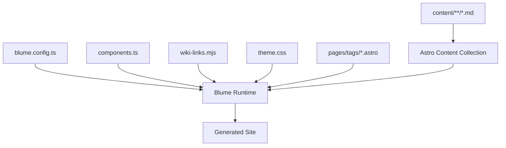
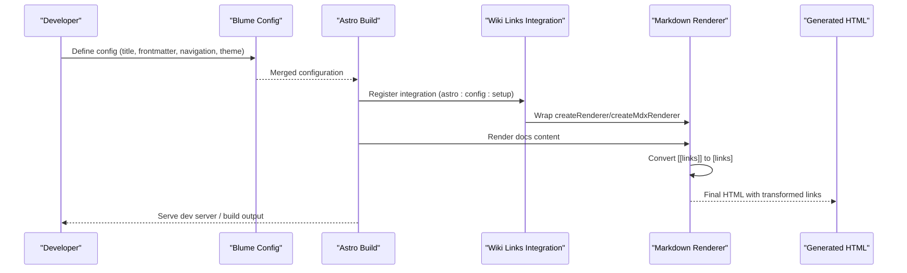
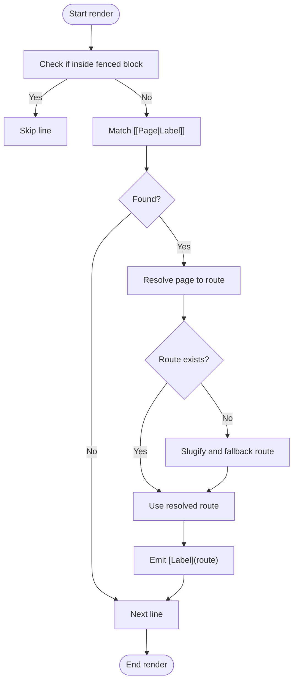
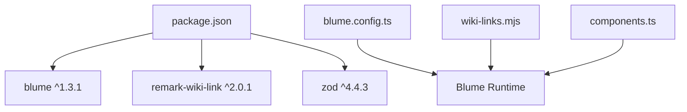

# API Reference

<cite>
**Referenced Files in This Document**
- [blume.config.ts](file://blume.config.ts)
- [components.ts](file://components.ts)
- [wiki-links.mjs](file://wiki-links.mjs)
- [package.json](file://package.json)
- [BLUME-CUSTOMIZATION-BACKEND.md](file://BLUME-CUSTOMIZATION-BACKEND.md)
- [theme.css](file://theme.css)
- [components/Logo.astro](file://components/Logo.astro)
- [components/PageHeader.astro](file://components/PageHeader.astro)
- [pages/tags/index.astro](file://pages/tags/index.astro)
- [pages/tags/[tag].astro](file://pages/tags/[tag].astro)
- [content/Writings/INDEX.md](file://content/Writings/INDEX.md)
- [content/Writings/about.md](file://content/Writings/about.md)
</cite>

## Table of Contents
1. Introduction
2. Project Structure
3. Core Components
4. Architecture Overview
5. Detailed Component Analysis
6. Dependency Analysis
7. Performance Considerations
8. Troubleshooting Guide
9. Conclusion
10. Appendices

## Introduction
This document provides a comprehensive API reference for Fractal Home, focusing on configuration APIs, component interfaces, and extension points. It explains how to configure Blume (frontmatter schema, navigation, theme), override components with props and behavior, extend markdown transformation via the wiki link processor, and integrate external services. It also includes guidance on versioning, backward compatibility, error handling, validation, and debugging tools available to developers extending the platform.

## Project Structure
Fractal Home is an Astro + Blume site that:
- Declares configuration and integrations in blume.config.ts
- Registers component overrides in components.ts
- Extends markdown processing through a custom integration in wiki-links.mjs
- Provides tag pages under pages/tags
- Uses content frontmatter validated by Zod schemas
- Applies global styles and tokens via theme.css

**Diagram sources**
- [blume.config.ts:1-67](file://blume.config.ts#L1-L67)
- [components.ts:1-12](file://components.ts#L1-L12)
- [wiki-links.mjs:1-125](file://wiki-links.mjs#L1-L125)
- [theme.css:72-116](file://theme.css#L72-L116)
- [pages/tags/index.astro:1-74](file://pages/tags/index.astro#L1-L74)
- [pages/tags/[tag].astro:1-61](file://pages/tags/[tag].astro#L1-L61)

**Section sources**
- [blume.config.ts:1-67](file://blume.config.ts#L1-L67)
- [components.ts:1-12](file://components.ts#L1-L12)
- [wiki-links.mjs:1-125](file://wiki-links.mjs#L1-L125)
- [theme.css:72-116](file://theme.css#L72-L116)
- [package.json:1-19](file://package.json#L1-L19)

## Core Components
This section documents the primary extension points and their contracts.

### Blume Configuration API (blume.config.ts)
- Title and description: top-level metadata for the site.
- Integrations: register extensions such as the wiki links processor.
- Frontmatter schema: extend default fields using Zod validators.
- Navigation: define featured items, tabs, and sidebar display mode.
- Theme fonts: declare display/body/mono font families and variants.

Key options exposed by this project’s configuration:
- title: string
- description: string
- integrations: array of integration factories
- frontmatter.extend: object mapping field names to Zod schemas
- navigation.featured: array of { label, href }
- navigation.tabs: array of { label, path }
- navigation.sidebar.display: "flat" | "group" | "page"
- theme.fonts.display.name, fallback, variants
- theme.fonts.body.name, fallback, variants
- theme.fonts.mono: string

Validation rules enforced at build time:
- knowledge-bank: optional array of strings
- tags: optional array of strings
- sources: optional array of strings
- related: optional array of strings
- timestamp: coerced string
- source: optional string
- created: coerced string
- updated: coerced string
- project: optional string
- boss: optional string
- group: optional string
- supergroup: optional string
- links: optional nullable array of objects with url (string) and name (string)

**Section sources**
- [blume.config.ts:1-67](file://blume.config.ts#L1-L67)
- [content/Writings/INDEX.md:1-41](file://content/Writings/INDEX.md#L1-L41)
- [content/Writings/about.md:1-18](file://content/Writings/about.md#L1-L18)

### Component Override Interface (components.ts)
- Exposes defineComponents from Blume to register layout component overrides.
- Current overrides include Logo and PageHeader under the layout namespace.

Override contract highlights:
- Layout components are registered by name and resolved during rendering.
- Components receive props defined by Blume’s internal contracts; see component-specific sections below for concrete props used here.

**Section sources**
- [components.ts:1-12](file://components.ts#L1-L12)

### Wiki Link Processing API (wiki-links.mjs)
- Provides a Blume integration that transforms wiki-style links into Markdown links during rendering.
- Builds a map of page titles and file names to routes by scanning the docs directory.
- Wraps Markdown renderers to convert [[Page|Label]] syntax to [Label](route).
- Falls back to a canonical route pattern when no match is found.

API surface:
- Default export function wikiLinks(options): Integration
  - options.docsRoot?: string — root directory to scan for docs (defaults to docs relative to integration file)
- Hooks:
  - astro:config:setup(updateConfig, config) — builds index, wraps renderer create methods, and updates merged config

Processing behavior:
- Ignores content inside fenced code blocks.
- Supports [[Page]] and [[Page|Label]].
- Resolves case-insensitive matches.
- Slugifies unknown targets to a fallback route.

**Section sources**
- [wiki-links.mjs:1-125](file://wiki-links.mjs#L1-L125)

### Tag Pages API (pages/tags/index.astro and pages/tags/[tag].astro)
- Index page aggregates all tags across the docs collection and groups them alphabetically.
- Dynamic tag page lists entries tagged with a specific tag, sorted by title.

Data flow:
- Reads data.routes and getCollection("docs") to compute tag maps.
- Filters out non-indexable or hidden entries.
- Renders RootLayout with computed headings and tag metadata.

Props passed to RootLayout:
- site: { title, description }
- logo: from config
- banner: from config
- navigation: from config
- page: { title, route }
- headings: array of heading descriptors
- themeMode: from config.theme.mode
- searchEnabled: from config.search.enabled
- indexable: boolean

**Section sources**
- [pages/tags/index.astro:1-74](file://pages/tags/index.astro#L1-L74)
- [pages/tags/[tag].astro:1-61](file://pages/tags/[tag].astro#L1-L61)

### Component Interfaces: Logo and PageHeader
- Logo.astro
  - Props: site ({ title }), logo? ({ text } | null)
  - Behavior: renders brand motif and wordmark images; toggles light/dark variants via CSS classes.
- PageHeader.astro
  - Props: page ({ title, route })
  - Behavior: resolves current route entry from blume:data and docs collection; renders tag pills linking to /tags/{tag}.

Lifecycle hooks:
- These are Astro components; they execute during rendering and do not expose explicit lifecycle hooks beyond standard Astro lifecycles.

Styling:
- Controlled via theme.css and Tailwind utility classes.

**Section sources**
- [components/Logo.astro:1-48](file://components/Logo.astro#L1-L48)
- [components/PageHeader.astro:1-31](file://components/PageHeader.astro#L1-L31)
- [theme.css:72-116](file://theme.css#L72-L116)

## Architecture Overview
The system integrates configuration, component overrides, and markdown processing to produce a navigable documentation site with tag-based indexing and wiki-link support.

**Diagram sources**
- [blume.config.ts:1-67](file://blume.config.ts#L1-L67)
- [wiki-links.mjs:79-125](file://wiki-links.mjs#L79-L125)

## Detailed Component Analysis

### Blume Configuration API
- Purpose: Centralize site metadata, content schema validation, navigation structure, and theme settings.
- Validation: Zod schemas enforce types and constraints for frontmatter fields.
- Extensibility: Integrations array allows adding processors like wiki-links.

Common patterns:
- Use frontmatter.extend to add new fields with strict typing.
- Configure navigation to control tabs and sidebar grouping.
- Define fonts to ensure consistent typography across themes.

Backward compatibility:
- Optional fields allow gradual adoption of new frontmatter keys.
- Coercion for date-like strings ensures robust parsing.

**Section sources**
- [blume.config.ts:1-67](file://blume.config.ts#L1-L67)

### Component Overrides API
- Purpose: Replace default Blume components with custom implementations while preserving expected props and behavior.
- Registration: Use defineComponents(layout: Record<string, AstroComponent>) to map component names.
- Styling: Prefer theme.css tokens for global changes; use overrides only when markup must change.

Best practices:
- Keep accessibility attributes intact.
- Preserve navigation data attributes when overriding interactive elements.
- Test both light and dark modes.

**Section sources**
- [components.ts:1-12](file://components.ts#L1-L12)
- [BLUME-CUSTOMIZATION-BACKEND.md:1-524](file://BLUME-CUSTOMIZATION-BACKEND.md#L1-L524)

### Wiki Link Processing API
- Purpose: Transform wiki-style links into standard Markdown links during rendering.
- Hook: astro:config:setup to wrap renderers and update merged config.
- Map building: Scans docs directory to associate titles and filenames with routes.

Algorithm overview:

**Diagram sources**
- [wiki-links.mjs:50-77](file://wiki-links.mjs#L50-L77)
- [wiki-links.mjs:23-48](file://wiki-links.mjs#L23-L48)

**Section sources**
- [wiki-links.mjs:1-125](file://wiki-links.mjs#L1-L125)

### Tag Pages API
- Purpose: Provide tag aggregation and per-tag listing pages.
- Data sources: blume:data.routes and Astro content collection.
- Filtering: Skips non-indexable or hidden entries.

Rendering details:
- Index page groups tags alphabetically and displays counts.
- Per-tag page sorts entries by title and shows descriptions.

Integration with Blume:
- Passes site, logo, banner, navigation, page, headings, themeMode, searchEnabled, and indexable to RootLayout.

**Section sources**
- [pages/tags/index.astro:1-74](file://pages/tags/index.astro#L1-L74)
- [pages/tags/[tag].astro:1-61](file://pages/tags/[tag].astro#L1-L61)

### Component Interfaces: Logo and PageHeader
- Logo.astro
  - Props: site.title, logo.text (optional)
  - Behavior: Renders brand assets; uses CSS to toggle light/dark wordmarks.
- PageHeader.astro
  - Props: page.title, page.route
  - Behavior: Fetches current entry via blume:data and docs collection; renders tag pills.

Styling and accessibility:
- Uses semantic anchors and aria-labels where appropriate.
- Relies on theme.css tokens for consistent colors and focus states.

**Section sources**
- [components/Logo.astro:1-48](file://components/Logo.astro#L1-L48)
- [components/PageHeader.astro:1-31](file://components/PageHeader.astro#L1-L31)
- [theme.css:72-116](file://theme.css#L72-L116)

## Dependency Analysis
External dependencies and scripts:
- blume: ^1.3.1 — core framework and runtime
- remark-wiki-link: ^2.0.1 — dependency present but not used by the custom wiki-links integration
- zod: ^4.4.3 — schema validation for frontmatter

Scripts:
- dev, build, preview, check, validate, doctor — provided by Blume CLI

**Diagram sources**
- [package.json:1-19](file://package.json#L1-L19)
- [blume.config.ts:1-67](file://blume.config.ts#L1-L67)
- [wiki-links.mjs:1-125](file://wiki-links.mjs#L1-L125)
- [components.ts:1-12](file://components.ts#L1-L12)

**Section sources**
- [package.json:1-19](file://package.json#L1-L19)

## Performance Considerations
- Wiki link map construction scans the docs directory synchronously during setup; keep the docs tree reasonably sized to avoid long build times.
- Avoid excessive nested groups in navigation to reduce DOM complexity.
- Prefer CSS token overrides over heavy component rewrites to minimize rebuild overhead.
- Use lazy loading for images where appropriate (already applied in Logo.astro for performance).

[No sources needed since this section provides general guidance]

## Troubleshooting Guide
Common issues and resolutions:
- Frontmatter validation errors: Ensure all fields conform to Zod schemas defined in blume.config.ts. Missing or invalid types will cause build failures.
- Wiki links not resolving: Verify that titles and filenames exist in the docs directory; the resolver is case-insensitive and falls back to slugified routes.
- Tag pages missing entries: Confirm entries are indexable and not marked as hidden in sidebar configuration.
- Component overrides not applied: Ensure components are registered in components.ts and that prop shapes match Blume’s expectations.

Debugging tools:
- blume check: Validates configuration and components.
- blume validate: Runs additional validations against content and routes.
- blume doctor: Diagnoses environment and dependency issues.
- Local development: Use blume dev to iterate quickly and inspect rendered output.

**Section sources**
- [package.json:1-19](file://package.json#L1-L19)
- [BLUME-CUSTOMIZATION-BACKEND.md:507-524](file://BLUME-CUSTOMIZATION-BACKEND.md#L507-L524)

## Conclusion
Fractal Home leverages Blume’s configuration and component override APIs to provide a flexible, extensible documentation site. The wiki link integration enhances authoring ergonomics, while Zod-based frontmatter validation ensures data integrity. By following the documented patterns and using the provided debugging tools, developers can customize behavior, style, and content processing effectively.

[No sources needed since this section summarizes without analyzing specific files]

## Appendices

### Versioning and Migration Notes
- Blume version: ^1.3.1 — pin major versions to maintain stability; review changelogs before upgrading.
- Zod version: ^4.4.3 — schema definitions should align with the installed version; breaking changes may require updating validators.
- Backward compatibility:
  - Optional frontmatter fields allow incremental adoption.
  - Component overrides should preserve existing props and attributes to avoid regressions.
- Migration checklist:
  - Update package versions and run blume check and blume validate.
  - Re-test tag pages and wiki link resolution after upgrades.
  - Validate theme tokens and component overrides in both light and dark modes.

[No sources needed since this section provides general guidance]