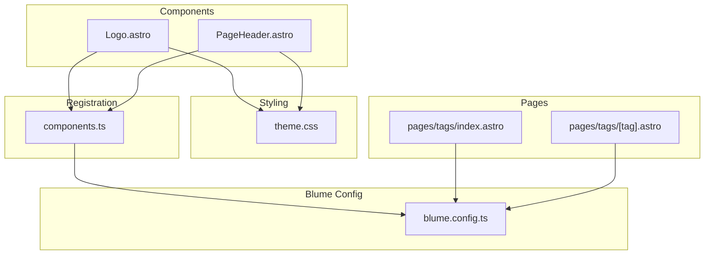
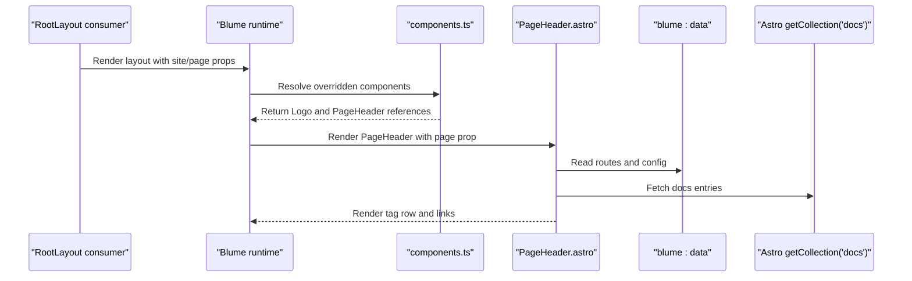
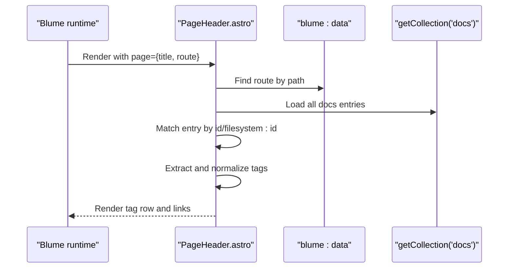
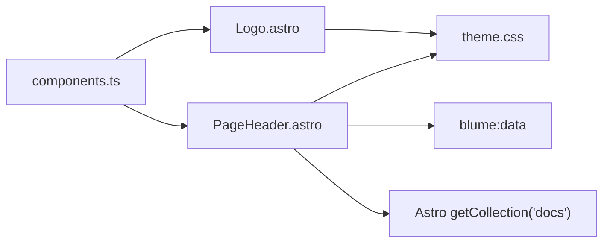

# Component APIs

<cite>
**Referenced Files in This Document**
- [components.ts](file://components.ts)
- [Logo.astro](file://components/Logo.astro)
- [PageHeader.astro](file://components/PageHeader.astro)
- [blume.config.ts](file://blume.config.ts)
- [theme.css](file://theme.css)
- [BLUME-CUSTOMIZATION-BACKEND.md](file://BLUME-CUSTOMIZATION-BACKEND.md)
- [package.json](file://package.json)
- [pages/tags/index.astro](file://pages/tags/index.astro)
- [pages/tags/[tag].astro](file://pages/tags/[tag].astro)
</cite>

## Table of Contents
1. [Introduction](#introduction)
2. [Project Structure](#project-structure)
3. [Core Components](#core-components)
4. [Architecture Overview](#architecture-overview)
5. [Detailed Component Analysis](#detailed-component-analysis)
6. [Dependency Analysis](#dependency-analysis)
7. [Performance Considerations](#performance-considerations)
8. [Troubleshooting Guide](#troubleshooting-guide)
9. [Conclusion](#conclusion)
10. [Appendices](#appendices)

## Introduction
This document provides detailed API documentation for Fractal Home’s custom Astro components built on Blume. It focuses on:
- Logo component interface, props, styling options, and integration patterns
- PageHeader component with tag display functionality, data flow, and customization
- The component registration system in components.ts for overriding defaults and extending functionality
- Practical usage examples, prop validation, slot patterns, and lifecycle considerations
- Accessibility, responsive design, and performance optimization techniques

The project uses Blume as the framework layer, Astro for component rendering, and Tailwind-like utility classes via theme.css. Custom components are registered through a central configuration to override Blume’s default layout components.

## Project Structure
At a high level, custom components live under components/, while their registration is centralized in components.ts. Styling tokens and overrides are defined in theme.css. Blume configuration (including frontmatter schema and navigation) is declared in blume.config.ts. Pages demonstrate how Blume’s RootLayout consumes site metadata and page context, which drives the behavior of custom components like PageHeader.



**Diagram sources**
- [components.ts:1-11](file://components.ts#L1-L11)
- [Logo.astro:1-48](file://components/Logo.astro#L1-L48)
- [PageHeader.astro:1-31](file://components/PageHeader.astro#L1-L31)
- [blume.config.ts:1-67](file://blume.config.ts#L1-L67)
- [theme.css:1-200](file://theme.css#L1-L200)
- [pages/tags/index.astro:1-74](file://pages/tags/index.astro#L1-L74)
- [pages/tags/[tag].astro](file://pages/tags/[tag].astro#L1-L60)

**Section sources**
- [components.ts:1-11](file://components.ts#L1-L11)
- [blume.config.ts:1-67](file://blume.config.ts#L1-L67)
- [theme.css:1-200](file://theme.css#L1-L200)
- [pages/tags/index.astro:1-74](file://pages/tags/index.astro#L1-L74)
- [pages/tags/[tag].astro:1-L60](file://pages/tags/[tag].astro#L1-L60)

## Core Components
- Logo: A brand lockup component that renders a motif and split-color wordmark images, adapting to light/dark themes via CSS selectors. It receives site metadata and optional logo text via props.
- PageHeader: Displays contextual tags derived from Blume’s route and content collection, generating links to tag pages. It integrates with Blume’s data layer and Astro’s content APIs.

Key responsibilities:
- Logo: Provide accessible branding with appropriate labels and theme-aware visuals.
- PageHeader: Surface tags associated with the current page and link to tag index pages.

**Section sources**
- [Logo.astro:1-48](file://components/Logo.astro#L1-L48)
- [PageHeader.astro:1-31](file://components/PageHeader.astro#L1-L31)

## Architecture Overview
Custom components are registered via Blume’s defineComponents API. When Blume renders layouts, it substitutes its default components with the provided implementations. Pages pass site and page context to RootLayout, which then composes Header, Sidebar, TOC, and other regions. PageHeader reads Blume’s routes and content collections to render tags.



**Diagram sources**
- [components.ts:1-11](file://components.ts#L1-L11)
- [PageHeader.astro:1-31](file://components/PageHeader.astro#L1-L31)
- [blume.config.ts:1-67](file://blume.config.ts#L1-L67)

## Detailed Component Analysis

### Logo Component API
Props:
- site: object with title string used for accessibility labeling
- logo: optional object with an optional text field; can be null

Behavior:
- Renders a home anchor with aria-label combining site.title and “home”
- Displays a motif image and two wordmark images (light/dark variants)
- Uses eager loading and async decoding for performance
- Theme switching handled by CSS toggling visibility based on data-theme

Accessibility:
- Motif image has empty alt (decorative)
- Wordmark images have meaningful alt for the site title or aria-hidden when decorative
- Anchor includes descriptive aria-label

Styling:
- Light mode shows dark wordmark; dark mode shows white wordmark
- Hover rotation animation on motif
- Responsive sizing via utility classes

Integration:
- Consumed by Blume’s header region when registered in components.ts
- Works with theme.css token-based color scheme

Usage example (conceptual):
- Pass site.title from Blume config
- Optionally pass logo.text if needed by downstream logic

**Section sources**
- [Logo.astro:1-48](file://components/Logo.astro#L1-L48)
- [theme.css:100-116](file://theme.css#L100-L116)
- [components.ts:1-11](file://components.ts#L1-L11)

#### Logo Class Diagram
```mermaid
classDiagram
class Logo {
+site : { title : string }
+logo? : { text? : string } | null
+render()
}
```

**Diagram sources**
- [Logo.astro:6-12](file://components/Logo.astro#L6-L12)

### PageHeader Component API
Props:
- page: object with title and route strings

Behavior:
- Reads Blume’s routes to find the matching route for page.route
- Fetches docs collection and locates the entry by id or filesystem:id
- Extracts tags from entry.data.tags, trims whitespace, filters empties
- Conditionally renders a tag row with label and pill links to /tags/{slug}

Data flow:
- blume:data provides routes and config
- Astro getCollection("docs") retrieves content entries
- Tag links use encodeURIComponent for safe URLs

Event handling:
- No explicit event handlers; relies on native anchor click navigation

Customization:
- Replace via components.ts to change markup or add features
- Style via theme.css using .fh-tag-row, .fh-tag-label, .fh-tag-pill

Accessibility:
- Semantic list of links for tags
- Ensure sufficient contrast with theme tokens

**Section sources**
- [PageHeader.astro:1-31](file://components/PageHeader.astro#L1-L31)
- [pages/tags/index.astro:1-74](file://pages/tags/index.astro#L1-L74)
- [pages/tags/[tag].astro:1-L60](file://pages/tags/[tag].astro#L1-L60)

#### PageHeader Sequence Diagram


**Diagram sources**
- [PageHeader.astro:1-31](file://components/PageHeader.astro#L1-L31)

### Component Registration System (components.ts)
Purpose:
- Override Blume’s default layout components with custom Astro components
- Centralize component mapping for maintainability

How to override:
- Import your Astro component files
- Export a default module calling defineComponents with layout mappings
- Map keys such as Logo, PageHeader to your implementations

Extending functionality:
- Add new components to the layout map
- Keep existing Blume attributes and data bindings intact when overriding complex components

Creating custom implementations:
- Follow Blume’s expected props and data contracts
- Preserve accessibility attributes and navigation data attributes
- Use theme tokens for consistent styling

Example structure:
- Import Logo and PageHeader
- Register them under layout key

**Section sources**
- [components.ts:1-11](file://components.ts#L1-L11)
- [BLUME-CUSTOMIZATION-BACKEND.md:460-505](file://BLUME-CUSTOMIZATION-BACKEND.md#L460-L505)

## Dependency Analysis
Component dependencies and relationships:
- components.ts imports and registers Logo and PageHeader
- PageHeader depends on blume:data and Astro content APIs
- Both components rely on theme.css for visual tokens and theme switching
- Pages consume Blume’s RootLayout and pass site/page context that influences component behavior



**Diagram sources**
- [components.ts:1-11](file://components.ts#L1-L11)
- [PageHeader.astro:1-31](file://components/PageHeader.astro#L1-L31)
- [theme.css:1-200](file://theme.css#L1-L200)

**Section sources**
- [components.ts:1-11](file://components.ts#L1-L11)
- [PageHeader.astro:1-31](file://components/PageHeader.astro#L1-L31)
- [theme.css:1-200](file://theme.css#L1-L200)

## Performance Considerations
- Image loading: Logo uses eager loading and async decoding for critical branding assets
- Content fetching: PageHeader fetches all docs entries; consider caching or filtering if the collection grows large
- CSS transitions: Minimal animations with short durations to avoid jank
- Token-driven styling: Using theme tokens avoids hard-coded colors and reduces repaint costs across themes
- Avoid unnecessary re-renders: Keep component logic pure and side-effect free where possible

[No sources needed since this section provides general guidance]

## Troubleshooting Guide
Common issues and resolutions:
- Tags not displaying: Ensure the route matches a valid entry with tags in frontmatter; verify getCollection returns expected entries
- Theme mismatch: Confirm theme.css toggles for wordmark images and tokens are applied correctly
- Component not overriding: Check components.ts mapping and ensure Blume recognizes the override keys
- Accessibility warnings: Validate aria-labels and alt attributes; ensure focus-visible styles are present

**Section sources**
- [PageHeader.astro:1-31](file://components/PageHeader.astro#L1-L31)
- [theme.css:100-116](file://theme.css#L100-L116)
- [components.ts:1-11](file://components.ts#L1-L11)

## Conclusion
Fractal Home’s custom components integrate seamlessly with Blume’s layout system. Logo provides accessible branding with theme-aware visuals, while PageHeader surfaces contextual tags using Blume’s data layer and Astro’s content APIs. The registration system in components.ts enables straightforward overrides and extensions. Adhering to theme tokens, accessibility best practices, and performance guidelines ensures a robust and maintainable component ecosystem.

[No sources needed since this section summarizes without analyzing specific files]

## Appendices

### Practical Usage Examples
- Passing site metadata to RootLayout and consuming it in Logo
- Rendering PageHeader within a page context that includes route information
- Creating tag links that navigate to /tags/{slug} pages

[No sources needed since this section provides general guidance]

### Prop Validation and Types
- Logo Props: site.title required; logo.text optional
- PageHeader Props: page.title and page.route required
- Frontmatter schema extended in blume.config.ts supports tags array

**Section sources**
- [Logo.astro:6-12](file://components/Logo.astro#L6-L12)
- [PageHeader.astro:5-8](file://components/PageHeader.astro#L5-L8)
- [blume.config.ts:9-25](file://blume.config.ts#L9-L25)

### Slot Patterns and Lifecycle Methods
- Astro components do not use traditional slots; content projection is achieved via props and composition
- Lifecycle methods are implicit in Astro’s build-time rendering; no client-side lifecycle hooks are used in these components

[No sources needed since this section provides general guidance]

### Integration with Blume’s Data Layer
- blume:data provides routes and configuration consumed by PageHeader
- getCollection("docs") retrieves content entries for tag extraction
- RootLayout passes site and page context influencing component behavior

**Section sources**
- [PageHeader.astro:1-31](file://components/PageHeader.astro#L1-L31)
- [pages/tags/index.astro:1-74](file://pages/tags/index.astro#L1-L74)
- [pages/tags/[tag].astro:1-L60](file://pages/tags/[tag].astro#L1-L60)

### Accessibility Considerations
- Descriptive aria-labels on anchors
- Meaningful alt attributes for images
- Focus-visible styles for interactive elements
- Semantic HTML structure for tags and lists

**Section sources**
- [Logo.astro:14-47](file://components/Logo.astro#L14-L47)
- [theme.css:76-87](file://theme.css#L76-L87)

### Responsive Design Patterns
- Utility classes control sizing and spacing
- Theme tokens adapt colors and shadows across modes
- Images use width/height attributes for layout stability

**Section sources**
- [Logo.astro:19-46](file://components/Logo.astro#L19-L46)
- [theme.css:12-61](file://theme.css#L12-L61)

### Performance Optimization Techniques
- Eager loading and async decoding for critical images
- Minimal JavaScript and reliance on static rendering
- Efficient tag extraction with early filtering

**Section sources**
- [Logo.astro:19-46](file://components/Logo.astro#L19-L46)
- [PageHeader.astro:11-15](file://components/PageHeader.astro#L11-L15)

### Package Dependencies
- Blume framework version and utilities
- Remark wiki-link integration for content processing
- Zod for schema validation

**Section sources**
- [package.json:1-19](file://package.json#L1-L19)
- [blume.config.ts:1-67](file://blume.config.ts#L1-L67)