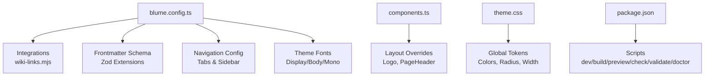
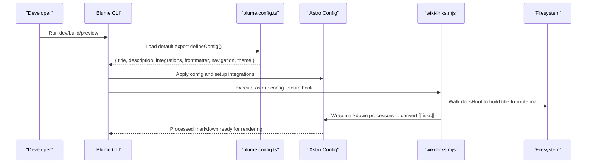
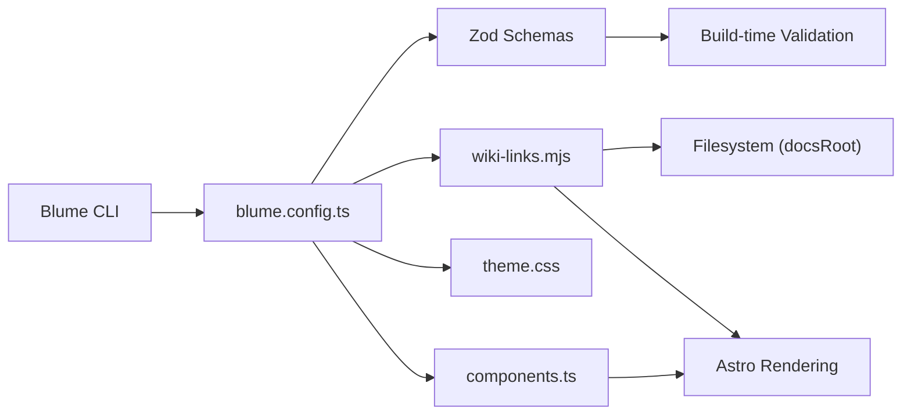

# Configuration API

<cite>
**Referenced Files in This Document**
- [blume.config.ts](file://blume.config.ts)
- [wiki-links.mjs](file://wiki-links.mjs)
- [components.ts](file://components.ts)
- [theme.css](file://theme.css)
- [package.json](file://package.json)
- [BLUME-CUSTOMIZATION-BACKEND.md](file://BLUME-CUSTOMIZATION-BACKEND.md)
- [content/Writings/INDEX.md](file://content/Writings/INDEX.md)
- [content/Archaeology/INDEX.md](file://content/Archaeology/INDEX.md)
- [pages/tags/index.astro](file://pages/tags/index.astro)
</cite>

## Table of Contents
1. [Introduction](#introduction)
2. [Project Structure](#project-structure)
3. [Core Components](#core-components)
4. [Architecture Overview](#architecture-overview)
5. [Detailed Component Analysis](#detailed-component-analysis)
6. [Dependency Analysis](#dependency-analysis)
7. [Performance Considerations](#performance-considerations)
8. [Troubleshooting Guide](#troubleshooting-guide)
9. [Conclusion](#conclusion)
10. [Appendices](#appendices)

## Introduction
This document provides a comprehensive configuration API reference for Fractal Home’s Blume-based site, focusing on the Blume configuration system. It explains how to configure site metadata, integrations (including the wikiLinks plugin), frontmatter schema extensions with Zod validation, navigation structure (tabs and sidebar), and theme customization including fonts. It also includes practical examples, runtime behavior, error handling considerations, and best practices for maintaining configuration across environments.

## Project Structure
The configuration surface is primarily defined in:
- blume.config.ts: Central Blume configuration (site metadata, integrations, frontmatter schema, navigation, theme).
- components.ts: Registered component overrides for layout elements.
- theme.css: Global visual tokens and CSS overrides that complement Blume’s theme configuration.
- package.json: Scripts and dependencies used by Blume and related tooling.

**Diagram sources**
- [blume.config.ts:1-67](file://blume.config.ts#L1-L67)
- [wiki-links.mjs:1-125](file://wiki-links.mjs#L1-L125)
- [components.ts:1-12](file://components.ts#L1-L12)
- [theme.css:1-673](file://theme.css#L1-L673)
- [package.json:1-19](file://package.json#L1-L19)

**Section sources**
- [blume.config.ts:1-67](file://blume.config.ts#L1-L67)
- [components.ts:1-12](file://components.ts#L1-L12)
- [theme.css:1-673](file://theme.css#L1-L673)
- [package.json:1-19](file://package.json#L1-L19)

## Core Components
- Site metadata: title and description are configured at the top level of the Blume config.
- Integrations: The wikiLinks integration is registered to transform wiki-style links during markdown processing.
- Frontmatter schema: Extended via Zod to validate and coerce custom fields such as tags, sources, related, timestamps, project/group/supergroup, and links.
- Navigation: Tabs and featured items are defined; sidebar display mode can be set to flat, group, or page.
- Theme fonts: Display, body, and mono fonts are configured with variants and fallbacks.

Practical usage patterns:
- Customizing navigation tabs and featured links.
- Extending frontmatter for new content types using Zod schemas.
- Configuring theme fonts with local webfont files.

**Section sources**
- [blume.config.ts:5-35](file://blume.config.ts#L5-L35)
- [blume.config.ts:37-65](file://blume.config.ts#L37-L65)
- [wiki-links.mjs:79-124](file://wiki-links.mjs#L79-L124)

## Architecture Overview
Blume reads blume.config.ts at build time to assemble the site configuration, register integrations, and apply theme settings. The wikiLinks integration hooks into Astro’s markdown processor to convert wiki-style links into standard Markdown links based on a prebuilt map of documents.

**Diagram sources**
- [blume.config.ts:1-67](file://blume.config.ts#L1-L67)
- [wiki-links.mjs:84-121](file://wiki-links.mjs#L84-L121)

## Detailed Component Analysis

### Site Metadata
- Fields:
  - title: string — Site name displayed in header and meta.
  - description: string — Site description used in meta and UI.
- Purpose: Establishes identity and SEO metadata for the site.
- Validation: Provided by Blume’s config loader; ensure values are non-empty strings.
- Defaults: Not specified in this project; provide explicit values.

Example usage:
- Set title to your site name and description to a concise summary.

**Section sources**
- [blume.config.ts:5-8](file://blume.config.ts#L5-L8)

### Integrations: wikiLinks Plugin
- Purpose: Converts wiki-style double-bracket links like [[Page Name]] into standard Markdown links based on a prebuilt index of documents.
- Behavior:
  - Scans the docs directory tree to build a map from titles and filenames to routes.
  - Wraps markdown renderers to replace wiki links outside code fences.
  - Falls back to a slugified route when no exact match is found.
- Configuration:
  - docsRoot defaults to the docs folder relative to the integration file.
- Runtime impact:
  - Ensures internal linking consistency without manual URL maintenance.
  - Ignores content inside fenced code blocks to avoid false positives.

Common pitfalls:
- Ensure titles in frontmatter match expected casing; the resolver normalizes to lowercase.
- Keep doc filenames consistent; the map also uses filename slugs.

**Section sources**
- [wiki-links.mjs:23-48](file://wiki-links.mjs#L23-L48)
- [wiki-links.mjs:50-77](file://wiki-links.mjs#L50-L77)
- [wiki-links.mjs:79-124](file://wiki-links.mjs#L79-L124)

### Frontmatter Schema Extensions (Zod)
- Purpose: Validate and coerce custom frontmatter fields for pages and collections.
- Supported fields (all optional unless noted):
  - knowledge-bank: array of strings
  - tags: array of strings
  - sources: array of strings
  - related: array of strings
  - timestamp: coerced string
  - source: string
  - created: coerced string
  - updated: coerced string
  - project: string
  - boss: string
  - group: string
  - supergroup: string
  - links: nullable array of objects with url (string) and name (string)
- Validation rules:
  - Arrays must contain strings; objects must have required properties.
  - Coercion applied to timestamp, created, updated to ensure string compatibility.
- Usage:
  - Add these fields to any content file’s frontmatter; invalid data will fail validation at build time.

Examples:
- Use tags to categorize content and power tag pages.
- Use sources to track provenance for academic content.
- Use links to attach external references with labels.

**Section sources**
- [blume.config.ts:9-25](file://blume.config.ts#L9-L25)
- [content/Writings/INDEX.md:1-15](file://content/Writings/INDEX.md#L1-L15)
- [content/Archaeology/INDEX.md:1-61](file://content/Archaeology/INDEX.md#L1-L61)

### Navigation Configuration
- Tabs:
  - Define label and path for each tab in the header navigation.
- Featured:
  - Provide highlighted entries (e.g., Tags) shown prominently.
- Sidebar:
  - display controls grouping behavior: "flat", "group", or "page".
- Impact:
  - Tabs appear in the header; featured items influence prominent links.
  - Sidebar display affects how content sections are presented.

Best practices:
- Keep labels user-friendly and paths stable.
- Use group/supergroup in frontmatter to organize hierarchical navigation.

**Section sources**
- [blume.config.ts:26-35](file://blume.config.ts#L26-L35)

### Theme Customization: Fonts
- Fields:
  - theme.fonts.display: object with name, fallback, and variants (src, weight, style).
  - theme.fonts.body: same structure as display.
  - theme.fonts.mono: string specifying monospace font family.
- Variants:
  - Each variant specifies src (path to woff2), weight range, and optional style (italic).
- Fallbacks:
  - Provide sensible fallbacks (e.g., sans, serif, monospace) to ensure readability.
- Practical example:
  - Configure Funnel Sans for display and body with variable weights and italic variants; use IBM Plex Mono for code.

Notes:
- Paths should point to static assets under public/webfonts.
- Ensure font files exist and are correctly referenced.

**Section sources**
- [blume.config.ts:37-65](file://blume.config.ts#L37-L65)

### Component Overrides
- Purpose: Replace default Blume components with custom Astro components.
- Current overrides:
  - layout.Logo
  - layout.PageHeader
- How it works:
  - components.ts exports defineComponents with a layout mapping.
  - Blume consumes these overrides during rendering.

Guidelines:
- Keep markup compatible with Blume’s expectations.
- Preserve accessibility attributes and data bindings.

**Section sources**
- [components.ts:1-12](file://components.ts#L1-L12)

### Tag Pages and Frontmatter Integration
- Tag aggregation:
  - pages/tags/index.astro collects tags from all indexable entries and groups them alphabetically.
- Frontmatter dependency:
  - Relies on entry.data.tags being present and valid per the Zod schema.

Behavior:
- Entries marked hidden in sidebar are excluded from tag aggregation.
- Tags are normalized to lowercase slugs for consistent indexing.

**Section sources**
- [pages/tags/index.astro:1-36](file://pages/tags/index.astro#L1-L36)

## Dependency Analysis
Blume orchestrates configuration loading, integration setup, and theme application. The wikiLinks integration depends on filesystem access to build a route map and wraps Astro’s markdown processor. Zod validates frontmatter at build time.

**Diagram sources**
- [blume.config.ts:1-67](file://blume.config.ts#L1-L67)
- [wiki-links.mjs:1-125](file://wiki-links.mjs#L1-L125)
- [components.ts:1-12](file://components.ts#L1-L12)
- [theme.css:1-673](file://theme.css#L1-L673)

**Section sources**
- [package.json:1-19](file://package.json#L1-L19)
- [blume.config.ts:1-67](file://blume.config.ts#L1-L67)

## Performance Considerations
- wikiLinks map construction:
  - Scans the entire docsRoot at startup; large directories may increase build time.
  - Optimization tip: Keep doc titles unique and avoid excessive nested folders if possible.
- Font loading:
  - Variable fonts reduce HTTP requests; ensure correct weight ranges and styles.
- Frontmatter validation:
  - Zod runs at build time; keep schemas minimal and avoid heavy computations.

[No sources needed since this section provides general guidance]

## Troubleshooting Guide
Common issues and resolutions:
- Invalid frontmatter:
  - Symptom: Build fails due to Zod validation errors.
  - Resolution: Ensure fields match the schema types; use coercion where applicable.
- Wiki links not resolving:
  - Symptom: Links fall back to slugified routes or remain unresolved.
  - Resolution: Verify titles in frontmatter match link text; check docsRoot path.
- Fonts not loading:
  - Symptom: Fallback fonts appear instead of configured ones.
  - Resolution: Confirm src paths point to existing files in public/webfonts; verify CORS if hosted remotely.
- Navigation not updating:
  - Symptom: Tabs or sidebar do not reflect changes.
  - Resolution: Rebuild after editing blume.config.ts; clear caches if necessary.

Operational tips:
- Use scripts in package.json for development and validation workflows.
- Follow the customization guide to avoid editing generated files.

**Section sources**
- [package.json:1-19](file://package.json#L1-L19)
- [BLUME-CUSTOMIZATION-BACKEND.md:1-28](file://BLUME-CUSTOMIZATION-BACKEND.md#L1-L28)

## Conclusion
Fractal Home’s Blume configuration provides a robust, extensible foundation for managing site metadata, integrations, frontmatter validation, navigation, and theme fonts. By leveraging Zod for schema enforcement and the wikiLinks integration for seamless internal linking, you can maintain a scalable knowledge base with strong developer ergonomics. Adhering to best practices ensures reliable builds and predictable runtime behavior across environments.

[No sources needed since this section summarizes without analyzing specific files]

## Appendices

### Practical Examples

- Customizing navigation structure:
  - Add or modify tabs in navigation.tabs with label and path.
  - Use navigation.featured to highlight key pages like Tags.
  - Adjust navigation.sidebar.display to control grouping behavior.

- Extending frontmatter schemas for new content types:
  - Add new fields in frontmatter.extend with appropriate Zod validators.
  - Populate fields in content files’ frontmatter to enable features like tagging and sourcing.

- Configuring theme fonts:
  - Specify display and body fonts with variants pointing to local woff2 files.
  - Set mono font for code blocks and inline code.

- Maintaining configuration across environments:
  - Keep environment-specific values out of version control; use Blume’s environment handling where applicable.
  - Validate configurations locally before deploying to production.

**Section sources**
- [blume.config.ts:26-35](file://blume.config.ts#L26-L35)
- [blume.config.ts:9-25](file://blume.config.ts#L9-L25)
- [blume.config.ts:37-65](file://blume.config.ts#L37-L65)