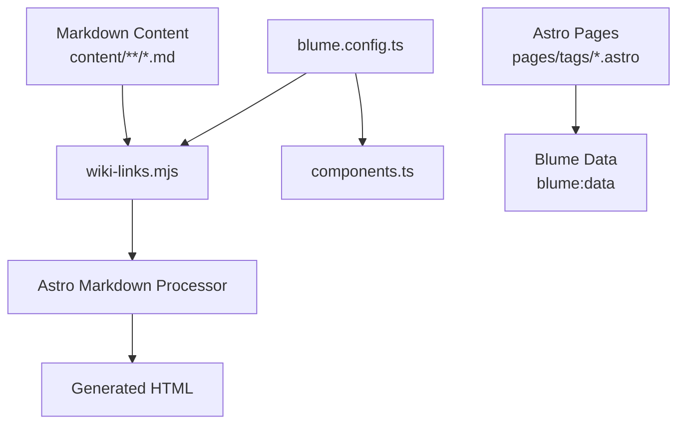
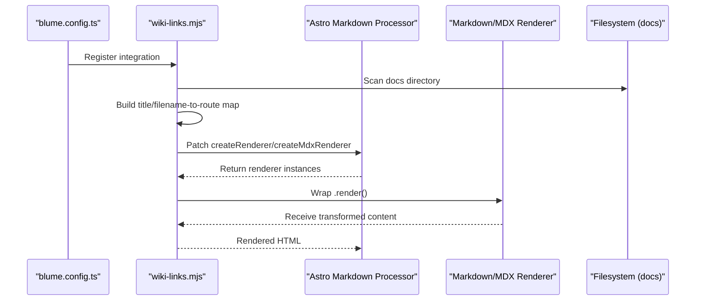
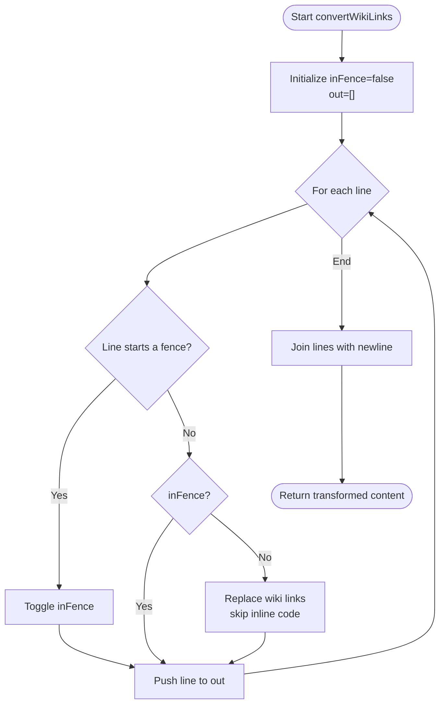
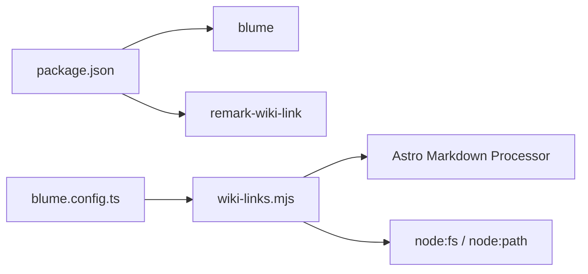

# Extension APIs

<cite>
**Referenced Files in This Document**
- [wiki-links.mjs](file://wiki-links.mjs)
- [blume.config.ts](file://blume.config.ts)
- [components.ts](file://components.ts)
- [package.json](file://package.json)
- [BLUME-CUSTOMIZATION-BACKEND.md](file://BLUME-CUSTOMIZATION-BACKEND.md)
- [pages/tags/index.astro](file://pages/tags/index.astro)
- [pages/tags/[tag].astro](file://pages/tags/[tag].astro)
</cite>

## Table of Contents
1. [Introduction](#introduction)
2. [Project Structure](#project-structure)
3. [Core Components](#core-components)
4. [Architecture Overview](#architecture-overview)
5. [Detailed Component Analysis](#detailed-component-analysis)
6. [Dependency Analysis](#dependency-analysis)
7. [Performance Considerations](#performance-considerations)
8. [Troubleshooting Guide](#troubleshooting-guide)
9. [Conclusion](#conclusion)
10. [Appendices](#appendices)

## Introduction
This document provides comprehensive extension API documentation for Fractal Home, focusing on the wiki link processing system and plugin architecture built on Blume and Astro. It explains how the wikiLinks module transforms markdown content, resolves links case-insensitively, protects code blocks from transformation, and integrates with the build pipeline via hooks. It also details how to extend the markdown transformation pipeline, create custom processors, implement cross-referencing logic, and integrate external services. Guidance is included for performance optimization, caching strategies, debugging, memory management, and testing approaches for custom extensions.

## Project Structure
Fractal Home uses a Blume-based configuration to register integrations and components. The wiki link integration is defined as a standalone module and registered in the Blume configuration. Custom layout components are registered via a components registry. Tag pages demonstrate how content data flows through the build-time collection APIs.

**Diagram sources**
- [blume.config.ts:1-12](file://blume.config.ts#L1-L12)
- [wiki-links.mjs:79-124](file://wiki-links.mjs#L79-L124)
- [components.ts:1-12](file://components.ts#L1-L12)
- [pages/tags/index.astro:1-36](file://pages/tags/index.astro#L1-L36)
- [pages/tags/[tag].astro:1-33](file://pages/tags/[tag].astro#L1-L33)

**Section sources**
- [blume.config.ts:1-12](file://blume.config.ts#L1-L12)
- [components.ts:1-12](file://components.ts#L1-L12)
- [package.json:1-19](file://package.json#L1-L19)

## Core Components
- wikiLinks module: Implements a Blume/Astro integration that patches the markdown processor to transform wiki-style links into standard markdown links while protecting fenced code blocks.
- Blume configuration: Registers the wikiLinks integration and defines frontmatter schema extensions used across the site.
- Components registry: Exposes custom Astro components for layout overrides.
- Tag pages: Demonstrate usage of Blume’s data and Astro’s content collection APIs to generate tag indexes and per-tag pages.

Key responsibilities:
- Build a mapping of page titles and filenames to routes during configuration setup.
- Wrap markdown renderers to preprocess content before rendering.
- Provide a configurable docs root for link resolution.
- Offer a fallback resolver for unmatched names.

**Section sources**
- [wiki-links.mjs:1-124](file://wiki-links.mjs#L1-L124)
- [blume.config.ts:1-25](file://blume.config.ts#L1-L25)
- [components.ts:1-12](file://components.ts#L1-L12)
- [pages/tags/index.astro:1-36](file://pages/tags/index.astro#L1-L36)
- [pages/tags/[tag].astro:1-33](file://pages/tags/[tag].astro#L1-L33)

## Architecture Overview
The wiki link processing pipeline integrates at the Astro markdown processor level. During configuration setup, the integration builds an index of available pages and wraps both Markdown and MDX renderers to transform wiki links prior to rendering.

**Diagram sources**
- [blume.config.ts:1-12](file://blume.config.ts#L1-L12)
- [wiki-links.mjs:79-124](file://wiki-links.mjs#L79-L124)

## Detailed Component Analysis

### Wiki Links Module
The wikiLinks module implements a Blume-compatible integration that:
- Parses frontmatter titles to build a fast lookup map.
- Normalizes file paths and handles index files.
- Converts wiki-style links [[Page]] or [[Page|Label]] into standard markdown links [Label](route).
- Protects fenced code blocks from transformation by tracking fence state per line.
- Provides case-insensitive matching using both original and lowercase keys.
- Falls back to a default route pattern when no match is found.

**Diagram sources**
- [wiki-links.mjs:50-77](file://wiki-links.mjs#L50-L77)

Implementation highlights:
- Frontmatter parsing extracts titles for indexing.
- Slugification normalizes names for fallback routing.
- Map building supports both exact and lowercase lookups.
- Renderer wrapping ensures transformations occur before final rendering.

**Section sources**
- [wiki-links.mjs:4-48](file://wiki-links.mjs#L4-L48)
- [wiki-links.mjs:50-77](file://wiki-links.mjs#L50-L77)
- [wiki-links.mjs:79-124](file://wiki-links.mjs#L79-L124)

### Blume Configuration and Integration Registration
The Blume configuration registers the wikiLinks integration and extends frontmatter schemas. It also configures navigation and theme fonts.

Key points:
- Integrations array includes the wikiLinks function call.
- Frontmatter schema extensions define typed fields like tags, related, sources, etc.
- Navigation and theme settings configure UI behavior and typography.

**Section sources**
- [blume.config.ts:1-25](file://blume.config.ts#L1-L25)
- [blume.config.ts:26-35](file://blume.config.ts#L26-L35)
- [blume.config.ts:37-66](file://blume.config.ts#L37-L66)

### Components Registry
Custom Astro components are registered for layout overrides. This allows replacing default Blume components with project-specific implementations.

**Section sources**
- [components.ts:1-12](file://components.ts#L1-L12)

### Tag Pages and Data Flow
Tag pages use Blume’s data and Astro’s content collection to build tag indexes and per-tag listings. They demonstrate how content metadata flows through the build process.

**Section sources**
- [pages/tags/index.astro:1-36](file://pages/tags/index.astro#L1-L36)
- [pages/tags/[tag].astro:1-33](file://pages/tags/[tag].astro#L1-L33)

## Dependency Analysis
The wikiLinks module depends on Node.js filesystem utilities and path handling. It integrates with Astro’s markdown processor via Blume’s configuration hook. External dependencies include Blume and remark-wiki-link (though the implementation here is custom).

**Diagram sources**
- [package.json:13-17](file://package.json#L13-L17)
- [blume.config.ts:1-8](file://blume.config.ts#L1-L8)
- [wiki-links.mjs:1-3](file://wiki-links.mjs#L1-L3)

**Section sources**
- [package.json:1-19](file://package.json#L1-L19)
- [blume.config.ts:1-8](file://blume.config.ts#L1-L8)
- [wiki-links.mjs:1-3](file://wiki-links.mjs#L1-L3)

## Performance Considerations
- Map construction: The page map is built once during configuration setup, minimizing repeated filesystem scans.
- Line-by-line processing: The transformer operates line-by-line, which is efficient for large documents but can be optimized further by buffering or streaming if needed.
- Regex usage: Inline code protection and wiki link matching use regular expressions; ensure patterns remain tight to avoid backtracking overhead.
- Renderer wrapping: Wrapping createRenderer and createMdxRenderer ensures consistent transformation without re-parsing entire documents multiple times.
- Memory management: Avoid storing large intermediate strings; reuse buffers where possible and clear caches if extending the module.

[No sources needed since this section provides general guidance]

## Troubleshooting Guide
Common issues and resolutions:
- Wiki links not transforming: Ensure the integration is registered in blume.config.ts and that the markdown processor exists.
- Code block corruption: Verify fence detection logic; triple backticks or tildes must correctly toggle state.
- Case sensitivity mismatches: Confirm that both original and lowercase keys are present in the map.
- Fallback routes: If links resolve to unexpected paths, check the slugify function and fallback pattern.
- Frontmatter parsing: Titles must be present and properly formatted for indexing.

Debugging tips:
- Log the constructed map during astro:config:setup to verify entries.
- Temporarily disable fence protection to test regex behavior.
- Use console logs in the renderer wrapper to inspect content before and after transformation.

**Section sources**
- [wiki-links.mjs:79-124](file://wiki-links.mjs#L79-L124)
- [wiki-links.mjs:4-21](file://wiki-links.mjs#L4-L21)

## Conclusion
The wikiLinks module provides a robust, extensible solution for wiki-style link processing within Fractal Home. By integrating at the markdown processor level, it ensures consistent transformation across all content while protecting code blocks and supporting case-insensitive matching. Developers can extend the pipeline by adding custom processors, implementing advanced cross-referencing logic, or integrating external services through the same hook mechanism. Proper attention to performance, memory management, and testing will ensure reliable and scalable extensions.

[No sources needed since this section summarizes without analyzing specific files]

## Appendices

### Creating Custom Link Resolvers
To implement custom link resolution:
- Extend the resolve function passed to convertWikiLinks.
- Add domain-specific logic for resolving aliases or external resources.
- Maintain backward compatibility with existing mappings.

Example approach:
- Check for custom prefixes in link names.
- Query external APIs or databases for dynamic resolution.
- Cache results to avoid repeated lookups.

[No sources needed since this section provides general guidance]

### Implementing Cross-Referencing Logic
Cross-references can be implemented by:
- Parsing additional metadata in frontmatter.
- Building a secondary index of relationships between pages.
- Injecting reference links or widgets during rendering.

[No sources needed since this section provides general guidance]

### Building Additional Markdown Processors
To add new processors:
- Create a separate module following the wikiLinks pattern.
- Hook into astro:config:setup to wrap renderers.
- Apply transformations before or after wiki link conversion.

[No sources needed since this section provides general guidance]

### Integrating with External Services
Integration steps:
- Use the resolve function to fetch data from external APIs.
- Handle network errors gracefully with fallbacks.
- Cache responses to improve performance.

[No sources needed since this section provides general guidance]

### Build-Time Optimization Techniques
Optimization strategies:
- Precompute expensive operations during configuration setup.
- Use efficient data structures like Maps for lookups.
- Minimize string concatenation by using arrays and join.

[No sources needed since this section provides general guidance]

### Caching Strategies
Caching recommendations:
- Cache page maps and resolved routes.
- Implement TTL-based caching for external service calls.
- Clear caches on rebuilds to ensure consistency.

[No sources needed since this section provides general guidance]

### Debugging Tools for Extension Development
Debugging tools:
- Enable verbose logging in development mode.
- Use browser dev tools to inspect generated HTML.
- Validate transformations with sample markdown inputs.

[No sources needed since this section provides general guidance]

### Testing Approaches for Custom Extensions
Testing strategies:
- Write unit tests for individual functions like slugify and parseFrontmatter.
- Create integration tests for full pipeline execution.
- Use mock filesystems for testing link resolution.

[No sources needed since this section provides general guidance]

### Blume Customization Backend
Blume customization follows specific guidelines for maintaining visual consistency and avoiding direct edits to generated files.

**Section sources**
- [BLUME-CUSTOMIZATION-BACKEND.md:1-22](file://BLUME-CUSTOMIZATION-BACKEND.md#L1-L22)
- [BLUME-CUSTOMIZATION-BACKEND.md:460-505](file://BLUME-CUSTOMIZATION-BACKEND.md#L460-L505)