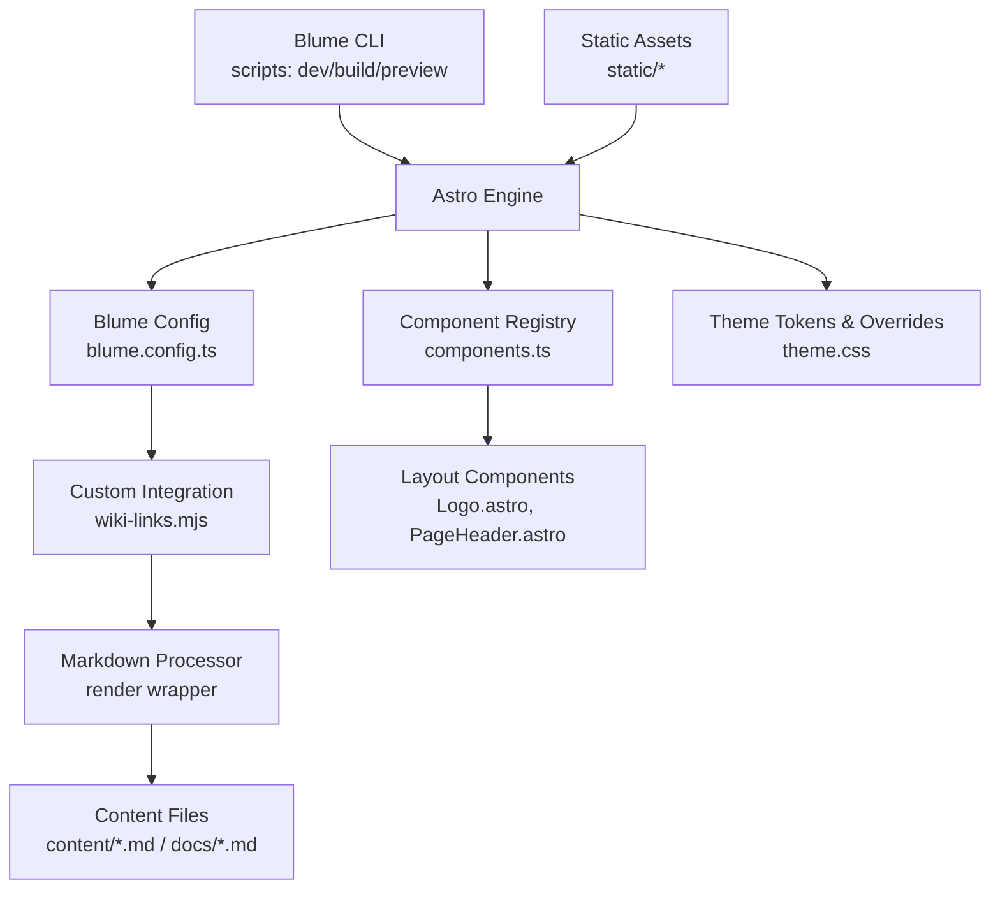
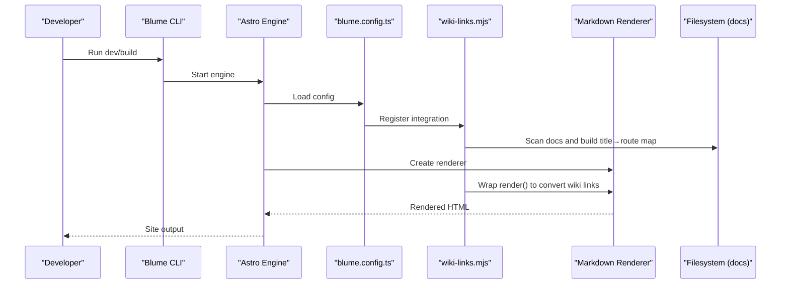
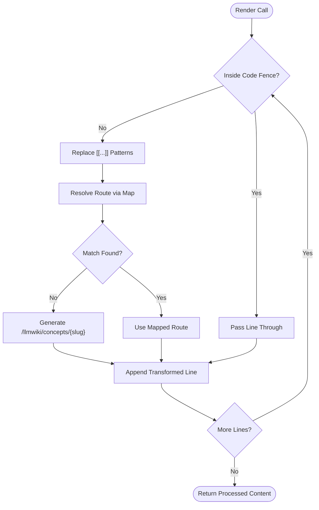
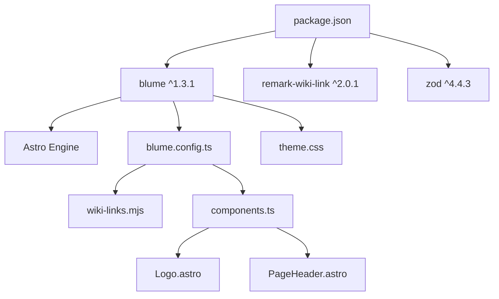

# Advanced Features

<cite>
**Referenced Files in This Document**
- [package.json](file://package.json)
- [blume.config.ts](file://blume.config.ts)
- [wiki-links.mjs](file://wiki-links.mjs)
- [components.ts](file://components.ts)
- [Logo.astro](file://components/Logo.astro)
- [PageHeader.astro](file://components/PageHeader.astro)
- [theme.css](file://theme.css)
- [BLUME-CUSTOMIZATION-BACKEND.md](file://BLUME-CUSTOMIZATION-BACKEND.md)
- [.gitignore](file://.gitignore)
</cite>

## Table of Contents
1. Introduction
2. Project Structure
3. Core Components
4. Architecture Overview
5. Detailed Component Analysis
6. Dependency Analysis
7. Performance Considerations
8. Troubleshooting Guide
9. Conclusion

## Introduction
This document explains the advanced features of Fractal Home with a focus on the content processing pipeline, performance optimization, and extensibility patterns. It covers how markdown is processed at build time using Blume and Astro, how wiki-style links are resolved via a custom integration, and how to extend functionality through plugins and component overrides. It also provides practical guidance for building custom processors, optimizing assets and bundles, caching strategies, debugging workflows, and troubleshooting production issues.

## Project Structure
Fractal Home is a Blume-powered static site built on Astro. Content lives under content/ and docs/, and the build is orchestrated by Blume scripts that wrap Astro’s tooling. The project uses a custom wiki-link integration to transform wiki-style links into standard Markdown links during rendering. UI components are registered via a central components registry and styled with a token-driven CSS system.

**Diagram sources**
- [blume.config.ts:1-67](file://blume.config.ts#L1-L67)
- [wiki-links.mjs:1-125](file://wiki-links.mjs#L1-L125)
- [components.ts:1-12](file://components.ts#L1-L12)
- [Logo.astro:1-48](file://components/Logo.astro#L1-L48)
- [PageHeader.astro:1-31](file://components/PageHeader.astro#L1-L31)
- [theme.css:1-673](file://theme.css#L1-L673)

**Section sources**
- [package.json:1-19](file://package.json#L1-L19)
- [blume.config.ts:1-67](file://blume.config.ts#L1-L67)
- [wiki-links.mjs:1-125](file://wiki-links.mjs#L1-L125)
- [components.ts:1-12](file://components.ts#L1-L12)
- [theme.css:1-673](file://theme.css#L1-L673)

## Core Components
- Blume configuration defines site metadata, integrations, frontmatter schema, navigation, and theme fonts.
- Custom wiki-link integration hooks into Astro’s config setup, builds a title-to-route map from docs, and wraps the markdown renderer to convert wiki links before rendering.
- Component registry registers layout components (e.g., Logo, PageHeader).
- Theme tokens define light/dark design tokens and component-level styles.

Key responsibilities:
- Frontmatter validation and extension via Zod schemas.
- Navigation structure and sidebar grouping.
- Build-time link resolution and transformation.
- Component overrides for header/sidebar/TOC behavior.

**Section sources**
- [blume.config.ts:1-67](file://blume.config.ts#L1-L67)
- [wiki-links.mjs:1-125](file://wiki-links.mjs#L1-L125)
- [components.ts:1-12](file://components.ts#L1-L12)
- [theme.css:1-673](file://theme.css#L1-L673)

## Architecture Overview
The build pipeline integrates Blume, Astro, and a custom wiki-link processor. During development or build, Blume invokes Astro, which loads the Blume configuration and the wiki-link integration. The integration scans the docs directory to build a mapping of titles and filenames to routes, then wraps the markdown renderer to transform wiki-style links into standard Markdown links. Layout components are injected via the component registry, and theme tokens are applied through CSS variables.

**Diagram sources**
- [blume.config.ts:1-67](file://blume.config.ts#L1-L67)
- [wiki-links.mjs:1-125](file://wiki-links.mjs#L1-L125)

## Detailed Component Analysis

### Markdown Processing Workflow and Wiki Links
The wiki-link integration transforms wiki-style links like [[Page|Label]] into standard Markdown links [Label](/path) during rendering. It:
- Parses frontmatter to extract titles for fast lookup.
- Builds a Map of title and filename keys to routes.
- Wraps the renderer’s render method to preprocess content line-by-line while skipping fenced code blocks.
- Falls back to a slugified path when no direct match is found.

**Diagram sources**
- [wiki-links.mjs:1-125](file://wiki-links.mjs#L1-L125)

**Section sources**
- [wiki-links.mjs:1-125](file://wiki-links.mjs#L1-L125)

### Plugin Architecture and Extensibility
Blume exposes an integration hook mechanism. The wiki-link plugin demonstrates how to:
- Hook into astro:config:setup to modify configuration.
- Patch the markdown processor object in place so other integrations see the wrapped renderer.
- Update the merged config to propagate changes to later-created renderers.

To extend functionality:
- Implement a new integration with hooks similar to astro:config:setup.
- Optionally wrap createRenderer/createMdxRenderer to inject custom processing steps.
- Use updateConfig to merge additional settings.

Practical examples:
- Add a custom transformer to sanitize or enrich content before rendering.
- Integrate analytics or SEO metadata extraction during build.
- Inject syntax highlighting or math rendering plugins into the markdown pipeline.

**Section sources**
- [wiki-links.mjs:79-125](file://wiki-links.mjs#L79-L125)
- [blume.config.ts:1-67](file://blume.config.ts#L1-L67)

### Component Overrides and Middleware Patterns
Components are registered centrally and can override default Blume components. For example:
- Logo.astro renders brand assets and supports light/dark variants.
- PageHeader.astro displays tags derived from page data and navigates to tag pages.

Middleware-like patterns:
- The wiki-link integration acts as middleware around the markdown renderer, transforming content before it reaches downstream consumers.
- Component overrides allow injecting logic at specific UI boundaries without altering generated runtime code.

Best practices:
- Keep global styles in theme.css and use tokens for consistency across themes.
- Prefer component overrides only when markup or accessibility attributes require change.

**Section sources**
- [components.ts:1-12](file://components.ts#L1-L12)
- [Logo.astro:1-48](file://components/Logo.astro#L1-L48)
- [PageHeader.astro:1-31](file://components/PageHeader.astro#L1-L31)
- [BLUME-CUSTOMIZATION-BACKEND.md:1-524](file://BLUME-CUSTOMIZATION-BACKEND.md#L1-L524)

### Frontmatter Schema and Validation
Frontmatter fields are extended and validated using Zod. This ensures consistent metadata across pages and enables typed access in components and templates.

Common fields include knowledge-bank arrays, tags, sources, related entries, timestamps, and project/group metadata. Optional fields allow flexibility while maintaining type safety.

**Section sources**
- [blume.config.ts:9-25](file://blume.config.ts#L9-L25)

## Dependency Analysis
The project depends on Blume, remark-wiki-link, and Zod. Blume orchestrates Astro-based builds; remark-wiki-link is available but not used directly here because a custom integration handles wiki links. Zod validates frontmatter.

**Diagram sources**
- [package.json:1-19](file://package.json#L1-L19)
- [blume.config.ts:1-67](file://blume.config.ts#L1-L67)
- [wiki-links.mjs:1-125](file://wiki-links.mjs#L1-L125)
- [components.ts:1-12](file://components.ts#L1-L12)
- [theme.css:1-673](file://theme.css#L1-L673)

**Section sources**
- [package.json:1-19](file://package.json#L1-L19)
- [blume.config.ts:1-67](file://blume.config.ts#L1-L67)

## Performance Considerations
- Static generation benefits: Blume/Astro produce static HTML, reducing server load and improving cacheability.
- Asset optimization: Images in components use eager loading and decoding attributes; ensure images are optimized (size, format) and served via CDN where possible.
- Bundle size reduction: Avoid heavy client-side libraries; prefer server-side processing and static outputs. Tailwind utilities are scoped and tree-shaken by the framework.
- Caching strategies: Leverage immutable asset naming and HTTP caching headers provided by static hosting. Use environment modules for build-time constants to avoid runtime overhead.
- Font loading: Fonts are declared in the theme configuration; preload critical font files and use variable fonts to reduce requests.

[No sources needed since this section provides general guidance]

## Troubleshooting Guide
Common issues and resolutions:
- Wiki links not resolving: Ensure docs directory contains valid markdown files with frontmatter titles. Verify the integration’s docsRoot points to the correct location.
- Build failures due to invalid frontmatter: Validate frontmatter against the Zod schema defined in blume.config.ts.
- Component overrides not applied: Confirm components.ts registers the correct paths and names. Regenerate Blume artifacts if necessary.
- Generated files missing: Do not edit .blume/, dist/, or .blume-verify/ directories; they are regenerated on each build.
- Visual inconsistencies across themes: Use tokens in theme.css and test both light and dark modes. Follow the customization guide to avoid fragile selectors.

Debugging techniques:
- Use Blume’s check and validate commands to catch configuration and content issues early.
- Inspect the rendered markdown output during development to verify transformations.
- Monitor network requests for font and image loading; ensure proper caching headers.

**Section sources**
- [BLUME-CUSTOMIZATION-BACKEND.md:507-524](file://BLUME-CUSTOMIZATION-BACKEND.md#L507-L524)
- [.gitignore:1-4](file://.gitignore#L1-L4)

## Conclusion
Fractal Home leverages Blume and Astro to deliver a high-performance, extensible static site. The custom wiki-link integration demonstrates a robust pattern for extending the markdown pipeline, while component overrides and token-driven styling enable flexible theming and UI customization. By following the outlined best practices for performance, caching, and debugging, teams can maintain a scalable knowledge base with reliable builds and responsive user experiences.