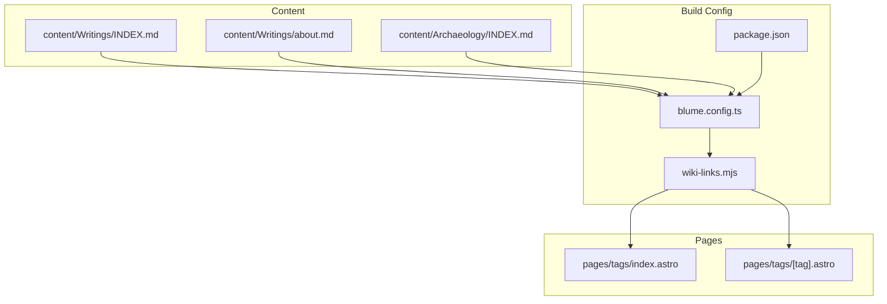
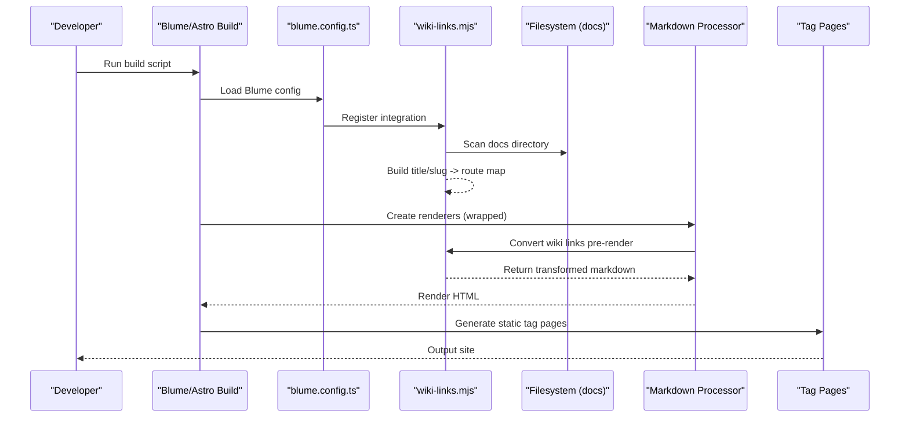
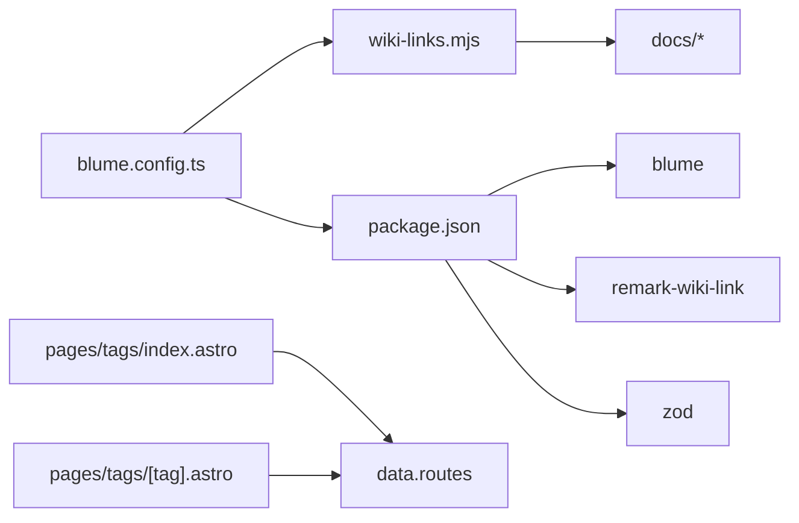

# Content Processing Pipeline

<cite>
**Referenced Files in This Document**
- [blume.config.ts](file://blume.config.ts)
- [wiki-links.mjs](file://wiki-links.mjs)
- [package.json](file://package.json)
- [components.ts](file://components.ts)
- [pages/tags/index.astro](file://pages/tags/index.astro)
- [pages/tags/[tag].astro](file://pages/tags/[tag].astro)
- [content/Writings/INDEX.md](file://content/Writings/INDEX.md)
- [content/Writings/about.md](file://content/Writings/about.md)
- [content/Archaeology/INDEX.md](file://content/Archaeology/INDEX.md)
- [BLUME-CUSTOMIZATION-BACKEND.md](file://BLUME-CUSTOMIZATION-BACKEND.md)
</cite>

## Table of Contents
1. [Introduction](#introduction)
2. [Project Structure](#project-structure)
3. [Core Components](#core-components)
4. [Architecture Overview](#architecture-overview)
5. [Detailed Component Analysis](#detailed-component-analysis)
6. [Dependency Analysis](#dependency-analysis)
7. [Performance Considerations](#performance-considerations)
8. [Troubleshooting Guide](#troubleshooting-guide)
9. [Conclusion](#conclusion)
10. [Appendices](#appendices)

## Introduction
This document explains the Fractal Home content processing pipeline with a focus on markdown workflow, build-time optimizations, and error handling. It covers how raw markdown is transformed into final HTML output, including wiki link conversion, frontmatter parsing, content indexing, syntax highlighting, table of contents generation, and cross-referencing. It also provides guidance for implementing custom processors, extending the build pipeline, debugging issues, and optimizing performance through caching and static generation.

## Project Structure
The project uses Blume (Astro-based) to manage documentation and content. Markdown files live under content and docs directories. The configuration integrates a custom wiki-link processor that runs at build time to convert wiki-style links into standard markdown links before rendering. Tag pages are statically generated from collected content metadata.

**Diagram sources**
- [blume.config.ts:1-67](file://blume.config.ts#L1-L67)
- [wiki-links.mjs:1-125](file://wiki-links.mjs#L1-L125)
- [package.json:1-19](file://package.json#L1-L19)
- [pages/tags/index.astro:1-74](file://pages/tags/index.astro#L1-L74)
- [pages/tags/[tag].astro:1-61](file://pages/tags/[tag].astro#L1-L61)
- [content/Writings/INDEX.md:1-41](file://content/Writings/INDEX.md#L1-L41)
- [content/Writings/about.md:1-18](file://content/Writings/about.md#L1-L18)
- [content/Archaeology/INDEX.md:1-88](file://content/Archaeology/INDEX.md#L1-L88)

**Section sources**
- [blume.config.ts:1-67](file://blume.config.ts#L1-L67)
- [package.json:1-19](file://package.json#L1-L19)

## Core Components
- Blume configuration defines site metadata, integrations, frontmatter schema, navigation, and theme settings.
- Custom wiki-link integration scans the docs directory, builds a title-to-route map, and wraps the markdown renderer to convert wiki links before rendering.
- Astro tag pages index entries by tags and generate static routes for tag listings and individual tag pages.
- Frontmatter fields are validated via Zod schema extensions in Blume config.

Key responsibilities:
- Frontmatter parsing and validation: blume.config.ts
- Wiki link mapping and transformation: wiki-links.mjs
- Static page generation and indexing: pages/tags/*.astro
- Dependency declarations: package.json

**Section sources**
- [blume.config.ts:1-67](file://blume.config.ts#L1-L67)
- [wiki-links.mjs:1-125](file://wiki-links.mjs#L1-L125)
- [pages/tags/index.astro:1-74](file://pages/tags/index.astro#L1-L74)
- [pages/tags/[tag].astro:1-61](file://pages/tags/[tag].astro#L1-L61)
- [package.json:1-19](file://package.json#L1-L19)

## Architecture Overview
The pipeline transforms markdown into HTML during build time using Blume and Astro. The custom wiki-link integration intercepts the markdown processor to inject link resolution before rendering. Tag pages aggregate metadata to produce static index pages.

**Diagram sources**
- [blume.config.ts:1-67](file://blume.config.ts#L1-L67)
- [wiki-links.mjs:1-125](file://wiki-links.mjs#L1-L125)
- [pages/tags/index.astro:1-74](file://pages/tags/index.astro#L1-L74)
- [pages/tags/[tag].astro:1-61](file://pages/tags/[tag].astro#L1-L61)

## Detailed Component Analysis

### Blume Configuration and Frontmatter Schema
- Defines site title, description, and integrations.
- Extends frontmatter schema with Zod types for knowledge-bank, tags, sources, related, timestamp, source, created, updated, project, boss, group, supergroup, and links.
- Configures navigation tabs and sidebar display mode.
- Sets theme fonts and variants.

Practical implications:
- Consistent frontmatter validation ensures reliable indexing and rendering.
- Navigation and theme settings influence layout and user experience.

**Section sources**
- [blume.config.ts:1-67](file://blume.config.ts#L1-L67)

### Wiki Link Integration
Responsibilities:
- Parse frontmatter titles from markdown files to build a lookup map.
- Slugify names for fallback routing when titles are not found.
- Wrap markdown renderers to convert wiki links [[Page|Label]] into standard markdown links [Label](route).
- Skip transformations inside fenced code blocks and inline code spans.

Processing flow:
- During astro:config:setup, scan docs directory recursively.
- For each .md/.mdx file, extract title from frontmatter and compute route.
- Map both exact title and lowercase variants; also map filename slugs.
- Wrap createRenderer/createMdxRenderer to ensure all renderers receive transformed content.

Error handling:
- If no processor exists, integration exits gracefully.
- Fallback route uses slugified name under a default path segment.

Optimization:
- Map built once per build; avoids repeated filesystem reads during rendering.
- Line-by-line processing minimizes memory overhead.

**Section sources**
- [wiki-links.mjs:1-125](file://wiki-links.mjs#L1-L125)

### Tag Indexing and Static Generation
- pages/tags/index.astro collects all docs entries, filters non-indexable or hidden items, aggregates tags, groups them alphabetically, and renders a tag cloud.
- pages/tags/[tag].astro generates static paths for each tag, sorts entries by title, and renders a list with descriptions.

Data flow:
- getCollection("docs") retrieves entries.
- data.routes maps entry IDs to routes.
- Tags are normalized (trimmed, lowercased) and counted.

Output:
- Static HTML pages for /tags and /tags/[tag] with accessible headings and semantic lists.

**Section sources**
- [pages/tags/index.astro:1-74](file://pages/tags/index.astro#L1-L74)
- [pages/tags/[tag].astro:1-61](file://pages/tags/[tag].astro#L1-L61)

### Frontmatter Examples and Usage
- content/Writings/INDEX.md demonstrates knowledge-bank arrays, tags, sources, related, timestamp, and source fields.
- content/Writings/about.md shows group, supergroup, date, and description usage.
- content/Archaeology/INDEX.md includes extensive sources array and related fields.

These examples validate the extended schema and illustrate how metadata drives indexing and navigation.

**Section sources**
- [content/Writings/INDEX.md:1-41](file://content/Writings/INDEX.md#L1-L41)
- [content/Writings/about.md:1-18](file://content/Writings/about.md#L1-L18)
- [content/Archaeology/INDEX.md:1-88](file://content/Archaeology/INDEX.md#L1-L88)

### Customization Hooks and Layout Overrides
- components.ts registers custom components for layout elements like Logo and PageHeader.
- BLUME-CUSTOMIZATION-BACKEND.md outlines how to override styles and components without editing generated files.

Use cases:
- Replace default logo and header behavior.
- Apply global CSS tokens and typography overrides.

**Section sources**
- [components.ts:1-12](file://components.ts#L1-L12)
- [BLUME-CUSTOMIZATION-BACKEND.md:1-380](file://BLUME-CUSTOMIZATION-BACKEND.md#L1-L380)

## Dependency Analysis
The pipeline depends on Blume for content management and Astro for static site generation. The wiki-link integration is registered via Blume’s integration system. Zod validates frontmatter schemas. remark-wiki-link is listed as a dependency but the project implements a custom processor instead of using it directly.

**Diagram sources**
- [blume.config.ts:1-67](file://blume.config.ts#L1-L67)
- [wiki-links.mjs:1-125](file://wiki-links.mjs#L1-L125)
- [package.json:1-19](file://package.json#L1-L19)
- [pages/tags/index.astro:1-74](file://pages/tags/index.astro#L1-L74)
- [pages/tags/[tag].astro:1-61](file://pages/tags/[tag].astro#L1-L61)

**Section sources**
- [package.json:1-19](file://package.json#L1-L19)
- [blume.config.ts:1-67](file://blume.config.ts#L1-L67)

## Performance Considerations
- Build-time static generation: All tag pages and content are rendered at build time, reducing runtime overhead.
- Memoized map: The wiki-link map is constructed once per build, avoiding repeated filesystem traversal.
- Minimal regex operations: Line-by-line processing skips fenced code blocks and inline code to reduce unnecessary transformations.
- Caching strategies:
  - Leverage Blume’s internal caches for collections and routes.
  - Avoid heavy synchronous IO in hot paths; keep scanning limited to docs root.
- Optimization opportunities:
  - Cache parsed frontmatter results if content grows significantly.
  - Use incremental builds where supported by Blume/Astro to rebuild only changed files.
  - Defer non-critical transformations until necessary.

[No sources needed since this section provides general guidance]

## Troubleshooting Guide
Common issues and resolutions:
- Wiki links not converting:
  - Ensure the docs directory exists and contains .md/.mdx files with valid frontmatter titles.
  - Verify the integration is registered in blume.config.ts.
  - Check that fenced code blocks are properly delimited so they are skipped.
- Frontmatter validation errors:
  - Confirm fields match the Zod schema defined in blume.config.ts.
  - Validate arrays and optional fields; remove unexpected types.
- Tag pages missing entries:
  - Ensure entries are indexable and not marked as hidden in sidebar.
  - Normalize tags (trim whitespace, lowercase) consistently.
- Rendering anomalies:
  - Inspect the wrapped renderer to confirm original render function is called correctly.
  - Review theme.css and component overrides for unintended style conflicts.

Debugging steps:
- Log the map keys and resolved routes during astro:config:setup.
- Temporarily disable the wrapper to isolate whether the issue lies in transformation or downstream rendering.
- Use Blume’s validation and doctor scripts to detect configuration issues.

**Section sources**
- [wiki-links.mjs:1-125](file://wiki-links.mjs#L1-L125)
- [blume.config.ts:1-67](file://blume.config.ts#L1-L67)
- [pages/tags/index.astro:1-74](file://pages/tags/index.astro#L1-L74)
- [pages/tags/[tag].astro:1-61](file://pages/tags/[tag].astro#L1-L61)

## Conclusion
The Fractal Home content processing pipeline leverages Blume and Astro to transform markdown into optimized static HTML. The custom wiki-link integration enhances cross-referencing by converting wiki-style links at build time. Robust frontmatter validation ensures consistent metadata, while tag pages provide efficient indexing and navigation. By following the outlined best practices, developers can extend the pipeline with additional transformations, maintain performance through caching and static generation, and troubleshoot issues effectively.

[No sources needed since this section summarizes without analyzing specific files]

## Appendices

### Practical Examples and Extensions
- Implementing custom markdown processors:
  - Wrap createRenderer/createMdxRenderer similarly to the wiki-link integration to inject transformations before rendering.
  - Ensure fenced code blocks and inline code are preserved.
- Extending the build pipeline:
  - Add post-processing steps after HTML generation for analytics, SEO enhancements, or asset optimization.
  - Integrate syntax highlighting plugins within the markdown processor chain.
- Debugging content processing:
  - Enable verbose logging in astro:config:setup to inspect map construction and resolver behavior.
  - Validate frontmatter with Zod schemas to catch errors early.

[No sources needed since this section provides general guidance]