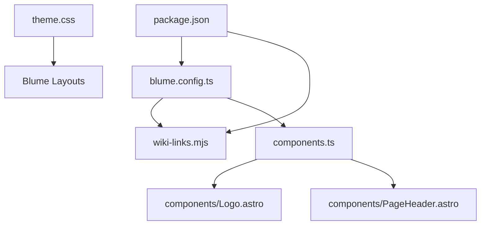
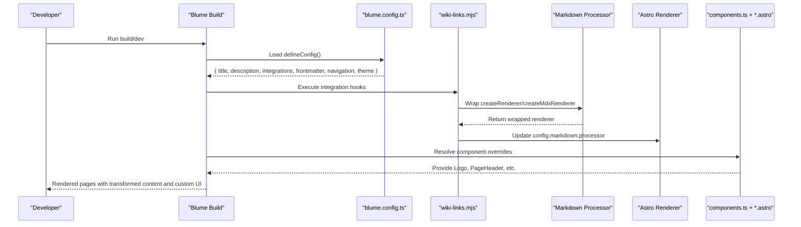
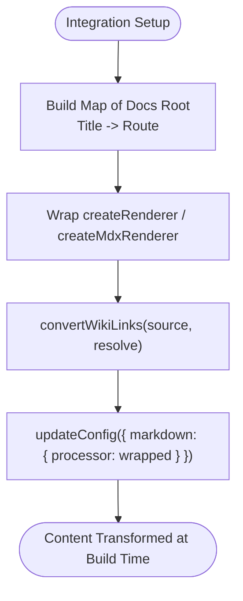
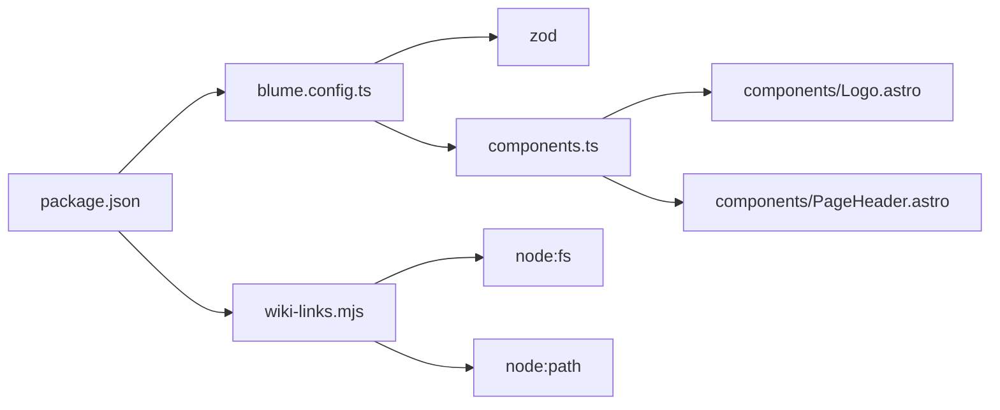

# Extensibility Patterns

<cite>
**Referenced Files in This Document**
- [components.ts](file://components.ts)
- [blume.config.ts](file://blume.config.ts)
- [wiki-links.mjs](file://wiki-links.mjs)
- [BLUME-CUSTOMIZATION-BACKEND.md](file://BLUME-CUSTOMIZATION-BACKEND.md)
- [theme.css](file://theme.css)
- [package.json](file://package.json)
- [components/Logo.astro](file://components/Logo.astro)
- [components/PageHeader.astro](file://components/PageHeader.astro)
</cite>

## Table of Contents
1. [Introduction](#introduction)
2. [Project Structure](#project-structure)
3. [Core Components](#core-components)
4. [Architecture Overview](#architecture-overview)
5. [Detailed Component Analysis](#detailed-component-analysis)
6. [Dependency Analysis](#dependency-analysis)
7. [Performance Considerations](#performance-considerations)
8. [Troubleshooting Guide](#troubleshooting-guide)
9. [Conclusion](#conclusion)
10. [Appendices](#appendices)

## Introduction
This document explains Fractal Home’s extensibility patterns built on Blume and Astro. It focuses on:
- The component override system via components.ts to customize default Blume UI while keeping compatibility.
- The plugin architecture for extending functionality, including custom markdown processors, build hooks, and runtime extensions.
- Middleware-like patterns that intercept content processing and modify the build pipeline.
- Practical examples for creating custom components, implementing plugins, and extending configuration.
- Best practices for backward compatibility, testing extensions, and distributing reusable components and plugins.

## Project Structure
The project organizes extensibility across three primary layers:
- Configuration layer (blume.config.ts): defines site metadata, integrations, frontmatter schema, navigation, and theme settings.
- Component overrides layer (components.ts and components/*.astro): replaces or augments Blume’s default layout/content components.
- Plugin/integration layer (wiki-links.mjs): implements a Blume/Astro integration with hooks to transform markdown at build time.



**Diagram sources**
- [blume.config.ts:1-67](file://blume.config.ts#L1-L67)
- [wiki-links.mjs:1-125](file://wiki-links.mjs#L1-L125)
- [components.ts:1-12](file://components.ts#L1-L12)
- [components/Logo.astro:1-48](file://components/Logo.astro#L1-L48)
- [components/PageHeader.astro:1-31](file://components/PageHeader.astro#L1-L31)
- [theme.css:1-673](file://theme.css#L1-L673)
- [package.json:1-18](file://package.json#L1-L18)

**Section sources**
- [blume.config.ts:1-67](file://blume.config.ts#L1-L67)
- [components.ts:1-12](file://components.ts#L1-L12)
- [wiki-links.mjs:1-125](file://wiki-links.mjs#L1-L125)
- [theme.css:1-673](file://theme.css#L1-L673)
- [package.json:1-18](file://package.json#L1-L18)

## Core Components
- Component overrides are registered through defineComponents in components.ts. This file imports Astro components and maps them to Blume’s layout slots such as Logo and PageHeader.
- Custom components like Logo.astro and PageHeader.astro demonstrate how to extend UI elements while consuming Blume data and Astro content APIs.
- Theme customization is centralized in theme.css using CSS custom properties and scoped selectors, ensuring consistent light/dark modes and token-driven design.

Key responsibilities:
- components.ts: declares which Blume components to override and provides references to local Astro components.
- components/Logo.astro: renders brand assets and adapts to theme via CSS classes.
- components/PageHeader.astro: reads page route and tags from Blume data and renders tag pills.

**Section sources**
- [components.ts:1-12](file://components.ts#L1-L12)
- [components/Logo.astro:1-48](file://components/Logo.astro#L1-L48)
- [components/PageHeader.astro:1-31](file://components/PageHeader.astro#L1-L31)
- [theme.css:1-673](file://theme.css#L1-L673)

## Architecture Overview
At build time, Blume loads the configuration and integrations, then renders pages using its layout components. The project extends this flow by:
- Registering an integration (wiki-links) that hooks into astro:config:setup to wrap markdown renderers and transform wiki-style links before rendering.
- Overriding specific Blume components via components.ts to inject custom markup and behavior without modifying Blume’s source.
- Applying global styles and tokens via theme.css to maintain visual consistency across themes.



**Diagram sources**
- [blume.config.ts:1-67](file://blume.config.ts#L1-L67)
- [wiki-links.mjs:79-124](file://wiki-links.mjs#L79-L124)
- [components.ts:1-12](file://components.ts#L1-L12)

## Detailed Component Analysis

### Component Override System (components.ts)
The override system allows replacing default Blume components with project-specific implementations. The current setup registers two layout components:
- Logo: a branded header link with theme-aware wordmark images.
- PageHeader: displays tags derived from page frontmatter and routes.

```mermaid
classDiagram
class DefineComponents {
+layout : object
}
class Logo {
+props : { site, logo? }
}
class PageHeader {
+props : { page }
}
DefineComponents --> Logo : "overrides"
DefineComponents --> PageHeader : "overrides"
```

Best practices:
- Keep props minimal and typed to ensure compatibility with Blume’s expectations.
- Use Blume data modules (e.g., blume:data) to access routes and entries.
- Avoid hard-coded colors; rely on theme.css tokens for accessibility and dark mode support.

**Diagram sources**
- [components.ts:1-12](file://components.ts#L1-L12)
- [components/Logo.astro:1-48](file://components/Logo.astro#L1-L48)
- [components/PageHeader.astro:1-31](file://components/PageHeader.astro#L1-L31)

**Section sources**
- [components.ts:1-12](file://components.ts#L1-L12)
- [components/Logo.astro:1-48](file://components/Logo.astro#L1-L48)
- [components/PageHeader.astro:1-31](file://components/PageHeader.astro#L1-L31)

### Plugin Architecture (wiki-links.mjs)
The wiki-links integration demonstrates a robust pattern for extending Blume’s markdown processing:
- Builds a map of docs root files to routes during astro:config:setup.
- Wraps the markdown processor’s renderer creation functions to intercept content transformation.
- Converts wiki-style links [[Page|Label]] into standard Markdown links while preserving fenced code blocks.
- Updates the final config so later-created renderers also receive the wrapped processor.



Implementation highlights:
- Safe parsing of frontmatter titles to generate slugs and fallback routes.
- Fence-aware processing to avoid transforming code blocks.
- In-place patching of existing processor references plus updateConfig for future instances.

**Diagram sources**
- [wiki-links.mjs:23-48](file://wiki-links.mjs#L23-L48)
- [wiki-links.mjs:50-77](file://wiki-links.mjs#L50-L77)
- [wiki-links.mjs:79-124](file://wiki-links.mjs#L79-L124)

**Section sources**
- [wiki-links.mjs:1-125](file://wiki-links.mjs#L1-L125)

### Middleware Patterns (Intercepting Requests and Content)
While Blume/Astro do not use traditional HTTP middleware in this context, the integration pattern acts as a “build-time middleware”:
- Hooks into astro:config:setup to mutate configuration and wrap renderers.
- Intercepts markdown content before it is rendered, enabling transformations like wiki-link conversion.
- Can be extended to add analytics, caching, or content validation steps.

Practical extension points:
- Add new hooks for pre/post-render phases if needed.
- Introduce environment-based toggles to enable/disable transformations.
- Compose multiple integrations by wrapping processors sequentially.

**Section sources**
- [wiki-links.mjs:79-124](file://wiki-links.mjs#L79-L124)

### Configuration Extension (blume.config.ts)
Configuration is defined via defineConfig and includes:
- Site metadata (title, description).
- Integrations array where wiki-links is registered.
- Frontmatter schema extension using Zod for type safety and validation.
- Navigation structure (featured, tabs, sidebar display mode).
- Theme font definitions and variants.

Extending configuration:
- Add new frontmatter fields with Zod validators to enforce types.
- Register additional integrations for features like search, analytics, or custom processors.
- Customize fonts and typography to match brand guidelines.

**Section sources**
- [blume.config.ts:1-67](file://blume.config.ts#L1-L67)

### Styling and Tokens (theme.css)
Global styling uses CSS custom properties to define tokens for backgrounds, foregrounds, borders, accents, and radii. Both light and dark themes are supported via [data-theme="dark"].
- Header, sidebar, TOC, and content areas are styled consistently using tokens.
- Tag pills and buttons have dedicated classes for hover states and transitions.
- Reduced motion preferences are respected to improve accessibility.

Guidelines:
- Prefer tokens over hard-coded values to maintain coherence across themes.
- Use scoped selectors to target specific regions without affecting unrelated components.
- Test both light and dark modes when adding new styles.

**Section sources**
- [theme.css:1-673](file://theme.css#L1-L673)

## Dependency Analysis
The project’s dependencies and relationships are straightforward:
- package.json lists blume, remark-wiki-link, and zod as core dependencies.
- blume.config.ts imports zod for frontmatter validation and registers the wiki-links integration.
- wiki-links.mjs depends on Node fs and path modules to scan docs and build route maps.
- components.ts imports Astro components and integrates them with Blume’s layout system.



**Diagram sources**
- [package.json:1-18](file://package.json#L1-L18)
- [blume.config.ts:1-67](file://blume.config.ts#L1-L67)
- [wiki-links.mjs:1-125](file://wiki-links.mjs#L1-L125)
- [components.ts:1-12](file://components.ts#L1-L12)

**Section sources**
- [package.json:1-18](file://package.json#L1-L18)
- [blume.config.ts:1-67](file://blume.config.ts#L1-L67)
- [wiki-links.mjs:1-125](file://wiki-links.mjs#L1-L125)
- [components.ts:1-12](file://components.ts#L1-L12)

## Performance Considerations
- Markdown processor wrapping adds minimal overhead but should be used judiciously to avoid unnecessary transformations.
- Building a large docs map can impact startup time; consider lazy loading or caching strategies for very large repositories.
- CSS tokens and scoped selectors reduce reflows and repaints by leveraging efficient browser optimizations.
- Respect reduced motion preferences to improve performance and accessibility on low-power devices.

[No sources needed since this section provides general guidance]

## Troubleshooting Guide
Common issues and resolutions:
- Generated files under .blume/, .blume-verify/, dist/ are overwritten on rebuild; never edit these directly.
- If wiki links are not transforming, verify that the docsRoot is correct and that frontmatter titles exist for mapping.
- Component overrides must preserve Blume’s expected props and data attributes to maintain navigation and accessibility.
- Theme changes should be tested in both light and dark modes; ensure tokens are used consistently.

Verification checklist:
- Run blume check and blume build to validate configuration and output.
- Inspect one normal page, a tagged page, and a long sidebar page.
- Toggle themes and test responsive layouts.
- Confirm keyboard focus visibility and navigation behavior.

**Section sources**
- [BLUME-CUSTOMIZATION-BACKEND.md:1-524](file://BLUME-CUSTOMIZATION-BACKEND.md#L1-L524)

## Conclusion
Fractal Home leverages Blume’s extensibility model to provide a flexible and maintainable architecture:
- Component overrides allow deep customization of UI without modifying framework source.
- Integration hooks enable powerful build-time transformations, such as wiki-link processing.
- Token-driven styling ensures consistent theming and accessibility across light and dark modes.
By following best practices for configuration, component design, and plugin development, teams can extend functionality safely and distribute reusable components and plugins to the community.

[No sources needed since this section summarizes without analyzing specific files]

## Appendices

### Practical Examples

#### Creating a Custom Component
- Create a new Astro component in components/.
- Import and register it in components.ts under the appropriate slot (e.g., layout).
- Ensure props align with Blume’s expectations and use theme tokens for styling.

**Section sources**
- [components.ts:1-12](file://components.ts#L1-L12)
- [components/Logo.astro:1-48](file://components/Logo.astro#L1-L48)
- [components/PageHeader.astro:1-31](file://components/PageHeader.astro#L1-L31)

#### Implementing a Plugin for New Features
- Export a function that returns an integration object with hooks (e.g., astro:config:setup).
- Wrap markdown processors to transform content or add metadata.
- Update config via updateConfig to propagate changes to all renderers.

**Section sources**
- [wiki-links.mjs:79-124](file://wiki-links.mjs#L79-L124)

#### Extending the Configuration System
- Add new frontmatter fields with Zod validators in blume.config.ts.
- Register additional integrations in the integrations array.
- Customize fonts and theme settings to match brand requirements.

**Section sources**
- [blume.config.ts:1-67](file://blume.config.ts#L1-L67)

### Best Practices for Backward Compatibility, Testing, and Distribution
- Maintain stable prop interfaces for components to avoid breaking changes.
- Write unit tests for integrations and transformations to ensure reliability.
- Publish reusable components and plugins with clear documentation and versioning.
- Use semantic versioning and changelogs to communicate updates to the community.

[No sources needed since this section provides general guidance]