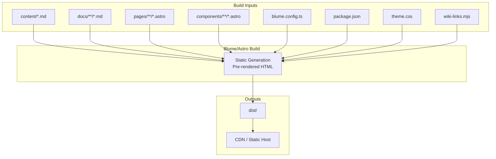
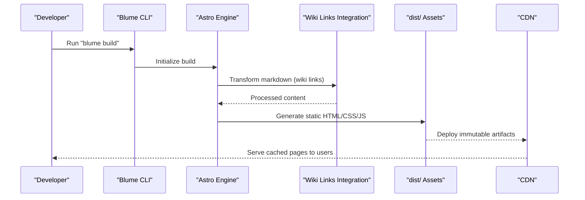
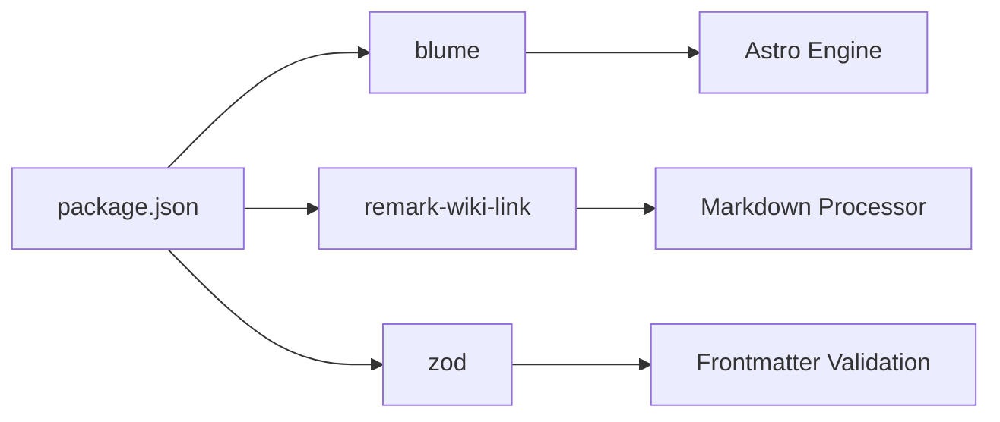

# Performance Optimization

<cite>
**Referenced Files in This Document**
- [package.json](file://package.json)
- [blume.config.ts](file://blume.config.ts)
- [components.ts](file://components.ts)
- [Logo.astro](file://components/Logo.astro)
- [PageHeader.astro](file://components/PageHeader.astro)
- [tags/[tag].astro](file://pages/tags/[tag].astro)
- [tags/index.astro](file://pages/tags/index.astro)
- [theme.css](file://theme.css)
- [wiki-links.mjs](file://wiki-links.mjs)
- [.gitignore](file://.gitignore)
- [SvelteKit-Advanced-Features.md](file://docs/Sveltekit/SvelteKit-Advanced-Features.md)
- [SvelteKit-Environment-Modules.md](file://docs/Sveltekit/SvelteKit-Environment-Modules.md)
- [webinterfaceguidelines.md](file://docs/Writings/webinterfaceguidelines.md)
</cite>

## Table of Contents
1. Introduction
2. Project Structure
3. Core Components
4. Architecture Overview
5. Detailed Component Analysis
6. Dependency Analysis
7. Performance Considerations
8. Troubleshooting Guide
9. Conclusion

## Introduction
This document provides a comprehensive performance optimization guide for Fractal Home, a static site built with Blume and Astro. It explains how the static site generator architecture delivers inherent performance benefits such as pre-rendered pages, reduced server load, and CDN-friendly deployment. It also documents asset optimization techniques (CSS minification, image optimization, font loading strategies, bundle size reduction), caching strategies across browser, CDN, and build-time layers, and practical methods to monitor metrics, identify bottlenecks, and implement improvements. Finally, it covers memory usage optimization during builds, parallel processing techniques, and production deployment best practices for optimal load times.

## Project Structure
Fractal Home is organized around content-driven Markdown files, Astro components, and Blume configuration:
- Content resides under content/ and docs/ directories, structured by topic areas.
- Pages are defined via Astro routes, including dynamic tag pages under pages/tags/.
- Custom UI components live under components/, registered through components.ts.
- Build and runtime configuration is centralized in blume.config.ts and package.json scripts.
- Styling and design tokens are managed in theme.css.
- A custom integration transforms wiki-style links at build time via wiki-links.mjs.

**Diagram sources**
- [package.json:1-19](file://package.json#L1-L19)
- [blume.config.ts:1-67](file://blume.config.ts#L1-L67)
- [theme.css:1-673](file://theme.css#L1-L673)
- [wiki-links.mjs:1-125](file://wiki-links.mjs#L1-L125)

**Section sources**
- [package.json:1-19](file://package.json#L1-L19)
- [blume.config.ts:1-67](file://blume.config.ts#L1-L67)
- [theme.css:1-673](file://theme.css#L1-L673)
- [wiki-links.mjs:1-125](file://wiki-links.mjs#L1-L125)

## Core Components
Key components that influence performance:
- Logo.astro: Uses eager loading for critical branding assets and async decoding to avoid render-blocking.
- PageHeader.astro: Fetches tags at build time and renders them statically, reducing client-side work.
- Tag pages: Generate static index and detail pages from content metadata, enabling full pre-rendering and cacheability.
- Theme and fonts: Centralized tokens and webfont declarations in blume.config.ts and theme.css ensure consistent, optimized rendering.

Performance highlights:
- Pre-rendered HTML reduces Time to First Byte (TTFB).
- Eager loading of essential images improves perceived performance.
- Async decoding prevents layout shifts and main-thread blocking.
- Static tag pages eliminate runtime data fetching.

**Section sources**
- [Logo.astro:1-48](file://components/Logo.astro#L1-L48)
- [PageHeader.astro:1-31](file://components/PageHeader.astro#L1-L31)
- [tags/index.astro:1-74](file://pages/tags/index.astro#L1-L74)
- [tags/[tag].astro:1-61](file://pages/tags/[tag].astro#L1-L61)
- [blume.config.ts:37-65](file://blume.config.ts#L37-L65)
- [theme.css:1-120](file://theme.css#L1-L120)

## Architecture Overview
The static generation pipeline leverages Blume and Astro to produce fully cached, CDN-ready outputs:
- Build-time: Markdown content is parsed, transformed (including wiki-link conversion), and rendered into static HTML/CSS/JS.
- Runtime: Zero-server delivery; browsers fetch prebuilt assets directly from CDN or static host.
- Caching: Long-lived cache headers on immutable assets; CDN edge caching for global distribution.

**Diagram sources**
- [package.json:5-11](file://package.json#L5-L11)
- [wiki-links.mjs:79-124](file://wiki-links.mjs#L79-L124)

**Section sources**
- [package.json:5-11](file://package.json#L5-L11)
- [wiki-links.mjs:79-124](file://wiki-links.mjs#L79-L124)

## Detailed Component Analysis

### Static Generation Benefits
- Pre-rendered pages: All content is compiled into static HTML at build time, eliminating server-side rendering overhead per request.
- Reduced server load: No runtime computation; requests are served as static files.
- CDN-friendly deployment: Immutable artifacts enable aggressive caching and global distribution.

Practical implications:
- Faster TTFB and Time to Interactive due to minimal JavaScript and no server round-trips.
- Improved SEO through complete HTML content available immediately.
- Lower infrastructure costs since static hosting scales efficiently.

**Section sources**
- [package.json:5-11](file://package.json#L5-L11)
- [tags/index.astro:1-74](file://pages/tags/index.astro#L1-L74)
- [tags/[tag].astro:1-61](file://pages/tags/[tag].astro#L1-L61)

### Asset Optimization Techniques
- CSS minification and bundling: Handled by the underlying Vite-based build pipeline used by Blume/Astro.
- Image optimization: Use appropriate formats (e.g., WebP), explicit width/height attributes, and async decoding to prevent layout shift.
- Font loading strategies: Declare fonts in blume.config.ts with woff2 variants and weight ranges; leverage preload hints where applicable.
- Bundle size reduction: Avoid unnecessary dependencies; rely on framework optimizations and code splitting.

Implementation notes:
- Images in Logo.astro use eager loading for critical branding and async decoding to improve rendering performance.
- Fonts are declared with modern woff2 formats and variable weights, minimizing download size and improving text rendering speed.

**Section sources**
- [Logo.astro:19-46](file://components/Logo.astro#L19-L46)
- [blume.config.ts:37-65](file://blume.config.ts#L37-L65)
- [theme.css:12-61](file://theme.css#L12-L61)

### Caching Strategies
- Browser caching: Leverage immutable asset filenames and long-lived cache-control headers for CSS/JS/images.
- CDN caching: Configure edge caches with appropriate TTLs and cache keys based on content hashes.
- Build-time caching: Utilize dependency caching in CI/CD pipelines to speed up subsequent builds.

Operational guidance:
- Ensure dist/ contains versioned artifacts for cache busting.
- Set Cache-Control: public, max-age=31536000, immutable for hashed assets.
- Use CDN features like stale-while-revalidate for non-critical resources.

**Section sources**
- [.gitignore:1-4](file://.gitignore#L1-L4)
- [SvelteKit-Environment-Modules.md:110-116](file://docs/Sveltekit/SvelteKit-Environment-Modules.md#L110-L116)

### Monitoring Performance Metrics
Recommended metrics:
- Core Web Vitals: Largest Contentful Paint (LCP), First Input Delay (FID)/Interaction to Next Paint (INP), Cumulative Layout Shift (CLS).
- Network waterfall: Identify slow resources, excessive requests, and large payloads.
- Build metrics: Track build time, memory usage, and output sizes.

Tools and practices:
- Lighthouse for automated audits and recommendations.
- WebPageTest for detailed network and rendering insights.
- Analytics platforms for real-user monitoring (RUM) of performance metrics.

**Section sources**
- [SvelteKit-Advanced-Features.md:43-49](file://docs/Sveltekit/SvelteKit-Advanced-Features.md#L43-L49)

### Identifying Bottlenecks
Common bottlenecks:
- Large images or unoptimized media.
- Excessive JavaScript bundles or third-party scripts.
- Render-blocking CSS or fonts.
- Inefficient build processes causing high memory usage.

Diagnostic steps:
- Analyze network waterfall to pinpoint slow resources.
- Use bundle analyzers to identify oversized dependencies.
- Profile build processes to detect memory spikes or inefficient tasks.

**Section sources**
- [SvelteKit-Advanced-Features.md:43-49](file://docs/Sveltekit/SvelteKit-Advanced-Features.md#L43-L49)

### Implementing Performance Improvements
Actionable improvements:
- Optimize images: Convert to WebP/AVIF, set explicit dimensions, lazy-load below-the-fold images.
- Minify and compress assets: Enable gzip/Brotli compression on CDN.
- Defer non-critical JavaScript: Use async/defer attributes or dynamic imports.
- Improve font loading: Subset fonts, preload critical variants, use font-display: swap.

Validation:
- Re-run Lighthouse audits after changes.
- Monitor Core Web Vitals in production to confirm improvements.

**Section sources**
- [webinterfaceguidelines.md:30-56](file://docs/Writings/webinterfaceguidelines.md#L30-L56)

### Memory Usage Optimization During Builds
Strategies:
- Limit concurrent operations to prevent memory spikes.
- Clear temporary directories between builds.
- Use incremental builds where supported to reduce recomputation.

Monitoring:
- Track peak memory usage during builds using system monitors.
- Adjust Node.js heap limits if necessary.

**Section sources**
- [.gitignore:1-4](file://.gitignore#L1-L4)

### Parallel Processing Techniques
Recommendations:
- Parallelize independent tasks (e.g., content parsing, asset processing).
- Use worker threads for CPU-intensive operations.
- Optimize file I/O with streaming and buffering strategies.

Implementation:
- Configure build tools to utilize multiple cores.
- Avoid blocking operations in the main thread.

**Section sources**
- [wiki-links.mjs:23-48](file://wiki-links.mjs#L23-L48)

### Production Deployment Best Practices
Guidelines:
- Deploy immutable artifacts to CDN with proper cache headers.
- Enable HTTP/2 or HTTP/3 for multiplexing and improved performance.
- Monitor uptime and performance continuously.

Checklist:
- Verify all assets are cached correctly.
- Test page load times across regions.
- Validate security headers and HTTPS configuration.

**Section sources**
- [package.json:5-11](file://package.json#L5-L11)

## Dependency Analysis
The project’s dependencies are minimal and focused:
- Blume: Provides the static site generation framework and integrations.
- remark-wiki-link: Enables wiki-style link transformation during build.
- Zod: Used for schema validation in frontmatter configuration.

**Diagram sources**
- [package.json:13-17](file://package.json#L13-L17)

**Section sources**
- [package.json:13-17](file://package.json#L13-L17)

## Performance Considerations
- Static generation ensures fast initial loads and excellent scalability.
- Asset optimization reduces payload sizes and improves rendering efficiency.
- Caching strategies maximize reuse and minimize network requests.
- Monitoring and diagnostics enable continuous improvement.

[No sources needed since this section provides general guidance]

## Troubleshooting Guide
Common issues and resolutions:
- Slow builds: Check for excessive logging, optimize file I/O, and limit concurrency.
- High memory usage: Increase Node.js heap size or refactor build processes.
- Poor caching: Verify cache headers and asset naming conventions.
- Rendering delays: Audit critical resources and defer non-essential scripts.

Debugging steps:
- Use build logs to identify bottlenecks.
- Inspect network requests for inefficiencies.
- Validate asset integrity and caching policies.

**Section sources**
- [.gitignore:1-4](file://.gitignore#L1-L4)

## Conclusion
Fractal Home’s static site architecture delivers significant performance advantages through pre-rendered pages, reduced server load, and CDN-friendly deployment. By implementing asset optimization, robust caching strategies, and continuous monitoring, teams can achieve optimal load times and user experiences. Adhering to production deployment best practices ensures reliable, scalable, and efficient delivery of content to users worldwide.

[No sources needed since this section summarizes without analyzing specific files]