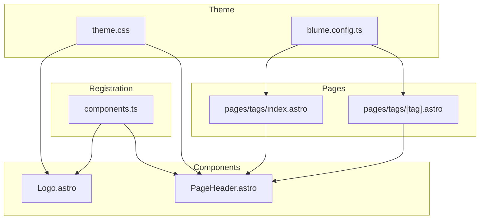
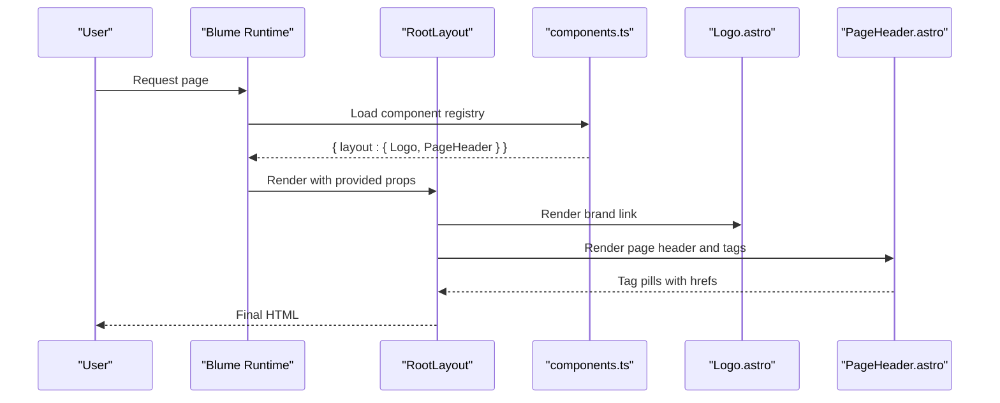
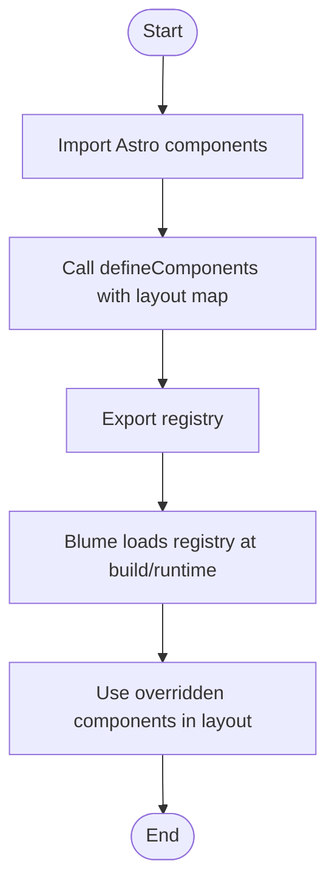
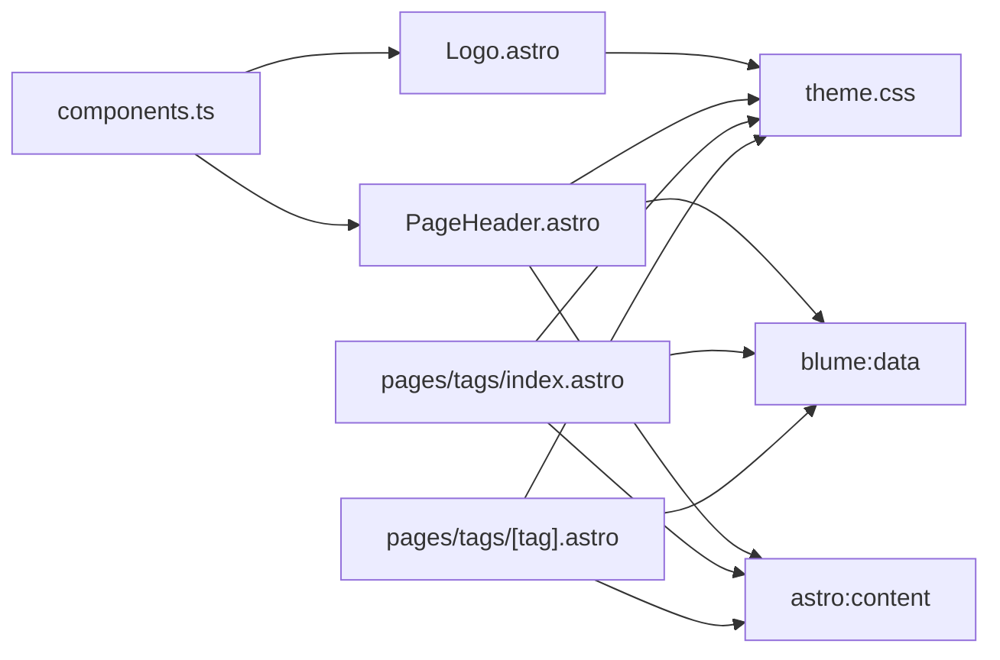

# Component Architecture

<cite>
**Referenced Files in This Document**
- [components.ts](file://components.ts)
- [Logo.astro](file://components/Logo.astro)
- [PageHeader.astro](file://components/PageHeader.astro)
- [theme.css](file://theme.css)
- [blume.config.ts](file://blume.config.ts)
- [index.astro (tags)](file://pages/tags/index.astro)
- [tag.astro (tags)](file://pages/tags/[tag].astro)
- [BLUME-CUSTOMIZATION-BACKEND.md](file://BLUME-CUSTOMIZATION-BACKEND.md)
</cite>

## Table of Contents
1. [Introduction](#introduction)
2. [Project Structure](#project-structure)
3. [Core Components](#core-components)
4. [Architecture Overview](#architecture-overview)
5. [Detailed Component Analysis](#detailed-component-analysis)
6. [Dependency Analysis](#dependency-analysis)
7. [Performance Considerations](#performance-considerations)
8. [Troubleshooting Guide](#troubleshooting-guide)
9. [Conclusion](#conclusion)
10. [Appendices](#appendices)

## Introduction
This document explains the Fractal Home component architecture built on Astro and Blume. It focuses on how custom components are registered, how they integrate with Blume’s layout system, and how the theme system and CSS custom properties provide consistent styling across light and dark modes. You will learn how to create custom components, override existing ones, and integrate third-party components while following accessibility best practices for interactive elements such as tag displays and navigation.

## Project Structure
The project organizes UI logic into small, focused Astro components under a dedicated folder and registers them via a central configuration file. Styling is centralized in a theme stylesheet that defines design tokens and component-level styles. Blume configuration controls fonts, navigation, and frontmatter schema. Tag pages demonstrate data-driven rendering and routing.

**Diagram sources**
- [components.ts:1-12](file://components.ts#L1-L12)
- [Logo.astro:1-48](file://components/Logo.astro#L1-L48)
- [PageHeader.astro:1-31](file://components/PageHeader.astro#L1-L31)
- [theme.css:1-120](file://theme.css#L1-L120)
- [blume.config.ts:1-67](file://blume.config.ts#L1-L67)
- [index.astro (tags):1-74](file://pages/tags/index.astro#L1-L74)
- [tag.astro (tags):1-61](file://pages/tags/[tag].astro#L1-L61)

**Section sources**
- [components.ts:1-12](file://components.ts#L1-L12)
- [theme.css:1-120](file://theme.css#L1-L120)
- [blume.config.ts:1-67](file://blume.config.ts#L1-L67)

## Core Components
- Logo: A lightweight brand link that renders a motif and wordmark images, switching between light and dark variants based on the theme attribute. It accepts site metadata and optional logo text props.
- PageHeader: Renders contextual page information and a tag row derived from content collection data. It uses Blume’s runtime data to resolve routes and tags.

Key responsibilities:
- Logo encapsulates branding and theme-aware visuals without JavaScript.
- PageHeader composes route and tag data to present accessible, navigable tag pills.

Props and usage patterns:
- Logo receives site metadata and an optional logo object; it renders semantic links and images with appropriate alt attributes and aria labels.
- PageHeader receives page metadata and derives tags from the current entry, mapping them to tag pages.

Slots and composition:
- Both components are declarative and rely on Astro’s template composition. They do not define named slots but can be composed within Blume’s layout regions through the registration mechanism.

Accessibility highlights:
- Semantic anchor elements with descriptive aria-labels.
- Images use alt text or aria-hidden where appropriate.
- Focus-visible outlines are enforced globally by theme.css.

**Section sources**
- [Logo.astro:1-48](file://components/Logo.astro#L1-L48)
- [PageHeader.astro:1-31](file://components/PageHeader.astro#L1-L31)
- [theme.css:76-87](file://theme.css#L76-L87)

## Architecture Overview
Blume provides a layout system that can be extended by registering custom components. The project registers Logo and PageHeader via a single entry point. These components integrate with Blume’s data layer and Tailwind-based utilities, while theme.css supplies design tokens and overrides.

**Diagram sources**
- [components.ts:1-12](file://components.ts#L1-L12)
- [Logo.astro:1-48](file://components/Logo.astro#L1-L48)
- [PageHeader.astro:1-31](file://components/PageHeader.astro#L1-L31)

**Section sources**
- [components.ts:1-12](file://components.ts#L1-L12)
- [BLUME-CUSTOMIZATION-BACKEND.md:460-524](file://BLUME-CUSTOMIZATION-BACKEND.md#L460-L524)

## Detailed Component Analysis

### Component Registration and Override Mechanism
Blume allows overriding default components by defining a registry. The project imports Astro components and exports them under a layout namespace. This approach ensures type safety and clear separation between markup and configuration.

- Registration pattern: Import components and pass them into a defineComponents call with a layout map.
- Extensibility: Additional components can be added to the same registry to replace Blume defaults.
- Best practice: Keep overrides minimal and focused on markup structure and accessibility attributes.

**Diagram sources**
- [components.ts:1-12](file://components.ts#L1-L12)

**Section sources**
- [components.ts:1-12](file://components.ts#L1-L12)
- [BLUME-CUSTOMIZATION-BACKEND.md:460-524](file://BLUME-CUSTOMIZATION-BACKEND.md#L460-L524)

### Logo Component
Responsibilities:
- Provide a branded home link with a motif and wordmark images.
- Switch wordmark variant based on theme using CSS selectors.
- Ensure accessibility with proper labels and image roles.

Props:
- site: Contains title used for aria-label and alt text.
- logo: Optional object allowing customization of displayed text.

Behavior:
- Uses eager loading and async decoding for performance.
- Applies hover transitions to the motif.
- Hides/shows wordmark variants via CSS rules tied to the theme attribute.

Accessibility:
- Descriptive aria-label on the anchor.
- Meaningful alt text for the primary wordmark; decorative images marked aria-hidden.

Styling:
- Relies on theme.css for color tokens and responsive sizing.
- Uses Tailwind utility classes for spacing and transitions.

**Section sources**
- [Logo.astro:1-48](file://components/Logo.astro#L1-L48)
- [theme.css:105-116](file://theme.css#L105-L116)

### PageHeader Component
Responsibilities:
- Display contextual page information and a tag row.
- Resolve the current route and associated entry from Blume’s data layer.
- Map tags to tag pages with encoded slugs.

Props:
- page: Includes title and route path used to locate the entry.

Data flow:
- Imports Blume data to find the matching route.
- Queries the docs collection to retrieve the entry by id.
- Extracts and normalizes tags, filtering empty values.

Rendering:
- Conditionally renders a tag row when tags exist.
- Each tag becomes a pill linking to /tags/{slug}.

Accessibility:
- Links are semantic anchors with readable text.
- Tag row is structured for screen readers with label and list-like semantics.

**Section sources**
- [PageHeader.astro:1-31](file://components/PageHeader.astro#L1-L31)

### Theme System and CSS Custom Properties
Design tokens:
- Centralized in theme.css with both light and dark variants.
- Tokens include background, foreground, muted colors, borders, accent, action, radius, content width, code surfaces, and local tokens like header height and shadow.

Component styling:
- Header, sidebar, TOC, search dialog, pagination, buttons, and tags are styled with token-backed selectors.
- Dark mode toggles via [data-theme="dark"] selector.

Accessibility:
- Global focus-visible styles ensure keyboard navigation visibility.
- Reduced motion media query disables animations for users preferring reduced motion.

Practical guidance:
- Prefer tokens over hard-coded colors.
- Test both light and dark modes for every change.
- Avoid editing generated files; keep customizations in theme.css and blume.config.ts.

**Section sources**
- [theme.css:1-120](file://theme.css#L1-L120)
- [theme.css:460-524](file://theme.css#L460-L524)
- [theme.css:664-673](file://theme.css#L664-L673)
- [BLUME-CUSTOMIZATION-BACKEND.md:486-505](file://BLUME-CUSTOMIZATION-BACKEND.md#L486-L505)

### Tag Pages Integration
Tag index:
- Aggregates all tags across entries, counts occurrences, groups alphabetically, and renders a cloud with letter sections.
- Uses Blume data and content collections to compute routes and entries.

Tag detail:
- Generates static paths per tag and lists entries with titles and descriptions.
- Sorts entries and provides headings for TOC integration.

Navigation:
- Tag pills link to /tags/{slug} with URL-encoded values.
- Consistent styling via theme.css classes for pills and entries.

**Section sources**
- [index.astro (tags):1-74](file://pages/tags/index.astro#L1-L74)
- [tag.astro (tags):1-61](file://pages/tags/[tag].astro#L1-L61)
- [theme.css:527-573](file://theme.css#L527-L573)

## Dependency Analysis
The component system has clear boundaries:
- components.ts depends on Astro components and Blume’s defineComponents API.
- Logo and PageHeader depend on Astro runtime and theme.css for styling.
- PageHeader depends on Blume’s data layer and Astro content collections.
- Tag pages depend on Blume data and content collections to compute routes and entries.

**Diagram sources**
- [components.ts:1-12](file://components.ts#L1-L12)
- [PageHeader.astro:1-31](file://components/PageHeader.astro#L1-L31)
- [index.astro (tags):1-74](file://pages/tags/index.astro#L1-L74)
- [tag.astro (tags):1-61](file://pages/tags/[tag].astro#L1-L61)
- [theme.css:1-120](file://theme.css#L1-L120)

**Section sources**
- [components.ts:1-12](file://components.ts#L1-L12)
- [PageHeader.astro:1-31](file://components/PageHeader.astro#L1-L31)
- [index.astro (tags):1-74](file://pages/tags/index.astro#L1-L74)
- [tag.astro (tags):1-61](file://pages/tags/[tag].astro#L1-L61)

## Performance Considerations
- Image optimization: Logo uses eager loading and async decoding to improve perceived performance.
- Data fetching: PageHeader queries collections once per render; consider caching strategies if datasets grow.
- CSS efficiency: Token-driven styling reduces duplication and enables efficient theme switching.
- Motion preferences: Respect prefers-reduced-motion to avoid unnecessary animations.

[No sources needed since this section provides general guidance]

## Troubleshooting Guide
Common issues and resolutions:
- Overrides not applied: Ensure components.ts exports the correct registry and that Blume loads it during build.
- Theme mismatch: Verify both :root and :root[data-theme="dark"] selectors are updated consistently.
- Tag links broken: Confirm tag slugs are URL-encoded and match the expected format in tag pages.
- Accessibility regressions: Validate focus-visible styles and ensure interactive elements have appropriate roles and labels.

Verification checklist:
- Run isolated checks and builds.
- Test light and dark modes.
- Validate desktop and mobile layouts.
- Confirm keyboard navigation and focus states.

**Section sources**
- [BLUME-CUSTOMIZATION-BACKEND.md:507-524](file://BLUME-CUSTOMIZATION-BACKEND.md#L507-L524)

## Conclusion
The Fractal Home component architecture leverages Astro and Blume to deliver a modular, theme-aware UI. Custom components are registered centrally, styled via design tokens, and integrated with content data for dynamic features like tags. By adhering to the outlined patterns, you can extend functionality, override defaults, and maintain accessibility and performance across the application.

[No sources needed since this section summarizes without analyzing specific files]

## Appendices

### Practical Examples

- Creating a custom component:
  - Place an Astro component in the components directory.
  - Register it in components.ts under the layout map.
  - Style with theme.css tokens and Tailwind utilities.

- Overriding an existing Blume component:
  - Create a replacement Astro component.
  - Add it to the layout registry in components.ts.
  - Preserve required data attributes and accessibility semantics.

- Integrating a third-party component:
  - Import the component in your Astro file.
  - Compose it within a registered component or page.
  - Apply theme tokens for consistent styling.

[No sources needed since this section provides general guidance]