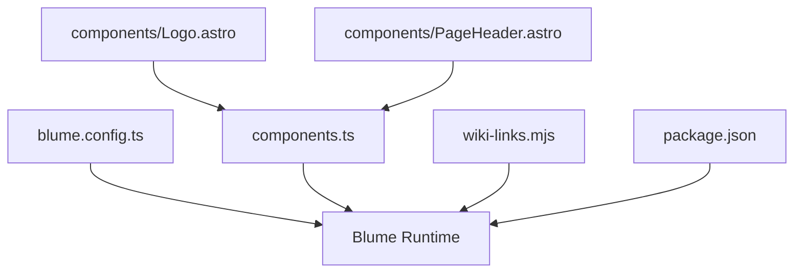
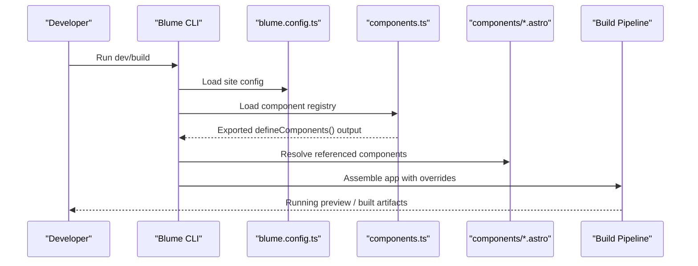
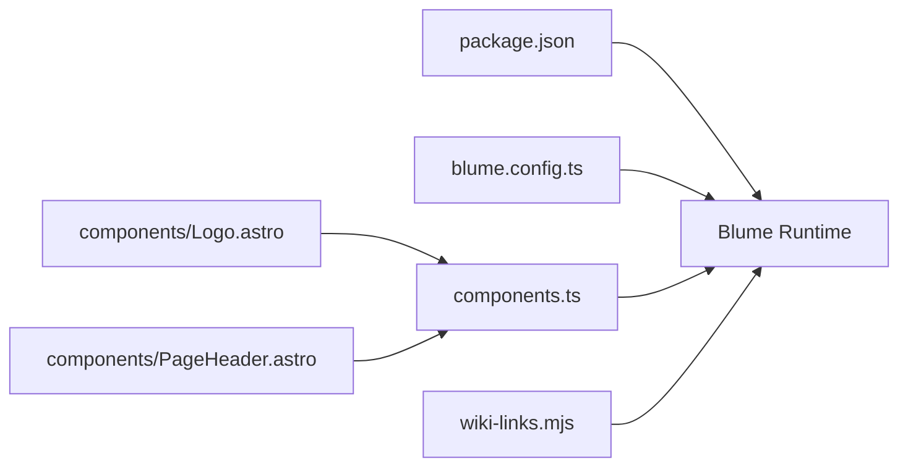

# Component Registration and Overrides

<cite>
**Referenced Files in This Document**
- [components.ts](file://components.ts)
- [blume.config.ts](file://blume.config.ts)
- [package.json](file://package.json)
- [BLUME-CUSTOMIZATION-BACKEND.md](file://BLUME-CUSTOMIZATION-BACKEND.md)
- [wiki-links.mjs](file://wiki-links.mjs)
- [Logo.astro](file://components/Logo.astro)
- [PageHeader.astro](file://components/PageHeader.astro)
</cite>

## Table of Contents
1. [Introduction](#introduction)
2. [Project Structure](#project-structure)
3. [Core Components](#core-components)
4. [Architecture Overview](#architecture-overview)
5. [Detailed Component Analysis](#detailed-component-analysis)
6. [Dependency Analysis](#dependency-analysis)
7. [Performance Considerations](#performance-considerations)
8. [Troubleshooting Guide](#troubleshooting-guide)
9. [Conclusion](#conclusion)
10. [Appendices](#appendices)

## Introduction
This document explains how Fractal Home registers and overrides Blume’s default components using the component registration system. It focuses on how components.ts manages imports, exports, and overrides for Blume’s layout components; how naming conventions determine which default component is replaced; how to extend existing components while maintaining compatibility; and how custom components are discovered and registered during the build process. It also covers integration with Blume’s configuration system, best practices for organization and versioning, and debugging strategies for registration issues.

## Project Structure
Fractal Home uses a small set of files to configure and override Blume:
- blume.config.ts configures site metadata, integrations, frontmatter schema, navigation, and theme settings.
- components.ts declares component overrides via defineComponents.
- components/*.astro contains the actual Astro components that replace or extend Blume defaults.
- wiki-links.mjs is an integration that transforms wiki-style links at build time.
- package.json defines scripts and dependencies, including the Blume runtime used by the project.

**Diagram sources**
- [blume.config.ts:1-67](file://blume.config.ts#L1-L67)
- [components.ts:1-12](file://components.ts#L1-L12)
- [Logo.astro:1-48](file://components/Logo.astro#L1-L48)
- [PageHeader.astro:1-31](file://components/PageHeader.astro#L1-L31)
- [wiki-links.mjs:1-125](file://wiki-links.mjs#L1-L125)
- [package.json:1-19](file://package.json#L1-L19)

**Section sources**
- [blume.config.ts:1-67](file://blume.config.ts#L1-L67)
- [components.ts:1-12](file://components.ts#L1-L12)
- [package.json:1-19](file://package.json#L1-L19)

## Core Components
The core of the override mechanism is components.ts, which:
- Imports Astro components from the local components directory.
- Registers them under the layout namespace using Blume’s defineComponents API.
- Exports the resulting registry as the default module so Blume can consume it.

Key behaviors:
- The layout object maps component names (e.g., Logo, PageHeader) to their implementations.
- Names must match Blume’s expected component identifiers to be recognized as overrides.
- Both string paths and direct component references are supported depending on the Blume version; this project uses direct imports for clarity and type safety.

**Section sources**
- [components.ts:1-12](file://components.ts#L1-L12)

## Architecture Overview
At build time, Blume reads both blume.config.ts and components.ts to assemble the final application:
- blume.config.ts provides site-level configuration, integrations, and theme settings.
- components.ts supplies the component registry that replaces Blume’s built-in components.
- Custom Astro components in components/ implement the overrides.
- Integrations like wiki-links.mjs hook into the build pipeline to transform content.

**Diagram sources**
- [blume.config.ts:1-67](file://blume.config.ts#L1-L67)
- [components.ts:1-12](file://components.ts#L1-L12)
- [wiki-links.mjs:1-125](file://wiki-links.mjs#L1-L125)

## Detailed Component Analysis

### Component Registry: components.ts
- Purpose: Centralized mapping of Blume layout components to project-specific implementations.
- Mechanism: Calls defineComponents with a layout object whose keys correspond to Blume’s internal component names.
- Import style: Direct imports of Astro components ensure static analysis and bundler optimizations.
- Extensibility: Add new overrides by importing the component and adding it to the layout object.

Best practices:
- Keep component names aligned with Blume’s expectations to avoid silent fallbacks.
- Prefer direct imports over string paths when possible for better tooling support.
- Group related overrides logically within the same file to maintain clarity.

**Section sources**
- [components.ts:1-12](file://components.ts#L1-L12)

### Override: Logo.astro
- Role: Replaces the default logo rendering in the header area.
- Props: Accepts site metadata and optional logo customization.
- Behavior: Renders brand assets with responsive sizing and theme-aware wordmark variants.
- Compatibility: Maintains accessibility attributes and semantic structure expected by Blume.

Implementation highlights:
- Uses Astro props interface for type safety.
- Leverages CSS classes for hover animations and theme switching.
- Avoids hard-coded colors; relies on tokens defined elsewhere.

**Section sources**
- [Logo.astro:1-48](file://components/Logo.astro#L1-L48)

### Override: PageHeader.astro
- Role: Adds page-level header content such as tags above the article body.
- Data access: Consumes Blume’s data module to resolve routes and fetch content entries.
- Rendering: Conditionally renders tag pills based on entry frontmatter.
- Integration: Works alongside Blume’s navigation and content model without breaking layout.

Implementation highlights:
- Reads tags from content frontmatter and filters empty values.
- Generates tag links with encoded slugs for consistent routing.
- Keeps markup minimal and accessible.

**Section sources**
- [PageHeader.astro:1-31](file://components/PageHeader.astro#L1-L31)

### Configuration: blume.config.ts
- Purpose: Defines site title, description, integrations, frontmatter schema, navigation, and theme fonts.
- Frontmatter: Extends schema with additional fields for knowledge-bank, tags, sources, related, timestamps, and more.
- Navigation: Configures tabs and sidebar display modes.
- Theme: Specifies font families and variants for display, body, and mono text.

Integration points:
- Integrations array includes wiki-links.mjs to transform wiki-style links during build.
- Fonts configuration ensures consistent typography across overridden components.

**Section sources**
- [blume.config.ts:1-67](file://blume.config.ts#L1-L67)

### Integration: wiki-links.mjs
- Purpose: Transforms wiki-style link syntax into standard markdown links at build time.
- Mechanism: Builds a map of titles/routes from docs content and wraps Markdown renderers to convert links.
- Hooks: Intercepts Astro’s markdown processor to inject transformation logic.

Build-time behavior:
- Scans docs directory recursively to index content.
- Normalizes titles and filenames to generate stable routes.
- Preserves fenced code blocks and handles edge cases gracefully.

**Section sources**
- [wiki-links.mjs:1-125](file://wiki-links.mjs#L1-L125)

### Scripts and Dependencies: package.json
- Scripts: Provide commands for development, building, previewing, checking, validating, and doctor diagnostics.
- Dependencies: Include Blume runtime, remark-wiki-link, and Zod for validation.

Usage patterns:
- Use npm/yarn/pnpm equivalents to run scripts.
- Ensure dependency versions align with Blume’s expected interfaces for component overrides.

**Section sources**
- [package.json:1-19](file://package.json#L1-L19)

## Dependency Analysis
The component system has clear boundaries:
- components.ts depends on Blume’s defineComponents API and local Astro components.
- blume.config.ts depends on Blume’s defineConfig and external integrations.
- wiki-links.mjs depends on Node filesystem APIs and hooks into Astro’s build pipeline.
- package.json orchestrates script execution and dependency resolution.

**Diagram sources**
- [package.json:1-19](file://package.json#L1-L19)
- [blume.config.ts:1-67](file://blume.config.ts#L1-L67)
- [components.ts:1-12](file://components.ts#L1-L12)
- [Logo.astro:1-48](file://components/Logo.astro#L1-L48)
- [PageHeader.astro:1-31](file://components/PageHeader.astro#L1-L31)
- [wiki-links.mjs:1-125](file://wiki-links.mjs#L1-L125)

**Section sources**
- [components.ts:1-12](file://components.ts#L1-L12)
- [blume.config.ts:1-67](file://blume.config.ts#L1-L67)
- [wiki-links.mjs:1-125](file://wiki-links.mjs#L1-L125)
- [package.json:1-19](file://package.json#L1-L19)

## Performance Considerations
- Prefer direct component imports in components.ts to enable tree-shaking and static analysis.
- Keep override components lightweight; defer heavy logic to client-side interactions if needed.
- Use Blume’s data modules efficiently; avoid unnecessary re-renders by caching computed values.
- Validate frontmatter schemas in blume.config.ts to catch errors early and reduce runtime overhead.

[No sources needed since this section provides general guidance]

## Troubleshooting Guide
Common issues and resolutions:
- Component not overriding: Ensure the key in components.ts matches Blume’s expected component name exactly.
- Build errors referencing generated directories: Do not edit .blume/, .blume-verify/, or dist/; these are regenerated.
- Missing props or types: Verify Astro component interfaces align with Blume’s expectations.
- Integration not running: Confirm wiki-links.mjs is included in blume.config.ts integrations array.
- Script failures: Use blume check and blume validate to diagnose configuration and content issues.

Useful references:
- Customization guide outlines where to place overrides and what to avoid editing.
- Package scripts provide diagnostic commands for faster troubleshooting.

**Section sources**
- [BLUME-CUSTOMIZATION-BACKEND.md:1-505](file://BLUME-CUSTOMIZATION-BACKEND.md#L1-L505)
- [package.json:1-19](file://package.json#L1-L19)

## Conclusion
Fractal Home’s component registration and override system centers on components.ts and Blume’s defineComponents API. By adhering to naming conventions, maintaining compatible component interfaces, and leveraging Blume’s configuration and integration mechanisms, you can reliably extend and customize Blume’s default components. Following the best practices outlined here ensures maintainability, performance, and smooth upgrades as Blume evolves.

[No sources needed since this section summarizes without analyzing specific files]

## Appendices

### Practical Examples

- Overriding a default component:
  - Create an Astro component in components/.
  - Import it in components.ts and add it to the layout object with the correct key.
  - Test locally using the dev script.

- Creating a component variant:
  - Duplicate an existing component and adjust props or markup.
  - Register the variant under a new key if Blume supports multiple slots; otherwise, use conditional rendering inside the override.

- Managing dependencies between components:
  - Keep shared logic in utility modules outside components.ts.
  - Import utilities into your Astro components to avoid duplication.

- Versioning considerations:
  - Pin Blume versions in package.json to ensure compatibility.
  - Review Blume release notes for changes to component interfaces before upgrading.

- Debugging registration issues:
  - Run blume check and blume validate to surface configuration and content problems.
  - Inspect console logs during dev for import or prop mismatches.

[No sources needed since this section provides general guidance]