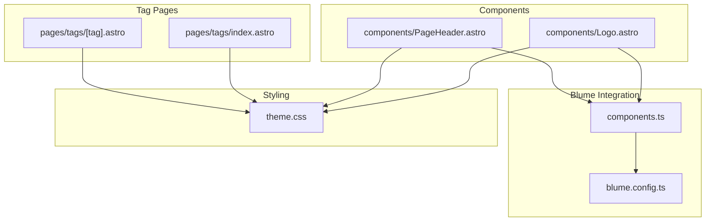
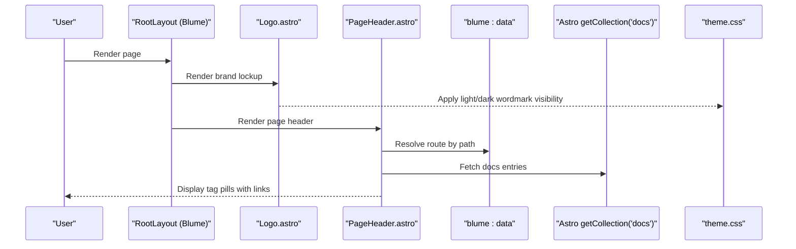
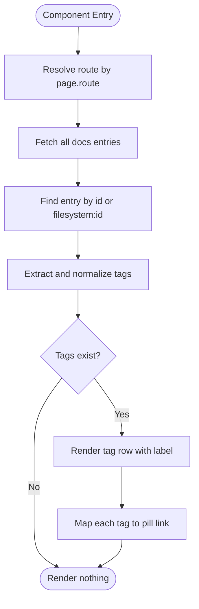
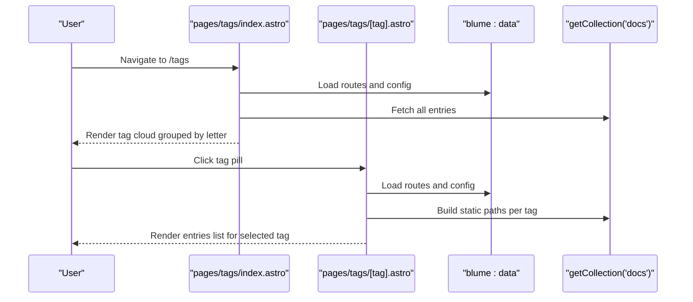
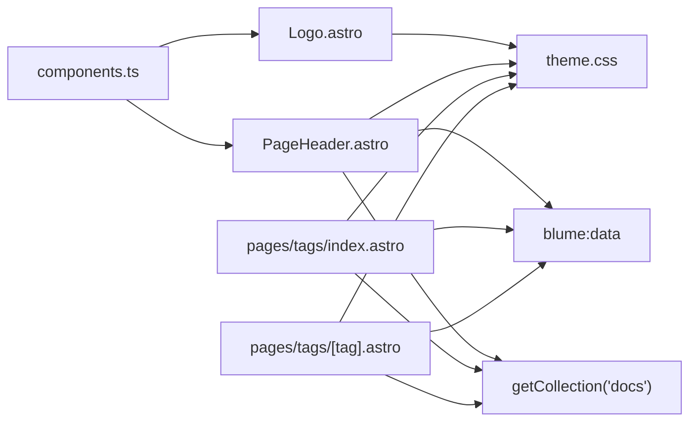

# Custom Components

<cite>
**Referenced Files in This Document**
- [Logo.astro](file://components/Logo.astro)
- [PageHeader.astro](file://components/PageHeader.astro)
- [components.ts](file://components.ts)
- [theme.css](file://theme.css)
- [blume.config.ts](file://blume.config.ts)
- [pages/tags/index.astro](file://pages/tags/index.astro)
- [pages/tags/[tag].astro](file://pages/tags/[tag].astro)
</cite>

## Table of Contents
1. [Introduction](#introduction)
2. [Project Structure](#project-structure)
3. [Core Components](#core-components)
4. [Architecture Overview](#architecture-overview)
5. [Detailed Component Analysis](#detailed-component-analysis)
6. [Dependency Analysis](#dependency-analysis)
7. [Performance Considerations](#performance-considerations)
8. [Troubleshooting Guide](#troubleshooting-guide)
9. [Conclusion](#conclusion)
10. [Appendices](#appendices)

## Introduction
This document provides a comprehensive guide to the custom Astro components used in Fractal Home, focusing on the Logo and PageHeader components. It explains their props interfaces, image handling for light/dark mode switching, accessibility features, responsive design patterns, tag display functionality, hover effects, integration with the tag system, and component composition patterns. It also includes guidance for creating new custom components following established patterns, lifecycle management, and performance optimization techniques such as lazy loading and async decoding.

## Project Structure
Fractal Home organizes custom layout components under the components directory and registers them via Blume’s component override mechanism. The theme is defined in a dedicated CSS file, and configuration is centralized in a Blume config file. Tag pages are implemented as Astro routes that integrate with the content collection.



**Diagram sources**
- [components.ts:1-11](file://components.ts#L1-L11)
- [blume.config.ts:1-67](file://blume.config.ts#L1-L67)
- [theme.css:1-673](file://theme.css#L1-L673)
- [Logo.astro:1-48](file://components/Logo.astro#L1-L48)
- [PageHeader.astro:1-31](file://components/PageHeader.astro#L1-L31)
- [pages/tags/index.astro:1-74](file://pages/tags/index.astro#L1-L74)
- [pages/tags/[tag].astro:1-61](file://pages/tags/[tag].astro#L1-L61)

**Section sources**
- [components.ts:1-11](file://components.ts#L1-L11)
- [blume.config.ts:1-67](file://blume.config.ts#L1-L67)
- [theme.css:1-673](file://theme.css#L1-L673)

## Core Components
- Logo: A brand lockup component that renders an icon motif and split wordmark images for light/dark modes. It accepts site metadata and optional logo text, uses eager loading and async decoding for performance, and includes accessible labels.
- PageHeader: Displays contextual tags for the current page by resolving route data and content entries, then rendering tag pills linking to tag index/detail pages.

Key responsibilities:
- Props validation via TypeScript interfaces.
- Data fetching from Blume’s data module and Astro content collections.
- Rendering semantic markup with Tailwind classes and theme-aware styles.
- Accessibility through aria-labels and proper alt attributes.

**Section sources**
- [Logo.astro:1-48](file://components/Logo.astro#L1-L48)
- [PageHeader.astro:1-31](file://components/PageHeader.astro#L1-L31)

## Architecture Overview
The custom components are registered with Blume and styled using global tokens. Theme switching toggles CSS variables and visibility of light/dark assets. Tag pages aggregate and display tags derived from content frontmatter.



**Diagram sources**
- [components.ts:1-11](file://components.ts#L1-L11)
- [Logo.astro:1-48](file://components/Logo.astro#L1-L48)
- [PageHeader.astro:1-31](file://components/PageHeader.astro#L1-L31)
- [theme.css:106-116](file://theme.css#L106-L116)
- [pages/tags/index.astro:1-74](file://pages/tags/index.astro#L1-L74)
- [pages/tags/[tag].astro:1-61](file://pages/tags/[tag].astro#L1-L61)

## Detailed Component Analysis

### Logo Component Analysis
The Logo component implements a responsive, accessible brand link with dual wordmark images for light and dark themes. It uses eager loading and async decoding to optimize initial render.

Props interface:
- site: object containing title string
- logo: optional object with text property or null

Accessibility:
- Anchor element has aria-label combining site title and “home” context
- Motif image has empty alt to avoid redundant announcements
- Wordmark images have appropriate alt values; dark variant is hidden from assistive tech

Responsive and interactive behavior:
- Uses Tailwind utilities for sizing, spacing, and transitions
- Hover rotation effect on the motif via group-hover class
- Image dimensions set explicitly to prevent layout shifts

Theme switching:
- Light and dark wordmarks are toggled via CSS selectors based on data-theme attribute

```mermaid
classDiagram
class Logo {
+site : { title : string }
+logo? : { text? : string } | null
+render() void
}
```

**Diagram sources**
- [Logo.astro:6-11](file://components/Logo.astro#L6-L11)

**Section sources**
- [Logo.astro:1-48](file://components/Logo.astro#L1-L48)
- [theme.css:106-116](file://theme.css#L106-L116)

### PageHeader Component Analysis
The PageHeader component displays tags associated with the current page. It resolves the route using Blume’s data module, fetches the corresponding entry from the docs collection, extracts tags, and renders pill links to tag detail pages.

Props interface:
- page: object with title and route strings

Processing logic:
- Finds route matching the provided route path
- Locates the content entry by id or filesystem-prefixed id
- Extracts and normalizes tags from frontmatter
- Renders conditional tag row with label and clickable pills

Integration with tag system:
- Links point to /tags/{slug} using encoded lowercase tag names
- Styling and hover effects are applied via theme.css classes



**Diagram sources**
- [PageHeader.astro:9-16](file://components/PageHeader.astro#L9-L16)
- [theme.css:527-565](file://theme.css#L527-L565)

**Section sources**
- [PageHeader.astro:1-31](file://components/PageHeader.astro#L1-L31)
- [theme.css:527-565](file://theme.css#L527-L565)

### Tag System Integration
Tag pages provide an index and detail views for tags across the knowledge base. They use Astro’s content collection API and Blume’s routing data to build tag clouds and entry lists.

- Index page aggregates unique tags with counts, groups them alphabetically, and renders sections with labeled headings.
- Detail page generates static paths for each tag and lists entries sorted by title.



**Diagram sources**
- [pages/tags/index.astro:1-74](file://pages/tags/index.astro#L1-L74)
- [pages/tags/[tag].astro:1-61](file://pages/tags/[tag].astro#L1-L61)

**Section sources**
- [pages/tags/index.astro:1-74](file://pages/tags/index.astro#L1-L74)
- [pages/tags/[tag].astro:1-61](file://pages/tags/[tag].astro#L1-L61)

## Dependency Analysis
Custom components are registered via Blume’s defineComponents function, which maps layout slots to Astro components. Styling relies on theme.css tokens and Tailwind utilities. Tag pages depend on blume:data and Astro’s content APIs.



**Diagram sources**
- [components.ts:1-11](file://components.ts#L1-L11)
- [theme.css:1-673](file://theme.css#L1-L673)
- [PageHeader.astro:1-31](file://components/PageHeader.astro#L1-L31)
- [pages/tags/index.astro:1-74](file://pages/tags/index.astro#L1-L74)
- [pages/tags/[tag].astro:1-61](file://pages/tags/[tag].astro#L1-L61)

**Section sources**
- [components.ts:1-11](file://components.ts#L1-L11)
- [theme.css:1-673](file://theme.css#L1-L673)

## Performance Considerations
- Eager loading and async decoding: Images in the Logo component use loading="eager" and decoding="async" to prioritize critical branding assets while offloading decode work.
- Reduced motion: Global media query ensures animations respect user preferences.
- Layout stability: Explicit width and height on images prevent cumulative layout shift.
- Conditional rendering: PageHeader only renders when tags exist, minimizing unnecessary DOM.
- Static generation: Tag detail pages precompute paths at build time to avoid runtime overhead.

[No sources needed since this section provides general guidance]

## Troubleshooting Guide
- Missing tags: Ensure content entries include a tags array in frontmatter. The PageHeader filters out empty strings and trims whitespace.
- Incorrect tag links: Verify tag normalization to lowercase and URL encoding in links.
- Theme switching issues: Confirm data-theme attribute is set on root and CSS selectors match expected classes for wordmark visibility.
- Accessibility concerns: Check aria-label presence on anchor elements and alt attributes on decorative images.

**Section sources**
- [PageHeader.astro:15-16](file://components/PageHeader.astro#L15-L16)
- [theme.css:106-116](file://theme.css#L106-L116)
- [Logo.astro:17-17](file://components/Logo.astro#L17-L17)

## Conclusion
The Logo and PageHeader components exemplify a clean, accessible, and performant approach to building reusable UI elements in Fractal Home. By leveraging Blume’s component registration, Astro’s content APIs, and theme-aware styling, they deliver consistent experiences across light and dark modes while integrating seamlessly with the tag system. Following the patterns outlined here will help you create new custom components that align with the project’s architecture and quality standards.

[No sources needed since this section summarizes without analyzing specific files]

## Appendices

### Creating New Custom Components
- Define a TypeScript interface for props to ensure type safety.
- Use Astro.props to access passed data and compute derived state.
- Prefer semantic HTML and Tailwind utilities for structure and styling.
- Integrate with blume:data and Astro content APIs as needed.
- Register the component in components.ts under the appropriate slot.
- Style with theme.css tokens to maintain coherence across themes.

**Section sources**
- [components.ts:1-11](file://components.ts#L1-L11)
- [blume.config.ts:1-67](file://blume.config.ts#L1-L67)
- [theme.css:1-673](file://theme.css#L1-L673)