# Layout System and Integration

<cite>
**Referenced Files in This Document**
- [blume.config.ts](file://blume.config.ts)
- [components.ts](file://components.ts)
- [theme.css](file://theme.css)
- [BLUME-CUSTOMIZATION-BACKEND.md](file://BLUME-CUSTOMIZATION-BACKEND.md)
- [wiki-links.mjs](file://wiki-links.mjs)
- [Logo.astro](file://components/Logo.astro)
- [PageHeader.astro](file://components/PageHeader.astro)
- [pages/tags/index.astro](file://pages/tags/index.astro)
- [pages/tags/[tag].astro](file://pages/tags/[tag].astro)
- [package.json](file://package.json)
</cite>

## Table of Contents
1. Introduction
2. Project Structure
3. Core Components
4. Architecture Overview
5. Detailed Component Analysis
6. Dependency Analysis
7. Performance Considerations
8. Troubleshooting Guide
9. Conclusion

## Introduction
This document explains how Fractal Home integrates with Blume’s layout system to deliver a responsive, accessible, and themeable documentation experience. It covers custom component integration (header, logo, page header), sidebar customization, table of contents generation, navigation structure, collapsible sections, dynamic content rendering, and the theme system via CSS custom properties. It also addresses mobile-first patterns, accessibility considerations, cross-browser compatibility, and performance optimization for layout-heavy pages.

## Project Structure
Fractal Home uses Blume as the docs engine built on Astro. The project configures Blume, registers custom components, defines frontmatter schema, sets up navigation, and applies a cohesive visual system through CSS tokens.

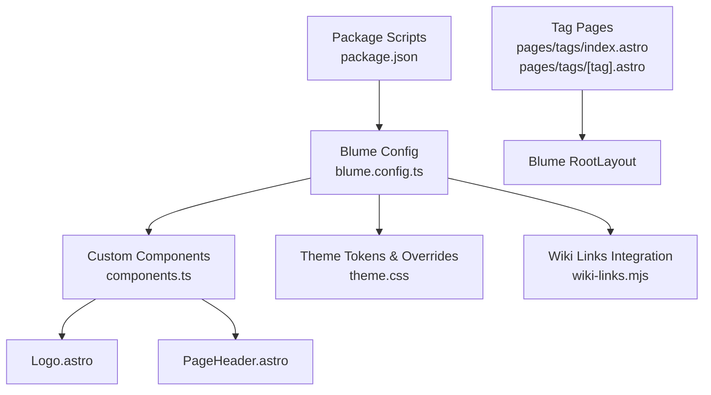

**Diagram sources**
- [blume.config.ts:1-67](file://blume.config.ts#L1-L67)
- [components.ts:1-12](file://components.ts#L1-L12)
- [theme.css:1-673](file://theme.css#L1-L673)
- [wiki-links.mjs:1-125](file://wiki-links.mjs#L1-L125)
- [pages/tags/index.astro:1-74](file://pages/tags/index.astro#L1-L74)
- [pages/tags/[tag].astro:1-61](file://pages/tags/[tag].astro#L1-L61)
- [package.json:1-19](file://package.json#L1-L19)

**Section sources**
- [blume.config.ts:1-67](file://blume.config.ts#L1-L67)
- [components.ts:1-12](file://components.ts#L1-L12)
- [theme.css:1-673](file://theme.css#L1-L673)
- [wiki-links.mjs:1-125](file://wiki-links.mjs#L1-L125)
- [pages/tags/index.astro:1-74](file://pages/tags/index.astro#L1-L74)
- [pages/tags/[tag].astro:1-61](file://pages/tags/[tag].astro#L1-L61)
- [package.json:1-19](file://package.json#L1-L19)

## Core Components
- Blume configuration: Defines site metadata, integrations, frontmatter schema, navigation tabs, sidebar display mode, and font settings.
- Component registration: Exposes custom Logo and PageHeader components to Blume’s layout slots.
- Theme system: Centralized CSS custom properties for light/dark themes, typography, spacing, and component-level overrides.
- Wiki links integration: Transforms wiki-style links into standard markdown links at build time.
- Tag pages: Generate tag index and per-tag listing pages using Blume’s RootLayout.

Key responsibilities:
- blume.config.ts: Site identity, navigation, frontmatter validation, fonts.
- components.ts: Map custom Astro components to Blume layout slots.
- theme.css: Global tokens, header/sidebar/TOC styling, prose, search dialog, pagination, tags UI, motion guards.
- wiki-links.mjs: Build-time link resolution and transformation.
- pages/tags/*: Dynamic tag-driven content pages.

**Section sources**
- [blume.config.ts:1-67](file://blume.config.ts#L1-L67)
- [components.ts:1-12](file://components.ts#L1-L12)
- [theme.css:1-673](file://theme.css#L1-L673)
- [wiki-links.mjs:1-125](file://wiki-links.mjs#L1-L125)
- [pages/tags/index.astro:1-74](file://pages/tags/index.astro#L1-L74)
- [pages/tags/[tag].astro:1-61](file://pages/tags/[tag].astro#L1-L61)

## Architecture Overview
The layout architecture combines Blume’s default doc grid with custom components and a token-based theme layer.

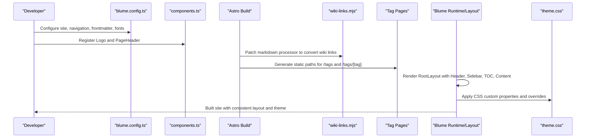

**Diagram sources**
- [blume.config.ts:1-67](file://blume.config.ts#L1-L67)
- [components.ts:1-12](file://components.ts#L1-L12)
- [wiki-links.mjs:1-125](file://wiki-links.mjs#L1-L125)
- [pages/tags/index.astro:1-74](file://pages/tags/index.astro#L1-L74)
- [pages/tags/[tag].astro:1-61](file://pages/tags/[tag].astro#L1-L61)
- [theme.css:1-673](file://theme.css#L1-L673)

## Detailed Component Analysis

### Blume Configuration and Navigation
- Site metadata and description are defined centrally.
- Frontmatter schema is extended with Zod types for knowledge-bank, tags, sources, related, timestamps, project metadata, boss/group/supergroup, and links.
- Navigation includes featured items and tabs; sidebar display mode is set to group.
- Fonts are configured for display/body (variable woff2 files) and mono.

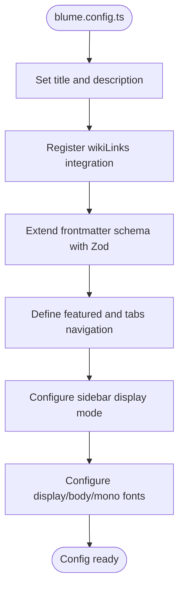

**Diagram sources**
- [blume.config.ts:1-67](file://blume.config.ts#L1-L67)

**Section sources**
- [blume.config.ts:1-67](file://blume.config.ts#L1-L67)

### Custom Components Registration
- components.ts imports and registers Logo and PageHeader under Blume’s layout slot map.
- This enables Blume to render these components in place of defaults where supported.

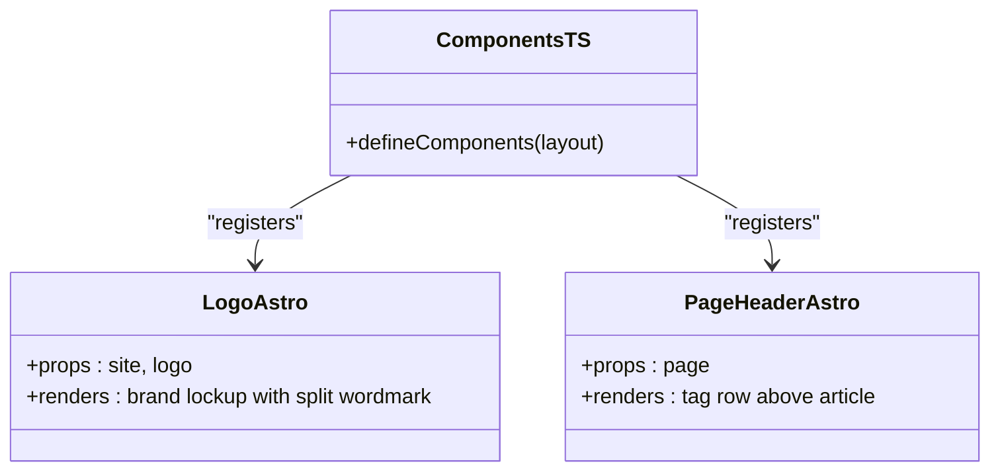

**Diagram sources**
- [components.ts:1-12](file://components.ts#L1-L12)
- [Logo.astro:1-48](file://components/Logo.astro#L1-L48)
- [PageHeader.astro:1-31](file://components/PageHeader.astro#L1-L31)

**Section sources**
- [components.ts:1-12](file://components.ts#L1-L12)
- [Logo.astro:1-48](file://components/Logo.astro#L1-L48)
- [PageHeader.astro:1-31](file://components/PageHeader.astro#L1-L31)

### Header Modifications and Branding
- Logo.astro renders a faceted motif and split-color wordmark that switches between light and dark variants based on data-theme.
- theme.css styles the header region with backdrop blur, hairline border, height, hover states, and active tab highlighting.
- Accessibility: aria-label on home link; proper alt text handling; visible focus outlines.

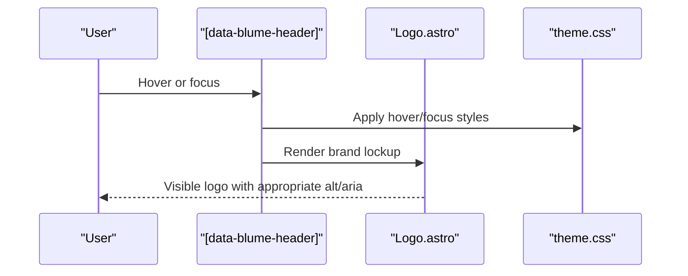

**Diagram sources**
- [Logo.astro:1-48](file://components/Logo.astro#L1-L48)
- [theme.css:92-143](file://theme.css#L92-L143)

**Section sources**
- [Logo.astro:1-48](file://components/Logo.astro#L1-L48)
- [theme.css:92-143](file://theme.css#L92-L143)

### Sidebar Customization and Collapsible Sections
- Sidebar surface, borders, and item styles are applied via theme.css selectors scoped to Blume’s doc grid aside elements.
- Active page rows use a soft green background; group labels and collapsible details are styled as uppercase section headers.
- Mobile drawer behavior shares the same active state styling.

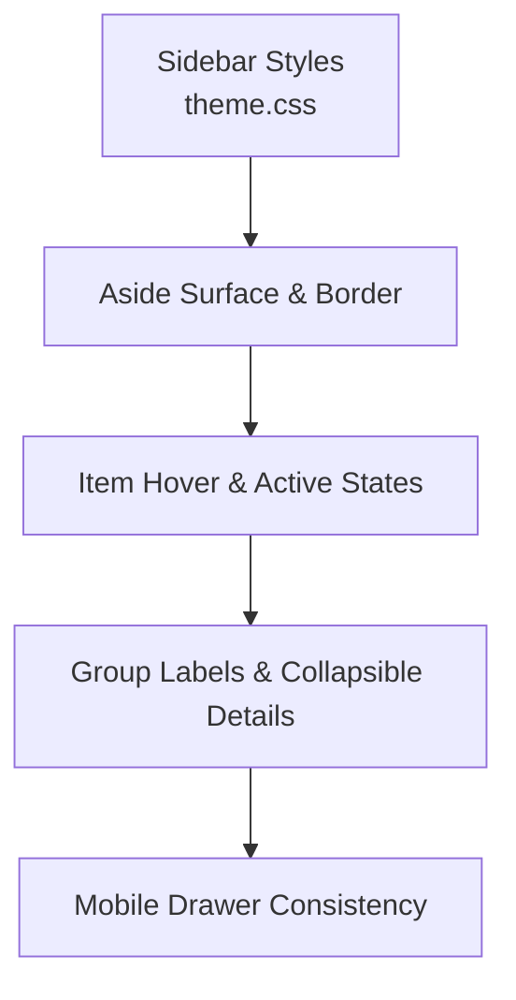

**Diagram sources**
- [theme.css:147-195](file://theme.css#L147-L195)

**Section sources**
- [theme.css:147-195](file://theme.css#L147-L195)

### Table of Contents Generation
- Right rail TOC is styled with hairline left rule, refined active state, and hover effects.
- Mobile TOC appears as a details element above the article and inherits consistent styling.

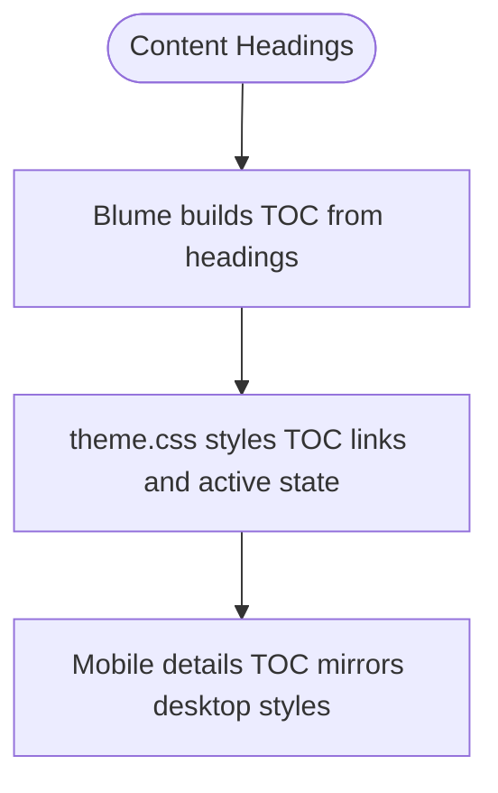

**Diagram sources**
- [theme.css:200-233](file://theme.css#L200-L233)

**Section sources**
- [theme.css:200-233](file://theme.css#L200-L233)

### Dynamic Content Rendering: Tag Index and Tag Detail
- Tag index aggregates all tags across docs, groups them alphabetically, and renders a cloud with counts.
- Tag detail page lists entries for a specific tag, sorted by title, with descriptions when available.
- Both pages use Blume’s RootLayout and pass navigation/theme/search props.

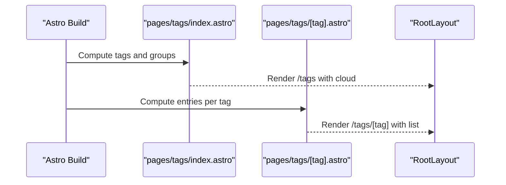

**Diagram sources**
- [pages/tags/index.astro:1-74](file://pages/tags/index.astro#L1-L74)
- [pages/tags/[tag].astro:1-61](file://pages/tags/[tag].astro#L1-L61)

**Section sources**
- [pages/tags/index.astro:1-74](file://pages/tags/index.astro#L1-L74)
- [pages/tags/[tag].astro:1-61](file://pages/tags/[tag].astro#L1-L61)

### Wiki Links Integration
- wiki-links.mjs scans docs, builds a title-to-route map, and transforms [[page]] wiki syntax into standard markdown links during build.
- It patches both createRenderer and createMdxRenderer to ensure all renderers see the transformed content.

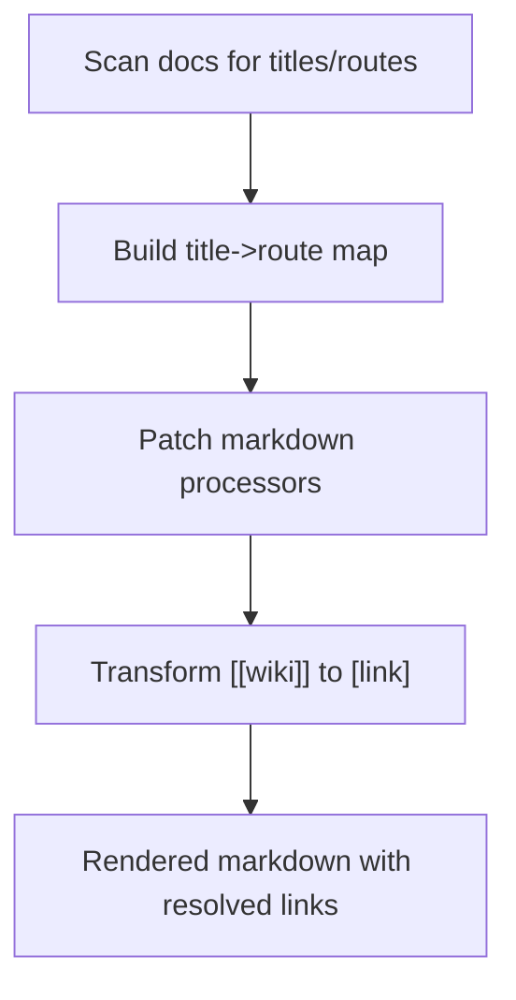

**Diagram sources**
- [wiki-links.mjs:1-125](file://wiki-links.mjs#L1-L125)

**Section sources**
- [wiki-links.mjs:1-125](file://wiki-links.mjs#L1-L125)

### Theme System and Responsive Design
- Light and dark themes are defined via CSS custom properties under :root and :root[data-theme="dark"].
- Tokens include backgrounds, foregrounds, muted colors, borders, accents, code surfaces, radius, and content width.
- Prose typography, tables, code blocks, callouts, search dialog, pagination, buttons, and tags UI are styled consistently.
- Motion is guarded by prefers-reduced-motion to respect user preferences.

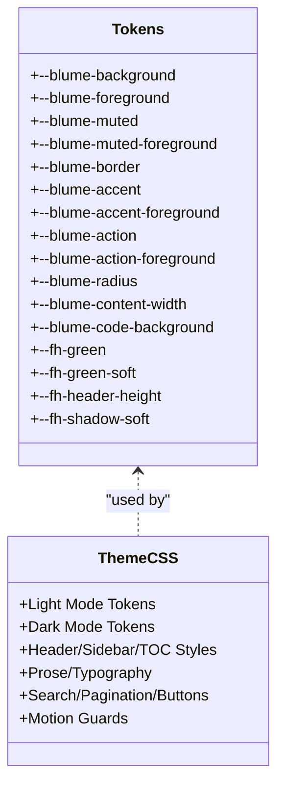

**Diagram sources**
- [theme.css:12-61](file://theme.css#L12-L61)
- [theme.css:66-673](file://theme.css#L66-L673)

**Section sources**
- [theme.css:12-61](file://theme.css#L12-L61)
- [theme.css:66-673](file://theme.css#L66-L673)

## Dependency Analysis
The layout system depends on Blume’s runtime and Astro’s build pipeline, with custom components and CSS overriding Blume’s defaults.

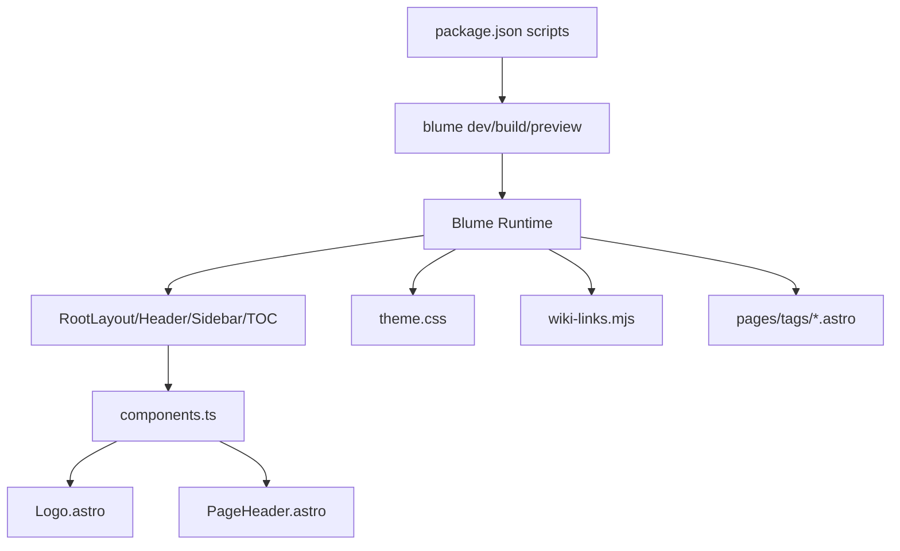

**Diagram sources**
- [package.json:1-19](file://package.json#L1-L19)
- [components.ts:1-12](file://components.ts#L1-L12)
- [theme.css:1-673](file://theme.css#L1-L673)
- [wiki-links.mjs:1-125](file://wiki-links.mjs#L1-L125)
- [pages/tags/index.astro:1-74](file://pages/tags/index.astro#L1-L74)
- [pages/tags/[tag].astro:1-61](file://pages/tags/[tag].astro#L1-L61)

**Section sources**
- [package.json:1-19](file://package.json#L1-L19)
- [components.ts:1-12](file://components.ts#L1-L12)
- [theme.css:1-673](file://theme.css#L1-L673)
- [wiki-links.mjs:1-125](file://wiki-links.mjs#L1-L125)
- [pages/tags/index.astro:1-74](file://pages/tags/index.astro#L1-L74)
- [pages/tags/[tag].astro:1-61](file://pages/tags/[tag].astro#L1-L61)

## Performance Considerations
- Prefer CSS tokens and selectors over heavy component overrides to minimize re-renders and maintainability overhead.
- Use eager loading for critical images (logo assets) and async decoding to avoid layout shifts.
- Respect prefers-reduced-motion to reduce unnecessary animations.
- Keep sidebar and TOC lightweight; avoid excessive nested details for very large trees.
- Avoid hardcoding colors; rely on tokens to prevent repaint thrash across themes.
- Validate changes with Blume’s check and build commands before deployment.

[No sources needed since this section provides general guidance]

## Troubleshooting Guide
Common issues and resolutions:
- Generated files overwritten: Do not edit .blume/, .blume-verify/, or dist/. Changes will be lost on rebuild.
- Header appearance not updating: Ensure selectors target [data-blume-header] and verify theme.css is injected last.
- Sidebar active state missing: Confirm aria-current="page" is present and theme.css selectors match Blume’s DOM.
- TOC not reflecting headings: Verify headings exist in content and theme.css targets the correct aside:last-of-type.
- Wiki links unresolved: Check wiki-links.mjs mapping and ensure titles match frontmatter exactly.
- Tag pages empty: Ensure entries have tags and are indexable; hidden sidebar entries are excluded intentionally.

Verification steps:
- Run blume check and blume build to validate configuration and assets.
- Test both light and dark modes across desktop and narrow viewports.
- Confirm keyboard focus visibility and interactive behaviors.

**Section sources**
- [BLUME-CUSTOMIZATION-BACKEND.md:1-524](file://BLUME-CUSTOMIZATION-BACKEND.md#L1-L524)

## Conclusion
Fractal Home leverages Blume’s robust layout system with a token-driven theme and minimal, targeted customizations. Custom components enhance branding and content presentation, while CSS tokens ensure consistency across light and dark themes. The wiki links integration streamlines authoring, and tag pages provide dynamic navigation. By following the documented patterns—token-first styling, selective component overrides, and careful attention to accessibility and performance—the layout remains scalable, maintainable, and user-friendly across devices and browsers.