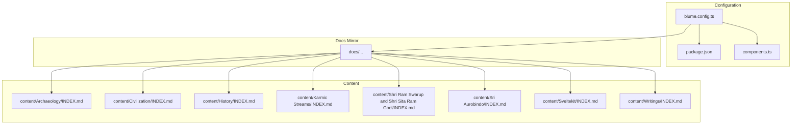
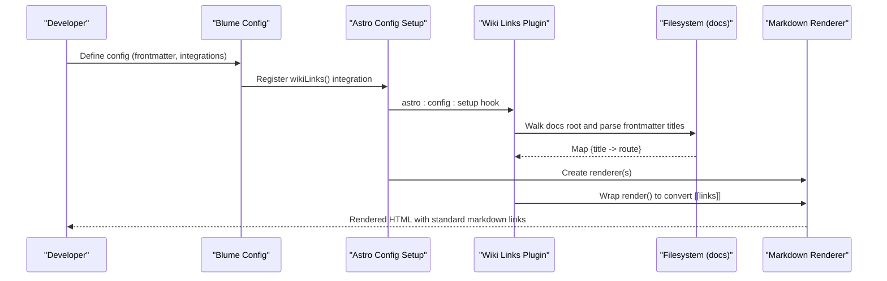
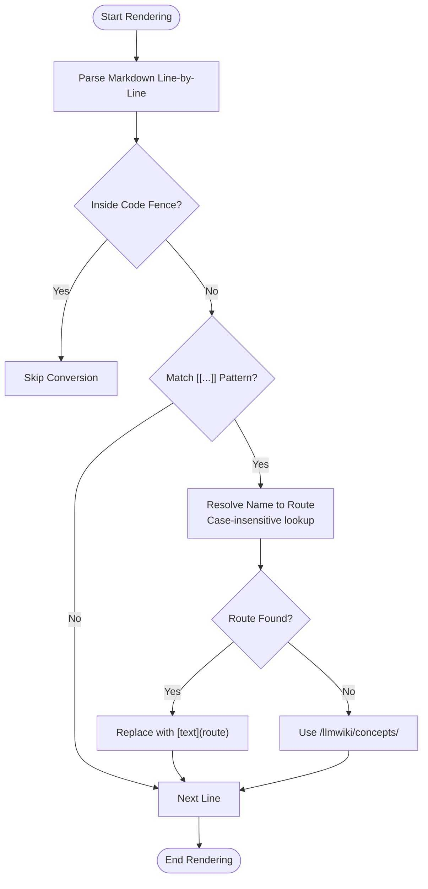
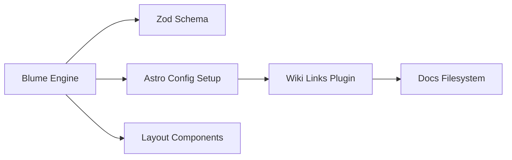

# Content Management System

<cite>
**Referenced Files in This Document**
- [blume.config.ts](file://blume.config.ts)
- [wiki-links.mjs](file://wiki-links.mjs)
- [components.ts](file://components.ts)
- [package.json](file://package.json)
- [content/Archaeology/INDEX.md](file://content/Archaeology/INDEX.md)
- [content/Civilization/INDEX.md](file://content/Civilization/INDEX.md)
- [content/Sveltekit/INDEX.md](file://content/Sveltekit/INDEX.md)
- [content/Writings/INDEX.md](file://content/Writings/INDEX.md)
- [content/Archaeology/archaeobotany-archaeozoology.md](file://content/Archaeology/archaeobotany-archaeozoology.md)
- [content/Sveltekit/svelte-5-runes.md](file://content/Sveltekit/svelte-5-runes.md)
</cite>

## Table of Contents
1. Introduction
2. Project Structure
3. Core Components
4. Architecture Overview
5. Detailed Component Analysis
6. Dependency Analysis
7. Performance Considerations
8. Troubleshooting Guide
9. Conclusion

## Introduction
This document explains the Fractal Home content management system’s markdown-first approach and hierarchical organization. It covers the category structure, frontmatter schema validated with Zod, and a custom wiki link system that converts [[page-name]] syntax into standard markdown links with case-insensitive resolution. Practical examples of index files, cross-referencing patterns, validation rules, error handling, and performance considerations for large knowledge bases are included.

## Project Structure
The repository organizes content under a content directory with top-level categories: Archaeology, Civilization, History, Karmic Streams, Shri Ram Swarup and Shri Sita Ram Goel, Sri Aurobindo, Sveltekit, and Writings. Each category typically includes an INDEX.md file that serves as a topic map and entry point. The docs directory mirrors this structure to support build-time processing and routing. Configuration is centralized in blume.config.ts, which defines the title, description, integrations (including the wiki-links plugin), frontmatter schema via Zod, navigation, and theme settings. Components are registered through components.ts.

**Diagram sources**
- [blume.config.ts:1-67](file://blume.config.ts#L1-L67)
- [package.json:1-19](file://package.json#L1-L19)
- [components.ts:1-12](file://components.ts#L1-L12)
- [content/Archaeology/INDEX.md:1-88](file://content/Archaeology/INDEX.md#L1-L88)
- [content/Civilization/INDEX.md:1-19](file://content/Civilization/INDEX.md#L1-L19)
- [content/Sveltekit/INDEX.md:1-80](file://content/Sveltekit/INDEX.md#L1-L88)
- [content/Writings/INDEX.md:1-41](file://content/Writings/INDEX.md#L1-L41)

**Section sources**
- [blume.config.ts:1-67](file://blume.config.ts#L1-L67)
- [package.json:1-19](file://package.json#L1-L19)
- [components.ts:1-12](file://components.ts#L1-L12)
- [content/Archaeology/INDEX.md:1-88](file://content/Archaeology/INDEX.md#L1-L88)
- [content/Civilization/INDEX.md:1-19](file://content/Civilization/INDEX.md#L1-L19)
- [content/Sveltekit/INDEX.md:1-80](file://content/Sveltekit/INDEX.md#L1-L80)
- [content/Writings/INDEX.md:1-41](file://content/Writings/INDEX.md#L1-L41)

## Core Components
- Blume configuration: Defines site metadata, integrations, frontmatter schema (Zod), navigation, and theme fonts.
- Wiki links integration: Scans the docs root to build a title-to-route map, then transforms wiki-style links during rendering.
- Component registry: Exposes layout components to Blume.
- Package scripts and dependencies: Provide dev/build/validate commands and include Blume, remark-wiki-link, and Zod.

Key responsibilities:
- Frontmatter validation ensures consistent metadata across all pages.
- Wiki link resolution supports case-insensitive matching and fallbacks.
- Navigation and theme configuration shape the user experience.

**Section sources**
- [blume.config.ts:1-67](file://blume.config.ts#L1-L67)
- [wiki-links.mjs:1-125](file://wiki-links.mjs#L1-L125)
- [components.ts:1-12](file://components.ts#L1-L12)
- [package.json:1-19](file://package.json#L1-L19)

## Architecture Overview
The system uses Blume as the content engine with a custom wiki-links integration. During Astro config setup, the integration scans the docs root, builds a mapping from page titles and filenames to routes, and wraps Markdown renderers to convert wiki links before final rendering. Frontmatter is validated against a Zod schema defined in the Blume configuration.

**Diagram sources**
- [blume.config.ts:1-67](file://blume.config.ts#L1-L67)
- [wiki-links.mjs:1-125](file://wiki-links.mjs#L1-L125)

## Detailed Component Analysis

### Frontmatter Schema and Validation
The frontmatter schema extends Blume’s defaults with fields commonly used across the knowledge base:
- knowledge-bank: array of strings
- tags: array of strings
- sources: array of strings
- related: array of strings
- timestamp: string (coerced)
- source: string
- created: string (coerced)
- updated: string (coerced)
- project: string
- boss: string
- group: string
- supergroup: string
- links: optional array of objects with url and name

Validation occurs at build time via Zod. Pages should include these fields where applicable to ensure consistency and enable features like indexing, filtering, and cross-references.

Examples of usage:
- Category indexes define knowledge-bank identifiers and descriptive tags.
- Topic pages list sources and related entries to connect content across categories.

Best practices:
- Use consistent naming for knowledge-bank IDs (e.g., numeric prefixes).
- Keep tags concise and reusable across pages.
- Populate sources and related fields to strengthen cross-references.

**Section sources**
- [blume.config.ts:9-25](file://blume.config.ts#L9-L25)
- [content/Archaeology/INDEX.md:1-88](file://content/Archaeology/INDEX.md#L1-L88)
- [content/Civilization/INDEX.md:1-19](file://content/Civilization/INDEX.md#L1-L19)
- [content/Sveltekit/INDEX.md:1-80](file://content/Sveltekit/INDEX.md#L1-L80)
- [content/Writings/INDEX.md:1-41](file://content/Writings/INDEX.md#L1-L41)
- [content/Archaeology/archaeobotany-archaeozoology.md:1-62](file://content/Archaeology/archaeobotany-archaeozoology.md#L1-L62)
- [content/Sveltekit/svelte-5-runes.md:1-138](file://content/Sveltekit/svelte-5-runes.md#L1-L138)

### Wiki Link System Implementation
The wiki-links integration performs three main tasks:
- Build a map of titles and filenames to routes by scanning the docs root and parsing frontmatter titles.
- Convert wiki-style links [[page-name]] or [[page-name|label]] into standard markdown links [label](route).
- Support case-insensitive resolution and provide a fallback path when no exact match is found.

Key behaviors:
- Ignores content inside fenced code blocks to avoid accidental conversions.
- Normalizes filenames and handles index files to produce clean routes.
- Falls back to a slugified path under a default namespace if no match is found.

**Diagram sources**
- [wiki-links.mjs:50-77](file://wiki-links.mjs#L50-L77)
- [wiki-links.mjs:23-48](file://wiki-links.mjs#L23-L48)
- [wiki-links.mjs:79-125](file://wiki-links.mjs#L79-L125)

Practical guidance:
- Prefer using page titles for [[links]] to leverage case-insensitive resolution.
- Use explicit labels for readability when the target name differs from display text.
- Ensure titles exist in frontmatter for reliable linking; otherwise, rely on filename-based resolution.

**Section sources**
- [wiki-links.mjs:1-125](file://wiki-links.mjs#L1-L125)

### Category Structure and Index Files
Categories are organized hierarchically with INDEX.md serving as the entry point for each knowledge bank. These index files typically include:
- A descriptive overview
- A topic map listing key pages within the category
- Cross-bank connections to related categories

Examples:
- Archaeology INDEX outlines topics such as excavations, numismatics, epigraphy, temple architecture, and scientific archaeology.
- Civilization INDEX introduces foundational essays on dharma, Vedic tradition, and Indian religion.
- Sveltekit INDEX provides a comprehensive topic map covering runes, template syntax, Context API, and SvelteKit features.
- Writings INDEX categorizes personal essays, web development tutorials, psychedelics reflections, fiction, whiskey reviews, AI commentary, design, and social commentary.

Best practices:
- Maintain a clear topic map in each INDEX to guide readers.
- Use consistent knowledge-bank identifiers to interlink categories.
- Include cross-bank connections to promote discovery across domains.

**Section sources**
- [content/Archaeology/INDEX.md:1-88](file://content/Archaeology/INDEX.md#L1-L88)
- [content/Civilization/INDEX.md:1-19](file://content/Civilization/INDEX.md#L1-L19)
- [content/Sveltekit/INDEX.md:1-80](file://content/Sveltekit/INDEX.md#L1-L80)
- [content/Writings/INDEX.md:1-41](file://content/Writings/INDEX.md#L1-L41)

### Content Organization Patterns and Cross-Referencing
Patterns observed across the knowledge base:
- Knowledge-bank identifiers unify cross-category references.
- Tags enable topical clustering and potential filtering.
- Sources attribute content to specific volumes or repositories.
- Related fields create semantic links between pages.

Cross-referencing best practices:
- Use [[page-title]] for internal wiki links to benefit from case-insensitive resolution.
- Add related entries to improve discoverability.
- Reference sources consistently to maintain traceability.

Example usage:
- In Sveltekit svelte-5-runes.md, sources reference official documentation and community guides; related fields connect to template syntax and context API.
- In archaeobotany-archaeozoology.md, sources cite specific volumes and related topics like palaeoclimate and Harappan studies.

**Section sources**
- [content/Sveltekit/svelte-5-runes.md:1-138](file://content/Sveltekit/svelte-5-runes.md#L1-L138)
- [content/Archaeology/archaeobotany-archaeozoology.md:1-62](file://content/Archaeology/archaeobotany-archaeozoology.md#L1-L62)

## Dependency Analysis
The system depends on Blume for content processing, Zod for schema validation, and Astro for rendering. The wiki-links integration hooks into Astro’s config setup to transform markdown content. Components are registered to extend Blume’s layout capabilities.

**Diagram sources**
- [blume.config.ts:1-67](file://blume.config.ts#L1-L67)
- [wiki-links.mjs:1-125](file://wiki-links.mjs#L1-L125)
- [components.ts:1-12](file://components.ts#L1-L12)
- [package.json:1-19](file://package.json#L1-L19)

**Section sources**
- [blume.config.ts:1-67](file://blume.config.ts#L1-L67)
- [wiki-links.mjs:1-125](file://wiki-links.mjs#L1-L125)
- [components.ts:1-12](file://components.ts#L1-L12)
- [package.json:1-19](file://package.json#L1-L19)

## Performance Considerations
- Title map construction: The wiki-links plugin walks the entire docs root and parses frontmatter titles. For large knowledge bases, consider caching the map or limiting scan scope to reduce build times.
- Regex processing: Line-by-line replacement avoids transforming fenced code blocks but still processes every line. Minimize unnecessary wiki links in large code samples.
- Case-insensitive resolution: Maintaining both original and lowercase keys in the map adds overhead. If performance becomes critical, evaluate whether strict casing is acceptable.
- Fallback paths: Using a default namespace for unmatched links prevents errors but may increase link resolution complexity. Prefer accurate titles to avoid fallbacks.

Recommendations:
- Precompute and cache the title-to-route map if rebuilds are frequent.
- Limit wiki link usage in code fences and large blocks of text.
- Standardize page titles to reduce ambiguity and improve resolution speed.

[No sources needed since this section provides general guidance]

## Troubleshooting Guide
Common issues and resolutions:
- Broken wiki links: Ensure page titles exist in frontmatter and match the [[link]] exactly (case-insensitive). Verify that the docs root contains the expected files.
- Links not converted: Check that the content is not inside fenced code blocks. Confirm that the regex pattern matches [[...]] syntax correctly.
- Fallback paths generated: If a link resolves to a slugified path, verify the intended page exists or adjust the link to match an existing title.

Validation errors:
- Frontmatter schema mismatches will cause build failures. Ensure all required fields conform to the Zod schema types.

Debugging steps:
- Run the validate command to check frontmatter integrity.
- Inspect the rendered output to confirm wiki link conversion.
- Review the docs root structure to ensure all linked pages are present.

**Section sources**
- [wiki-links.mjs:50-77](file://wiki-links.mjs#L50-L77)
- [wiki-links.mjs:79-125](file://wiki-links.mjs#L79-L125)
- [blume.config.ts:9-25](file://blume.config.ts#L9-L25)

## Conclusion
Fractal Home’s content management system combines a markdown-first workflow with robust frontmatter validation and a flexible wiki link system. The hierarchical category structure and index files facilitate navigation and cross-referencing across diverse knowledge domains. By following the outlined best practices for content organization, cross-referencing, and performance optimization, contributors can maintain a scalable and interconnected knowledge base.

[No sources needed since this section summarizes without analyzing specific files]