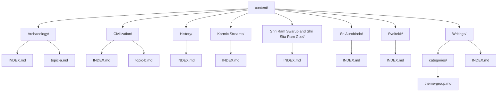
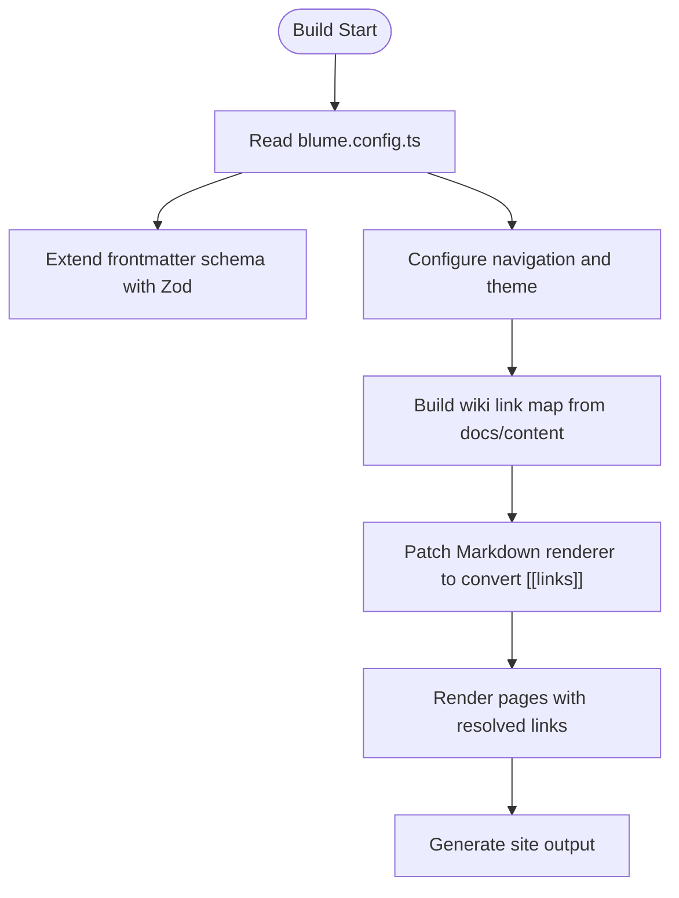
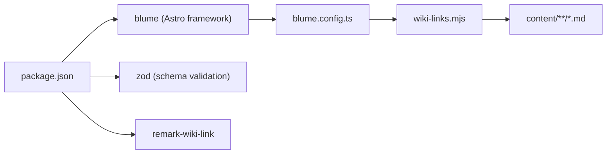

# Content Organization

<cite>
**Referenced Files in This Document**
- [blume.config.ts](file://blume.config.ts)
- [wiki-links.mjs](file://wiki-links.mjs)
- [package.json](file://package.json)
- [content/Archaeology/INDEX.md](file://content/Archaeology/INDEX.md)
- [content/Civilization/INDEX.md](file://content/Civilization/INDEX.md)
- [content/History/INDEX.md](file://content/History/INDEX.md)
- [content/Karmic Streams/INDEX.md](file://content/Karmic Streams/INDEX.md)
- [content/Shri Ram Swarup and Shri Sita Ram Goel/INDEX.md](file://content/Shri Ram Swarup and Shri Sita Ram Goel/INDEX.md)
- [content/Sri Aurobindo/INDEX.md](file://content/Sri Aurobindo/INDEX.md)
- [content/Sveltekit/INDEX.md](file://content/Sveltekit/INDEX.md)
- [content/Writings/INDEX.md](file://content/Writings/INDEX.md)
- [content/Archaeology/archaeobotany-archaeozoology.md](file://content/Archaeology/archaeobotany-archaeozoology.md)
- [content/Civilization/dharma.md](file://content/Civilization/dharma.md)
- [content/Sveltekit/svelte-5-runes.md](file://content/Sveltekit/svelte-5-runes.md)
- [content/Writings/categories/dharma-civilizational-consciousness.md](file://content/Writings/categories/dharma-civilizational-consciousness.md)
</cite>

## Table of Contents
1. [Introduction](#introduction)
2. [Project Structure](#project-structure)
3. [Core Components](#core-components)
4. [Architecture Overview](#architecture-overview)
5. [Detailed Component Analysis](#detailed-component-analysis)
6. [Dependency Analysis](#dependency-analysis)
7. [Performance Considerations](#performance-considerations)
8. [Troubleshooting Guide](#troubleshooting-guide)
9. [Conclusion](#conclusion)
10. [Appendices](#appendices)

## Introduction
This document explains the Fractal Home content organization system used to structure knowledge banks across multiple domains: Archaeology, Civilization, History, Karmic Streams, Shri Ram Swarup and Shri Sita Ram Goel, Sri Aurobindo, Sveltekit, and Writings. It details the index file pattern for each category, the naming conventions for content files, and how cross-bank connections are maintained. It also provides practical guidance for creating new categories, organizing hierarchies, and maintaining navigation.

## Project Structure
The content is organized under a top-level content directory with one folder per knowledge bank. Each category contains an INDEX.md that serves as the navigation hub and overview. Individual topic pages live alongside the index within the same folder. The Writings category additionally uses a subfolder named categories to group related essays by theme.

**Diagram sources**
- [content/Archaeology/INDEX.md](file://content/Archaeology/INDEX.md)
- [content/Civilization/INDEX.md](file://content/Civilization/INDEX.md)
- [content/History/INDEX.md](file://content/History/INDEX.md)
- [content/Karmic Streams/INDEX.md](file://content/Karmic Streams/INDEX.md)
- [content/Shri Ram Swarup and Shri Sita Ram Goel/INDEX.md](file://content/Shri Ram Swarup and Shri Sita Ram Goel/INDEX.md)
- [content/Sri Aurobindo/INDEX.md](file://content/Sri Aurobindo/INDEX.md)
- [content/Sveltekit/INDEX.md](file://content/Sveltekit/INDEX.md)
- [content/Writings/INDEX.md](file://content/Writings/INDEX.md)
- [content/Writings/categories/dharma-civilizational-consciousness.md](file://content/Writings/categories/dharma-civilizational-consciousness.md)

**Section sources**
- [content/Archaeology/INDEX.md](file://content/Archaeology/INDEX.md)
- [content/Civilization/INDEX.md](file://content/Civilization/INDEX.md)
- [content/History/INDEX.md](file://content/History/INDEX.md)
- [content/Karmic Streams/INDEX.md](file://content/Karmic Streams/INDEX.md)
- [content/Shri Ram Swarup and Shri Sita Ram Goel/INDEX.md](file://content/Shri Ram Swarup and Shri Sita Ram Goel/INDEX.md)
- [content/Sri Aurobindo/INDEX.md](file://content/Sri Aurobindo/INDEX.md)
- [content/Sveltekit/INDEX.md](file://content/Sveltekit/INDEX.md)
- [content/Writings/INDEX.md](file://content/Writings/INDEX.md)
- [content/Writings/categories/dharma-civilizational-consciousness.md](file://content/Writings/categories/dharma-civilizational-consciousness.md)

## Core Components
- Category Index Pages: Each category has an INDEX.md that defines metadata (title, description, knowledge-bank identifier, tags, sources, related entries, timestamp, source), followed by a Topic Map linking to all pages within the category.
- Topic Pages: Individual markdown files describe specific topics with consistent frontmatter fields and structured sections.
- Cross-Bank Connections: Categories reference other knowledge banks via related fields and explicit links in their indexes.
- Wiki Links Integration: A custom integration scans content and converts wiki-style links into navigable routes at build time.

Key frontmatter fields used consistently:
- title: Human-readable page title
- description: Short summary for indexing and previews
- knowledge-bank: Identifier tying the page to its knowledge bank
- tags: Keywords for search and filtering
- sources: Source identifiers or references
- related: Related page slugs or titles
- timestamp: Last updated date
- source: Origin repository or collection name

**Section sources**
- [content/Archaeology/INDEX.md](file://content/Archaeology/INDEX.md)
- [content/Archaeology/archaeobotany-archaeozoology.md](file://content/Archaeology/archaeobotany-archaeozoology.md)
- [content/Civilization/INDEX.md](file://content/Civilization/INDEX.md)
- [content/Civilization/dharma.md](file://content/Civilization/dharma.md)
- [content/History/INDEX.md](file://content/History/INDEX.md)
- [content/Karmic Streams/INDEX.md](file://content/Karmic Streams/INDEX.md)
- [content/Shri Ram Swarup and Shri Sita Ram Goel/INDEX.md](file://content/Shri Ram Swarup and Shri Sita Ram Goel/INDEX.md)
- [content/Sri Aurobindo/INDEX.md](file://content/Sri Aurobindo/INDEX.md)
- [content/Sveltekit/INDEX.md](file://content/Sveltekit/INDEX.md)
- [content/Sveltekit/svelte-5-runes.md](file://content/Sveltekit/svelte-5-runes.md)
- [content/Writings/INDEX.md](file://content/Writings/INDEX.md)
- [content/Writings/categories/dharma-civilizational-consciousness.md](file://content/Writings/categories/dharma-civilizational-consciousness.md)

## Architecture Overview
The content system is powered by Blume (Astro-based) with a custom wiki-links integration that builds a map of all markdown files and transforms wiki-style links into proper routes. Frontmatter schemas are extended via Zod to support knowledge-bank, tags, sources, related, timestamps, and grouping fields. Navigation is configured through tabs and sidebar display modes.

**Diagram sources**
- [blume.config.ts](file://blume.config.ts)
- [wiki-links.mjs](file://wiki-links.mjs)

**Section sources**
- [blume.config.ts](file://blume.config.ts)
- [wiki-links.mjs](file://wiki-links.mjs)
- [package.json](file://package.json)

## Detailed Component Analysis

### Knowledge Bank Index Pattern
Each category’s INDEX.md follows a consistent pattern:
- Frontmatter includes knowledge-bank identifier, tags, sources, related entries, timestamp, and source.
- Body contains a Topic Map listing all pages in the category with concise descriptions.
- Some indexes include additional narrative context about the scope and provenance of the knowledge bank.

Examples:
- Archaeology INDEX outlines journal volumes and topic areas.
- History INDEX organizes core debates, archaeology, genetics, linguistics, Vedic studies, epics, chronology, geography, philosophy, historiography, contributors, references, comparative topics, and cross-bank connections.
- Karmic Streams INDEX groups scientific research, religious traditions, indigenous perspectives, and modern comparative works.
- Sri Aurobindo INDEX catalogs major works and cross-bank connections.
- Sveltekit INDEX documents fundamentals, core, advanced features, libraries, and cross-bank connections.
- Writings INDEX lists thematic categories and cross-bank connections.

Best practices:
- Keep the Topic Map exhaustive and ordered logically.
- Use descriptive anchor text for each link.
- Maintain related fields to connect across knowledge banks.

**Section sources**
- [content/Archaeology/INDEX.md](file://content/Archaeology/INDEX.md)
- [content/History/INDEX.md](file://content/History/INDEX.md)
- [content/Karmic Streams/INDEX.md](file://content/Karmic Streams/INDEX.md)
- [content/Sri Aurobindo/INDEX.md](file://content/Sri Aurobindo/INDEX.md)
- [content/Sveltekit/INDEX.md](file://content/Sveltekit/INDEX.md)
- [content/Writings/INDEX.md](file://content/Writings/INDEX.md)

### Content File Naming Conventions
- Use kebab-case for filenames (e.g., archaeobotany-archaeozoology.md).
- Place topic files directly under the category folder alongside INDEX.md.
- For grouped essays within Writings, use a categories subfolder with theme-based files (e.g., dharma-civilizational-consciousness.md).
- Ensure frontmatter fields are present and consistent across files.

Rationale:
- Consistent naming improves discoverability and automation.
- Grouping related essays simplifies maintenance and navigation.

**Section sources**
- [content/Archaeology/archaeobotany-archaeozoology.md](file://content/Archaeology/archaeobotany-archaeozoology.md)
- [content/Civilization/dharma.md](file://content/Civilization/dharma.md)
- [content/Sveltekit/svelte-5-runes.md](file://content/Sveltekit/svelte-5-runes.md)
- [content/Writings/categories/dharma-civilizational-consciousness.md](file://content/Writings/categories/dharma-civilizational-consciousness.md)

### Cross-Bank Connections Strategy
- Use the related field in frontmatter to list related page slugs or titles.
- Include explicit “Cross-Bank Connections” sections in indexes to guide readers between knowledge banks.
- Leverage wiki-style links to automatically resolve routes during build.

Benefits:
- Encourages interdisciplinary exploration.
- Maintains coherence across diverse domains.

**Section sources**
- [content/History/INDEX.md](file://content/History/INDEX.md)
- [content/Sri Aurobindo/INDEX.md](file://content/Sri Aurobindo/INDEX.md)
- [content/Sveltekit/INDEX.md](file://content/Sveltekit/INDEX.md)
- [content/Writings/INDEX.md](file://content/Writings/INDEX.md)

### Wiki Links Integration
The wiki-links integration:
- Scans markdown files to build a map of titles and routes.
- Converts wiki-style links (double-bracket syntax) into standard markdown links.
- Patches the Markdown processor to ensure all renderers use the transformed content.

Operational flow:
- On config setup, it walks the docs/content root, parses frontmatter titles, and constructs a route map.
- During rendering, it replaces wiki links with resolved routes, falling back to a default path if unresolved.

**Section sources**
- [wiki-links.mjs](file://wiki-links.mjs)

## Dependency Analysis
The system depends on Blume for Astro-based static site generation, Zod for frontmatter validation, and a custom wiki-links integration for link resolution. Scripts in package.json provide development, build, preview, check, validate, and doctor commands.

**Diagram sources**
- [package.json](file://package.json)
- [blume.config.ts](file://blume.config.ts)
- [wiki-links.mjs](file://wiki-links.mjs)

**Section sources**
- [package.json](file://package.json)
- [blume.config.ts](file://blume.config.ts)
- [wiki-links.mjs](file://wiki-links.mjs)

## Performance Considerations
- Keep indexes concise; avoid excessive nested lists to reduce parsing overhead.
- Prefer stable slugs and consistent naming to minimize rebuilds and link resolution costs.
- Limit large arrays in frontmatter (sources, related) to only essential entries.
- Use targeted tags to improve search performance without bloating metadata.

[No sources needed since this section provides general guidance]

## Troubleshooting Guide
Common issues and resolutions:
- Broken wiki links: Ensure the target page exists and its title matches the wiki link exactly (case-insensitive). Check that the file is under the scanned content root.
- Missing frontmatter fields: Validate required fields like title, description, knowledge-bank, and timestamp. Use the provided schema to catch errors early.
- Navigation not updating: Verify blume.config.ts settings for tabs and sidebar display mode. Rebuild after changes.
- Build failures due to schema mismatch: Confirm that frontmatter values match expected types (arrays vs strings) as defined in the configuration.

**Section sources**
- [blume.config.ts](file://blume.config.ts)
- [wiki-links.mjs](file://wiki-links.mjs)

## Conclusion
The Fractal Home content organization system provides a robust, scalable framework for managing multi-domain knowledge banks. By adhering to consistent index patterns, naming conventions, and cross-bank connection strategies, maintainers can create clear navigation and rich interconnections. The Blume-based architecture with Zod validation and wiki-links integration ensures reliability and developer ergonomics.

[No sources needed since this section summarizes without analyzing specific files]

## Appendices

### Practical Examples

#### Creating a New Category
Steps:
- Create a new folder under content with a descriptive name.
- Add an INDEX.md with frontmatter including knowledge-bank identifier, tags, sources, related entries, timestamp, and source.
- Populate the Topic Map with links to all pages within the category.
- Optionally add a narrative introduction describing the scope and provenance.

Guidelines:
- Use kebab-case for filenames.
- Keep frontmatter fields consistent with existing categories.
- Include related entries to connect with other knowledge banks.

**Section sources**
- [content/Archaeology/INDEX.md](file://content/Archaeology/INDEX.md)
- [content/Civilization/INDEX.md](file://content/Civilization/INDEX.md)
- [content/History/INDEX.md](file://content/History/INDEX.md)
- [content/Karmic Streams/INDEX.md](file://content/Karmic Streams/INDEX.md)
- [content/Shri Ram Swarup and Shri Sita Ram Goel/INDEX.md](file://content/Shri Ram Swarup and Shri Sita Ram Goel/INDEX.md)
- [content/Sri Aurobindo/INDEX.md](file://content/Sri Aurobindo/INDEX.md)
- [content/Sveltekit/INDEX.md](file://content/Sveltekit/INDEX.md)
- [content/Writings/INDEX.md](file://content/Writings/INDEX.md)

#### Organizing Content Hierarchies
Recommendations:
- Place topic files directly under the category folder alongside INDEX.md.
- For grouped essays, use a categories subfolder with theme-based files.
- Maintain alphabetical or logical ordering in Topic Maps for readability.

**Section sources**
- [content/Writings/categories/dharma-civilizational-consciousness.md](file://content/Writings/categories/dharma-civilizational-consciousness.md)

#### Maintaining Cross-Bank Connections
Best practices:
- Update related fields when adding new pages that bridge domains.
- Include explicit cross-bank sections in indexes to guide readers.
- Use wiki-style links to automate route resolution.

**Section sources**
- [content/History/INDEX.md](file://content/History/INDEX.md)
- [content/Sri Aurobindo/INDEX.md](file://content/Sri Aurobindo/INDEX.md)
- [content/Sveltekit/INDEX.md](file://content/Sveltekit/INDEX.md)
- [content/Writings/INDEX.md](file://content/Writings/INDEX.md)