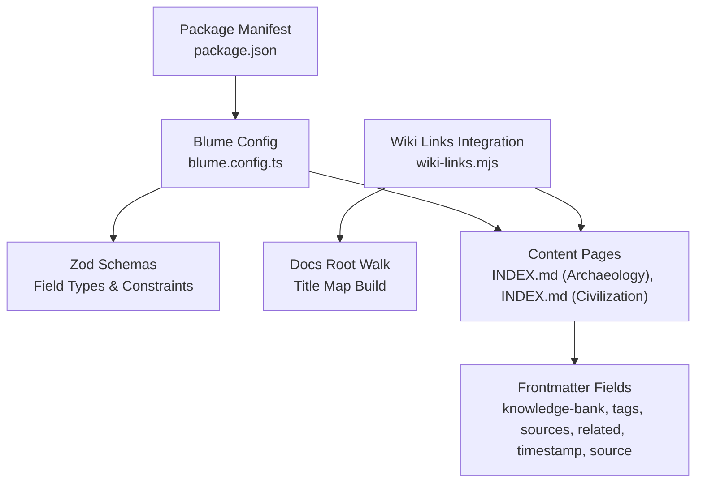
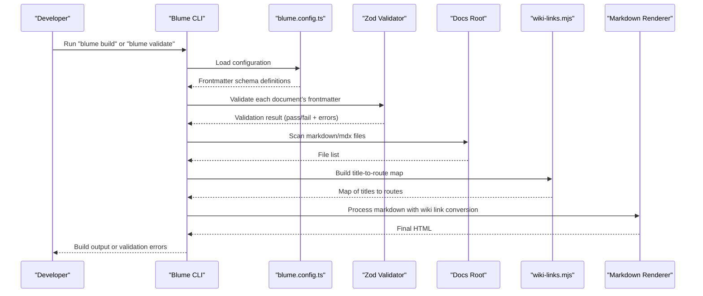
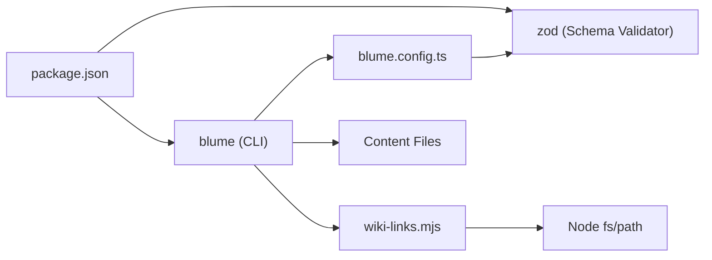

# Content Validation

<cite>
**Referenced Files in This Document**
- [blume.config.ts](file://blume.config.ts)
- [package.json](file://package.json)
- [wiki-links.mjs](file://wiki-links.mjs)
- [INDEX.md (Archaeology)](file://content/Archaeology/INDEX.md)
- [INDEX.md (Civilization)](file://content/Civilization/INDEX.md)
- [SvelteKit-Error-Handling.md](file://content/Sveltekit/SvelteKit-Error-Handling.md)
</cite>

## Table of Contents
1. [Introduction](#introduction)
2. [Project Structure](#project-structure)
3. [Core Components](#core-components)
4. [Architecture Overview](#architecture-overview)
5. [Detailed Component Analysis](#detailed-component-analysis)
6. [Dependency Analysis](#dependency-analysis)
7. [Performance Considerations](#performance-considerations)
8. [Troubleshooting Guide](#troubleshooting-guide)
9. [Conclusion](#conclusion)

## Introduction
This document explains the Fractal Home content validation system powered by Zod schemas through Blume’s frontmatter configuration. It focuses on how frontmatter validation enforces data consistency across the knowledge base, including required fields, type checking, and custom validation rules. It also covers error handling mechanisms for invalid content, build-time validation feedback, recovery strategies for malformed documents, practical examples for extending validation rules, handling optional fields, implementing domain-specific validations, performance implications, caching strategies, and debugging techniques during development.

## Project Structure
The validation system is primarily configured in a single configuration file that extends Blume’s frontmatter schema using Zod. The project includes:
- A Blume configuration file defining frontmatter field types and constraints.
- A package manifest declaring dependencies, including Blume and Zod.
- An integration module that processes wiki links and reads minimal frontmatter to build a title-to-route map.
- Sample content files demonstrating typical frontmatter usage.

**Diagram sources**
- [blume.config.ts:1-25](file://blume.config.ts#L1-L25)
- [package.json:1-18](file://package.json#L1-L18)
- [wiki-links.mjs:23-48](file://wiki-links.mjs#L23-L48)
- [INDEX.md (Archaeology):1-61](file://content/Archaeology/INDEX.md#L1-L61)
- [INDEX.md (Civilization):1-15](file://content/Civilization/INDEX.md#L1-L15)

**Section sources**
- [blume.config.ts:1-25](file://blume.config.ts#L1-L25)
- [package.json:1-18](file://package.json#L1-L18)
- [wiki-links.mjs:23-48](file://wiki-links.mjs#L23-L48)
- [INDEX.md (Archaeology):1-61](file://content/Archaeology/INDEX.md#L1-L61)
- [INDEX.md (Civilization):1-15](file://content/Civilization/INDEX.md#L1-L15)

## Core Components
- Blume Frontmatter Schema Extension: Defines Zod-based types for each frontmatter field, enabling type checking and optional constraints.
- Wiki Links Integration: Scans documentation files to build a title-to-route map; performs minimal frontmatter parsing to extract titles for linking purposes.
- Content Examples: Demonstrate consistent use of frontmatter fields such as knowledge-bank, tags, sources, related, timestamp, and source.

Key responsibilities:
- Enforce field presence and types via Zod schemas.
- Provide optional fields with safe defaults or nullability.
- Support arrays of strings and structured objects where needed.
- Integrate with Blume’s build pipeline to validate content at build time.

**Section sources**
- [blume.config.ts:10-24](file://blume.config.ts#L10-L24)
- [wiki-links.mjs:4-14](file://wiki-links.mjs#L4-L14)
- [INDEX.md (Archaeology):1-61](file://content/Archaeology/INDEX.md#L1-L61)
- [INDEX.md (Civilization):1-15](file://content/Civilization/INDEX.md#L1-L15)

## Architecture Overview
At build time, Blume loads the configuration, applies Zod schemas to each document’s frontmatter, and validates fields. The wiki-links integration scans the docs root to construct a mapping of titles to routes, which is used to convert wiki-style links into standard markdown links during rendering.

**Diagram sources**
- [blume.config.ts:1-25](file://blume.config.ts#L1-L25)
- [wiki-links.mjs:23-48](file://wiki-links.mjs#L23-L48)
- [wiki-links.mjs:50-77](file://wiki-links.mjs#L50-L77)
- [package.json:6-11](file://package.json#L6-L11)

## Detailed Component Analysis

### Frontmatter Schema Definition (Zod)
The configuration defines Zod schemas for multiple frontmatter fields:
- Arrays of strings for knowledge-bank, tags, sources, related.
- Coerced string fields for timestamp, created, updated.
- Optional string fields for source, project, boss, group, supergroup.
- Optional array of objects for links, allowing nullable entries.

Validation behavior:
- Type enforcement ensures arrays are arrays and objects have required properties.
- Optional fields allow missing values without failing validation.
- Coercion converts compatible inputs to strings for date-like fields.

Extensibility:
- Add new fields by appending Zod validators under the extend block.
- Use .optional() for non-required fields.
- Use .nullable() when null is an acceptable value.
- Combine z.object() with nested validators for complex structures.

Practical examples:
- To require a minimum length for tags, apply a refinement or transform before validation.
- For domain-specific checks (e.g., valid knowledge-bank IDs), add a custom refine function.

**Section sources**
- [blume.config.ts:10-24](file://blume.config.ts#L10-L24)

### Wiki Links Integration
The integration performs:
- Minimal frontmatter parsing to extract titles from markdown files.
- Recursive directory walking to build a title-to-route map.
- Conversion of wiki-style links [[Page|Label]] into standard markdown links during rendering.

Behavior details:
- Only title extraction is performed; full schema validation is handled by Blume/Zod.
- Title normalization supports lowercase variants and filename-based fallbacks.
- Code fences are ignored to prevent accidental link conversion inside code blocks.

Recovery strategies:
- If a title is missing, the integration falls back to filename-based slugification.
- Unknown wiki links resolve to a default route pattern, preventing broken links.

**Section sources**
- [wiki-links.mjs:4-14](file://wiki-links.mjs#L4-L14)
- [wiki-links.mjs:23-48](file://wiki-links.mjs#L23-L48)
- [wiki-links.mjs:50-77](file://wiki-links.mjs#L50-L77)

### Content Examples and Field Usage
Sample content demonstrates consistent frontmatter usage:
- knowledge-bank: Array of identifiers grouping pages.
- tags: Array of descriptive keywords.
- sources: Array of source references.
- related: Array of related topic identifiers.
- timestamp: Coerced string representing update time.
- source: String indicating origin repository or name.

These fields align with the Zod schema definitions and ensure uniform metadata across the knowledge base.

**Section sources**
- [INDEX.md (Archaeology):1-61](file://content/Archaeology/INDEX.md#L1-L61)
- [INDEX.md (Civilization):1-15](file://content/Civilization/INDEX.md#L1-L15)

### Error Handling and Build-Time Feedback
Build-time validation:
- Running the validate script triggers Blume’s validation pipeline, which applies Zod schemas to all documents.
- Errors include field names, expected types, and locations within the frontmatter.

Runtime error patterns:
- SvelteKit error handling patterns are documented in the knowledge base and can be applied to display user-friendly messages when content is invalid or missing.

Recovery strategies:
- During development, fix frontmatter according to error messages.
- For malformed documents, temporarily remove problematic fields to proceed with builds while correcting content offline.

**Section sources**
- [package.json:10](file://package.json#L10)
- [SvelteKit-Error-Handling.md:26-41](file://content/Sveltekit/SvelteKit-Error-Handling.md#L26-L41)

## Dependency Analysis
The validation system depends on:
- Blume for configuration-driven content processing and build scripts.
- Zod for schema validation of frontmatter fields.
- Node.js filesystem utilities within the wiki-links integration for scanning and parsing.

**Diagram sources**
- [package.json:13-17](file://package.json#L13-L17)
- [blume.config.ts:1-3](file://blume.config.ts#L1-L3)
- [wiki-links.mjs:1-2](file://wiki-links.mjs#L1-L2)

**Section sources**
- [package.json:13-17](file://package.json#L13-L17)
- [blume.config.ts:1-3](file://blume.config.ts#L1-L3)
- [wiki-links.mjs:1-2](file://wiki-links.mjs#L1-L2)

## Performance Considerations
- Validation overhead: Zod schemas run per document during build; keep schemas simple and avoid heavy transforms.
- Docs scanning: The wiki-links integration walks the entire docs root synchronously; consider limiting scope if the docs tree grows significantly.
- Caching strategies:
  - Leverage Blume’s build cache to avoid revalidating unchanged documents.
  - Avoid dynamic operations inside schema validators; precompute constants outside validation.
  - Cache the title-to-route map if the integration is reused across multiple build steps.

Optimization tips:
- Use optional fields to reduce validation complexity for rarely present metadata.
- Normalize input early (e.g., coerce timestamps) to minimize downstream checks.
- Profile builds with large content sets and isolate slow integrations.

[No sources needed since this section provides general guidance]

## Troubleshooting Guide
Common issues and resolutions:
- Missing required fields: Ensure all mandatory frontmatter keys are present; add defaults if appropriate.
- Type mismatches: Verify arrays are arrays and objects contain required properties; adjust content or schema accordingly.
- Invalid wiki links: Confirm titles exist in the docs root or rely on fallback slugification; update page titles to match link targets.
- Build failures due to validation errors: Run the validate script to get detailed error messages; fix frontmatter based on reported paths and expectations.

Debugging techniques:
- Temporarily comment out optional fields to isolate schema conflicts.
- Log intermediate values in the wiki-links integration to verify title extraction and mapping.
- Use isolated checks and builds to reproduce issues without full site regeneration.

**Section sources**
- [package.json:10](file://package.json#L10)
- [wiki-links.mjs:4-14](file://wiki-links.mjs#L4-L14)
- [SvelteKit-Error-Handling.md:26-41](file://content/Sveltekit/SvelteKit-Error-Handling.md#L26-L41)

## Conclusion
The Fractal Home content validation system leverages Blume and Zod to enforce consistent, type-safe frontmatter across the knowledge base. By defining clear schemas, integrating wiki link processing, and providing robust build-time validation, the system ensures reliable content structure and improves developer experience. Extending validation rules, handling optional fields, and applying domain-specific checks are straightforward with Zod. Performance can be optimized through careful schema design and caching strategies, while troubleshooting is streamlined by targeted validation feedback and debugging practices.

[No sources needed since this section summarizes without analyzing specific files]