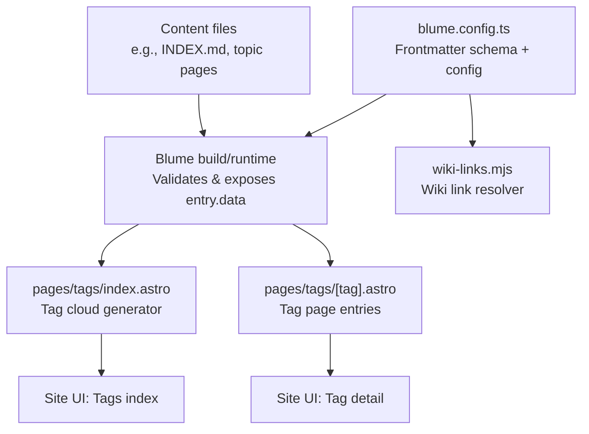
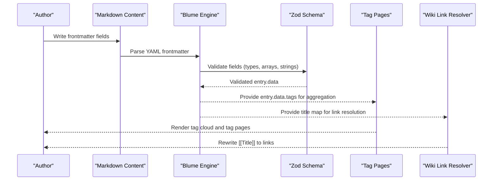
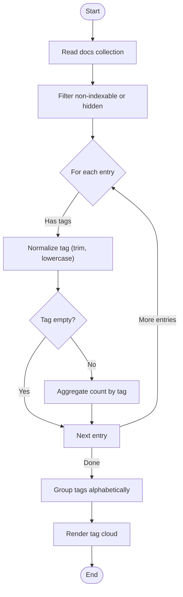
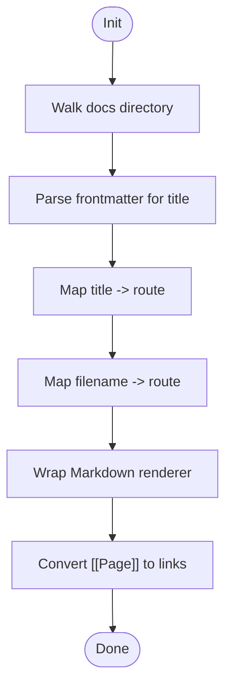
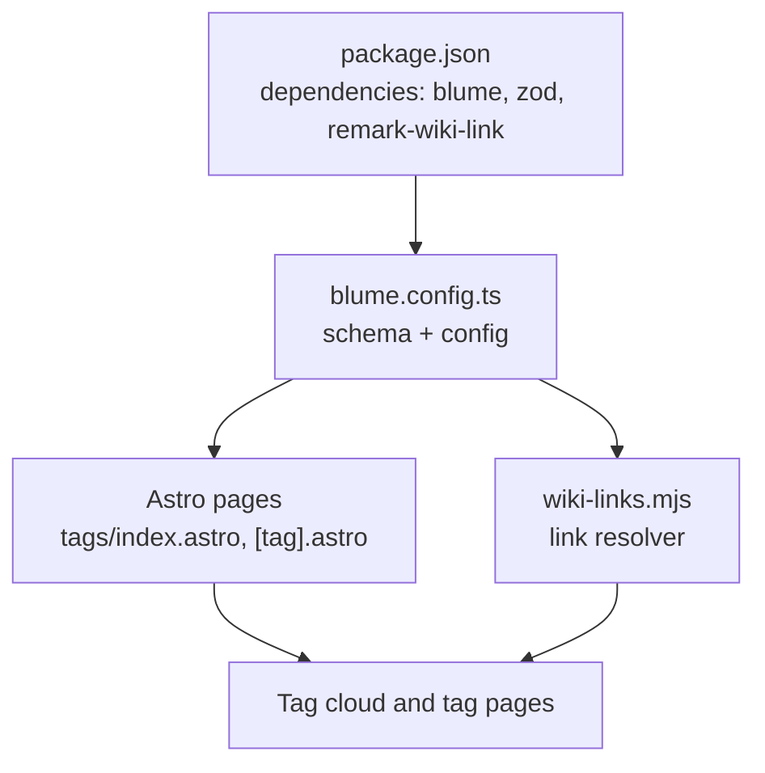

# Frontmatter Schema

<cite>
**Referenced Files in This Document**
- [blume.config.ts](file://blume.config.ts)
- [package.json](file://package.json)
- [wiki-links.mjs](file://wiki-links.mjs)
- [pages/tags/index.astro](file://pages/tags/index.astro)
- [pages/tags/[tag].astro](file://pages/tags/[tag].astro)
- [content/Writings/INDEX.md](file://content/Writings/INDEX.md)
- [content/Archaeology/INDEX.md](file://content/Archaeology/INDEX.md)
- [content/Archaeology/archaeobotany-archaeozoology.md](file://content/Archaeology/archaeobotany-archaeozoology.md)
</cite>

## Table of Contents
1. [Introduction](#introduction)
2. [Project Structure](#project-structure)
3. [Core Components](#core-components)
4. [Architecture Overview](#architecture-overview)
5. [Detailed Component Analysis](#detailed-component-analysis)
6. [Dependency Analysis](#dependency-analysis)
7. [Performance Considerations](#performance-considerations)
8. [Troubleshooting Guide](#troubleshooting-guide)
9. [Conclusion](#conclusion)
10. [Appendices](#appendices)

## Introduction
This document explains the Fractal Home frontmatter schema system, which is powered by Blume and validated with Zod. It details all available frontmatter fields (knowledge-bank references, tags, sources, related content, and metadata), how validation ensures data integrity and type safety, and how these fields drive site functionality such as search indexing, tag generation, and cross-referencing. It also provides practical examples, common validation errors and fixes, best practices for structuring metadata, and guidance on advanced features like conditional field validation and custom rules.

## Project Structure
The frontmatter schema is defined centrally in the Blume configuration and consumed across the site to power tagging, navigation, and wiki-link resolution.

**Diagram sources**
- [blume.config.ts:1-25](file://blume.config.ts#L1-L25)
- [pages/tags/index.astro:1-36](file://pages/tags/index.astro#L1-L36)
- [pages/tags/[tag].astro:1-33](file://pages/tags/[tag].astro#L1-L33)
- [wiki-links.mjs:1-48](file://wiki-links.mjs#L1-L48)

**Section sources**
- [blume.config.ts:1-25](file://blume.config.ts#L1-L25)
- [package.json:1-18](file://package.json#L1-L18)

## Core Components
- Frontmatter schema definition: Declares allowed fields and their types using Zod within Blume’s frontmatter extension.
- Validation runtime: Blume validates content against the schema during build/dev, ensuring type safety and consistent data shapes.
- Tagging pipeline: Pages read from the docs collection; tags are normalized and aggregated into a tag cloud and per-tag pages.
- Wiki-link integration: A custom integration maps wiki-style links to routes based on titles and file names.

Key responsibilities:
- blume.config.ts: Defines the schema and site-level options.
- package.json: Declares dependencies including Blume and Zod.
- pages/tags/*.astro: Consumes validated frontmatter to generate tag-related pages.
- wiki-links.mjs: Builds a title-to-route map and rewrites wiki links at render time.

**Section sources**
- [blume.config.ts:1-25](file://blume.config.ts#L1-L25)
- [package.json:1-18](file://package.json#L1-L18)
- [pages/tags/index.astro:1-36](file://pages/tags/index.astro#L1-L36)
- [pages/tags/[tag].astro:1-33](file://pages/tags/[tag].astro#L1-L33)
- [wiki-links.mjs:1-48](file://wiki-links.mjs#L1-L48)

## Architecture Overview
The frontmatter schema flows through Blume’s build pipeline and powers multiple site features:

**Diagram sources**
- [blume.config.ts:1-25](file://blume.config.ts#L1-L25)
- [pages/tags/index.astro:1-36](file://pages/tags/index.astro#L1-L36)
- [pages/tags/[tag].astro:1-33](file://pages/tags/[tag].astro#L1-L33)
- [wiki-links.mjs:1-48](file://wiki-links.mjs#L1-L48)

## Detailed Component Analysis

### Frontmatter Fields and Types
All fields are optional unless otherwise noted. The schema uses Zod to enforce types and structure.

- knowledge-bank: Array of strings. Used to associate content with named knowledge banks.
- tags: Array of strings. Used to generate tag clouds and tag pages.
- sources: Array of strings. References to source identifiers or volumes.
- related: Array of strings. Cross-references to other topics or knowledge banks.
- timestamp: Coerced string. Represents a date-like value stored as a string.
- source: String. Single source identifier.
- created: Coerced string. Creation date-like value.
- updated: Coerced string. Update date-like value.
- project: String. Optional project label.
- boss: String. Optional owner or lead label.
- group: String. Optional grouping label used in navigation.
- supergroup: String. Optional higher-level grouping label.
- links: Nullable array of objects with url (string) and name (string). Optional.

Notes:
- Arrays are validated as lists of strings where applicable.
- Date-like fields use coercion to ensure consistent string handling.
- links allows null or an array of structured objects.

Examples of usage in content:
- Index pages commonly include knowledge-bank, tags, sources, related, timestamp, and source.
- Topic pages often include knowledge-bank, tags, sources, related, timestamp, and source.

**Section sources**
- [blume.config.ts:10-24](file://blume.config.ts#L10-L24)
- [content/Writings/INDEX.md:1-15](file://content/Writings/INDEX.md#L1-L15)
- [content/Archaeology/INDEX.md:1-61](file://content/Archaeology/INDEX.md#L1-L61)
- [content/Archaeology/archaeobotany-archaeozoology.md:1-29](file://content/Archaeology/archaeobotany-archaeozoology.md#L1-L29)

### Tag Generation and Tag Pages
Tag generation reads all docs entries, filters out hidden or non-indexable items, normalizes tags, and aggregates counts. Tag pages list entries grouped by tag slug.

Key behaviors:
- Normalize tags by trimming whitespace and lowercasing.
- Skip empty tags.
- Group tags alphabetically for display; digit-leading tags are grouped under “0-9”.
- Build static paths for each unique tag.

**Diagram sources**
- [pages/tags/index.astro:1-36](file://pages/tags/index.astro#L1-L36)

**Section sources**
- [pages/tags/index.astro:1-36](file://pages/tags/index.astro#L1-L36)
- [pages/tags/[tag].astro:1-L33](file://pages/tags/[tag].astro#L1-L33)

### Wiki Links Integration
The wiki-links integration builds a map of titles and file names to routes, then rewrites wiki-style links in markdown content.

Key behaviors:
- Recursively walk the docs directory to find md/mdx files.
- Extract title from frontmatter if present; fallback to filename-based mapping.
- Normalize route paths and handle index files.
- Wrap Markdown renderers to convert [[Page]] syntax into proper links.

**Diagram sources**
- [wiki-links.mjs:1-48](file://wiki-links.mjs#L1-L48)
- [wiki-links.mjs:50-77](file://wiki-links.mjs#L50-L77)

**Section sources**
- [wiki-links.mjs:1-48](file://wiki-links.mjs#L1-L48)
- [wiki-links.mjs:50-77](file://wiki-links.mjs#L50-L77)

### Search Indexing and Metadata
Search indexing is enabled via the layout props passed to RootLayout. Entries marked indexable are included in search. Hidden sidebar entries are excluded from tag aggregation and likely from search indexing.

- indexable flag controls inclusion in search and tag processing.
- description and title are surfaced in tag pages and potentially search results.

**Section sources**
- [pages/tags/index.astro:1-36](file://pages/tags/index.astro#L1-L36)
- [pages/tags/[tag].astro:1-L33](file://pages/tags/[tag].astro#L1-L33)

## Dependency Analysis
Dependencies between components and external packages:

**Diagram sources**
- [package.json:1-18](file://package.json#L1-L18)
- [blume.config.ts:1-25](file://blume.config.ts#L1-L25)
- [pages/tags/index.astro:1-36](file://pages/tags/index.astro#L1-L36)
- [pages/tags/[tag].astro:1-L33](file://pages/tags/[tag].astro#L1-L33)
- [wiki-links.mjs:1-48](file://wiki-links.mjs#L1-L48)

**Section sources**
- [package.json:1-18](file://package.json#L1-L18)
- [blume.config.ts:1-25](file://blume.config.ts#L1-L25)
- [pages/tags/index.astro:1-36](file://pages/tags/index.astro#L1-L36)
- [pages/tags/[tag].astro:1-L33](file://pages/tags/[tag].astro#L1-L33)
- [wiki-links.mjs:1-48](file://wiki-links.mjs#L1-L48)

## Performance Considerations
- Tag aggregation iterates over all docs entries; keep collections reasonably sized and avoid unnecessary heavy computations in tag generation.
- Wiki link resolution walks the entire docs directory at config setup; this is a one-time cost but can be significant for large repositories.
- Use concise tags and avoid excessive duplication to reduce tag cloud size.
- Prefer stable slugs and consistent naming to minimize route mismatches and rebuild overhead.

[No sources needed since this section provides general guidance]

## Troubleshooting Guide
Common validation errors and solutions:
- Wrong type for array fields: Ensure knowledge-bank, tags, sources, and related are arrays of strings.
- Invalid object structure for links: If provided, links must be either null or an array of objects with url and name as strings.
- Incorrect date-like values: timestamp, created, and updated should be valid strings; coercion handles many formats but invalid inputs may still fail.
- Missing required fields for features: To appear in tag pages, entries must be indexable and not hidden in the sidebar.

Debugging tips:
- Run the validate script to catch schema issues early.
- Check tag normalization behavior: ensure tags have no leading/trailing spaces and are consistently cased.
- Verify wiki link mappings by confirming titles exist in frontmatter or filenames match expected patterns.

**Section sources**
- [blume.config.ts:10-24](file://blume.config.ts#L10-L24)
- [pages/tags/index.astro:1-36](file://pages/tags/index.astro#L1-L36)
- [wiki-links.mjs:1-48](file://wiki-links.mjs#L1-L48)

## Conclusion
The Fractal Home frontmatter schema leverages Blume and Zod to provide robust, type-safe metadata handling. Fields like knowledge-bank, tags, sources, related, and various metadata keys enable powerful site features including tag generation, search indexing, and wiki-link resolution. By following best practices for field usage and validation, authors can maintain high-quality, interconnected content that drives a rich user experience.

[No sources needed since this section summarizes without analyzing specific files]

## Appendices

### Practical Examples of Well-formed Frontmatter
- Index page example: Includes knowledge-bank, tags, sources, related, timestamp, and source.
- Topic page example: Includes knowledge-bank, tags, sources, related, timestamp, and source.
- Personal essay example: Uses tags, group, supergroup, and description.

Use these patterns as templates when authoring new content.

**Section sources**
- [content/Writings/INDEX.md:1-15](file://content/Writings/INDEX.md#L1-L15)
- [content/Archaeology/INDEX.md:1-61](file://content/Archaeology/INDEX.md#L1-L61)
- [content/Archaeology/archaeobotany-archaeozoology.md:1-29](file://content/Archaeology/archaeobotany-archaeozoology.md#L1-L29)

### Advanced Features: Conditional Validation and Custom Rules
- Conditional fields: Extend the schema to require certain fields only when others are present (e.g., require source when sources is non-empty).
- Custom validators: Add Zod refinements to enforce domain-specific constraints (e.g., unique tags, valid URL formats in links).
- Integration hooks: Combine Blume’s hooks with custom logic to transform or enrich frontmatter before rendering.

[No sources needed since this section provides general guidance]