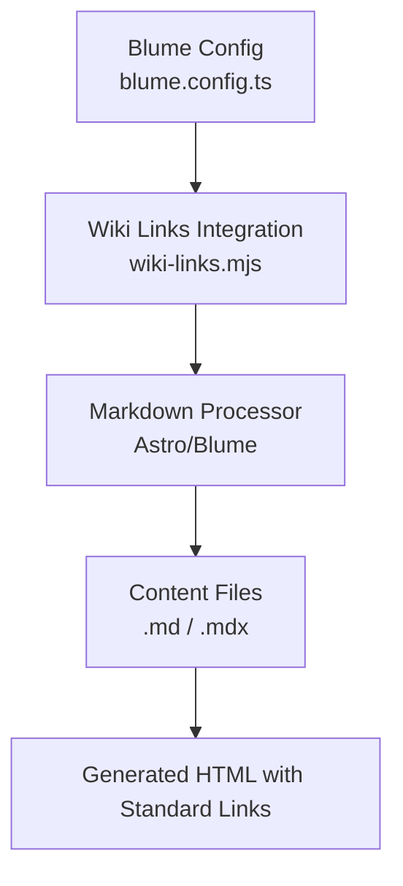
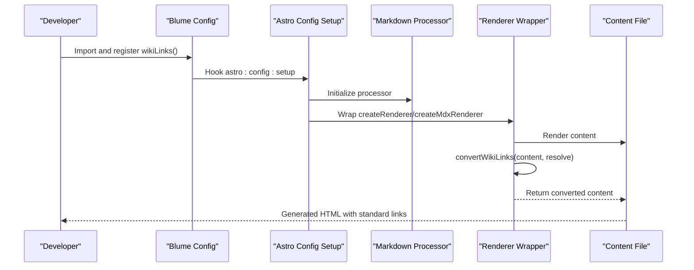
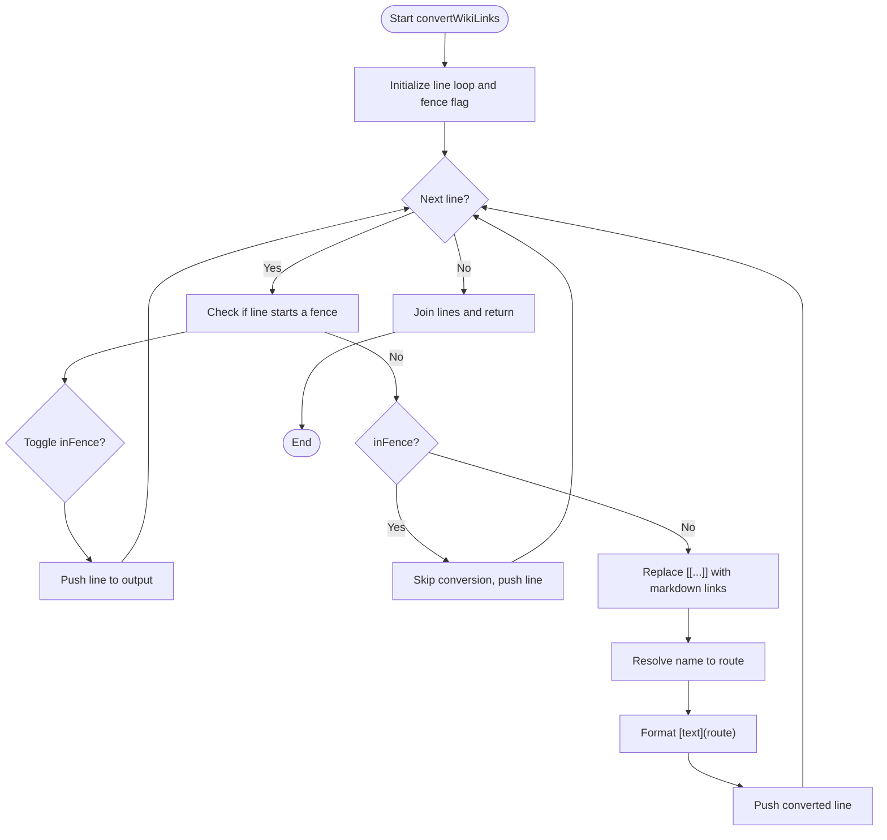
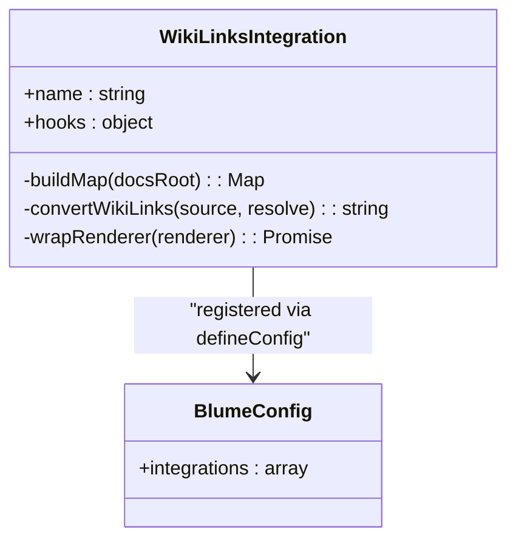
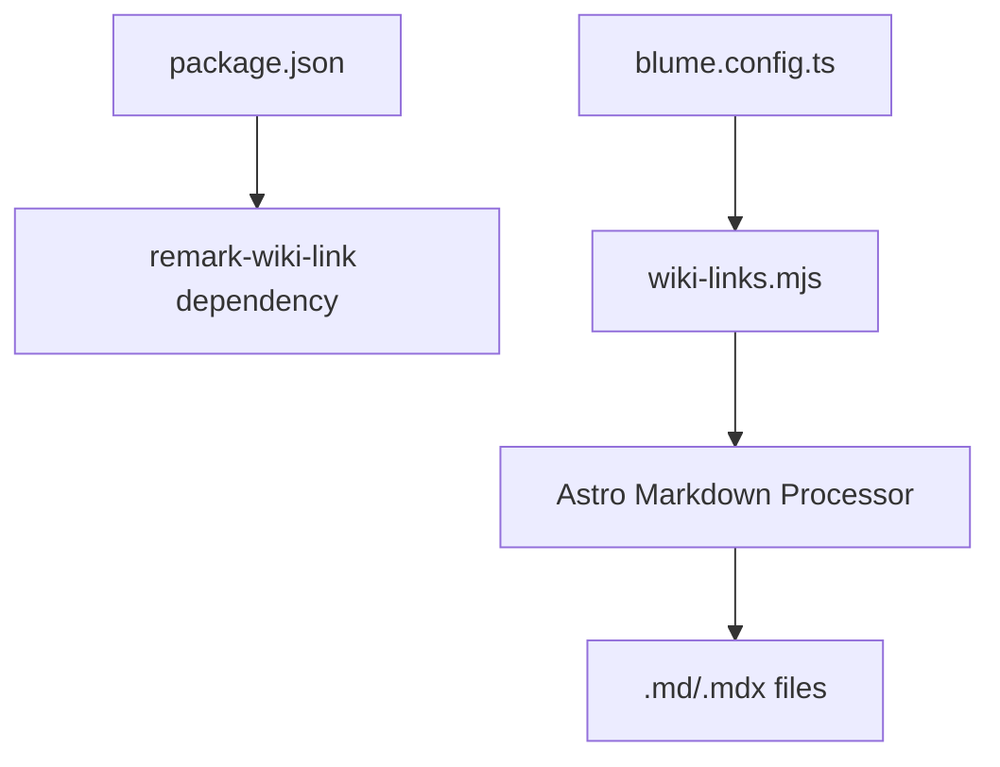

# Wiki Link System

<cite>
**Referenced Files in This Document**
- [wiki-links.mjs](file://wiki-links.mjs)
- [blume.config.ts](file://blume.config.ts)
- [package.json](file://package.json)
- [BLUME-CUSTOMIZATION-BACKEND.md](file://BLUME-CUSTOMIZATION-BACKEND.md)
- [content/Archaeology/INDEX.md](file://content/Archaeology/INDEX.md)
- [content/Writings/dharma.md](file://content/Writings/dharma.md)
</cite>

## Table of Contents
1. [Introduction](#introduction)
2. [Project Structure](#project-structure)
3. [Core Components](#core-components)
4. [Architecture Overview](#architecture-overview)
5. [Detailed Component Analysis](#detailed-component-analysis)
6. [Dependency Analysis](#dependency-analysis)
7. [Performance Considerations](#performance-considerations)
8. [Troubleshooting Guide](#troubleshooting-guide)
9. [Conclusion](#conclusion)

## Introduction
This document explains the Fractal Home wiki link system that enables [[page-name]] syntax for cross-referencing documents and converts these references into standard markdown links during build time. It covers how page resolution works (including case-insensitive matching), fallback strategies for unresolved links, protection of code blocks from conversion, and best practices for effective cross-referencing patterns, nested paths, and managing link dependencies. It also provides troubleshooting guidance for common issues such as unresolved links and performance considerations for large wikis.

## Project Structure
The wiki link system is implemented as a Blume/Astro integration that hooks into the Markdown processing pipeline. The key files are:
- Integration logic: wiki-links.mjs
- Blume configuration enabling the integration: blume.config.ts
- Package dependencies including remark-wiki-link: package.json
- Documentation on Blume customization: BLUME-CUSTOMIZATION-BACKEND.md
- Example content demonstrating knowledge bank organization and cross-references: content/Archaeology/INDEX.md, content/Writings/dharma.md

**Diagram sources**
- [blume.config.ts:1-10](file://blume.config.ts#L1-L10)
- [wiki-links.mjs:79-125](file://wiki-links.mjs#L79-L125)

**Section sources**
- [blume.config.ts:1-10](file://blume.config.ts#L1-L10)
- [package.json:1-19](file://package.json#L1-L19)
- [BLUME-CUSTOMIZATION-BACKEND.md:1-30](file://BLUME-CUSTOMIZATION-BACKEND.md#L1-L30)

## Core Components
- wiki-links.mjs: Implements the wiki link resolver, map builder, and renderer wrapper to convert [[page-name]] to standard markdown links at build time.
- blume.config.ts: Registers the wikiLinks integration with Blume so it runs during Astro config setup.
- package.json: Declares dependencies including remark-wiki-link which can be used alongside or in addition to the custom implementation.

Key responsibilities:
- Build a mapping of pages to routes by scanning the docs directory.
- Parse frontmatter titles to support title-based linking.
- Convert wiki links while protecting fenced code blocks and inline code spans.
- Provide case-insensitive resolution and a fallback strategy for unresolved links.

**Section sources**
- [wiki-links.mjs:1-125](file://wiki-links.mjs#L1-L125)
- [blume.config.ts:1-10](file://blume.config.ts#L1-L10)
- [package.json:13-17](file://package.json#L13-L17)

## Architecture Overview
The wiki link system integrates into Blume’s Markdown processor via an Astro hook. During build:
- The docs directory is scanned to build a Map of page names to routes.
- Frontmatter titles are extracted to enable title-based resolution.
- The Markdown renderers are wrapped so that all content passes through a converter that replaces [[page-name]] with standard markdown links.
- Unresolved links fall back to a slugified path under a predefined namespace.

**Diagram sources**
- [blume.config.ts:1-10](file://blume.config.ts#L1-L10)
- [wiki-links.mjs:79-125](file://wiki-links.mjs#L79-L125)

## Detailed Component Analysis

### Wiki Link Resolution and Conversion
- Page mapping: Scans the docs directory recursively, constructs relative routes, normalizes index files, strips leading numeric segments and date prefixes, and maps both file basenames and frontmatter titles to routes.
- Case-insensitive resolution: Attempts exact match first, then lowercase match.
- Fallback strategy: If no match is found, generates a slugified route under a fixed namespace.
- Code block protection: Tracks fenced code blocks using triple backticks or tildes; skips conversion inside fences. Inline code spans are also skipped.
- Output format: Converts [[page|label]] to [label](route) or [[page]] to [page](route).

**Diagram sources**
- [wiki-links.mjs:50-77](file://wiki-links.mjs#L50-L77)

**Section sources**
- [wiki-links.mjs:23-48](file://wiki-links.mjs#L23-L48)
- [wiki-links.mjs:50-77](file://wiki-links.mjs#L50-L77)
- [wiki-links.mjs:79-125](file://wiki-links.mjs#L79-L125)

### Integration Registration and Hooking
- The integration registers itself with Blume via astro:config:setup.
- It builds the page map once per setup phase.
- It wraps both createRenderer and createMdxRenderer to ensure all renderers use the converted content.
- It updates the final merged config to propagate the wrapped processor.

**Diagram sources**
- [wiki-links.mjs:79-125](file://wiki-links.mjs#L79-L125)
- [blume.config.ts:1-10](file://blume.config.ts#L1-L10)

**Section sources**
- [blume.config.ts:1-10](file://blume.config.ts#L1-L10)
- [wiki-links.mjs:79-125](file://wiki-links.mjs#L79-L125)

### Practical Cross-Referencing Patterns
- Basic wiki link: Use [[Page Name]] to reference a page by its title or filename.
- Custom label: Use [[Page Name|Custom Label]] to display a different text while linking to the same page.
- Nested paths: Reference files within subdirectories using their normalized routes derived from filenames and frontmatter titles.
- Index files: Index files are mapped to their parent directory route, enabling clean navigation entries.
- Examples in content:
  - content/Archaeology/INDEX.md demonstrates structured topic mapping and cross-bank connections.
  - content/Writings/dharma.md shows typical prose usage and conceptual linking.

**Section sources**
- [content/Archaeology/INDEX.md:1-88](file://content/Archaeology/INDEX.md#L1-L88)
- [content/Writings/dharma.md:1-53](file://content/Writings/dharma.md#L1-L53)

## Dependency Analysis
- Blume integration: The wikiLinks function is imported and registered in blume.config.ts.
- Markdown processing: The integration wraps Astro/Blume’s Markdown processor to intercept rendering.
- Dependencies: package.json includes remark-wiki-link, indicating potential compatibility or alternative implementations.

**Diagram sources**
- [package.json:13-17](file://package.json#L13-L17)
- [blume.config.ts:1-10](file://blume.config.ts#L1-L10)
- [wiki-links.mjs:79-125](file://wiki-links.mjs#L79-L125)

**Section sources**
- [package.json:13-17](file://package.json#L13-L17)
- [blume.config.ts:1-10](file://blume.config.ts#L1-L10)
- [wiki-links.mjs:79-125](file://wiki-links.mjs#L79-L125)

## Performance Considerations
- Map construction cost: Scanning the docs directory and parsing frontmatter occurs during config setup; this is typically fast but may increase with very large wikis.
- Rendering overhead: Each line of content is processed; fenced code blocks are skipped efficiently, minimizing unnecessary regex operations.
- Optimization opportunities:
  - Cache the page map across builds if multiple processors are created.
  - Limit scanning depth or exclude non-content directories if needed.
  - Prefer concise titles and consistent naming to reduce fallback resolution steps.

[No sources needed since this section provides general guidance]

## Troubleshooting Guide
Common issues and resolutions:
- Unresolved links:
  - Ensure the target page has a frontmatter title or a filename that matches the wiki link exactly (case-insensitive).
  - Verify the docs root path used by the integration; default is the docs directory adjacent to wiki-links.mjs.
  - Check fallback behavior: unresolved links will generate slugified routes under a fixed namespace; confirm this is acceptable.
- Code blocks not converting:
  - Confirm fenced code blocks use triple backticks or tildes; conversion is intentionally skipped inside fences.
  - Inline code spans are also skipped; avoid placing wiki links inside backticks.
- Performance issues:
  - Monitor build times when adding many pages; consider optimizing frontmatter parsing or reducing scan scope.
- Debugging techniques:
  - Inspect the generated HTML to verify link routes.
  - Add logging in the resolve function to trace failed lookups.
  - Validate frontmatter titles and filenames for consistency.

**Section sources**
- [wiki-links.mjs:23-48](file://wiki-links.mjs#L23-L48)
- [wiki-links.mjs:50-77](file://wiki-links.mjs#L50-L77)
- [wiki-links.mjs:79-125](file://wiki-links.mjs#L79-L125)

## Conclusion
The Fractal Home wiki link system provides a robust mechanism for creating cross-references using [[page-name]] syntax, converting them to standard markdown links during build time. It supports case-insensitive resolution, protects code blocks from conversion, and offers a fallback strategy for unresolved links. By following the recommended patterns and troubleshooting guidelines, authors can maintain a well-linked, performant wiki even as the content grows.

[No sources needed since this section summarizes without analyzing specific files]