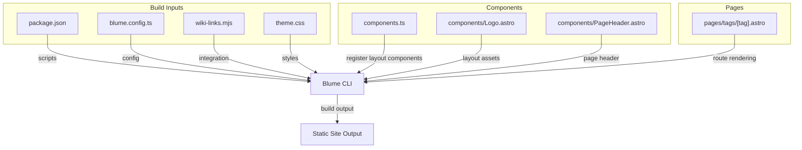
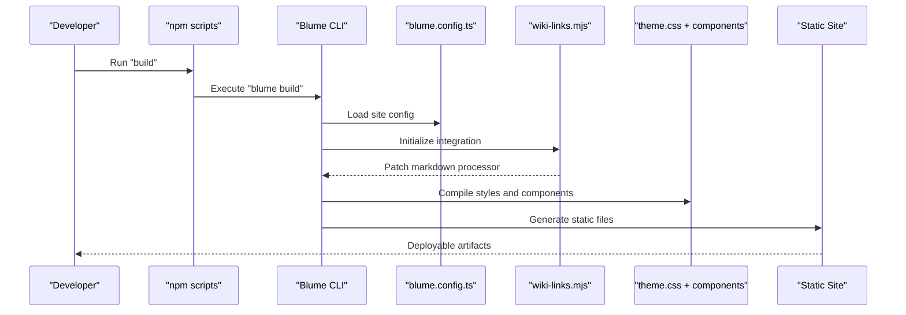
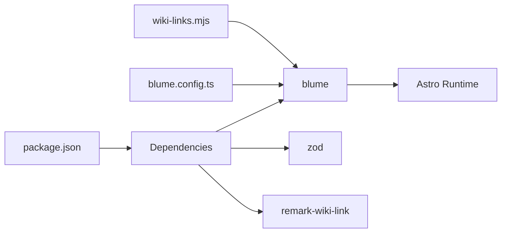

# Deployment and Production

<cite>
**Referenced Files in This Document**
- [package.json](file://package.json)
- [blume.config.ts](file://blume.config.ts)
- [components.ts](file://components.ts)
- [wiki-links.mjs](file://wiki-links.mjs)
- [theme.css](file://theme.css)
- [components/Logo.astro](file://components/Logo.astro)
- [components/PageHeader.astro](file://components/PageHeader.astro)
- [pages/tags/[tag].astro](file://pages/tags/[tag].astro)
</cite>

## Table of Contents
1. [Introduction](#introduction)
2. [Project Structure](#project-structure)
3. [Core Components](#core-components)
4. [Architecture Overview](#architecture-overview)
5. [Detailed Component Analysis](#detailed-component-analysis)
6. [Dependency Analysis](#dependency-analysis)
7. [Performance Considerations](#performance-considerations)
8. [Troubleshooting Guide](#troubleshooting-guide)
9. [Conclusion](#conclusion)
10. [Appendices](#appendices)

## Introduction
This document provides a production-focused guide for deploying Fractal Home, a static site built with Blume (Astro-based). It explains the build commands, environment configuration, asset optimization strategies, hosting options for static sites, CDN setup, performance monitoring, scalability considerations, security practices, and maintenance procedures. Practical deployment examples are included for popular platforms such as Vercel, Netlify, and GitHub Pages.

## Project Structure
Fractal Home is organized around content-driven documentation and pages:
- Content resides under content/ and docs/ directories, consumed by Blume/Astro at build time.
- Custom components are defined under components/ and registered via components.ts.
- Site configuration is centralized in blume.config.ts.
- Build scripts are defined in package.json and delegate to the Blume CLI.
- Theme and styling are managed through theme.css.
- A custom integration transforms wiki-style links into standard Markdown links during build.

**Diagram sources**
- [package.json:1-19](file://package.json#L1-L19)
- [blume.config.ts:1-67](file://blume.config.ts#L1-L67)
- [wiki-links.mjs:1-125](file://wiki-links.mjs#L1-L125)
- [theme.css:1-673](file://theme.css#L1-L673)
- [components.ts:1-12](file://components.ts#L1-L12)
- [components/Logo.astro:1-48](file://components/Logo.astro#L1-L48)
- [components/PageHeader.astro:1-31](file://components/PageHeader.astro#L1-L31)
- [pages/tags/[tag].astro:35-60](file://pages/tags/[tag].astro#L35-L60)

**Section sources**
- [package.json:1-19](file://package.json#L1-L19)
- [blume.config.ts:1-67](file://blume.config.ts#L1-L67)
- [components.ts:1-12](file://components.ts#L1-L12)
- [wiki-links.mjs:1-125](file://wiki-links.mjs#L1-L125)
- [theme.css:1-673](file://theme.css#L1-L673)

## Core Components
- Build scripts: The npm scripts wrap Blume CLI commands for development, building, previewing, checking, validating, and doctor diagnostics. These are the primary entry points for local and CI workflows.
- Configuration: blume.config.ts defines site metadata, integrations, frontmatter schema extensions, navigation structure, and theme font settings.
- Component registration: components.ts registers layout components used across pages.
- Custom integration: wiki-links.mjs scans documentation files, builds a title-to-route map, and converts wiki-style links to standard Markdown links during build.
- Styling: theme.css defines design tokens, light/dark themes, typography, and component-level styles.

Key responsibilities:
- Scripts orchestrate the build pipeline via Blume.
- Configuration centralizes site behavior and appearance.
- Integration enhances content processing without runtime overhead.
- Components encapsulate reusable UI logic.

**Section sources**
- [package.json:1-19](file://package.json#L1-L19)
- [blume.config.ts:1-67](file://blume.config.ts#L1-L67)
- [components.ts:1-12](file://components.ts#L1-L12)
- [wiki-links.mjs:1-125](file://wiki-links.mjs#L1-L125)
- [theme.css:1-673](file://theme.css#L1-L673)

## Architecture Overview
The build process transforms source content and configuration into optimized static assets. The custom integration modifies Markdown rendering at build time, while theme and components provide consistent UI.

**Diagram sources**
- [package.json:1-19](file://package.json#L1-L19)
- [blume.config.ts:1-67](file://blume.config.ts#L1-L67)
- [wiki-links.mjs:1-125](file://wiki-links.mjs#L1-L125)
- [theme.css:1-673](file://theme.css#L1-L673)

## Detailed Component Analysis

### Build Scripts and Commands
- dev: Starts the development server for live previews.
- build: Produces the production static build.
- preview: Serves the built output locally for testing.
- check: Runs type or lint checks as configured by Blume.
- validate: Validates content and configuration.
- doctor: Diagnoses environment and dependency issues.

Operational notes:
- Use build in CI pipelines to generate reproducible outputs.
- Use preview to verify the production build locally before deployment.
- Use doctor early in CI to catch misconfiguration or missing dependencies.

**Section sources**
- [package.json:1-19](file://package.json#L1-L19)

### Site Configuration and Frontmatter Schema
- Title and description define site metadata used by layouts and SEO.
- Integrations include the wiki-links module for link transformation.
- Frontmatter schema extends supported fields for content entries, enabling tags, sources, timestamps, and more.
- Navigation defines tabs and sidebar grouping.
- Theme fonts specify display/body/mono fonts and variants, including woff2 sources.

Production implications:
- Ensure all referenced font files exist in static paths to avoid broken resources.
- Keep frontmatter fields consistent to prevent validation errors during validate or build.

**Section sources**
- [blume.config.ts:1-67](file://blume.config.ts#L1-L67)

### Component Registration and Layout
- components.ts registers Logo and PageHeader as layout components.
- These components are injected into the site’s layout system by Blume.

Best practices:
- Keep layout components pure and data-driven.
- Avoid heavy computations in components; precompute where possible during build.

**Section sources**
- [components.ts:1-12](file://components.ts#L1-L12)
- [components/Logo.astro:1-48](file://components/Logo.astro#L1-L48)
- [components/PageHeader.astro:1-31](file://components/PageHeader.astro#L1-L31)

### Wiki Links Integration
- Scans docsRoot for .md/.mdx files and builds a map from titles and filenames to routes.
- Converts wiki-style double-bracket links into standard Markdown links during build-time rendering.
- Wraps the markdown processor to intercept render calls and transform content.

Impact on production:
- All links are resolved at build time, ensuring no runtime overhead.
- If content changes, rebuild to update the link map.

**Section sources**
- [wiki-links.mjs:1-125](file://wiki-links.mjs#L1-L125)

### Tag Pages Rendering
- The dynamic tag route renders a list of entries associated with a tag.
- Uses Blume’s data API and Astro content APIs to fetch and display tagged content.

Production considerations:
- Ensure tags are consistently applied in frontmatter to populate tag pages correctly.
- Validate that routes resolve to existing entries to avoid dead links.

**Section sources**
- [pages/tags/[tag].astro:35-60](file://pages/tags/[tag].astro#L35-L60)

## Dependency Analysis
The project depends on Blume (Astro-based), Zod for schema validation, and remark-wiki-link for additional link handling. The custom wiki-links integration complements these dependencies by transforming content at build time.

**Diagram sources**
- [package.json:1-19](file://package.json#L1-L19)
- [blume.config.ts:1-67](file://blume.config.ts#L1-L67)
- [wiki-links.mjs:1-125](file://wiki-links.mjs#L1-L125)

**Section sources**
- [package.json:1-19](file://package.json#L1-L19)

## Performance Considerations
- Static generation: All content is processed at build time, eliminating runtime overhead.
- Asset optimization:
  - Fonts are declared as woff2 variants; ensure they are minified and served with proper caching headers.
  - Images referenced in components should be optimized (e.g., WebP/AVIF) and use appropriate sizing attributes.
- CSS strategy:
  - theme.css uses design tokens and minimal overrides; keep it lean to reduce payload.
- Caching:
  - Configure long-term caching for immutable assets (hashed filenames).
  - Use CDN edge caching for HTML with short TTLs to allow fast updates.
- Monitoring:
  - Integrate performance monitoring (e.g., web vitals) via CDN or analytics providers.
- Scalability:
  - Static sites scale horizontally via CDN; ensure origin storage supports high throughput if needed.

[No sources needed since this section provides general guidance]

## Troubleshooting Guide
Common issues and resolutions:
- Missing font files: Verify that woff2 files referenced in blume.config.ts exist under static/webfonts and are included in the build output.
- Broken wiki links: Rebuild after adding or renaming content to refresh the title-to-route map.
- Tag pages empty: Ensure frontmatter includes valid tags; validate content using the validate script.
- Build failures: Run doctor to diagnose environment or dependency problems; check logs for schema validation errors related to frontmatter fields.
- Preview mismatches: Always run preview after build to confirm production behavior matches expectations.

**Section sources**
- [blume.config.ts:1-67](file://blume.config.ts#L1-L67)
- [wiki-links.mjs:1-125](file://wiki-links.mjs#L1-L125)
- [package.json:1-19](file://package.json#L1-L19)

## Conclusion
Fractal Home leverages Blume and Astro to produce a fast, scalable static site. With well-defined build scripts, centralized configuration, and a custom build-time integration, the project ensures optimal performance and maintainability. By following the deployment and operational guidance outlined here, teams can confidently deploy to modern hosting platforms, optimize assets, monitor performance, and maintain reliability in production.

[No sources needed since this section summarizes without analyzing specific files]

## Appendices

### Build Commands and Options
- Development: Use the dev script to start the local development server.
- Production build: Use the build script to generate optimized static assets.
- Local preview: Use the preview script to serve the built output.
- Validation and diagnostics: Use validate and doctor scripts to ensure correctness and environment health.

**Section sources**
- [package.json:1-19](file://package.json#L1-L19)

### Environment Configuration
- Site metadata and navigation are defined in blume.config.ts.
- Frontmatter schema extensions enable structured content fields validated at build time.
- For future dynamic environments, consider platform-specific environment variables and secure secret management.

**Section sources**
- [blume.config.ts:1-67](file://blume.config.ts#L1-L67)

### Asset Optimization Strategies
- Fonts: Serve woff2 variants with strong caching; preload critical fonts if necessary.
- Images: Optimize formats and sizes; use responsive images where applicable.
- CSS: Keep theme.css minimal; leverage design tokens for consistency.

**Section sources**
- [blume.config.ts:1-67](file://blume.config.ts#L1-L67)
- [theme.css:1-673](file://theme.css#L1-L673)

### Hosting Options and CDN Configuration
- Vercel:
  - Connect repository and set build command to the project’s build script.
  - Configure output directory if required by the platform.
  - Enable CDN caching and HTTPS automatically.
- Netlify:
  - Set build command to the project’s build script.
  - Specify publish directory for static output.
  - Configure redirects and headers for caching and security.
- GitHub Pages:
  - Use a CI workflow to build and deploy the static output to gh-pages branch or GitHub Pages folder.
  - Ensure base path is configured if deployed under a subpath.

[No sources needed since this section provides general guidance]

### Security Considerations
- Avoid embedding secrets in client-facing assets; keep sensitive values server-side or in platform-managed secrets.
- Enforce HTTPS and secure headers via CDN/platform settings.
- Validate and sanitize user inputs if any dynamic features are added later.

[No sources needed since this section provides general guidance]

### Monitoring Setup
- Integrate web vitals and error tracking via CDN or analytics services.
- Set up uptime monitoring and alerting for availability.
- Track build success/failure in CI pipelines for rapid feedback.

[No sources needed since this section provides general guidance]

### Maintenance Procedures
- Regularly update dependencies and review security advisories.
- Rebuild and redeploy after content or configuration changes.
- Periodically audit assets for size and performance regressions.

[No sources needed since this section provides general guidance]