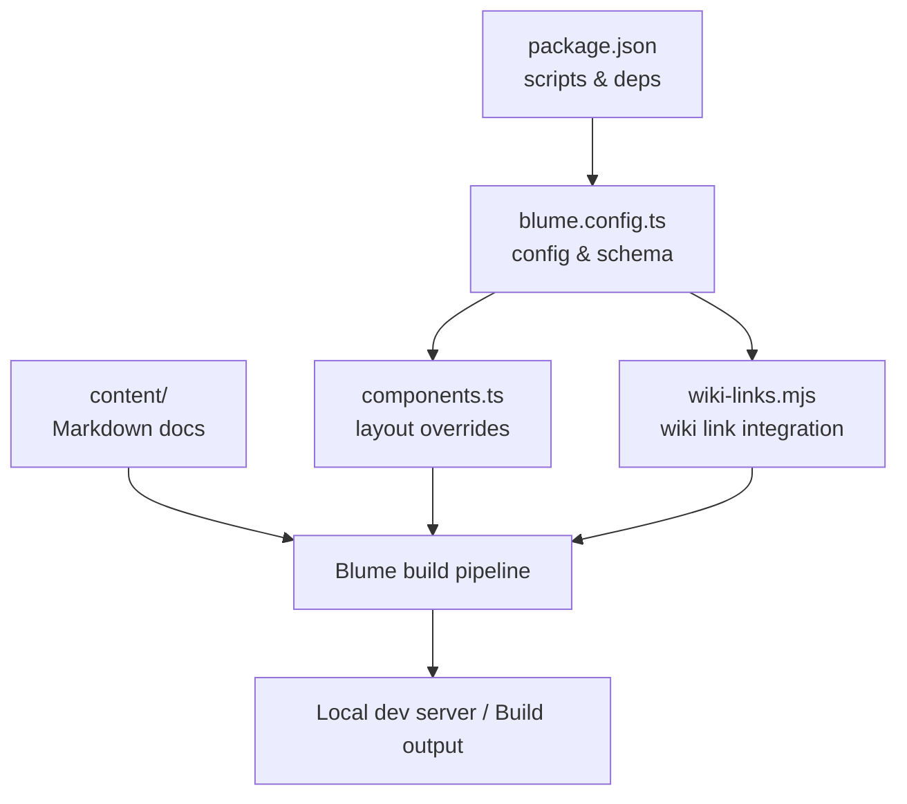
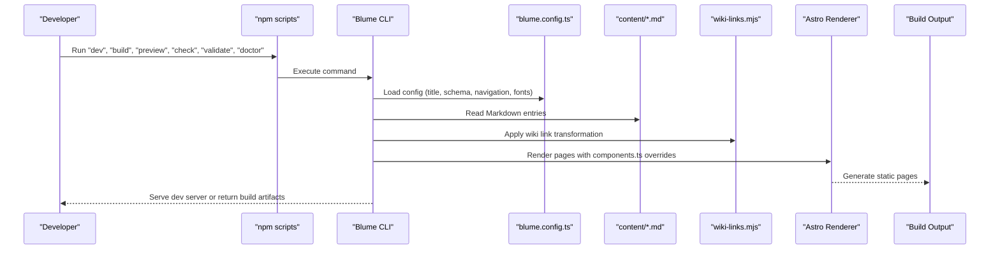
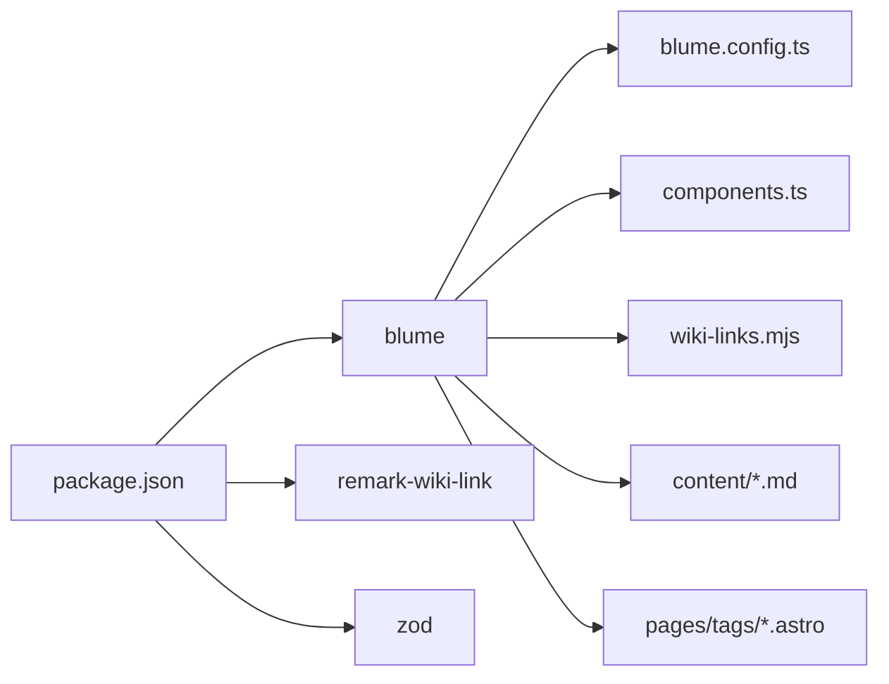

# Getting Started

<cite>
**Referenced Files in This Document**
- [package.json](file://package.json)
- [blume.config.ts](file://blume.config.ts)
- [components.ts](file://components.ts)
- [wiki-links.mjs](file://wiki-links.mjs)
- [content/Archaeology/INDEX.md](file://content/Archaeology/INDEX.md)
- [content/Writings/INDEX.md](file://content/Writings/INDEX.md)
- [content/Archaeology/archaeobotany-archaeozoology.md](file://content/Archaeology/archaeobotany-archaeozoology.md)
- [components/Logo.astro](file://components/Logo.astro)
- [components/PageHeader.astro](file://components/PageHeader.astro)
- [pages/tags/index.astro](file://pages/tags/index.astro)
- [BLUME-CUSTOMIZATION-BACKEND.md](file://BLUME-CUSTOMIZATION-BACKEND.md)
</cite>

## Table of Contents
1. Introduction
2. Project Structure
3. Core Components
4. Architecture Overview
5. Detailed Component Analysis
6. Dependency Analysis
7. Performance Considerations
8. Troubleshooting Guide
9. Conclusion

## Introduction
This guide helps you set up Fractal Home, an Astro-based knowledge bank powered by Blume, and get your first content running locally. You will learn how to install dependencies, run development scripts, configure frontmatter validation with Zod, organize content under the content directory, and create your first markdown document with proper metadata. It also explains the npm scripts used for development, building, previewing, type checking, validation, and diagnostics.

## Project Structure
Fractal Home follows a simple, predictable layout:
- content: Markdown documents organized into folders (e.g., Archaeology, Writings). Each folder typically includes an INDEX.md that acts as a landing page for the section.
- components: Astro components for customizing the site’s look and behavior (e.g., Logo, PageHeader).
- pages: Custom Astro pages such as tags index and dynamic tag routes.
- blume.config.ts: Central configuration for title, description, integrations, frontmatter schema, navigation, and theme settings.
- components.ts: Registration of component overrides for Blume’s layout slots.
- wiki-links.mjs: Integration that converts wiki-style links into regular markdown links at build time.
- package.json: Scripts and dependencies for Blume, remark-wiki-link, and Zod.

**Diagram sources**
- [package.json:1-19](file://package.json#L1-L19)
- [blume.config.ts:1-67](file://blume.config.ts#L1-L67)
- [components.ts:1-12](file://components.ts#L1-L12)
- [wiki-links.mjs:1-125](file://wiki-links.mjs#L1-L125)

**Section sources**
- [package.json:1-19](file://package.json#L1-L19)
- [blume.config.ts:1-67](file://blume.config.ts#L1-L67)
- [components.ts:1-12](file://components.ts#L1-L12)
- [wiki-links.mjs:1-125](file://wiki-links.mjs#L1-L125)

## Core Components
- Blume CLI and scripts: The npm scripts wrap Blume commands for development, building, previewing, type checking, validation, and diagnostics.
- Frontmatter schema: Defined via Zod in blume.config.ts to validate fields like title, description, tags, sources, related, timestamp, source, created, updated, project, boss, group, supergroup, and links.
- Wiki links integration: Converts [[PageName]] or [[PageName|Label]] syntax into standard markdown links during rendering.
- Layout customization: Register Astro components for layout slots (e.g., Logo, PageHeader) through components.ts.
- Tag pages: Built-in tag aggregation and display via pages/tags/index.astro.

Key responsibilities:
- blume.config.ts sets site identity, integrations, frontmatter schema, navigation, and fonts.
- components.ts wires custom Astro components into Blume’s layout system.
- wiki-links.mjs enhances authoring experience with wiki-style linking.
- pages/tags/index.astro aggregates and displays all tags across the knowledge base.

**Section sources**
- [blume.config.ts:1-67](file://blume.config.ts#L1-L67)
- [components.ts:1-12](file://components.ts#L1-L12)
- [wiki-links.mjs:1-125](file://wiki-links.mjs#L1-L125)
- [pages/tags/index.astro:1-74](file://pages/tags/index.astro#L1-L74)

## Architecture Overview
At a high level, content flows from Markdown files through Blume’s build pipeline, which applies the configured frontmatter schema, renders content using Astro components, and generates static pages. Integrations like wiki-links transform authoring-friendly markup into final HTML.

**Diagram sources**
- [package.json:1-19](file://package.json#L1-L19)
- [blume.config.ts:1-67](file://blume.config.ts#L1-L67)
- [wiki-links.mjs:1-125](file://wiki-links.mjs#L1-L125)
- [components.ts:1-12](file://components.ts#L1-L12)

## Detailed Component Analysis

### Installation and Setup
- Ensure Node.js is installed on your machine.
- Install dependencies using npm.
- Start the local development server to see changes instantly.
- Build the site for production deployment.
- Preview the built output locally.
- Run type checks and validation to catch errors early.
- Use doctor to diagnose environment issues.

Recommended workflow:
- Use dev for iterative editing and live reload.
- Use check to validate TypeScript and types.
- Use validate to enforce frontmatter schema rules.
- Use build to generate optimized static assets.
- Use preview to verify the production build locally.
- Use doctor to troubleshoot setup problems.

**Section sources**
- [package.json:1-19](file://package.json#L1-L19)

### Initial Project Configuration
- Site identity and description are defined in blume.config.ts.
- Integrations include wikiLinks for wiki-style linking.
- Frontmatter schema extends supported fields with Zod validators.
- Navigation defines tabs and featured items; sidebar can be flat, grouped, or per-page.
- Theme configuration sets fonts and variants.

Practical steps:
- Edit blume.config.ts to set title, description, and integrations.
- Extend frontmatter fields as needed using Zod schemas.
- Configure navigation labels and paths.
- Add custom fonts and variants if required.

**Section sources**
- [blume.config.ts:1-67](file://blume.config.ts#L1-L67)

### Creating Your First Markdown Document
- Place your new document under content/<Category>/<slug>.md.
- Include frontmatter with required fields like title and description.
- Optionally add tags, sources, related, timestamp, and other extended fields validated by Zod.
- Use wiki-style links [[PageName]] or [[PageName|Label]] to reference other pages.
- Create an INDEX.md in each category folder to serve as a landing page.

Example structure:
- content/MyTopic/first-post.md
- content/MyTopic/INDEX.md

Frontmatter fields commonly used:
- title, description
- knowledge-bank (array of strings)
- tags (array of strings)
- sources (array of strings)
- related (array of strings)
- timestamp, source, created, updated, project, boss, group, supergroup
- links (array of objects with url and name)

Validation behavior:
- Fields are optional unless specified otherwise in the schema.
- Arrays must contain strings where defined.
- Timestamps and dates are coerced to strings when applicable.

**Section sources**
- [content/Archaeology/INDEX.md:1-88](file://content/Archaeology/INDEX.md#L1-L88)
- [content/Writings/INDEX.md:1-41](file://content/Writings/INDEX.md#L1-L41)
- [content/Archaeology/archaeobotany-archaeozoology.md:1-62](file://content/Archaeology/archaeobotany-archaeozoology.md#L1-L62)
- [blume.config.ts:1-67](file://blume.config.ts#L1-L67)

### Wiki Links Integration
The wiki-links integration transforms wiki-style links into standard markdown links during rendering:
- Supports [[PageName]] and [[PageName|Label]].
- Ignores code fences to avoid transforming code blocks.
- Builds a map of titles and filenames to resolve links.
- Falls back to a default route pattern if a page is not found.

Authoring tips:
- Use descriptive page names for better readability.
- Provide explicit labels when the display text differs from the target page.
- Keep consistent naming conventions across categories.

**Section sources**
- [wiki-links.mjs:1-125](file://wiki-links.mjs#L1-L125)

### Layout Customization
Customize Blume’s layout by registering Astro components:
- Logo.astro provides the brand logo and wordmark with light/dark mode support.
- PageHeader.astro renders tag pills above the article content.
- Register these components in components.ts under the layout slot.

Best practices:
- Keep global styles in theme.css.
- Use components.ts only when markup or behavior must change.
- Test both light and dark themes after changes.

**Section sources**
- [components/Logo.astro:1-48](file://components/Logo.astro#L1-L48)
- [components/PageHeader.astro:1-31](file://components/PageHeader.astro#L1-L31)
- [components.ts:1-12](file://components.ts#L1-L12)
- [BLUME-CUSTOMIZATION-BACKEND.md:1-524](file://BLUME-CUSTOMIZATION-BACKEND.md#L1-L524)

### Tags System
Tags are aggregated and displayed via pages/tags/index.astro:
- Scans all entries and collects unique tags.
- Groups tags alphabetically, handling digit-leading tags under “0-9”.
- Renders a tag cloud with counts and links to /tags/<slug>.

Usage:
- Add tags in frontmatter to enable tagging.
- Use lowercase, hyphenated slugs for consistency.
- Link to tag pages from PageHeader.astro or within content.

**Section sources**
- [pages/tags/index.astro:1-74](file://pages/tags/index.astro#L1-L74)
- [components/PageHeader.astro:1-31](file://components/PageHeader.astro#L1-L31)

## Dependency Analysis
Core dependencies:
- blume: Static site generator engine and CLI.
- remark-wiki-link: Markdown processing for wiki-style links.
- zod: Runtime schema validation for frontmatter.

Scripts:
- dev: Starts the development server.
- build: Generates production assets.
- preview: Serves the built output locally.
- check: Runs type checks.
- validate: Validates frontmatter schema.
- doctor: Diagnoses environment issues.

**Diagram sources**
- [package.json:1-19](file://package.json#L1-L19)
- [blume.config.ts:1-67](file://blume.config.ts#L1-L67)
- [components.ts:1-12](file://components.ts#L1-L12)
- [wiki-links.mjs:1-125](file://wiki-links.mjs#L1-L125)

**Section sources**
- [package.json:1-19](file://package.json#L1-L19)

## Performance Considerations
- Prefer minimal frontmatter fields to reduce parsing overhead.
- Avoid excessively large images; use optimized assets in static directories.
- Leverage Astro’s efficient rendering and Blume’s static generation.
- Keep wiki link maps small by organizing content logically.
- Use dev mode for fast iteration and build mode for production optimization.

[No sources needed since this section provides general guidance]

## Troubleshooting Guide
Common issues and resolutions:
- Dependencies not installed: Run npm install to ensure all packages are present.
- Port conflicts: If the dev server fails to start, try a different port or stop conflicting processes.
- Frontmatter validation errors: Use blume validate to identify missing or invalid fields.
- Type errors: Run blume check to surface TypeScript issues.
- Environment problems: Use blume doctor to diagnose Node.js version or path issues.
- Wiki links not resolving: Ensure page titles or filenames match the wiki link references.
- Tag pages not showing: Verify tags exist in frontmatter and are lowercase/hyphenated.

Verification checklist:
- Confirm blume.config.ts has valid schema definitions.
- Check that components.ts registers necessary layout components.
- Validate content/frontmatter against the schema.
- Test both light and dark themes after visual changes.
- Review generated pages for correct routing and links.

**Section sources**
- [BLUME-CUSTOMIZATION-BACKEND.md:1-524](file://BLUME-CUSTOMIZATION-BACKEND.md#L1-L524)

## Conclusion
You now have the essentials to set up Fractal Home, configure it with blume.config.ts, write validated markdown content, and customize the site’s layout and behavior. Use the npm scripts to iterate quickly, validate your work, and build for production. With Zod-backed frontmatter and wiki-style linking, you can maintain a robust, navigable knowledge bank tailored to your needs.

[No sources needed since this section summarizes without analyzing specific files]