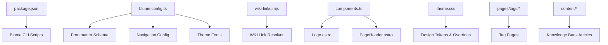
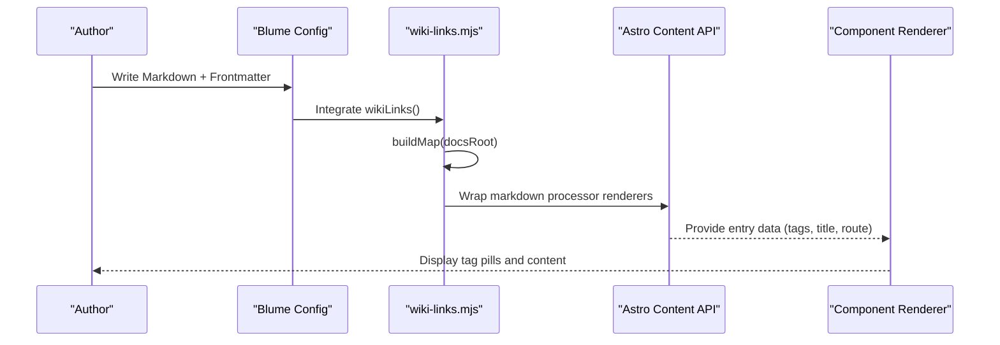
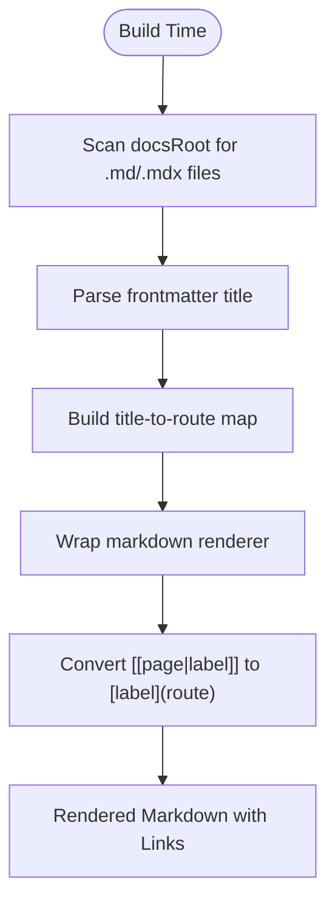
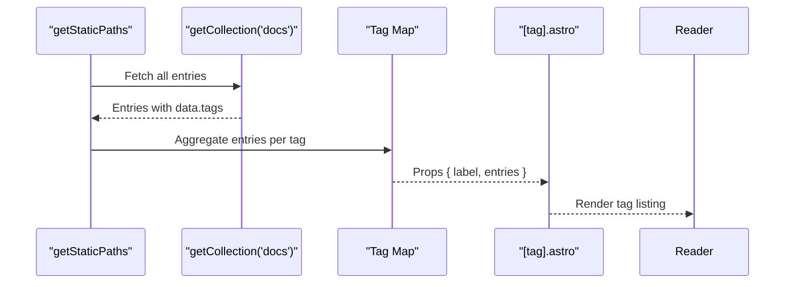
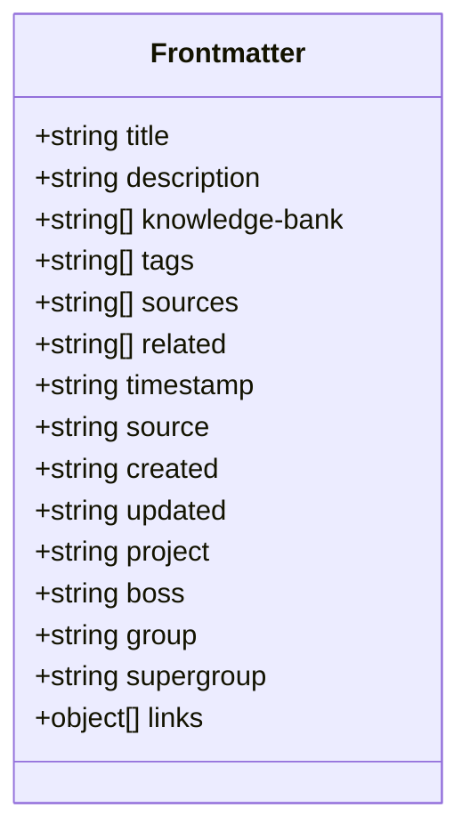
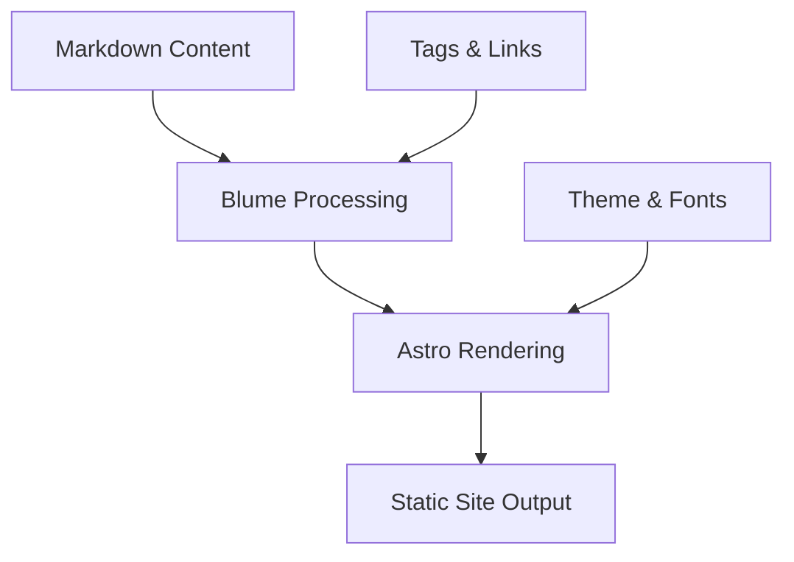
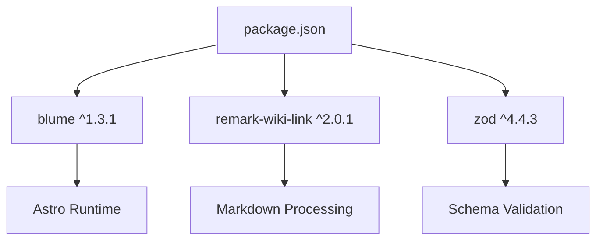

# Project Overview

<cite>
**Referenced Files in This Document**
- [blume.config.ts](file://blume.config.ts)
- [package.json](file://package.json)
- [components.ts](file://components.ts)
- [wiki-links.mjs](file://wiki-links.mjs)
- [BLUME-CUSTOMIZATION-BACKEND.md](file://BLUME-CUSTOMIZATION-BACKEND.md)
- [theme.css](file://theme.css)
- [components/Logo.astro](file://components/Logo.astro)
- [components/PageHeader.astro](file://components/PageHeader.astro)
- [pages/tags/[tag].astro](file://pages/tags/[tag].astro)
- [pages/tags/index.astro](file://pages/tags/index.astro)
- [content/Writings/INDEX.md](file://content/Writings/INDEX.md)
- [content/Archaeology/INDEX.md](file://content/Archaeology/INDEX.md)
- [content/Comparative Civilization/INDEX.md](file://content/Comparative Civilization/INDEX.md)
- [content/Writings/dharma.md](file://content/Writings/dharma.md)
- [content/Archaeology/harappan-indus.md](file://content/Archaeology/harappan-indus.md)
</cite>

## Table of Contents
1. Introduction
2. Project Structure
3. Core Components
4. Architecture Overview
5. Detailed Component Analysis
6. Dependency Analysis
7. Performance Considerations
8. Troubleshooting Guide
9. Conclusion

## Introduction
Fractal Home is a sophisticated static site generator and knowledge management platform built on Blume (Astro-based). It serves as a markdown-first documentation system optimized for scholarly presentation, wiki-style cross-referencing, and tag-based navigation across a large knowledge-bank spanning multiple academic domains such as archaeology, civilization studies, history, philosophy, and personal writings. The project emphasizes structured content organization, consistent typography, and a clean editorial aesthetic suitable for long-form research and reference materials.

Key features include:
- Markdown-first authoring with rich frontmatter fields for knowledge-bank metadata
- Wiki-links that automatically convert internal references into navigable links
- Tag-based navigation and index pages for browsing by topic
- Scholarly presentation with refined typography, light/dark themes, and accessible focus states
- Astro component composition patterns for layout customization via Blume’s override system

This document provides both conceptual overviews for beginners learning about static site generators and technical details for experienced developers working with Astro components and TypeScript configuration.

## Project Structure
The repository organizes content under a clear directory hierarchy with dedicated sections for each knowledge domain. Each domain contains an INDEX.md file that acts as a hub page, linking to related articles and providing topic maps. Custom components are placed under a dedicated folder and registered through a central configuration file. Build scripts and dependencies are defined in the package manifest.



**Diagram sources**
- [package.json:1-19](file://package.json#L1-L19)
- [blume.config.ts:1-67](file://blume.config.ts#L1-L67)
- [wiki-links.mjs:1-125](file://wiki-links.mjs#L1-L125)
- [components.ts:1-12](file://components.ts#L1-L12)
- [theme.css:1-200](file://theme.css#L1-L200)
- [pages/tags/[tag].astro:1-61](file://pages/tags/[tag].astro#L1-L61)
- [pages/tags/index.astro:35-73](file://pages/tags/index.astro#L35-L73)
- [content/Writings/INDEX.md:1-41](file://content/Writings/INDEX.md#L1-L41)

**Section sources**
- [package.json:1-19](file://package.json#L1-L19)
- [blume.config.ts:1-67](file://blume.config.ts#L1-L67)
- [wiki-links.mjs:1-125](file://wiki-links.mjs#L1-L125)
- [components.ts:1-12](file://components.ts#L1-L12)
- [theme.css:1-200](file://theme.css#L1-L200)
- [pages/tags/[tag].astro:1-61](file://pages/tags/[tag].astro#L1-L61)
- [pages/tags/index.astro:35-73](file://pages/tags/index.astro#L35-L73)
- [content/Writings/INDEX.md:1-41](file://content/Writings/INDEX.md#L1-L41)

## Core Components
The core components define how the site renders its visual identity and content structure:
- Logo component: Provides brand lockup with theme-aware wordmark variants and accessible labels.
- PageHeader component: Renders tag pills above article content using data from Blume’s content collection.
- Tag pages: Generate dynamic listings for each tag, sorting entries and displaying descriptions.
- Theme and fonts: Configure typography and design tokens for consistent scholarly aesthetics.

These components integrate with Blume’s layout system and Astro’s content APIs to produce a cohesive reading experience.

**Section sources**
- [components/Logo.astro:1-48](file://components/Logo.astro#L1-L48)
- [components/PageHeader.astro:1-31](file://components/PageHeader.astro#L1-L31)
- [pages/tags/[tag].astro:1-61](file://pages/tags/[tag].astro#L1-L61)
- [pages/tags/index.astro:35-73](file://pages/tags/index.astro#L35-L73)
- [theme.css:1-200](file://theme.css#L1-L200)

## Architecture Overview
Fractal Home follows a modular architecture where content is authored in Markdown, processed by Blume’s integration layer, and rendered through Astro components. The wiki-link resolver scans content during build time to map titles and filenames to routes, enabling seamless cross-references. Frontmatter fields extend the schema to support knowledge-bank metadata, tags, and relational pointers.



**Diagram sources**
- [blume.config.ts:1-67](file://blume.config.ts#L1-L67)
- [wiki-links.mjs:1-125](file://wiki-links.mjs#L1-L125)
- [components/PageHeader.astro:1-31](file://components/PageHeader.astro#L1-L31)

**Section sources**
- [blume.config.ts:1-67](file://blume.config.ts#L1-L67)
- [wiki-links.mjs:1-125](file://wiki-links.mjs#L1-L125)
- [components/PageHeader.astro:1-31](file://components/PageHeader.astro#L1-L31)

## Detailed Component Analysis

### Wiki Links System
The wiki-links module transforms wiki-style references within Markdown into standard Markdown links. It builds a mapping of titles and filenames to routes by scanning the docs root, then wraps the markdown renderer to intercept and convert content before rendering.



**Diagram sources**
- [wiki-links.mjs:1-125](file://wiki-links.mjs#L1-L125)

**Section sources**
- [wiki-links.mjs:1-125](file://wiki-links.mjs#L1-L125)

### Tag Navigation
Tag pages dynamically generate listings based on collected entries. The index page groups tags alphabetically and displays counts, while individual tag pages list all entries associated with that tag, sorted by title and including descriptions when available.



**Diagram sources**
- [pages/tags/[tag].astro:1-61](file://pages/tags/[tag].astro#L1-L61)
- [pages/tags/index.astro:35-73](file://pages/tags/index.astro#L35-L73)

**Section sources**
- [pages/tags/[tag].astro:1-61](file://pages/tags/[tag].astro#L1-L61)
- [pages/tags/index.astro:35-73](file://pages/tags/index.astro#L35-L73)

### Frontmatter Schema and Knowledge-Bank Metadata
Frontmatter fields are extended via Zod schemas to enforce type safety and provide structured metadata for knowledge-bank organization. Fields include knowledge-bank identifiers, tags, sources, related entries, timestamps, and hierarchical groupings.



**Diagram sources**
- [blume.config.ts:1-67](file://blume.config.ts#L1-L67)

**Section sources**
- [blume.config.ts:1-67](file://blume.config.ts#L1-L67)

### Component Composition Patterns
Custom components are registered through a central configuration file, allowing selective overrides of Blume’s default layout elements. The Logo and PageHeader components demonstrate how to integrate brand assets and dynamic content rendering within the Blume ecosystem.

```mermaid
classDiagram
class ComponentsConfig {
+defineComponents(config)
+layout : {
+Logo
+PageHeader
}
}
class Logo {
+Props : site, logo
+renders : Brand lockup with theme-aware wordmarks
}
class PageHeader {
+Props : page
+renders : Tag pills from blume : data
}
ComponentsConfig --> Logo : "registers"
ComponentsConfig --> PageHeader : "registers"
```

**Diagram sources**
- [components.ts:1-12](file://components.ts#L1-L12)
- [components/Logo.astro:1-48](file://components/Logo.astro#L1-L48)
- [components/PageHeader.astro:1-31](file://components/PageHeader.astro#L1-L31)

**Section sources**
- [components.ts:1-12](file://components.ts#L1-L12)
- [components/Logo.astro:1-48](file://components/Logo.astro#L1-L48)
- [components/PageHeader.astro:1-31](file://components/PageHeader.astro#L1-L31)

### Conceptual Overview
For beginners, Fractal Home operates like a modern static site generator: you write content in Markdown, configure how it’s organized and styled, and the system builds a fast, accessible website. Think of it as a digital library where each article is a book, tags are bookmarks, and wiki-links are footnotes that connect ideas across chapters. The Blume framework handles the heavy lifting—routing, theming, and rendering—while you focus on content structure and relationships.



[No sources needed since this diagram shows conceptual workflow, not actual code structure]

## Dependency Analysis
The project relies on Blume as the primary framework, remark-wiki-link for additional wiki functionality, and Zod for schema validation. Dependencies are declared in the package manifest, and scripts provide development, build, and validation commands.



**Diagram sources**
- [package.json:1-19](file://package.json#L1-L19)

**Section sources**
- [package.json:1-19](file://package.json#L1-L19)

## Performance Considerations
- Static generation ensures fast load times and optimal SEO performance
- Content is pre-rendered at build time, minimizing client-side processing
- Tag pages use efficient data aggregation and sorting algorithms
- Image assets should be optimized and lazy-loaded where appropriate
- Font loading strategies should consider critical rendering paths

[No sources needed since this section provides general guidance]

## Troubleshooting Guide
Common issues and their solutions:
- Wiki links not resolving: Ensure docs root path is correctly configured and files have valid frontmatter titles
- Tag pages not generating: Verify entries have properly formatted tags in frontmatter
- Component overrides not applying: Check components.ts registration and ensure proper import paths
- Theme inconsistencies: Validate CSS custom properties and test both light and dark modes
- Build errors: Run validation commands and check for schema mismatches in frontmatter

**Section sources**
- [BLUME-CUSTOMIZATION-BACKEND.md:1-524](file://BLUME-CUSTOMIZATION-BACKEND.md#L1-L524)

## Conclusion
Fractal Home represents a mature approach to knowledge management through static site generation. Its combination of Blume’s robust framework, Astro’s component model, and thoughtful content architecture creates a powerful platform for scholarly documentation. The system’s emphasis on wiki-style linking, tag-based navigation, and scholarly presentation makes it ideal for organizing complex knowledge domains while maintaining accessibility and performance standards.

[No sources needed since this section summarizes without analyzing specific files]