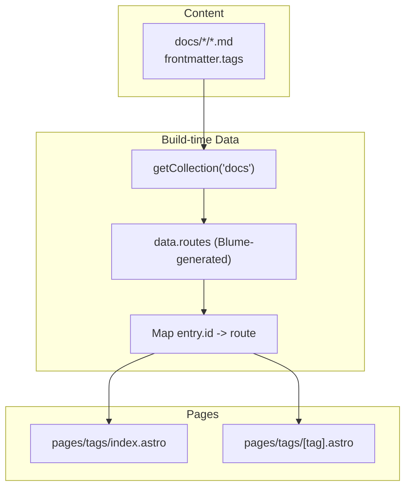
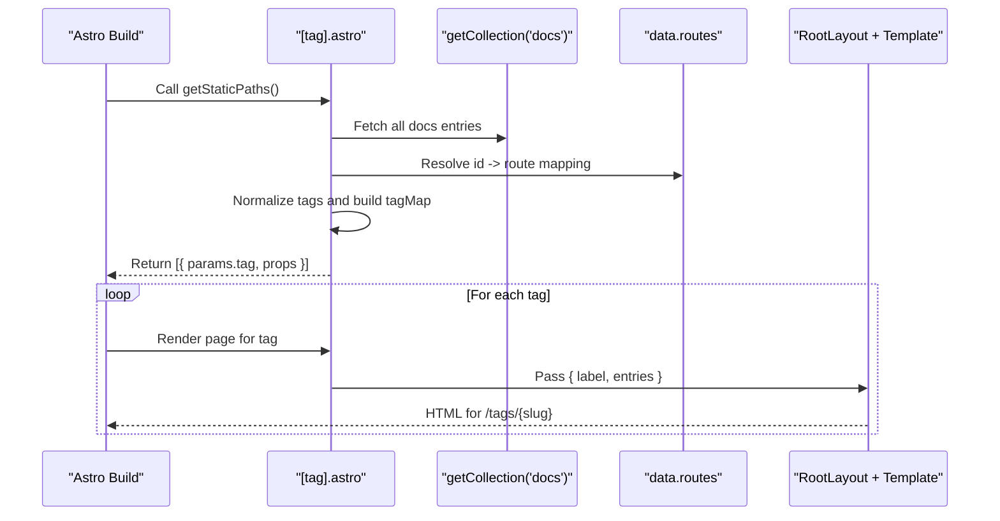
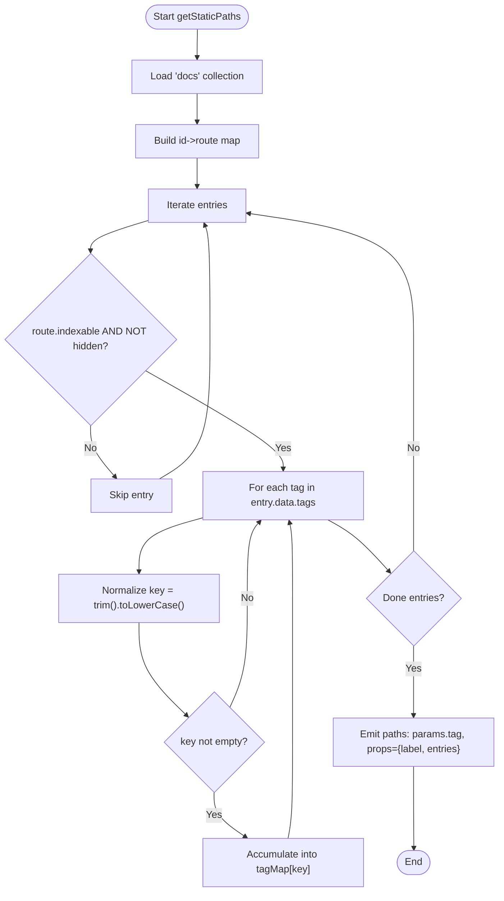
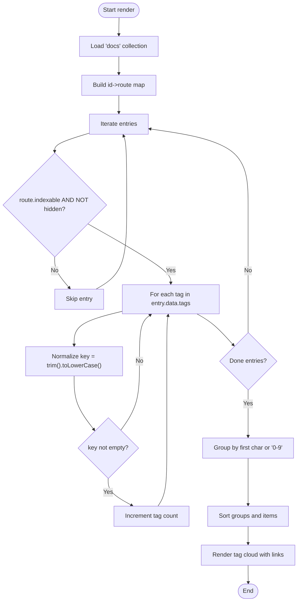
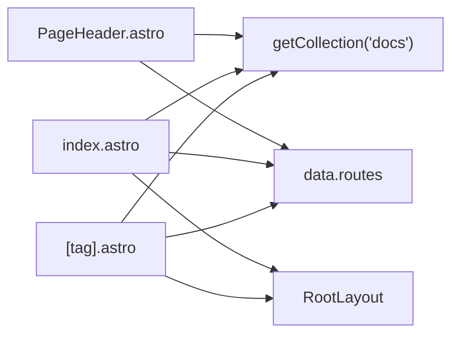
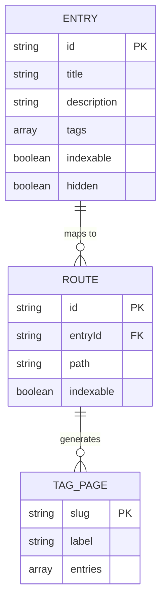

# Dynamic Tag Pages and Routing

<cite>
**Referenced Files in This Document**
- [pages/tags/[tag].astro](file://pages/tags/[tag].astro)
- [pages/tags/index.astro](file://pages/tags/index.astro)
- [components/PageHeader.astro](file://components/PageHeader.astro)
- [blume.config.ts](file://blume.config.ts)
- [content/Writings/INDEX.md](file://content/Writings/INDEX.md)
- [content/Writings/dharma.md](file://content/Writings/dharma.md)
</cite>

## Table of Contents
1. [Introduction](#introduction)
2. [Project Structure](#project-structure)
3. [Core Components](#core-components)
4. [Architecture Overview](#architecture-overview)
5. [Detailed Component Analysis](#detailed-component-analysis)
6. [Dependency Analysis](#dependency-analysis)
7. [Performance Considerations](#performance-considerations)
8. [Troubleshooting Guide](#troubleshooting-guide)
9. [Conclusion](#conclusion)
10. [Appendices](#appendices)

## Introduction
This document explains how dynamic tag pages and routing work in the project using Astro’s parameterized routes. It focuses on the [tag].astro template that generates per-tag pages, the /tags index page that lists all tags, and how content frontmatter tags are transformed into URL slugs and filtered listings at build time. It also covers SEO considerations, canonical URLs, sitemap integration, customization patterns, and performance strategies for large tag collections.

## Project Structure
The tag system is implemented with two Astro pages under pages/tags:
- pages/tags/index.astro: Builds a tag cloud and links to each tag page.
- pages/tags/[tag].astro: A dynamic route that renders a page for each unique tag found across the docs collection.

Tag data comes from the docs content collection via getCollection("docs") and is mapped through Blume’s generated routes (data.routes). The blume.config.ts defines the schema for frontmatter fields including tags.

**Diagram sources**
- [pages/tags/index.astro](file://pages/tags/index.astro)
- [pages/tags/[tag].astro](file://pages/tags/[tag].astro)
- [blume.config.ts](file://blume.config.ts)

**Section sources**
- [pages/tags/index.astro](file://pages/tags/index.astro)
- [pages/tags/[tag].astro](file://pages/tags/[tag].astro)
- [blume.config.ts](file://blume.config.ts)

## Core Components
- Dynamic tag page ([tag].astro):
  - Uses getStaticPaths to enumerate all tags present in the docs collection.
  - Filters out non-indexable entries and hidden sidebar items.
  - Normalizes tags by trimming whitespace and lowercasing to create stable slugs.
  - Produces one static route per unique tag with props containing label and sorted entries.
  - Renders a list of entries linked to their final paths.

- Tags index page (index.astro):
  - Aggregates all tags and counts occurrences.
  - Groups tags alphabetically; digit-leading tags group under “0-9”.
  - Generates links to /tags/{slug} using encodeURIComponent for safe URLs.

- Page header component (PageHeader.astro):
  - Displays inline tags on individual pages as links to /tags/{slug}.
  - Encodes slugs consistently with the rest of the site.

- Configuration (blume.config.ts):
  - Declares the tags field in frontmatter schema so it is available in entry.data.tags.

**Section sources**
- [pages/tags/[tag].astro](file://pages/tags/[tag].astro)
- [pages/tags/index.astro](file://pages/tags/index.astro)
- [components/PageHeader.astro](file://components/PageHeader.astro)
- [blume.config.ts](file://blume.config.ts)

## Architecture Overview
At build time, Astro executes getStaticPaths in the dynamic route to pre-render every tag page. The process:
1. Load all docs entries.
2. Map entry IDs to Blume routes to obtain title, path, and indexability.
3. Iterate over each entry’s tags array, normalize keys, and accumulate entries per tag.
4. Emit a static path for each unique tag with its associated entries.

**Diagram sources**
- [pages/tags/[tag].astro](file://pages/tags/[tag].astro)
- [pages/tags/index.astro](file://pages/tags/index.astro)

## Detailed Component Analysis

### Dynamic Tag Page: [tag].astro
Responsibilities:
- Enumerate tags via getStaticPaths.
- Filter entries based on route.indexable and sidebar.hidden.
- Normalize tag keys to lowercase trimmed strings.
- Sort entries by title for consistent output.
- Provide page metadata via RootLayout props.

Key behaviors:
- Tag normalization ensures consistent slug generation and matching.
- Entries include title, path, and optional description for display.
- The page sets headings and indexable flag for search indexing.

**Diagram sources**
- [pages/tags/[tag].astro](file://pages/tags/[tag].astro)

**Section sources**
- [pages/tags/[tag].astro](file://pages/tags/[tag].astro)

### Tags Index Page: index.astro
Responsibilities:
- Aggregate tags and count occurrences across all indexable entries.
- Group tags alphabetically; digits grouped under “0-9”.
- Generate a scannable tag cloud with links to /tags/{slug}.

Key behaviors:
- Uses encodeURIComponent when generating links to ensure valid URLs.
- Provides accessibility attributes for sections and letter headers.

**Diagram sources**
- [pages/tags/index.astro](file://pages/tags/index.astro)

**Section sources**
- [pages/tags/index.astro](file://pages/tags/index.astro)

### Page Header Component: PageHeader.astro
Responsibilities:
- Display tags from the current page’s frontmatter as clickable pills.
- Link to /tags/{slug} with proper encoding.

Behavior:
- Reads tags from entry.data.tags after resolving the route.
- Ensures consistent slug casing and encoding.

**Section sources**
- [components/PageHeader.astro](file://components/PageHeader.astro)

### Frontmatter Schema: blume.config.ts
Responsibilities:
- Define the tags field as an optional string array in frontmatter.
- Enable access to entry.data.tags throughout the app.

Impact:
- Without this schema, tag arrays would not be typed or validated.

**Section sources**
- [blume.config.ts](file://blume.config.ts)

## Dependency Analysis
- pages/tags/[tag].astro depends on:
  - Astro’s getCollection API for content.
  - Blume’s data.routes for mapping entry IDs to routes.
  - RootLayout for layout and metadata injection.

- pages/tags/index.astro depends on:
  - Same content and route mapping mechanisms.
  - RootLayout for layout and metadata.

- components/PageHeader.astro depends on:
  - Blume’s data.routes to find the current entry.
  - getCollection to read tags from the matched entry.

**Diagram sources**
- [pages/tags/[tag].astro](file://pages/tags/[tag].astro)
- [pages/tags/index.astro](file://pages/tags/index.astro)
- [components/PageHeader.astro](file://components/PageHeader.astro)

**Section sources**
- [pages/tags/[tag].astro](file://pages/tags/[tag].astro)
- [pages/tags/index.astro](file://pages/tags/index.astro)
- [components/PageHeader.astro](file://components/PageHeader.astro)

## Performance Considerations
- Pre-rendering strategy:
  - All tag pages are generated at build time via getStaticPaths, avoiding runtime overhead.
  - Sorting and grouping occur during build, reducing client-side cost.

- Memory and CPU:
  - Tag aggregation uses Maps keyed by normalized tag strings for O(1) lookups.
  - Large collections benefit from early filtering (indexable and hidden checks).

- Optimization opportunities:
  - Cache the id->route map once per build (already done).
  - Avoid redundant string operations by normalizing tags once per occurrence.
  - Consider pagination if a single tag has a very large number of entries.

[No sources needed since this section provides general guidance]

## Troubleshooting Guide
Common issues and resolutions:
- Empty or missing tag pages:
  - Ensure entries have non-empty tags arrays and are marked indexable.
  - Verify that sidebar.hidden is not set for entries you expect to appear.

- Incorrect slug casing or special characters:
  - Slugs are normalized to lowercase trimmed strings; ensure consistency in frontmatter.
  - Links use encodeURIComponent to handle spaces and special characters safely.

- Duplicate or inconsistent labels:
  - The first occurrence of a tag determines the label; keep tag spelling consistent.

- Missing tags in PageHeader:
  - Confirm the current route resolves to an entry with tags defined.
  - Validate that data.routes contains the expected entryId mapping.

- SEO and canonical URLs:
  - Set page.title and page.route in RootLayout props to reflect the tag page URL.
  - Use canonical link tags where appropriate to avoid duplicate content issues.

- Sitemap integration:
  - Include /tags and /tags/{slug} routes in your sitemap generator configuration.
  - Ensure robots meta allows indexing for tag pages if desired.

**Section sources**
- [pages/tags/[tag].astro](file://pages/tags/[tag].astro)
- [pages/tags/index.astro](file://pages/tags/index.astro)
- [components/PageHeader.astro](file://components/PageHeader.astro)

## Conclusion
The dynamic tag system leverages Astro’s parameterized routes and Blume’s content model to generate comprehensive tag pages at build time. By normalizing tags, filtering entries, and precomputing routes, the system delivers fast, SEO-friendly pages. Customization points include layout overrides via RootLayout, additional metadata rendering, and custom filtering logic within getStaticPaths. Proper slug handling and encoding ensure robust navigation across diverse tag names.

[No sources needed since this section summarizes without analyzing specific files]

## Appendices

### Customization Examples
- Customize tag page layout:
  - Modify the RootLayout props in [tag].astro to adjust title, description, and navigation.
  - Add extra metadata blocks before the entry list.

- Add additional metadata display:
  - Extend the entry object in getStaticPaths to include fields like date or author.
  - Render these fields in the template alongside title and description.

- Implement custom filtering logic:
  - In getStaticPaths, add conditions to exclude certain tags or entries.
  - Example: filter by group or supergroup values from frontmatter.

**Section sources**
- [pages/tags/[tag].astro](file://pages/tags/[tag].astro)
- [blume.config.ts](file://blume.config.ts)

### SEO Considerations
- Canonical URLs:
  - Set rel="canonical" to the absolute URL of the tag page to prevent duplication.
  - Ensure the canonical matches the rendered page’s actual URL.

- Meta tags:
  - Provide descriptive title and meta description for each tag page.
  - Include Open Graph and Twitter Card metadata for social sharing.

- Sitemap:
  - Generate sitemaps that include /tags and all /tags/{slug} pages.
  - Mark priority and changefreq appropriately for tag pages.

[No sources needed since this section provides general guidance]

### Data Models and Examples
- Frontmatter tags example:
  - See content/Writings/INDEX.md for tags usage in index pages.
  - See content/Writings/dharma.md for tags on individual entries.

**Diagram sources**
- [content/Writings/INDEX.md](file://content/Writings/INDEX.md)
- [content/Writings/dharma.md](file://content/Writings/dharma.md)

**Section sources**
- [content/Writings/INDEX.md](file://content/Writings/INDEX.md)
- [content/Writings/dharma.md](file://content/Writings/dharma.md)