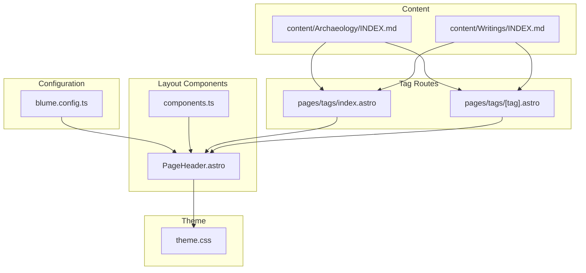
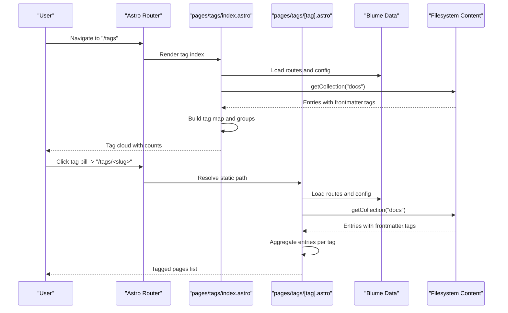
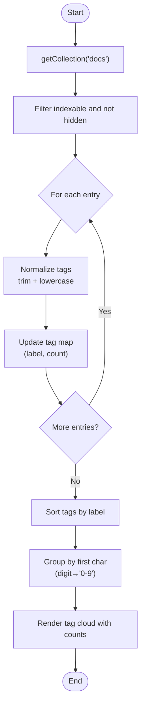
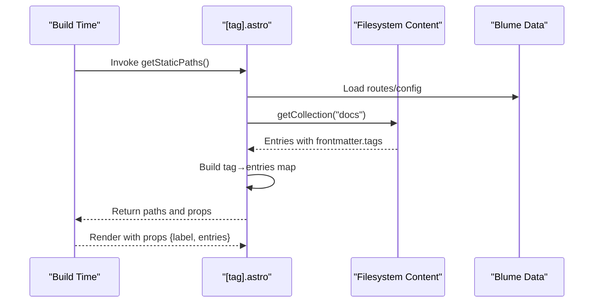
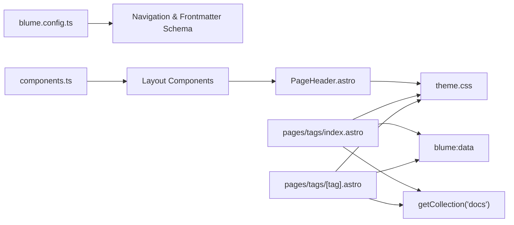

# Navigation Integration and Search

<cite>
**Referenced Files in This Document**
- [blume.config.ts](file://blume.config.ts)
- [components.ts](file://components.ts)
- [pages/tags/index.astro](file://pages/tags/index.astro)
- [pages/tags/[tag].astro](file://pages/tags/[tag].astro)
- [components/PageHeader.astro](file://components/PageHeader.astro)
- [theme.css](file://theme.css)
- [BLUME-CUSTOMIZATION-BACKEND.md](file://BLUME-CUSTOMIZATION-BACKEND.md)
- [package.json](file://package.json)
- [wiki-links.mjs](file://wiki-links.mjs)
- [content/Archaeology/INDEX.md](file://content/Archaeology/INDEX.md)
- [content/Writings/INDEX.md](file://content/Writings/INDEX.md)
</cite>

## Table of Contents
1. Introduction
2. Project Structure
3. Core Components
4. Architecture Overview
5. Detailed Component Analysis
6. Dependency Analysis
7. Performance Considerations
8. Troubleshooting Guide
9. Conclusion

## Introduction
This document explains how tags integrate with the site’s navigation and search to power content discovery. It covers:
- How tag metadata is declared in frontmatter and surfaced in the sidebar and page headers
- Automatic generation of a Tags index and per-tag pages for deep linking
- How search indexing leverages route metadata and tag data for filtering
- Cross-bank navigation patterns and consistent behavior across categories
- Configuration, customization, and performance tuning guidance

## Project Structure
The tag-driven navigation spans configuration, layout components, and dedicated tag routes:
- Configuration defines frontmatter schema, navigation tabs, and featured links including Tags
- Layout components render tag pills on each page header
- Dedicated tag routes generate an index cloud and per-tag listing pages
- Theme styles provide consistent visual treatment for sidebar and tag elements

**Diagram sources**
- [blume.config.ts:26-35](file://blume.config.ts#L26-L35)
- [components/PageHeader.astro:1-31](file://components/PageHeader.astro#L1-L31)
- [components.ts:1-12](file://components.ts#L1-L12)
- [pages/tags/index.astro:1-74](file://pages/tags/index.astro#L1-L74)
- [pages/tags/[tag].astro:1-61](file://pages/tags/[tag].astro#L1-L61)
- [theme.css:152-195](file://theme.css#L152-L195)
- [content/Archaeology/INDEX.md:1-15](file://content/Archaeology/INDEX.md#L1-L15)
- [content/Writings/INDEX.md:1-15](file://content/Writings/INDEX.md#L1-L15)

**Section sources**
- [blume.config.ts:1-35](file://blume.config.ts#L1-L35)
- [components.ts:1-12](file://components.ts#L1-L12)
- [pages/tags/index.astro:1-74](file://pages/tags/index.astro#L1-L74)
- [pages/tags/[tag].astro:1-61](file://pages/tags/[tag].astro#L1-L61)
- [components/PageHeader.astro:1-31](file://components/PageHeader.astro#L1-L31)
- [theme.css:152-195](file://theme.css#L152-L195)
- [content/Archaeology/INDEX.md:1-15](file://content/Archaeology/INDEX.md#L1-L15)
- [content/Writings/INDEX.md:1-15](file://content/Writings/INDEX.md#L1-L15)

## Core Components
- Frontmatter schema: Declares tags as an array of strings alongside other metadata used by navigation and search
- Tag index page: Aggregates all tags from indexable entries, groups them alphabetically, and renders a navigable cloud
- Per-tag page: Generates static paths for every unique tag and lists associated pages with titles and descriptions
- Page header component: Displays tag pills that link to the corresponding tag pages
- Navigation configuration: Adds Tabs and Featured items pointing to /tags; sidebar display mode set to group

Key behaviors:
- Only indexable routes are included (respects sidebar.hidden)
- Tags are normalized (trimmed, lowercased) for stable slugs
- Alphabetical grouping consolidates digit-leading tags under “0-9”

**Section sources**
- [blume.config.ts:9-25](file://blume.config.ts#L9-L25)
- [blume.config.ts:26-35](file://blume.config.ts#L26-L35)
- [pages/tags/index.astro:6-34](file://pages/tags/index.astro#L6-L34)
- [pages/tags/[tag].astro:6-28](file://pages/tags/[tag].astro#L6-L28)
- [components/PageHeader.astro:9-30](file://components/PageHeader.astro#L9-L30)

## Architecture Overview
The tag system integrates with Blume’s routing and content pipeline to produce discoverable navigation surfaces and support search indexing.

**Diagram sources**
- [pages/tags/index.astro:6-34](file://pages/tags/index.astro#L6-L34)
- [pages/tags/[tag].astro:6-28](file://pages/tags/[tag].astro#L6-L28)
- [blume.config.ts:26-35](file://blume.config.ts#L26-L35)

## Detailed Component Analysis

### Tag Index Page (pages/tags/index.astro)
Responsibilities:
- Collects all docs via getCollection("docs")
- Filters out non-indexable or hidden entries
- Builds a tag map keyed by normalized slug with label and count
- Groups tags alphabetically, handling digit-leading tags under “0-9”
- Renders a structured tag cloud with accessible headings and links

Data flow:
- Entry iteration → tag normalization → aggregation → sorting → grouping → rendering

**Diagram sources**
- [pages/tags/index.astro:6-34](file://pages/tags/index.astro#L6-L34)

**Section sources**
- [pages/tags/index.astro:6-34](file://pages/tags/index.astro#L6-L34)

### Per-Tag Page (pages/tags/[tag].astro)
Responsibilities:
- Generates static paths for every unique tag found across indexable entries
- Aggregates page metadata (title, path, description) per tag
- Sorts entries by title and renders a clean list

Static path generation:
- Iterates entries, normalizes tags, and accumulates per-tag entry lists
- Returns params and props for each tag route

**Diagram sources**
- [pages/tags/[tag].astro:6-28](file://pages/tags/[tag].astro#L6-L28)

**Section sources**
- [pages/tags/[tag].astro:6-33](file://pages/tags/[tag].astro#L6-L33)

### Page Header Component (components/PageHeader.astro)
Responsibilities:
- Resolves current route and finds the matching entry
- Extracts tags from frontmatter and renders clickable pills
- Links point to /tags/<normalized-slug>

Behavior highlights:
- Uses blume:data to resolve route metadata
- Safely handles missing entryId and empty tags arrays

**Section sources**
- [components/PageHeader.astro:9-30](file://components/PageHeader.astro#L9-L30)

### Navigation Configuration (blume.config.ts)
Frontmatter schema:
- Declares tags as z.array(z.string()) among other fields

Navigation structure:
- Adds Tabs and Featured items pointing to /tags
- Sidebar display mode set to group for hierarchical presentation

**Section sources**
- [blume.config.ts:9-25](file://blume.config.ts#L9-L25)
- [blume.config.ts:26-35](file://blume.config.ts#L26-L35)

### Theme Styling (theme.css)
Sidebar styling:
- Active page highlighting, group labels, collapsible sections, and hover states
- Ensures consistent look-and-feel across desktop and mobile nav drawers

Tag UI:
- Pill styling and spacing are applied consistently across tag rows and clouds

**Section sources**
- [theme.css:152-195](file://theme.css#L152-L195)

### Wiki Links Integration (wiki-links.mjs)
Purpose:
- Converts wiki-style links into standard markdown links during build
- Supports fallback routing for unmatched names

Relevance to navigation:
- Enhances cross-linking within content, complementing tag-based discovery

**Section sources**
- [wiki-links.mjs:50-77](file://wiki-links.mjs#L50-L77)
- [wiki-links.mjs:79-124](file://wiki-links.mjs#L79-L124)

## Dependency Analysis
The tag system depends on Blume’s data layer, Astro’s content collection, and theme styling.

**Diagram sources**
- [blume.config.ts:9-35](file://blume.config.ts#L9-L35)
- [components.ts:1-12](file://components.ts#L1-L12)
- [components/PageHeader.astro:1-31](file://components/PageHeader.astro#L1-L31)
- [pages/tags/index.astro:1-74](file://pages/tags/index.astro#L1-L74)
- [pages/tags/[tag].astro:1-61](file://pages/tags/[tag].astro#L1-L61)
- [theme.css:152-195](file://theme.css#L152-L195)

**Section sources**
- [blume.config.ts:9-35](file://blume.config.ts#L9-L35)
- [components.ts:1-12](file://components.ts#L1-L12)
- [components/PageHeader.astro:1-31](file://components/PageHeader.astro#L1-L31)
- [pages/tags/index.astro:1-74](file://pages/tags/index.astro#L1-L74)
- [pages/tags/[tag].astro:1-61](file://pages/tags/[tag].astro#L1-L61)
- [theme.css:152-195](file://theme.css#L152-L195)

## Performance Considerations
- Pre-rendered tag routes: Static path generation avoids runtime overhead and improves load times
- Efficient aggregation: Maps and sets minimize repeated lookups during tag processing
- Filtering early: Skipping non-indexable or hidden entries reduces processing cost
- Sorting and grouping: Localized operations keep memory usage predictable
- Search indexing: Ensure searchEnabled is configured so tag metadata participates in search results

[No sources needed since this section provides general guidance]

## Troubleshooting Guide
Common issues and resolutions:
- Tags not appearing in header:
  - Verify frontmatter includes a non-empty tags array
  - Confirm the route is indexable and not marked sidebar.hidden
- Tag links broken:
  - Ensure tag values are trimmed and lowercased when generating slugs
  - Check that the tag exists in the generated static paths
- Tag counts incorrect:
  - Rebuild to refresh the tag map; ensure no duplicate whitespace in tags
- Search not returning tagged content:
  - Confirm searchEnabled is true in configuration
  - Validate that entries are indexable and have valid frontmatter
- Sidebar conflicts:
  - Review theme.css selectors for active states and group labels
  - Use the customization guide to adjust padding, borders, and collapsible behavior

**Section sources**
- [components/PageHeader.astro:9-30](file://components/PageHeader.astro#L9-L30)
- [pages/tags/index.astro:6-34](file://pages/tags/index.astro#L6-L34)
- [pages/tags/[tag].astro:6-28](file://pages/tags/[tag].astro#L6-L28)
- [theme.css:152-195](file://theme.css#L152-L195)
- [BLUME-CUSTOMIZATION-BACKEND.md:248-380](file://BLUME-CUSTOMIZATION-BACKEND.md#L248-L380)

## Conclusion
The tag system provides a robust foundation for content discovery through:
- Consistent tag metadata in frontmatter
- Automatic generation of tag index and per-tag pages
- Seamless integration with navigation and search
- Customizable styling and behavior across categories

By following the configuration and troubleshooting guidance, you can maintain reliable navigation behavior, optimize search performance, and extend tag-driven features as your knowledge base grows.