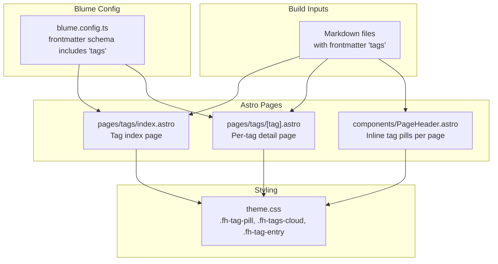
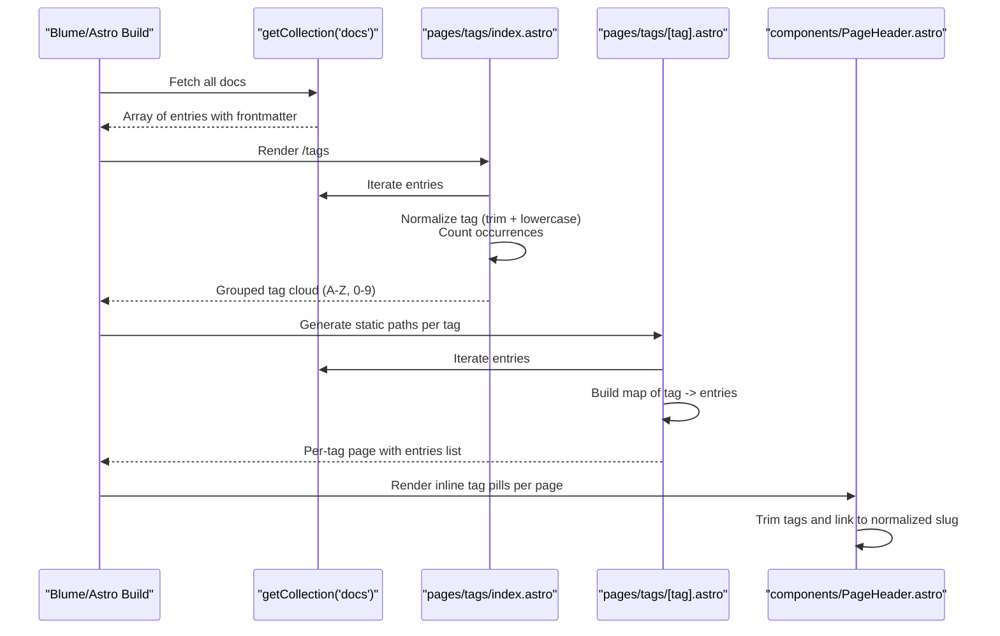
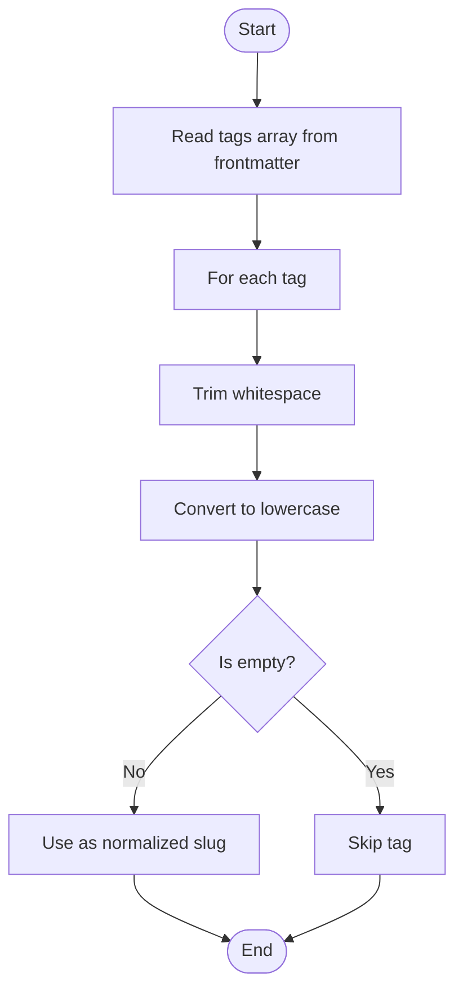
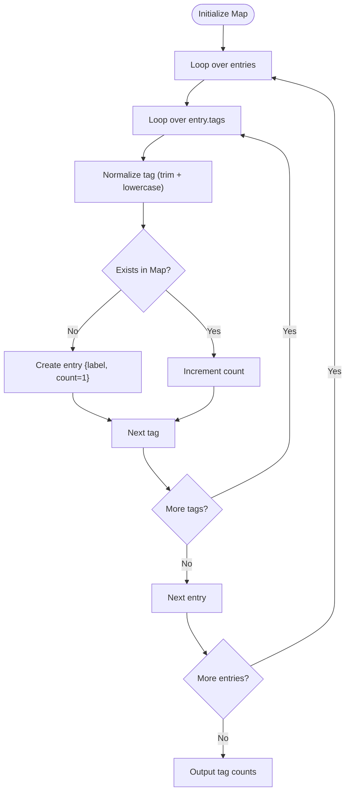
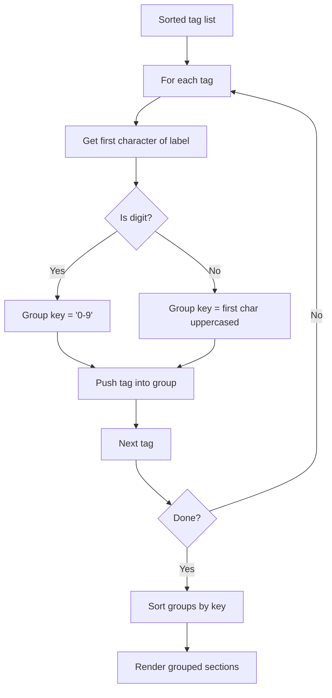
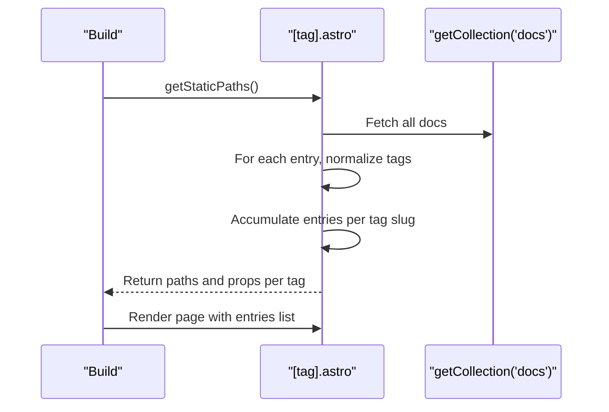
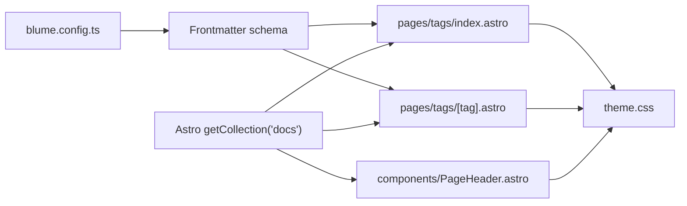

# Tag Implementation and Processing

<cite>
**Referenced Files in This Document**
- [blume.config.ts](file://blume.config.ts)
- [pages/tags/index.astro](file://pages/tags/index.astro)
- [pages/tags/[tag].astro](file://pages/tags/[tag].astro)
- [components/PageHeader.astro](file://components/PageHeader.astro)
- [theme.css](file://theme.css)
- [package.json](file://package.json)
</cite>

## Table of Contents
1. [Introduction](#introduction)
2. [Project Structure](#project-structure)
3. [Core Components](#core-components)
4. [Architecture Overview](#architecture-overview)
5. [Detailed Component Analysis](#detailed-component-analysis)
6. [Dependency Analysis](#dependency-analysis)
7. [Performance Considerations](#performance-considerations)
8. [Troubleshooting Guide](#troubleshooting-guide)
9. [Conclusion](#conclusion)
10. [Appendices](#appendices)

## Introduction
This document explains how Fractal Home implements tags: automatic extraction from frontmatter metadata during the build, normalization (case-insensitive processing and whitespace trimming), counting across all content entries, and alphabetical grouping with special handling for digit-leading tags under a “0-9” section. It also provides practical guidance on using tags in markdown frontmatter, customizing tag labels, extending tag logic, and offers performance and debugging tips for large collections.

## Project Structure
The tag system is implemented as Astro pages that read content via Blume’s data layer and Astro’s content collection API. Frontmatter schema is defined in configuration, and styling is provided by theme CSS.

**Diagram sources**
- [blume.config.ts:9-24](file://blume.config.ts#L9-L24)
- [pages/tags/index.astro:1-74](file://pages/tags/index.astro#L1-L74)
- [pages/tags/[tag].astro:1-61](file://pages/tags/[tag].astro#L1-L61)
- [components/PageHeader.astro:1-30](file://components/PageHeader.astro#L1-L30)
- [theme.css:540-673](file://theme.css#L540-L673)

**Section sources**
- [blume.config.ts:9-24](file://blume.config.ts#L9-L24)
- [package.json:1-19](file://package.json#L1-L19)

## Core Components
- Frontmatter schema defines the tags field as an optional array of strings.
- The tag index page aggregates tags across all docs, normalizes them, counts occurrences, sorts alphabetically, and groups by first character with a “0-9” bucket for digits.
- The per-tag page lists all entries tagged with a given slug, sorted by title.
- Page headers render inline tag pills linking to normalized tag slugs.
- Theme CSS styles tag pills, grouped clouds, and entry cards.

**Section sources**
- [blume.config.ts:9-24](file://blume.config.ts#L9-L24)
- [pages/tags/index.astro:1-74](file://pages/tags/index.astro#L1-L74)
- [pages/tags/[tag].astro:1-61](file://pages/tags/[tag].astro#L1-L61)
- [components/PageHeader.astro:1-30](file://components/PageHeader.astro#L1-L30)
- [theme.css:540-673](file://theme.css#L540-L673)

## Architecture Overview
At build time, Astro collects all docs, reads their frontmatter, and constructs tag maps. The tag index computes counts and groups; the per-tag route generates static paths for every unique tag slug. Inline page headers display tags directly on content pages.

**Diagram sources**
- [pages/tags/index.astro:6-33](file://pages/tags/index.astro#L6-L33)
- [pages/tags/[tag].astro:6-28](file://pages/tags/[tag].astro#L6-L28)
- [components/PageHeader.astro:11-16](file://components/PageHeader.astro#L11-L16)

## Detailed Component Analysis

### Frontmatter Schema and Tag Field
- The tags field is declared as an optional array of strings in the frontmatter schema. This allows authors to attach zero or more tags per document.
- Validation ensures type safety and prevents malformed frontmatter from breaking builds.

Practical example of implementing tags in markdown frontmatter:
- Add a `tags` key with a YAML array of string values.
- Keep tags concise and consistent (e.g., use hyphens instead of spaces).
- Avoid leading/trailing whitespace; the pipeline trims automatically.

**Section sources**
- [blume.config.ts:9-24](file://blume.config.ts#L9-L24)

### Tag Normalization Pipeline
Normalization occurs at two points:
- During aggregation on the tag index and per-tag pages: each tag is trimmed and lowercased to produce a stable slug key.
- In page headers: tags are trimmed before rendering and linking.

Key behaviors:
- Case-insensitive matching: “Svelte”, “svelte”, and “SVELTE” resolve to the same slug.
- Whitespace trimming: extra spaces around tags are removed.
- Empty tags are skipped to avoid noise.

**Diagram sources**
- [pages/tags/index.astro:14-19](file://pages/tags/index.astro#L14-L19)
- [pages/tags/[tag].astro:15-21](file://pages/tags/[tag].astro#L15-L21)
- [components/PageHeader.astro:15](file://components/PageHeader.astro#L15)

**Section sources**
- [pages/tags/index.astro:14-19](file://pages/tags/index.astro#L14-L19)
- [pages/tags/[tag].astro:15-21](file://pages/tags/[tag].astro#L15-L21)
- [components/PageHeader.astro:15](file://components/PageHeader.astro#L15)

### Tag Counting Mechanism
The tag index builds a map keyed by normalized slug to aggregate counts:
- For each entry, iterate its tags.
- For each normalized tag, increment count if already present or initialize with 1.
- Preserve a human-friendly label (first-seen trimmed version) while using the normalized slug as the key.

Complexity:
- Time: O(N * T), where N is number of entries and T is average tags per entry.
- Space: O(U), where U is number of unique normalized tags.

**Diagram sources**
- [pages/tags/index.astro:8-20](file://pages/tags/index.astro#L8-L20)

**Section sources**
- [pages/tags/index.astro:8-20](file://pages/tags/index.astro#L8-L20)

### Alphabetical Grouping Algorithm
After counting, tags are sorted by label and grouped by the first character:
- If the first character is a digit, group under “0-9”.
- Otherwise, group under the uppercase letter of the first character.
- Groups are then sorted lexicographically for consistent ordering.

Special handling:
- Digit-leading tags are consolidated under “0-9” to keep column headers clean.
- Sorting uses locale-aware comparison for predictable order.

**Diagram sources**
- [pages/tags/index.astro:22-33](file://pages/tags/index.astro#L22-L33)

**Section sources**
- [pages/tags/index.astro:22-33](file://pages/tags/index.astro#L22-L33)

### Per-Tag Detail Page
The per-tag route dynamically generates static paths for every unique tag slug:
- Builds a map from normalized slug to a structured object containing label and entries.
- Each entry includes title, path, and description.
- Entries are sorted by title for readability.

**Diagram sources**
- [pages/tags/[tag].astro:6-28](file://pages/tags/[tag].astro#L6-L28)
- [pages/tags/[tag].astro:30-32](file://pages/tags/[tag].astro#L30-L32)

**Section sources**
- [pages/tags/[tag].astro:6-28](file://pages/tags/[tag].astro#L6-L28)
- [pages/tags/[tag].astro:30-32](file://pages/tags/[tag].astro#L30-L32)

### Inline Tag Pills on Pages
Page headers render tags directly on content pages:
- Tags are trimmed and filtered for empties.
- Links point to normalized slugs (lowercased).
- Styling uses shared classes for consistency.

**Section sources**
- [components/PageHeader.astro:11-16](file://components/PageHeader.astro#L11-L16)
- [components/PageHeader.astro:18-30](file://components/PageHeader.astro#L18-L30)

### Styling and Visual Grouping
Theme CSS provides:
- Pill styling for tags with hover effects and count badges.
- Grid layout for the tag cloud with responsive columns.
- Section headers for grouped letters.
- Entry cards for per-tag pages with hover states.

**Section sources**
- [theme.css:540-673](file://theme.css#L540-L673)

## Dependency Analysis
- Blume config declares the tags field and integrates with the build.
- Astro content collection supplies entries with frontmatter.
- Astro routing powers dynamic per-tag pages.
- Theme CSS styles the UI components.

**Diagram sources**
- [blume.config.ts:9-24](file://blume.config.ts#L9-L24)
- [pages/tags/index.astro:1-74](file://pages/tags/index.astro#L1-L74)
- [pages/tags/[tag].astro:1-61](file://pages/tags/[tag].astro#L1-L61)
- [components/PageHeader.astro:1-30](file://components/PageHeader.astro#L1-L30)
- [theme.css:540-673](file://theme.css#L540-L673)

**Section sources**
- [package.json:1-19](file://package.json#L1-L19)

## Performance Considerations
- Aggregation complexity: O(N * T) for scanning all entries and their tags. For large collections, ensure tags arrays remain reasonably sized per entry.
- Map operations: Using Maps for counting and grouping yields O(1) average-time lookups and updates.
- Sorting: Locale-aware sorting is efficient but can be costly with very large tag sets; consider limiting visible tags or paginating results if needed.
- Static generation: Per-tag pages are generated statically; excessive unique tags increase build time and output size. Consider consolidating similar tags to reduce cardinality.
- Memory usage: Tag maps scale with unique tags; monitor memory during builds for very large repositories.

[No sources needed since this section provides general guidance]

## Troubleshooting Guide
Common issues and resolutions:
- Tags not appearing on index or detail pages:
  - Ensure the entry is indexable and not hidden in the sidebar.
  - Verify tags exist in frontmatter and are non-empty after trimming.
- Incorrect case or spacing:
  - Normalization lowercases and trims; inconsistent casing should resolve automatically.
  - If links break, confirm the slug matches the normalized form.
- Missing per-tag routes:
  - Confirm getStaticPaths runs and returns entries for each unique tag.
  - Check that entries pass filters (indexable and not hidden).
- Styling anomalies:
  - Validate class names used in templates match theme.css selectors.
  - Inspect computed styles in browser dev tools.

Debugging techniques:
- Log intermediate structures in development:
  - Print the size of the tag map and sample keys to verify normalization.
  - Inspect the grouped structure to ensure “0-9” bucket behavior.
- Validate frontmatter:
  - Use the build validation command to catch schema mismatches.
- Reduce scope:
  - Temporarily limit the content collection to a subset to isolate issues.

**Section sources**
- [pages/tags/index.astro:10-13](file://pages/tags/index.astro#L10-L13)
- [pages/tags/[tag].astro:11-14](file://pages/tags/[tag].astro#L11-L14)
- [package.json:5-11](file://package.json#L5-L11)

## Conclusion
Fractal Home’s tag system leverages Blume’s frontmatter schema and Astro’s content APIs to provide robust tag extraction, normalization, counting, and grouping. The implementation is straightforward, performant, and extensible. Authors can easily add tags in markdown frontmatter, and developers can customize labeling and extend processing logic as needed. With careful attention to tag cardinality and consistent naming, the system scales well to large knowledge bases.

[No sources needed since this section summarizes without analyzing specific files]

## Appendices

### Practical Examples
- Implementing tags in markdown frontmatter:
  - Add a `tags` array with string values.
  - Example patterns: single-word tags, hyphenated phrases, mixed-case tags (normalized automatically).
- Customizing tag labels:
  - The first-seen trimmed version becomes the displayed label; subsequent duplicates reuse it.
  - To enforce a canonical label, ensure the first occurrence has the desired casing and spacing.
- Extending tag processing logic:
  - Modify normalization rules in the aggregation loops to add transformations (e.g., synonym mapping).
  - Adjust grouping logic to introduce additional buckets beyond “0-9”.

**Section sources**
- [pages/tags/index.astro:14-19](file://pages/tags/index.astro#L14-L19)
- [pages/tags/index.astro:27-33](file://pages/tags/index.astro#L27-L33)
- [components/PageHeader.astro:15](file://components/PageHeader.astro#L15)