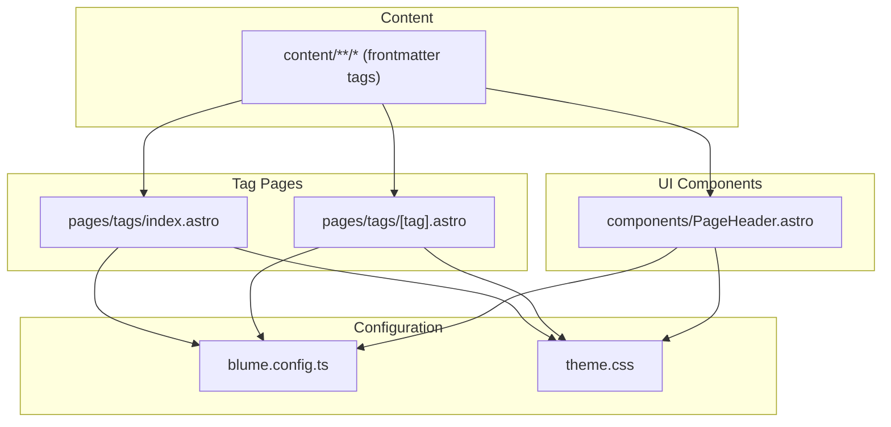
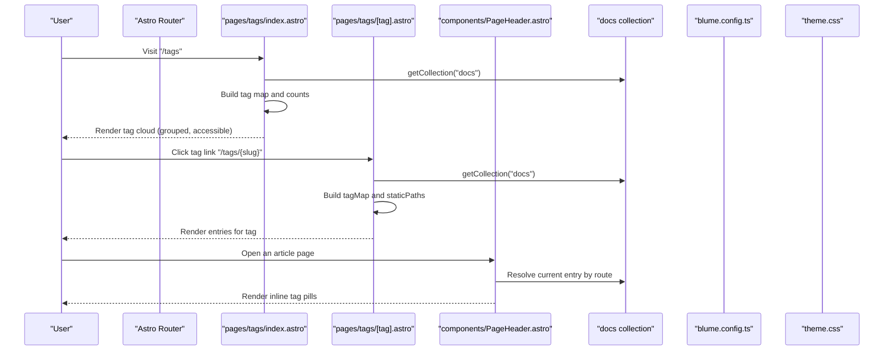
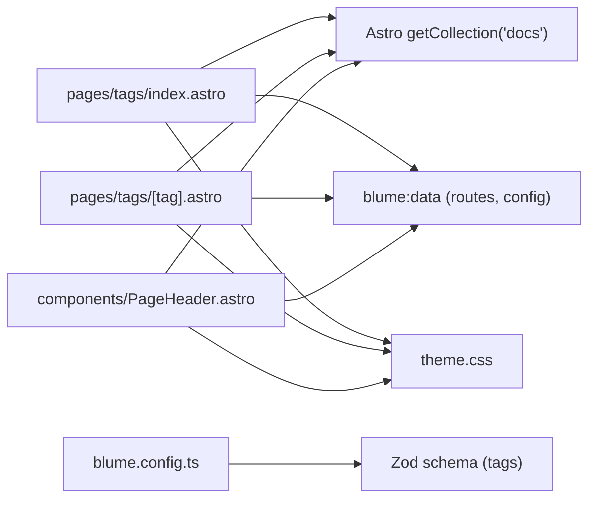

# Tag System and Navigation

<cite>
**Referenced Files in This Document**
- [pages/tags/index.astro](file://pages/tags/index.astro)
- [pages/tags/[tag].astro](file://pages/tags/[tag].astro)
- [components/PageHeader.astro](file://components/PageHeader.astro)
- [blume.config.ts](file://blume.config.ts)
- [theme.css](file://theme.css)
- [package.json](file://package.json)
- [content/Writings/seoinsveltekit.md](file://content/Writings/seoinsveltekit.md)
</cite>

## Table of Contents
1. [Introduction](#introduction)
2. [Project Structure](#project-structure)
3. [Core Components](#core-components)
4. [Architecture Overview](#architecture-overview)
5. [Detailed Component Analysis](#detailed-component-analysis)
6. [Dependency Analysis](#dependency-analysis)
7. [Performance Considerations](#performance-considerations)
8. [Troubleshooting Guide](#troubleshooting-guide)
9. [Conclusion](#conclusion)
10. [Appendices](#appendices)

## Introduction
This document explains the Fractal Home tag system and navigation focused on dynamic content filtering and discovery. It covers how tags are extracted from frontmatter, how Astro parameterized routes generate tag pages, and how the tag cloud is built with alphabetical grouping and accessibility features. It also provides guidance for implementing tags in content, customizing layouts, integrating search, optimizing performance for large collections, and ensuring mobile-responsive navigation.

## Project Structure
The tag system centers around three key areas:
- Tag index page that builds a tag cloud grouped alphabetically
- Parameterized tag detail page that lists entries for a given tag
- Page header component that renders inline tags per article

**Diagram sources**
- [pages/tags/index.astro](file://pages/tags/index.astro)
- [pages/tags/[tag].astro](file://pages/tags/[tag].astro)
- [components/PageHeader.astro](file://components/PageHeader.astro)
- [blume.config.ts](file://blume.config.ts)
- [theme.css](file://theme.css)

**Section sources**
- [pages/tags/index.astro](file://pages/tags/index.astro)
- [pages/tags/[tag].astro](file://pages/tags/[tag].astro)
- [components/PageHeader.astro](file://components/PageHeader.astro)
- [blume.config.ts](file://blume.config.ts)
- [theme.css](file://theme.css)

## Core Components
- Tag Index (/tags): Aggregates all tags across the docs collection, counts occurrences, groups by first character (digits under “0-9”), sorts alphabetically, and renders a responsive grid of sections with pill links to each tag’s detail page.
- Tag Detail (/tags/[tag]): Builds static paths for every unique tag found in the docs collection, then renders a sorted list of entries with title and optional description.
- Page Header: For each article, reads the current route’s entry, extracts its tags, and renders clickable pills linking to /tags/{normalized-tag}.

Key behaviors:
- Tags are normalized to lowercase and trimmed before use as slugs.
- Entries are filtered out if they are not indexable or have sidebar hidden set.
- The tag index uses aria-labelledby for accessible letter group headers.
- Styling is provided via theme.css classes for consistent hover effects and responsive layout.

**Section sources**
- [pages/tags/index.astro](file://pages/tags/index.astro)
- [pages/tags/[tag].astro](file://pages/tags/[tag].astro)
- [components/PageHeader.astro](file://components/PageHeader.astro)
- [theme.css](file://theme.css)

## Architecture Overview
The tag system leverages Astro’s content collections and Blume’s data layer to derive routes and render UI.

**Diagram sources**
- [pages/tags/index.astro](file://pages/tags/index.astro)
- [pages/tags/[tag].astro](file://pages/tags/[tag].astro)
- [components/PageHeader.astro](file://components/PageHeader.astro)
- [blume.config.ts](file://blume.config.ts)
- [theme.css](file://theme.css)

## Detailed Component Analysis

### Tag Index (/tags)
Responsibilities:
- Scans all docs entries and aggregates tags into a map with labels and counts.
- Normalizes tag keys to lowercase and trims whitespace.
- Groups tags by first character; digits are grouped under “0-9”.
- Sorts groups and items alphabetically using locale-aware comparison.
- Renders accessible sections with aria-labelledby and pill links to tag detail pages.

Data flow:
- Reads config and navigation from Blume’s data module.
- Uses Astro’s getCollection to access the docs collection.
- Produces a grid of sections with letter headings and lists of tag pills.

Accessibility:
- Each section has an id and aria-labelledby pointing to the letter heading.
- Focus styles are defined globally in theme.css.

Styling:
- Cloud layout uses CSS grid with auto-fill columns.
- Pill components include hover transitions and subtle transforms.

**Section sources**
- [pages/tags/index.astro](file://pages/tags/index.astro)
- [theme.css](file://theme.css)

### Tag Detail (/tags/[tag])
Responsibilities:
- Generates static paths for every unique tag found in the docs collection.
- Builds a map of tag -> { label, entries[] } where entries include title, path, and optional description.
- Filters non-indexable or hidden entries.
- Sorts entries by title using locale-aware comparison.
- Renders a list of entry cards with hover effects.

Routing:
- Uses Astro’s getStaticPaths to prebuild one page per tag.
- Props passed to the page include the tag label and its entries.

Styling:
- Entry cards use bordered containers with hover lift and shadow.
- Titles and descriptions are styled consistently with prose tokens.

**Section sources**
- [pages/tags/[tag].astro](file://pages/tags/[tag].astro)
- [theme.css](file://theme.css)

### Page Header Inline Tags
Responsibilities:
- Resolves the current page’s route and finds the corresponding entry in the docs collection.
- Extracts tags from the entry’s frontmatter, normalizes them, and renders a row of tag pills.
- Links point to /tags/{lowercase-normalized-tag}.

Behavior:
- Only renders when there are tags present.
- Uses consistent pill styling and hover effects.

**Section sources**
- [components/PageHeader.astro](file://components/PageHeader.astro)
- [theme.css](file://theme.css)

### Frontmatter Schema and Configuration
- The blume configuration extends frontmatter schema to include a tags field (array of strings).
- Navigation includes a “Tags” tab and featured item linking to /tags.
- Theme fonts and tokens are configured here.

Implications:
- Any doc with a tags array will be considered for tag indexing and rendering.
- Hidden or non-indexable entries are excluded from tag aggregation.

**Section sources**
- [blume.config.ts](file://blume.config.ts)

### Styling and Accessibility
- Global focus-visible outlines ensure keyboard accessibility.
- Tag pills and clouds are styled with consistent tokens and hover transitions.
- Reduced motion preferences are respected.

**Section sources**
- [theme.css](file://theme.css)

## Dependency Analysis
The tag system depends on:
- Astro content collections for reading docs and generating routes
- Blume’s data module for config, navigation, and routes metadata
- Tailwind utilities and custom CSS tokens for styling
- Zod schema validation for frontmatter fields

**Diagram sources**
- [pages/tags/index.astro](file://pages/tags/index.astro)
- [pages/tags/[tag].astro](file://pages/tags/[tag].astro)
- [components/PageHeader.astro](file://components/PageHeader.astro)
- [blume.config.ts](file://blume.config.ts)
- [theme.css](file://theme.css)

**Section sources**
- [package.json](file://package.json)
- [blume.config.ts](file://blume.config.ts)

## Performance Considerations
For large tag collections:
- Precompute tag maps at build time using getStaticPaths to avoid runtime overhead.
- Avoid repeated collection scans by caching results within the same build process.
- Use locale-aware sorting only once during data preparation.
- Keep tag labels concise to reduce DOM size and improve rendering speed.
- Defer heavy computations off the critical path; rely on Astro’s static generation.

Mobile-responsive navigation considerations:
- Ensure tag pills wrap gracefully using flex-wrap and grid auto-fill.
- Maintain adequate touch targets for tag links.
- Respect reduced motion preferences to avoid janky animations.

Search integration patterns:
- Leverage Blume’s search configuration flag to enable/disable search UI.
- If building a custom search, index titles, descriptions, and tags from the docs collection and filter client-side or server-side based on query parameters.

[No sources needed since this section provides general guidance]

## Troubleshooting Guide
Common issues and resolutions:
- No tags appear on a page:
  - Verify the entry has a tags array in frontmatter.
  - Ensure the entry is indexable and not marked as hidden in the sidebar.
- Tag count seems incorrect:
  - Confirm normalization rules (trimming and lowercasing) are applied consistently.
  - Check that duplicate tags are merged correctly in the tag map.
- Tag detail page missing:
  - Ensure getStaticPaths generates a route for every unique tag.
  - Validate that the slug matches the normalized tag key.
- Accessibility warnings:
  - Confirm aria-labelledby IDs match their referenced headings.
  - Verify focus-visible styles are applied to interactive elements.

**Section sources**
- [pages/tags/index.astro](file://pages/tags/index.astro)
- [pages/tags/[tag].astro](file://pages/tags/[tag].astro)
- [components/PageHeader.astro](file://components/PageHeader.astro)
- [theme.css](file://theme.css)

## Conclusion
The Fractal Home tag system provides a robust, accessible, and performant mechanism for discovering content through tags. By extracting tags from frontmatter, generating parameterized routes, and rendering a well-structured tag cloud, it enables users to navigate and filter content efficiently. With clear customization points and strong styling foundations, the system can be extended to support advanced search, analytics, and richer navigation experiences.

[No sources needed since this section summarizes without analyzing specific files]

## Appendices

### Implementing Tags in Content
- Add a tags array in the frontmatter of any doc file.
- Use lowercase, descriptive labels separated by commas.
- Optionally include a description for better context on tag detail pages.

Example reference:
- See a sample doc with tags in frontmatter for structure and conventions.

**Section sources**
- [content/Writings/seoinsveltekit.md](file://content/Writings/seoinsveltekit.md)

### Customizing Tag Page Layouts
- Modify the tag cloud grid and pill styles in theme.css to adjust spacing, colors, and hover effects.
- Extend the tag detail page to include additional metadata or filters.
- Customize the PageHeader component to change how inline tags are presented.

**Section sources**
- [theme.css](file://theme.css)
- [pages/tags/index.astro](file://pages/tags/index.astro)
- [pages/tags/[tag].astro](file://pages/tags/[tag].astro)
- [components/PageHeader.astro](file://components/PageHeader.astro)

### Extending Navigation Features
- Update blume.config.ts to add new tabs or featured items linking to tag-related pages.
- Integrate search toggles and filters to enhance discovery.
- Consider adding a “Popular Tags” section based on counts computed at build time.

**Section sources**
- [blume.config.ts](file://blume.config.ts)