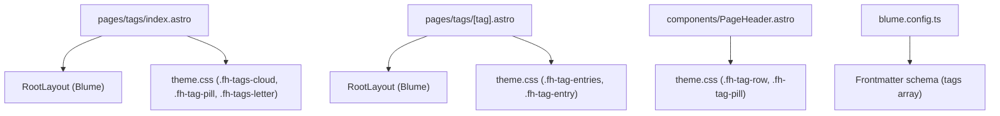
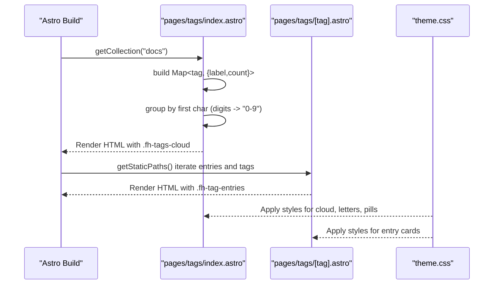
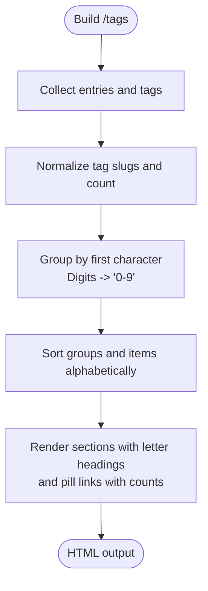
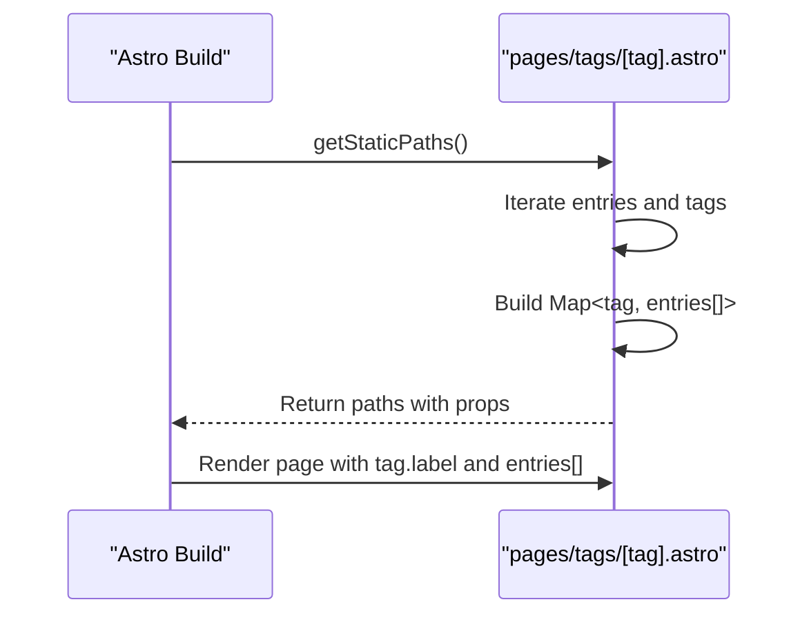
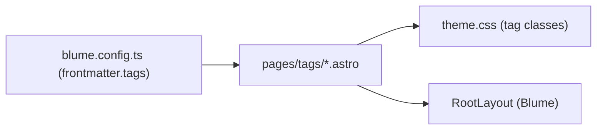

# Tag Visualization and User Interface

<cite>
**Referenced Files in This Document**
- [pages/tags/index.astro](file://pages/tags/index.astro)
- [pages/tags/[tag].astro](file://pages/tags/[tag].astro)
- [components/PageHeader.astro](file://components/PageHeader.astro)
- [theme.css](file://theme.css)
- [blume.config.ts](file://blume.config.ts)
</cite>

## Table of Contents
1. [Introduction](#introduction)
2. [Project Structure](#project-structure)
3. [Core Components](#core-components)
4. [Architecture Overview](#architecture-overview)
5. [Detailed Component Analysis](#detailed-component-analysis)
6. [Dependency Analysis](#dependency-analysis)
7. [Performance Considerations](#performance-considerations)
8. [Troubleshooting Guide](#troubleshooting-guide)
9. [Conclusion](#conclusion)
10. [Appendices](#appendices)

## Introduction
This document explains the tag visualization and user interface components used across the site. It covers the tag cloud implementation with alphabetical grouping, hover effects, responsive design patterns, CSS styling for tag pills (color schemes, typography, interactive states), accessibility features (ARIA labels, keyboard navigation, screen reader support), customization via CSS variables, animations, alternative layouts, mobile-responsive considerations, touch interactions, performance optimization for large tag clouds, and guidance for integrating custom tag widgets while maintaining consistency with the design system.

## Project Structure
The tag feature is implemented using Astro pages and a shared CSS theme:
- The tags index page builds an alphabetically grouped tag cloud from content metadata.
- The dynamic tag detail page lists entries associated with a specific tag.
- Page headers render inline tags per page.
- All visual styles are centralized in the theme stylesheet.

**Diagram sources**
- [pages/tags/index.astro:1-74](file://pages/tags/index.astro#L1-L74)
- [pages/tags/[tag].astro:1-61](file://pages/tags/[tag].astro#L1-L61)
- [components/PageHeader.astro:1-31](file://components/PageHeader.astro#L1-L31)
- [theme.css:524-652](file://theme.css#L524-L652)
- [blume.config.ts:9-25](file://blume.config.ts#L9-L25)

**Section sources**
- [pages/tags/index.astro:1-74](file://pages/tags/index.astro#L1-L74)
- [pages/tags/[tag].astro:1-61](file://pages/tags/[tag].astro#L1-L61)
- [components/PageHeader.astro:1-31](file://components/PageHeader.astro#L1-L31)
- [theme.css:524-652](file://theme.css#L524-L652)
- [blume.config.ts:9-25](file://blume.config.ts#L9-L25)

## Core Components
- Tags Index (/tags): Aggregates all tags from content, groups them alphabetically, and renders a grid-based cloud with letter headings and pill links. Each pill shows the tag label and count.
- Tag Detail (/tags/[tag]): Generates static paths for each unique tag and displays a list of entries that carry that tag, sorted by title.
- Page Header: Displays inline tags for the current page as small pills linking to the tag index.

Key responsibilities:
- Data aggregation and grouping for the tag cloud.
- Static path generation for tag detail pages.
- Rendering consistent tag pills across contexts.

**Section sources**
- [pages/tags/index.astro:1-74](file://pages/tags/index.astro#L1-L74)
- [pages/tags/[tag].astro:1-61](file://pages/tags/[tag].astro#L1-L61)
- [components/PageHeader.astro:1-31](file://components/PageHeader.astro#L1-L31)

## Architecture Overview
The tag system follows a simple data-driven architecture:
- Content entries expose a tags array in frontmatter.
- Build-time scripts collect and normalize tags into slugs and counts.
- Astro routes render either the aggregated cloud or filtered entry lists.
- Styling is applied through semantic class names and CSS variables.

**Diagram sources**
- [pages/tags/index.astro:6-33](file://pages/tags/index.astro#L6-L33)
- [pages/tags/[tag].astro:6-28](file://pages/tags/[tag].astro#L6-L28)
- [theme.css:577-652](file://theme.css#L577-L652)

## Detailed Component Analysis

### Tags Index: Alphabetical Grouping and Cloud Layout
- Data collection: Iterates over docs, filters non-indexable or hidden entries, normalizes tags to lowercase slugs, and counts occurrences.
- Grouping logic: Groups tags by their first character; digit-leading tags are collected under a single “0-9” group to keep headers clean.
- Rendering: Produces sections per letter with an h2 heading and a list of pill links. Each pill includes a count span.
- Accessibility: Sections use aria-labelledby pointing to the letter heading for screen readers.

**Diagram sources**
- [pages/tags/index.astro:10-33](file://pages/tags/index.astro#L10-L33)

**Section sources**
- [pages/tags/index.astro:10-33](file://pages/tags/index.astro#L10-L33)
- [pages/tags/index.astro:54-72](file://pages/tags/index.astro#L54-L72)

### Tag Detail: Entry Listing
- Static paths: Builds a map of tag slugs to entries (title, path, description) and returns params for each tag.
- Sorting: Entries are sorted by title for consistent listing.
- Rendering: Outputs a grid of entry cards with strong titles and optional descriptions.

**Diagram sources**
- [pages/tags/[tag].astro:6-28](file://pages/tags/[tag].astro#L6-L28)
- [pages/tags/[tag].astro:30-32](file://pages/tags/[tag].astro#L30-L32)

**Section sources**
- [pages/tags/[tag].astro:6-28](file://pages/tags/[tag].astro#L6-L28)
- [pages/tags/[tag].astro:30-32](file://pages/tags/[tag].astro#L30-L32)

### Page Header: Inline Tag Pills
- Extracts tags from the current page’s entry metadata.
- Renders a row with a label and pill links to the tag detail pages.

**Section sources**
- [components/PageHeader.astro:11-30](file://components/PageHeader.astro#L11-L30)

### CSS Styling System for Tag Pills
- Color scheme: Uses Blume tokens for background, foreground, borders, and accent colors. Pill backgrounds mix with the page background; hover states shift toward the accent color.
- Typography: Small font sizes with medium weight for readability; tabular nums for counts; uppercase labels for section headers.
- Interactive states: Hover transitions include color, border, background, and subtle transform; focus-visible outlines are globally defined for accessibility.
- Responsive layout: Grid auto-fill columns for the tag cloud; flexible wrapping for pill rows.

Key classes and behaviors:
- .fh-tag-row: Flex container for inline tags with wrap and spacing.
- .fh-tag-pill: Pill link with border, background mixing, transitions, and hover lift.
- .count: Numeric badge inside pills with tabular numbers and muted color.
- .fh-tags-cloud: Grid layout for the cloud with column sizing and gaps.
- .fh-tags-letter: Section header style for letter groups.
- .fh-tag-entries and .fh-tag-entry: Card-like entries with hover elevation and shadow.

Accessibility highlights:
- Global focus-visible styles ensure visible focus rings on interactive elements.
- Reduced motion media query disables transitions/animations for users preferring reduced motion.

**Section sources**
- [theme.css:524-652](file://theme.css#L524-L652)
- [theme.css:76-87](file://theme.css#L76-L87)
- [theme.css:664-672](file://theme.css#L664-L672)

## Dependency Analysis
- Frontmatter schema defines the tags array type, ensuring consistent metadata across content.
- Pages consume the tags array to generate UI and routes.
- Styles are centralized and applied via semantic class names, decoupling structure from presentation.

**Diagram sources**
- [blume.config.ts:9-25](file://blume.config.ts#L9-L25)
- [pages/tags/index.astro:1-74](file://pages/tags/index.astro#L1-L74)
- [pages/tags/[tag].astro:1-61](file://pages/tags/[tag].astro#L1-L61)
- [theme.css:524-652](file://theme.css#L524-L652)

**Section sources**
- [blume.config.ts:9-25](file://blume.config.ts#L9-L25)
- [pages/tags/index.astro:1-74](file://pages/tags/index.astro#L1-L74)
- [pages/tags/[tag].astro:1-61](file://pages/tags/[tag].astro#L1-L61)
- [theme.css:524-652](file://theme.css#L524-L652)

## Performance Considerations
- Build-time processing: Tag aggregation and grouping occur at build time, avoiding runtime overhead.
- Grid layout: Auto-fill columns adapt to viewport width without JavaScript.
- Transitions: Lightweight transforms and color changes; avoid heavy filters or blurs on tags.
- Reduced motion: Respects prefers-reduced-motion to minimize animation cost for sensitive users.
- Large tag clouds: Consider virtualization or pagination if the number of tags grows significantly; currently, the grid handles moderate sizes well.

[No sources needed since this section provides general guidance]

## Troubleshooting Guide
- Missing tags: Ensure content entries include a tags array in frontmatter; otherwise, no pills will appear.
- Non-indexable or hidden entries: The tag index skips entries marked non-indexable or hidden in sidebar configuration.
- Focus visibility: If focus rings are not visible, verify global focus-visible styles are applied and not overridden.
- Motion sensitivity: Users with reduced motion preferences will see minimal animations; confirm behavior aligns with expectations.

**Section sources**
- [pages/tags/index.astro:10-12](file://pages/tags/index.astro#L10-L12)
- [theme.css:76-87](file://theme.css#L76-L87)
- [theme.css:664-672](file://theme.css#L664-L672)

## Conclusion
The tag visualization system provides a clear, accessible, and responsive way to explore content through tags. The implementation leverages build-time data processing, semantic HTML, and a cohesive CSS design system. Customization is straightforward via CSS variables and class extensions, while accessibility is maintained through ARIA labeling, focus management, and reduced motion support.

[No sources needed since this section summarizes without analyzing specific files]

## Appendices

### Customizing Tag Appearance with CSS Variables
- Accent and surfaces: Adjust --blume-accent, --blume-background, --blume-border, and --blume-muted-foreground to change pill colors and contrast.
- Signature green: Modify --fh-green and --fh-green-soft for brand-aligned accents.
- Radius and spacing: Update --blume-radius and padding/margins in .fh-tag-pill and .fh-tag-entry to alter shape and density.

**Section sources**
- [theme.css:12-42](file://theme.css#L12-L42)
- [theme.css:544-572](file://theme.css#L544-L572)
- [theme.css:615-651](file://theme.css#L615-L651)

### Implementing Animations and Hover Effects
- Hover transitions: Use existing transition properties on .fh-tag-pill and .fh-tag-entry for smooth state changes.
- Transform lifts: Subtle translateY on hover enhances interactivity without heavy costs.
- Reduced motion: Respect prefers-reduced-motion to disable animations when requested.

**Section sources**
- [theme.css:556-565](file://theme.css#L556-L565)
- [theme.css:622-631](file://theme.css#L622-L631)
- [theme.css:664-672](file://theme.css#L664-L672)

### Creating Alternative Tag Layouts
- Horizontal scroll: Wrap .fh-tag-row with overflow-x-auto for horizontal scrolling on narrow screens.
- Masonry-style: Replace grid with flex-wrap and varying heights for a masonry effect.
- Compact mode: Reduce padding and font-size in .fh-tag-pill for denser presentations.

[No sources needed since this section provides general guidance]

### Mobile-Responsive Design and Touch Interactions
- Grid responsiveness: .fh-tags-cloud uses auto-fill minmax for adaptive columns.
- Touch targets: Ensure pill dimensions meet minimum touch target guidelines; adjust padding if needed.
- Hover vs. tap: On touch devices, hover states may flash; rely on focus-visible and active states for clarity.

**Section sources**
- [theme.css:577-582](file://theme.css#L577-L582)
- [theme.css:76-87](file://theme.css#L76-L87)

### Integrating Custom Tag Widgets
- Extend classes: Add new classes alongside existing ones to maintain consistency.
- Reuse tokens: Leverage CSS variables for colors and spacing to stay aligned with the design system.
- Accessibility: Include appropriate ARIA attributes and keyboard navigation where necessary.

[No sources needed since this section provides general guidance]