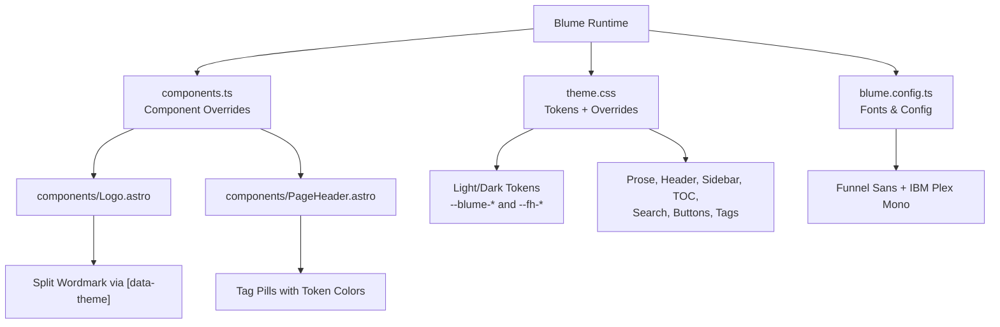
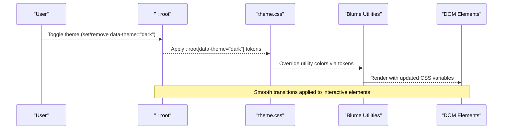
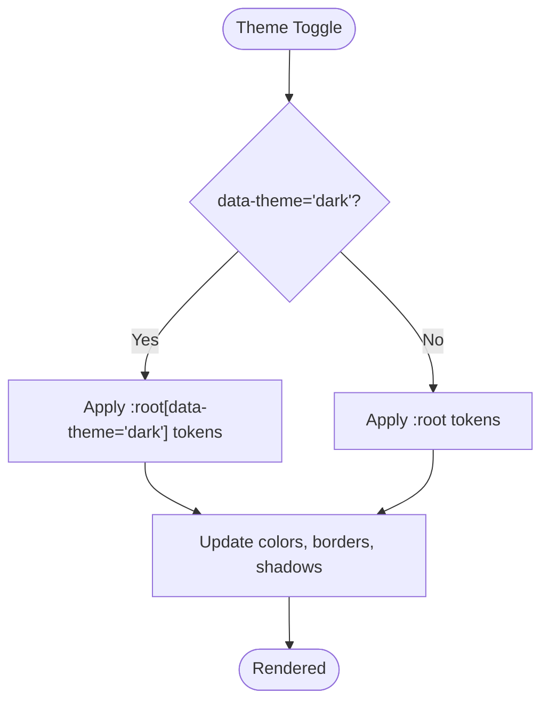
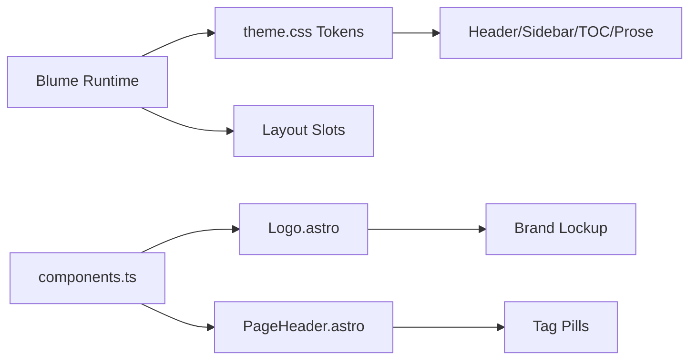

# Theme and Styling System

<cite>
**Referenced Files in This Document**
- [theme.css](file://theme.css)
- [blume.config.ts](file://blume.config.ts)
- [components.ts](file://components.ts)
- [Logo.astro](file://components/Logo.astro)
- [PageHeader.astro](file://components/PageHeader.astro)
- [BLUME-CUSTOMIZATION-BACKEND.md](file://BLUME-CUSTOMIZATION-BACKEND.md)
- [package.json](file://package.json)
</cite>

## Table of Contents
1. [Introduction](#introduction)
2. [Project Structure](#project-structure)
3. [Core Components](#core-components)
4. [Architecture Overview](#architecture-overview)
5. [Detailed Component Analysis](#detailed-component-analysis)
6. [Dependency Analysis](#dependency-analysis)
7. [Performance Considerations](#performance-considerations)
8. [Troubleshooting Guide](#troubleshooting-guide)
9. [Conclusion](#conclusion)
10. [Appendices](#appendices)

## Introduction
This document explains the Fractal Home theme and styling system built on CSS custom properties (design tokens). It covers light/dark mode with smooth transitions, responsive patterns, color palette, typography, spacing conventions, mobile-first breakpoints, customization via CSS variable overrides, creating custom color schemes, accessibility compliance, component-specific styling, performance considerations for theme switching, browser compatibility, and production optimization strategies.

The system is layered:
- Blume provides a token layer and layout primitives.
- theme.css defines global design tokens and component-level overrides.
- blume.config.ts configures fonts and site metadata.
- components.ts registers Astro component overrides for layout regions.
- Custom Astro components implement brand-specific behavior (e.g., logo wordmark variants, tag pills).

**Section sources**
- [theme.css:1-12](file://theme.css#L1-L12)
- [blume.config.ts:1-10](file://blume.config.ts#L1-L10)
- [components.ts:1-12](file://components.ts#L1-L12)

## Project Structure
The theme system centers around a small set of files that define tokens, configuration, and component overrides:
- theme.css: Global tokens, dark mode, base styles, and component-level rules.
- blume.config.ts: Fonts, site title/description, navigation structure, and integrations.
- components.ts: Registers Astro components to override default Blume layout slots.
- components/Logo.astro: Brand lockup with split-color wordmarks controlled by data-theme.
- components/PageHeader.astro: Page header with tags rendered as styled pills.
- BLUME-CUSTOMIZATION-BACKEND.md: Guidance on how to customize Blume without editing generated code.
- package.json: Build/dev scripts and dependencies.

**Diagram sources**
- [theme.css:12-61](file://theme.css#L12-L61)
- [blume.config.ts:37-65](file://blume.config.ts#L37-L65)
- [components.ts:6-11](file://components.ts#L6-L11)
- [Logo.astro:14-47](file://components/Logo.astro#L14-L47)
- [PageHeader.astro:18-30](file://components/PageHeader.astro#L18-L30)

**Section sources**
- [theme.css:1-12](file://theme.css#L1-L12)
- [blume.config.ts:1-10](file://blume.config.ts#L1-L10)
- [components.ts:1-12](file://components.ts#L1-L12)
- [BLUME-CUSTOMIZATION-BACKEND.md:12-21](file://BLUME-CUSTOMIZATION-BACKEND.md#L12-L21)

## Core Components
- Design tokens:
  - Light mode tokens define pure-white surfaces, warm near-black ink, muted neutrals, borders, accent emerald, action colors, radius, content width, and code background.
  - Dark mode tokens redefine these values under :root[data-theme="dark"].
- Base styles:
  - Body typography features font-feature-settings and text-rendering optimizations.
  - Focus-visible outlines use the accent token for AA-friendly visibility.
- Layout regions:
  - Header uses backdrop blur and hairline border; active tab highlights use accent tint.
  - Sidebar and TOC use token-based borders and hover states.
  - Prose typography scales fluidly using clamp() for headings and consistent line-heights for dense scholarly text.
- UI elements:
  - Search dialog and page actions use token-driven backgrounds and shadows.
  - Buttons (.fh-button) provide primary and outline variants with token colors and subtle transforms.
  - Tag pills and tag index pages are styled with token borders and hover tints.
- Accessibility and motion:
  - prefers-reduced-motion disables animations and transitions for users who prefer reduced motion.

**Section sources**
- [theme.css:12-61](file://theme.css#L12-L61)
- [theme.css:66-87](file://theme.css#L66-L87)
- [theme.css:92-142](file://theme.css#L92-L142)
- [theme.css:147-226](file://theme.css#L147-L226)
- [theme.css:237-327](file://theme.css#L237-L327)
- [theme.css:432-447](file://theme.css#L432-L447)
- [theme.css:452-477](file://theme.css#L452-L477)
- [theme.css:482-522](file://theme.css#L482-L522)
- [theme.css:527-572](file://theme.css#L527-L572)
- [theme.css:577-602](file://theme.css#L577-L602)
- [theme.css:607-651](file://theme.css#L607-L651)
- [theme.css:656-659](file://theme.css#L656-L659)
- [theme.css:664-672](file://theme.css#L664-L672)

## Architecture Overview
The theme architecture layers tokens over Blume’s utilities and Tailwind classes. theme.css is injected last so plain CSS wins where needed. The data-theme attribute toggles between light and dark palettes. Component selectors target Blume’s data attributes to style regions consistently across themes.

**Diagram sources**
- [theme.css:12-61](file://theme.css#L12-L61)
- [theme.css:92-142](file://theme.css#L92-L142)

**Section sources**
- [theme.css:1-12](file://theme.css#L1-L12)
- [theme.css:12-61](file://theme.css#L12-L61)

## Detailed Component Analysis

### Color Palette and Tokens
- Surfaces:
  - Background, foreground, muted, muted-foreground, border tokens define the core surface hierarchy.
- Accent:
  - Accent and accent-foreground tokens control links, focus rings, and active states.
  - Signature green (--fh-green) and its soft variant are used for fills, arrows, and pills.
- Code:
  - Code background token ensures readability in both modes.
- Shadows:
  - Soft shadow token adapts per theme for depth and elevation.

Customization approach:
- Override tokens in :root or :root[data-theme="dark"] to change global appearance.
- Use color-mix() and oklch() for accessible, perceptually uniform colors.

**Section sources**
- [theme.css:12-42](file://theme.css#L12-L42)
- [theme.css:47-61](file://theme.css#L47-L61)

### Typography System
- Font families:
  - Display and body use Funnel Sans with italic variants; mono uses IBM Plex Mono.
- Fluid sizing:
  - Headings use clamp() for responsive scaling.
- Readability:
  - Generous line-heights for dense scholarly text; strong emphasis uses full foreground color.
- Selection:
  - Selection background uses accent tint for visual consistency.

**Section sources**
- [blume.config.ts:37-65](file://blume.config.ts#L37-L65)
- [theme.css:66-74](file://theme.css#L66-L74)
- [theme.css:259-313](file://theme.css#L259-L313)

### Spacing Conventions
- Radius:
  - Shared rounding via --blume-radius ensures consistent corners across components.
- Content width:
  - --blume-content-width controls article column width globally.
- Header height:
  - Local token --fh-header-height aligns sticky offsets with drawer and TOC.

**Section sources**
- [theme.css:30-42](file://theme.css#L30-L42)
- [theme.css:92-99](file://theme.css#L92-L99)

### Mobile-First Responsive Patterns
- Fluid typography:
  - clamp() for heading sizes adapts across viewports.
- Grid and layout:
  - Sidebar and TOC use token borders and hover states; mobile TOC appears as collapsible details.
- Motion guards:
  - prefers-reduced-motion reduces animation duration and scroll behavior.

Note: No explicit media query breakpoints are defined in theme.css; responsiveness relies on fluid sizing and token-driven layouts.

**Section sources**
- [theme.css:259-278](file://theme.css#L259-L278)
- [theme.css:229-232](file://theme.css#L229-L232)
- [theme.css:664-672](file://theme.css#L664-L672)

### Light/Dark Mode Implementation
- Mechanism:
  - :root sets light tokens; :root[data-theme="dark"] redefines them for dark mode.
- Transitions:
  - Interactive elements apply short transition durations for smooth state changes.
- Logo wordmark:
  - Split images toggle visibility based on data-theme.

**Diagram sources**
- [theme.css:12-61](file://theme.css#L12-L61)
- [theme.css:110-116](file://theme.css#L110-L116)

**Section sources**
- [theme.css:12-61](file://theme.css#L12-L61)
- [theme.css:110-116](file://theme.css#L110-L116)

### Component-Specific Styling
- Header:
  - Backdrop blur, hairline border, active tab highlight using accent tint.
- Sidebar:
  - Near-white surface, hairline right rule, refined item hover and active states.
- TOC:
  - Hairline left rule, active location highlighting, hover states.
- Buttons:
  - Primary and outline variants with token colors and subtle transform on press.
- Tags:
  - Row labels, pill links, grouped cloud layout, entry cards with hover elevation.

**Section sources**
- [theme.css:92-142](file://theme.css#L92-L142)
- [theme.css:147-190](file://theme.css#L147-L190)
- [theme.css:200-226](file://theme.css#L200-L226)
- [theme.css:482-522](file://theme.css#L482-L522)
- [theme.css:527-651](file://theme.css#L527-L651)

### Customization via CSS Variable Overrides
- Global changes:
  - Override tokens in :root or :root[data-theme="dark"] within theme.css.
- Component overrides:
  - Use Astro component overrides registered in components.ts when markup must change.
- Best practices:
  - Prefer tokens over one-off selectors; ensure both light and dark modes are covered.

**Section sources**
- [BLUME-CUSTOMIZATION-BACKEND.md:30-74](file://BLUME-CUSTOMIZATION-BACKEND.md#L30-L74)
- [BLUME-CUSTOMIZATION-BACKEND.md:451-484](file://BLUME-CUSTOMIZATION-BACKEND.md#L451-L484)
- [components.ts:6-11](file://components.ts#L6-L11)

### Creating Custom Color Schemes
- Steps:
  - Define new tokens or adjust existing ones in :root and :root[data-theme="dark"].
  - Ensure contrast ratios meet accessibility guidelines.
  - Test both modes thoroughly.
- Example guidance:
  - Replace hardcoded colors with token references to maintain coherence across themes.

**Section sources**
- [BLUME-CUSTOMIZATION-BACKEND.md:486-505](file://BLUME-CUSTOMIZATION-BACKEND.md#L486-L505)
- [theme.css:12-61](file://theme.css#L12-L61)

### Accessibility Compliance
- Focus states:
  - Visible focus rings using accent token for all interactive elements.
- Reduced motion:
  - Respects prefers-reduced-motion to disable animations and transitions.
- Semantic markup:
  - Proper aria attributes and roles maintained in component overrides.

**Section sources**
- [theme.css:77-87](file://theme.css#L77-L87)
- [theme.css:664-672](file://theme.css#L664-L672)

### Practical Examples
- Customize header background:
  - Adjust backdrop blur and opacity via token-based color mixing.
- Change sidebar active state:
  - Modify active link background and color using tokens.
- Style buttons:
  - Use .fh-button--primary and .fh-button--outline classes with token colors.
- Add tag pills:
  - Render tags in PageHeader.astro with .fh-tag-pill class.

**Section sources**
- [theme.css:92-115](file://theme.css#L92-L115)
- [theme.css:160-165](file://theme.css#L160-L165)
- [theme.css:482-522](file://theme.css#L482-L522)
- [PageHeader.astro:18-30](file://components/PageHeader.astro#L18-L30)

## Dependency Analysis
The theme system depends on Blume’s runtime and utilities, with theme.css providing overrides and tokens. Components.ts registers Astro components that integrate with Blume’s layout slots.

**Diagram sources**
- [theme.css:12-61](file://theme.css#L12-L61)
- [components.ts:6-11](file://components.ts#L6-L11)
- [Logo.astro:14-47](file://components/Logo.astro#L14-L47)
- [PageHeader.astro:18-30](file://components/PageHeader.astro#L18-L30)

**Section sources**
- [theme.css:12-61](file://theme.css#L12-L61)
- [components.ts:6-11](file://components.ts#L6-L11)

## Performance Considerations
- Theme switching:
  - Avoid triggering transitions during theme changes; keep interaction animations short (≤200ms).
- Browser compatibility:
  - Use backdrop-filter with vendor prefixes where necessary; test color-mix() support.
- Optimization strategies:
  - Minimize large blur() values; prefer gradients for filled shapes to avoid banding.
  - Use GPU acceleration sparingly for unperformant animations.
  - Tree-shake unused libraries; leverage build tools for production builds.

**Section sources**
- [BLUME-CUSTOMIZATION-BACKEND.md:40-50](file://BLUME-CUSTOMIZATION-BACKEND.md#L40-L50)
- [theme.css:92-99](file://theme.css#L92-L99)
- [package.json:6-11](file://package.json#L6-L11)

## Troubleshooting Guide
- Verify token usage:
  - Ensure all colors reference tokens rather than hardcoded values.
- Check both themes:
  - Validate light and dark modes after changes.
- Inspect generated files:
  - Do not edit .blume/, .blume-verify/, or dist/; changes will be overwritten.
- Run checks:
  - Use blume check and blume build to validate configuration and assets.

**Section sources**
- [BLUME-CUSTOMIZATION-BACKEND.md:507-524](file://BLUME-CUSTOMIZATION-BACKEND.md#L507-L524)

## Conclusion
The Fractal Home theme leverages CSS custom properties to create a flexible, accessible, and performant design system. By centralizing tokens in theme.css and configuring fonts and components through blume.config.ts and components.ts, the system ensures consistency across light and dark modes while supporting responsive design and customization. Following best practices for accessibility, performance, and production optimization guarantees a high-quality user experience.

## Appendices

### Build and Development Scripts
- dev: Start development server.
- build: Generate production assets.
- preview: Preview production build locally.
- check/validate/doctor: Validate configuration and diagnose issues.

**Section sources**
- [package.json:6-11](file://package.json#L6-L11)