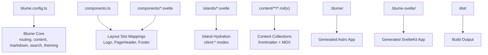
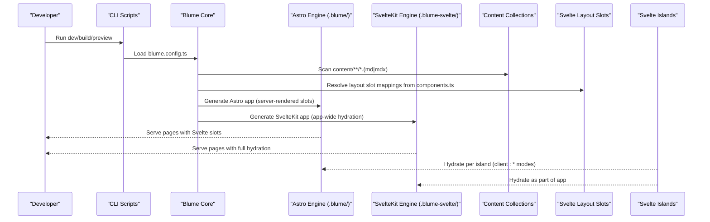
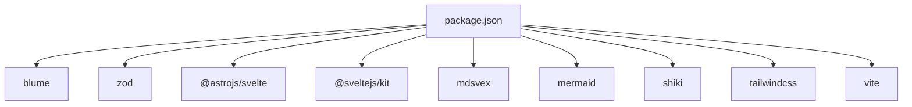

# API Reference

<cite>
**Referenced Files in This Document**
- [blume.config.ts](file://blume.config.ts)
- [components.ts](file://components.ts)
- [package.json](file://package.json)
- [README.md](file://README.md)
- [content/index.md](file://content/index.md)
- [content/components.mdx](file://content/components.mdx)
- [content/svelte-layer.mdx](file://content/svelte-layer.mdx)
- [islands/Counter.svelte](file://islands/Counter.svelte)
- [components/Footer.svelte](file://components/Footer.svelte)
- [components/Logo.svelte](file://components/Logo.svelte)
- [components/PageHeader.svelte](file://components/PageHeader.svelte)
</cite>

## Table of Contents
1. [Introduction](#introduction)
2. [Project Structure](#project-structure)
3. [Core Components](#core-components)
4. [Architecture Overview](#architecture-overview)
5. [Detailed Component Analysis](#detailed-component-analysis)
6. [Dependency Analysis](#dependency-analysis)
7. [Performance Considerations](#performance-considerations)
8. [Troubleshooting Guide](#troubleshooting-guide)
9. [Conclusion](#conclusion)
10. [Appendices](#appendices)

## Introduction
This API reference documents the Blume-powered FractalWiki site with Svelte as the component layer. It covers:
- The complete configuration schema used in blume.config.ts (site metadata, content root, deployment, frontmatter validation via Zod, navigation, and i18n).
- The components.ts API for mapping layout slots to Svelte components and configuring islands hydration.
- Available Blume configuration options inferred from usage patterns and documentation within the project.
- Hook functions and event system APIs referenced by the framework (notably blume/hooks for hydrated access to collection data).
- Public interfaces for content collections, routing, and middleware as exposed through props and documented behavior.
- Error handling patterns and debugging utilities available via CLI commands and generated outputs.

## Project Structure
The project is organized around a Blume configuration file, a component mapping file, Svelte-based layout overrides, interactive islands, and Markdown/MDX content. Generated apps are produced under .blume/ (Astro engine) and .blume-svelte/ (SvelteKit engine), while build output goes to dist/.

**Diagram sources**
- [blume.config.ts:14-56](file://blume.config.ts#L14-L56)
- [components.ts:20-26](file://components.ts#L20-L26)
- [components/Footer.svelte:1-29](file://components/Footer.svelte#L1-L29)
- [components/Logo.svelte:1-50](file://components/Logo.svelte#L1-L50)
- [components/PageHeader.svelte:1-76](file://components/PageHeader.svelte#L1-L76)
- [islands/Counter.svelte:1-45](file://islands/Counter.svelte#L1-L45)
- [content/index.md:1-39](file://content/index.md#L1-L39)
- [content/components.mdx:1-125](file://content/components.mdx#L1-L125)
- [content/svelte-layer.mdx:1-67](file://content/svelte-layer.mdx#L1-L67)

**Section sources**
- [README.md:10-124](file://README.md#L10-L124)
- [package.json:5-14](file://package.json#L5-L14)

## Core Components
- blume.config.ts: Central configuration for site metadata, content root, deployment base URL, frontmatter schema extension using Zod, navigation structure, and i18n locales.
- components.ts: Maps Blume layout slots to Svelte components and configures island hydration descriptors.
- Layout slot components: Logo, PageHeader, Footer implement server-rendered Svelte components that receive typed props from Blume.
- Islands: Counter demonstrates an interactive Svelte 5 component with client-side state and default visible hydration.

Key responsibilities:
- Site metadata and i18n are defined in blume.config.ts.
- Navigation tabs and sidebar display mode are configured there.
- Frontmatter validation rules extend built-in schemas via Zod.
- Layout slot mappings replace Blume’s default Astro components with Svelte equivalents.
- Islands are auto-discovered and hydrable based on client directives or descriptor configuration.

**Section sources**
- [blume.config.ts:14-56](file://blume.config.ts#L14-L56)
- [components.ts:1-26](file://components.ts#L1-L26)
- [components/Logo.svelte:1-50](file://components/Logo.svelte#L1-L50)
- [components/PageHeader.svelte:1-76](file://components/PageHeader.svelte#L1-L76)
- [components/Footer.svelte:1-29](file://components/Footer.svelte#L1-L29)
- [islands/Counter.svelte:1-45](file://islands/Counter.svelte#L1-L45)

## Architecture Overview
Blume owns routing, content collections, markdown/MDX processing, sidebar, table of contents, search, theming, and more. This project swaps only the component surface to Svelte. Two engines run from the same source:
- Astro engine via blume dev generates .blume/ and renders Svelte slots server-side.
- SvelteKit engine via blume-svelte dev generates .blume-svelte/ and hydrates app-wide.

**Diagram sources**
- [blume.config.ts:14-56](file://blume.config.ts#L14-L56)
- [components.ts:20-26](file://components.ts#L20-L26)
- [README.md:1-38](file://README.md#L1-L38)
- [content/index.md:1-39](file://content/index.md#L1-L39)

## Detailed Component Analysis

### Configuration Schema (blume.config.ts)
The configuration defines:
- title and description for site metadata.
- content.root to set the content directory.
- deployment.site for canonical URLs, sitemap, and social cards.
- frontmatter.extend with Zod validators for custom fields: tags, related, source, created, updated.
- navigation.tabs and navigation.sidebar.display settings.
- i18n.defaultLocale, fallbackLocale, and locales array with code and label.

Type definitions and usage examples:
- defineConfig accepts a configuration object with the above properties.
- Zod schemas enforce types at build time and provide runtime validation.

Frontmatter validation rules:
- tags: optional array of strings.
- related: optional array of strings.
- source: optional string.
- created: optional coerced string.
- updated: optional coerced string.

Navigation structure:
- tabs: array of objects with label and path.
- sidebar.display: controls grouping behavior.

i18n settings:
- defaultLocale and fallbackLocale specify language codes.
- locales list includes code and human-readable label.

**Section sources**
- [blume.config.ts:14-56](file://blume.config.ts#L14-L56)

### Components API (components.ts)
defineComponents maps Blume layout slots to Svelte components:
- layout: Logo, PageHeader, Footer are registered here.
- Slots available include Header, Sidebar, MobileNav, Breadcrumbs, TableOfContents, Pagination, Footer, PageHeader, PageFooter, Feedback, Logo, Search.
- Layout slots render server-side without JavaScript unless a client mode is specified.
- Islands can be listed under islands in the descriptor form; any PascalCase .svelte file in islands/ becomes globally available in .mdx pages.

Hydration modes:
- visible (default): hydrate when scrolled into view.
- load: hydrate immediately.
- idle: hydrate on idle.
- only: client-only, never server-rendered.

Props passed to slots:
- Logo receives site and logo.
- PageHeader and PageFooter receive page, route, headings.
- Footer receives site, navigation, ui.

**Section sources**
- [components.ts:1-26](file://components.ts#L1-L26)
- [README.md:40-100](file://README.md#L40-L100)
- [content/svelte-layer.mdx:25-67](file://content/svelte-layer.mdx#L25-L67)

### Layout Slot Components
- Logo.svelte: Renders a link with an SVG mark and text derived from site.title or logo.text. Uses Svelte 5 runes ($props, $derived).
- PageHeader.svelte: Builds a sections strip from headings prop, filtering depth-2 headings. Uses typed props and reactive derived values.
- Footer.svelte: Displays site.title and current year, styled with CSS variables.

These components demonstrate how Blume passes typed props to Svelte slots and how they remain static (zero JS) unless explicitly hydrated.

**Section sources**
- [components/Logo.svelte:1-50](file://components/Logo.svelte#L1-L50)
- [components/PageHeader.svelte:1-76](file://components/PageHeader.svelte#L1-L76)
- [components/Footer.svelte:1-29](file://components/Footer.svelte#L1-L29)

### Islands API
Counter.svelte shows:
- Props defined via $props() with defaults.
- Reactive state via $state().
- Default hydration mode client:visible.
- Usage in .mdx without imports.

Hydration control:
- Per-file export const client sets mode.
- Descriptor form in components.ts allows centralized configuration.

**Section sources**
- [islands/Counter.svelte:1-45](file://islands/Counter.svelte#L1-L45)
- [content/svelte-layer.mdx:25-37](file://content/svelte-layer.mdx#L25-L37)

### Content Collections and Routing
- Content files live under content/ with index.md and localized hi/index.md.
- Routes follow locale prefixes; default locale has no prefix.
- Frontmatter fields like title and description are validated and consumed by Blume.

Routing behavior:
- Root routes for default locale.
- Prefixed routes for other locales.

**Section sources**
- [content/index.md:1-39](file://content/index.md#L1-L39)
- [content/svelte-layer.mdx:1-24](file://content/svelte-layer.mdx#L1-L24)

### Hooks and Event System
- blume/hooks provides serialized snapshots for hydrated slots needing collection data.
- When a slot requires content collection access, either hydrate it and use blume/hooks or keep the slot as .astro.

Usage pattern:
- Hydrate slot with client mode.
- Access serialized data via hooks to read tags or other collection fields.

**Section sources**
- [README.md:87-99](file://README.md#L87-L99)
- [content/svelte-layer.mdx:64-67](file://content/svelte-layer.mdx#L64-L67)

### Middleware and Public Interfaces
- Blume manages routing, content collections, markdown/MDX, sidebar, TOC, search, theming.
- Middleware concepts are handled internally by Blume; this project focuses on component-level customization.
- Public interfaces for content collections and routing are exposed through props passed to slots and through MDX context.

**Section sources**
- [README.md:22-32](file://README.md#L22-L32)
- [content/svelte-layer.mdx:56-67](file://content/svelte-layer.mdx#L56-L67)

## Dependency Analysis
The project depends on Blume core and Svelte tooling. Scripts expose development, build, preview, check, validate, and doctor commands. Dependencies include @astrojs/svelte, SvelteKit, mdsvex, mermaid, shiki, and Tailwind.

**Diagram sources**
- [package.json:16-39](file://package.json#L16-L39)

**Section sources**
- [package.json:5-14](file://package.json#L5-L14)
- [package.json:16-39](file://package.json#L16-L39)

## Performance Considerations
- Layout slots are server-rendered and ship zero JavaScript by default, minimizing client payload.
- Islands hydrate selectively based on client modes; visible is efficient for scroll-triggered interactivity.
- Using only for components requiring window/document access avoids unnecessary SSR work.
- Theme tokens via CSS custom properties enable light/dark switching without JS overhead.

[No sources needed since this section provides general guidance]

## Troubleshooting Guide
Common issues and resolutions:
- Virtual modules blume:data and astro:content are Astro-only; Svelte slots cannot import them directly. Use blume/hooks when hydrated or keep the slot as .astro.
- If a slot needs collection data, ensure it is hydrated and uses hooks to access serialized snapshots.
- Build and validation commands help catch configuration errors early.

Debugging utilities:
- blume check validates configuration and content.
- blume validate runs additional checks.
- blume doctor provides diagnostic information.

**Section sources**
- [README.md:87-99](file://README.md#L87-L99)
- [package.json:5-14](file://package.json#L5-L14)

## Conclusion
FractalWiki demonstrates a clean separation between Blume’s core capabilities and a Svelte-based component layer. The configuration schema in blume.config.ts defines site metadata, content root, deployment, frontmatter validation, navigation, and i18n. The components.ts API enables slot mappings and island hydration control. Svelte slots render statically by default, while islands hydrate on demand. Hooks and event system APIs allow extending functionality where necessary. The project leverages Blume’s robust features while keeping the component surface fully customizable with Svelte.

[No sources needed since this section summarizes without analyzing specific files]

## Appendices

### Configuration Options Summary
- title: string — Site title.
- description: string — Site description.
- content.root: string — Content directory path.
- deployment.site: string — Base site URL for canonicals and SEO.
- frontmatter.extend: object — Zod schemas for custom frontmatter fields.
- navigation.tabs: array — Tab navigation entries with label and path.
- navigation.sidebar.display: string — Sidebar grouping mode.
- i18n.defaultLocale: string — Default language code.
- i18n.fallbackLocale: string — Fallback language code.
- i18n.locales: array — Locale definitions with code and label.

**Section sources**
- [blume.config.ts:14-56](file://blume.config.ts#L14-L56)

### Slot Props Reference
- Logo: { site: { title: string }, logo?: { text?: string } | null }
- PageHeader / PageFooter: { page: { title: string; description?: string; route: string }, route?: string, headings?: Array<{ depth: number; slug: string; text: string }> }
- Footer: { site: { title: string }, navigation?: unknown, ui?: unknown }

**Section sources**
- [components/Logo.svelte:1-50](file://components/Logo.svelte#L1-L50)
- [components/PageHeader.svelte:1-76](file://components/PageHeader.svelte#L1-L76)
- [components/Footer.svelte:1-29](file://components/Footer.svelte#L1-L29)

### Island Hydration Modes
- visible: hydrate on scroll into view (default).
- load: hydrate immediately.
- idle: hydrate on idle.
- only: client-only, never server-rendered.

**Section sources**
- [content/svelte-layer.mdx:25-37](file://content/svelte-layer.mdx#L25-L37)