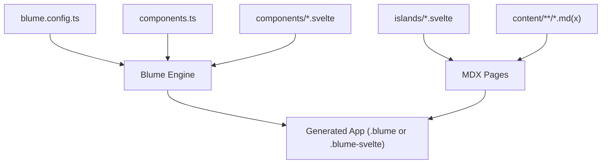
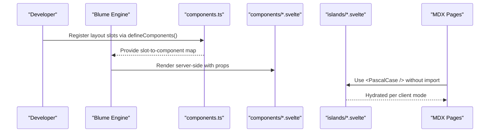
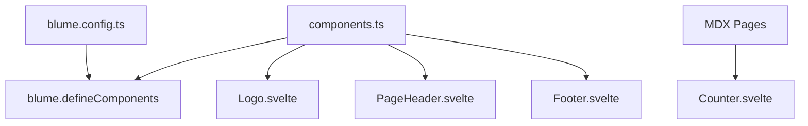

# Component APIs

<cite>
**Referenced Files in This Document**
- [components.ts](file://components.ts)
- [blume.config.ts](file://blume.config.ts)
- [package.json](file://package.json)
- [README.md](file://README.md)
- [Footer.svelte](file://components/Footer.svelte)
- [Logo.svelte](file://components/Logo.svelte)
- [PageHeader.svelte](file://components/PageHeader.svelte)
- [Counter.svelte](file://islands/Counter.svelte)
- [svelte-layer.mdx](file://content/svelte-layer.mdx)
</cite>

## Table of Contents
1. [Introduction](#introduction)
2. [Project Structure](#project-structure)
3. [Core Components](#core-components)
4. [Architecture Overview](#architecture-overview)
5. [Detailed Component Analysis](#detailed-component-analysis)
6. [Dependency Analysis](#dependency-analysis)
7. [Performance Considerations](#performance-considerations)
8. [Troubleshooting Guide](#troubleshooting-guide)
9. [Conclusion](#conclusion)
10. [Appendices](#appendices)

## Introduction
This document explains FractalWiki’s component system that maps Blume layout slots to Svelte components and how islands are discovered and hydrated automatically. It focuses on the slot mapping interface, registration patterns, available slots and their props, island discovery and hydration, lifecycle considerations, and TypeScript interfaces for props. The goal is to help you create custom layout components, pass data between components, and understand how Blume’s slot system integrates with Svelte’s component model.

## Project Structure
FractalWiki uses a minimal structure:
- blume.config.ts configures site metadata, content root, navigation, i18n, and frontmatter schema.
- components.ts registers Svelte components as Blume layout overrides via defineComponents.
- components/*.svelte are server-rendered layout slots (no JS by default).
- islands/*.svelte are interactive components used directly in MDX without imports.
- content/**/*.md(x) are pages; .mdx can use islands directly.

**Diagram sources**
- [blume.config.ts:14-56](file://blume.config.ts#L14-L56)
- [components.ts:20-26](file://components.ts#L20-L26)

**Section sources**
- [blume.config.ts:14-56](file://blume.config.ts#L14-L56)
- [README.md:103-111](file://README.md#L103-L111)

## Core Components
The core of the component API is the components.ts file, which exports a default configuration using defineComponents from Blume. It maps Blume layout slots to Svelte components under the layout key. Slots are static by default and render on the server unless explicitly given a client mode. Islands live in the islands directory and are auto-discovered for use in MDX.

Key points:
- Slot mapping: layout object keys correspond to Blume slot names.
- Available slots include Header, Sidebar, MobileNav, Breadcrumbs, TableOfContents, Pagination, Footer, PageHeader, PageFooter, Feedback, Logo, Search.
- Layout slots receive specific props provided by Blume.
- Islands are PascalCase .svelte files in islands/ and hydrate automatically.

**Section sources**
- [components.ts:1-27](file://components.ts#L1-L27)
- [README.md:44-71](file://README.md#L44-L71)

## Architecture Overview
Blume owns routing, content collections, markdown processing, layout, theming, search, and more. In this project, the component surface is replaced with Svelte. Blume infers framework support from .svelte extensions and enables @astrojs/svelte when rendering Astro engine output. Islands are discovered automatically and hydrated based on default or explicit modes.

**Diagram sources**
- [components.ts:20-26](file://components.ts#L20-L26)
- [README.md:21-32](file://README.md#L21-L32)

## Detailed Component Analysis

### Slot Mapping Interface and Registration
- The default export of components.ts calls defineComponents({ layout: { ... } }) to register Svelte components against Blume slots.
- Keys in the layout object must match Blume’s slot names (e.g., Logo, PageHeader, Footer).
- Blume will render these components server-side with no JavaScript unless a client mode is specified.

Slot names and expected props:
- Logo: receives site and optional logo.
- PageHeader / PageFooter: receives page, route, headings.
- Footer: receives site, navigation, ui.
- Other slots (Header, Sidebar, MobileNav, Breadcrumbs, TableOfContents, Pagination, Feedback, Search): exist but are not overridden here.

How to override:
- Add a new .svelte file under components/.
- Import it in components.ts and add it to the layout object.

**Section sources**
- [components.ts:7-26](file://components.ts#L7-L26)
- [README.md:55-71](file://README.md#L55-L71)

### Layout Slot Components

#### Logo.svelte
- Purpose: Replaces Blume’s default logo inside the header.
- Props: site (with title), logo (optional text fallback).
- Behavior: Static by default; renders an anchor link with SVG mark and label derived from site.title or logo.text.
- Styling: Uses CSS custom properties for theme tokens.

Props interface (TypeScript):
- site: { title: string }
- logo?: { text?: string } | null

Lifecycle notes:
- Server-rendered by default.
- No client mode means no JS shipped unless you add one.

**Section sources**
- [Logo.svelte:1-50](file://components/Logo.svelte#L1-L50)

#### PageHeader.svelte
- Purpose: Renders a section strip above the article body using extracted headings.
- Props: page (title, description, route), headings (array of depth, slug, text), route (optional).
- Behavior: Filters headings at depth 2 to build a navigable list of sections.
- Styling: Uses CSS custom properties and responsive flex layout.

Props interface (TypeScript):
- page: { title: string; description?: string; route: string }
- headings?: Array<{ depth: number; slug: string; text: string }>
- route?: string

Lifecycle notes:
- Server-rendered by default.
- Avoids Astro-only virtual modules; relies on props.

**Section sources**
- [PageHeader.svelte:1-76](file://components/PageHeader.svelte#L1-L76)

#### Footer.svelte
- Purpose: Adds a footer bar with site title and year.
- Props: site (with title), navigation (optional), ui (optional).
- Behavior: Displays site.title and current year; styled with CSS custom properties.

Props interface (TypeScript):
- site: { title: string }
- navigation?: unknown
- ui?: unknown

Lifecycle notes:
- Server-rendered by default.

**Section sources**
- [Footer.svelte:1-30](file://components/Footer.svelte#L1-L30)

### Island Discovery and Automatic Hydration
- Any PascalCase .svelte file in islands/ becomes a globally available component in MDX without imports.
- Default hydration is client:visible; you can change per island via export const client = "load" | "idle" | "only" | "visible".
- Props must be serializable across the boundary.

Example usage in MDX:
- <Counter />
- <Counter start={10} label="Pressed" />

Hydration modes:
- visible: When scrolled into view (default)
- load: Immediately
- idle: On idle
- only: Client only, never server-rendered

**Section sources**
- [README.md:73-86](file://README.md#L73-L86)
- [svelte-layer.mdx:11-38](file://content/svelte-layer.mdx#L11-L38)

### Counter.svelte (Island Example)
- Purpose: Demonstrates an interactive island component with state and event handling.
- Props: start (number, default 0), label (string, default 'Clicked').
- Behavior: Maintains local state count and increments on click.
- Styling: Uses CSS custom properties for consistent theming.

Props interface (TypeScript):
- start?: number
- label?: string

Lifecycle notes:
- Hydrated according to client mode (default visible).
- State and events run in the browser after hydration.

**Section sources**
- [Counter.svelte:1-45](file://islands/Counter.svelte#L1-L45)

### Creating Custom Layout Components
Steps:
1. Create a new .svelte file under components/.
2. Define props using $props() and type them with TypeScript.
3. Register the component in components.ts under the appropriate slot name.
4. Ensure props align with Blume’s contract for that slot.

Data passing:
- Blume passes predefined props to each slot; do not rely on Astro-only virtual modules in .svelte slots.
- If you need collection data, either hydrate the slot and read serialized snapshots via blume/hooks or keep that slot as .astro.

Lifecycle events:
- For server-rendered slots, there is no client-side lifecycle unless you add client mode.
- For islands, lifecycle is controlled by client mode and Svelte’s runtime.

**Section sources**
- [components.ts:7-26](file://components.ts#L7-L26)
- [README.md:87-99](file://README.md#L87-L99)

### Relationship Between Blume’s Slot System and Svelte’s Component Model
- Blume’s slots act as named placeholders in its layout shell.
- By registering a .svelte file against a slot, Blume renders that Svelte component in place of its default Astro component.
- Blume infers framework support from .svelte extension and enables @astrojs/svelte accordingly.
- Slots are server-rendered by default; islands are client-hydrated components.

**Section sources**
- [README.md:21-32](file://README.md#L21-L32)
- [components.ts:10-18](file://components.ts#L10-L18)

## Dependency Analysis
- components.ts depends on blume’s defineComponents function and imports Svelte components for layout slots.
- Each layout component consumes props provided by Blume and may reference CSS custom properties for theming.
- Islands are consumed by MDX pages without explicit imports due to automatic discovery.
- blume.config.ts defines site metadata, content root, navigation, i18n, and frontmatter schema used by Blume.

**Diagram sources**
- [components.ts:1-26](file://components.ts#L1-L26)
- [blume.config.ts:14-56](file://blume.config.ts#L14-L56)

**Section sources**
- [components.ts:1-26](file://components.ts#L1-L26)
- [blume.config.ts:14-56](file://blume.config.ts#L14-L56)

## Performance Considerations
- Layout slots are server-rendered and ship no JavaScript by default, minimizing bundle size.
- Islands hydrate only when needed (client:visible by default), reducing initial payload.
- Use client:only for components that require window/document access on mount to avoid SSR mismatches.
- Keep island props serializable to ensure efficient serialization across boundaries.
- Prefer static rendering for layout slots unless interactivity is required.

[No sources needed since this section provides general guidance]

## Troubleshooting Guide
Common issues and resolutions:
- Using Astro-only virtual modules in .svelte slots:
  - blume:data and astro:content are Astro-only; use props or blume/hooks when hydrated.
- Missing props in slots:
  - Ensure your component destructures the correct props Blume provides for that slot.
- Island hydration mode:
  - Set export const client appropriately if you encounter hydration mismatches or performance concerns.
- Theme tokens:
  - Ensure CSS custom properties are defined in your theme.css and referenced by components.

**Section sources**
- [README.md:87-99](file://README.md#L87-L99)
- [svelte-layer.mdx:64-68](file://content/svelte-layer.mdx#L64-L68)

## Conclusion
FractalWiki’s component system leverages Blume’s slot mechanism to replace default Astro components with Svelte components. Layout slots are server-rendered and static by default, while islands provide interactive experiences with automatic discovery and configurable hydration. By following the slot contracts and TypeScript interfaces outlined here, you can extend layouts, pass data safely, and manage lifecycles effectively.

[No sources needed since this section summarizes without analyzing specific files]

## Appendices

### TypeScript Interfaces Summary

- Logo props:
  - site: { title: string }
  - logo?: { text?: string } | null

- PageHeader props:
  - page: { title: string; description?: string; route: string }
  - headings?: Array<{ depth: number; slug: string; text: string }>
  - route?: string

- Footer props:
  - site: { title: string }
  - navigation?: unknown
  - ui?: unknown

- Counter island props:
  - start?: number
  - label?: string

**Section sources**
- [Logo.svelte:1-50](file://components/Logo.svelte#L1-L50)
- [PageHeader.svelte:1-76](file://components/PageHeader.svelte#L1-L76)
- [Footer.svelte:1-30](file://components/Footer.svelte#L1-L30)
- [Counter.svelte:1-45](file://islands/Counter.svelte#L1-L45)

### Available Slots Reference
- Header, Sidebar, MobileNav, Breadcrumbs, TableOfContents, Pagination, Footer, PageHeader, PageFooter, Feedback, Logo, Search.

**Section sources**
- [components.ts:14-18](file://components.ts#L14-L18)
- [README.md:55-71](file://README.md#L55-L71)

### Hydration Modes Reference
- visible (default): Hydrates when scrolled into view.
- load: Hydrates immediately.
- idle: Hydrates on idle.
- only: Client only, never server-rendered.

**Section sources**
- [README.md:73-86](file://README.md#L73-L86)
- [svelte-layer.mdx:25-38](file://content/svelte-layer.mdx#L25-L38)