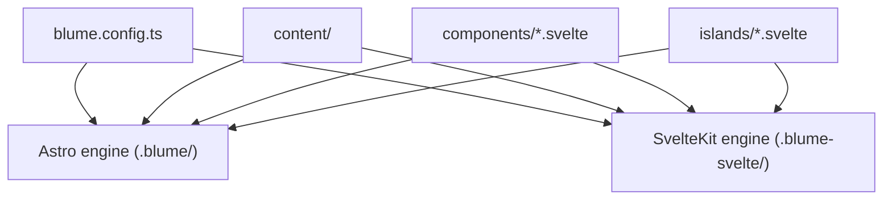
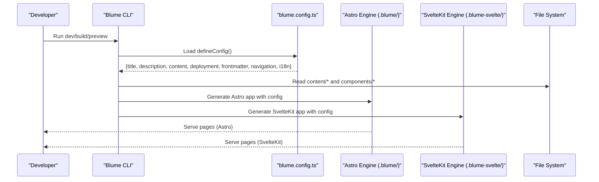
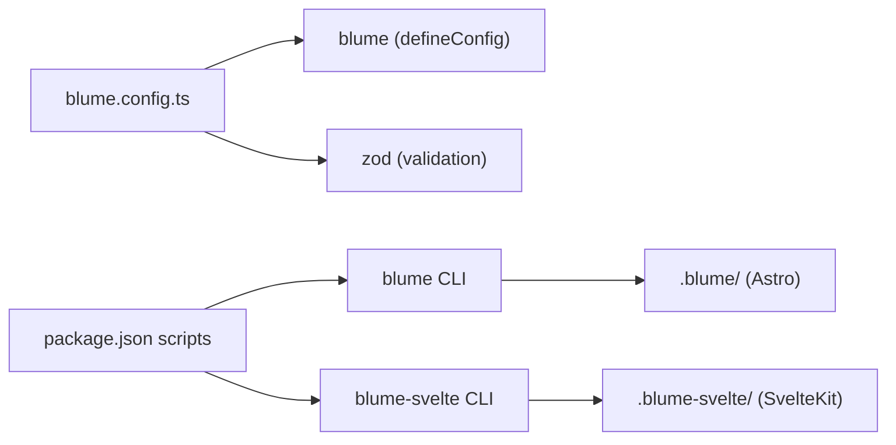

# Configuration Schema

<cite>
**Referenced Files in This Document**
- [blume.config.ts](file://blume.config.ts)
- [package.json](file://package.json)
- [README.md](file://README.md)
- [content/index.md](file://content/index.md)
- [content/hi/index.md](file://content/hi/index.md)
- [content/svelte-layer.mdx](file://content/svelte-layer.mdx)
</cite>

## Table of Contents
1. [Introduction](#introduction)
2. [Project Structure](#project-structure)
3. [Core Components](#core-components)
4. [Architecture Overview](#architecture-overview)
5. [Detailed Component Analysis](#detailed-component-analysis)
6. [Dependency Analysis](#dependency-analysis)
7. [Performance Considerations](#performance-considerations)
8. [Troubleshooting Guide](#troubleshooting-guide)
9. [Conclusion](#conclusion)
10. [Appendices](#appendices)

## Introduction
This document provides a comprehensive configuration schema reference for FractalWiki’s Blume setup. It explains the complete structure of blume.config.ts, including site metadata, content root configuration, deployment options, frontmatter validation with Zod schemas, navigation settings (tabs and sidebar), and i18n configuration. It also clarifies how these settings influence build-time behavior and runtime rendering across both Astro and SvelteKit engines that share the same sources.

## Project Structure
FractalWiki is a Blume project where Svelte serves as the component layer. The configuration file blume.config.ts centralizes site metadata, content location, deployment URL, frontmatter validation, navigation, and internationalization. Both engines read this single configuration to generate their respective apps.

**Diagram sources**
- [README.md:10-14](file://README.md#L10-L14)
- [README.md:103-111](file://README.md#L103-L111)

**Section sources**
- [README.md:10-14](file://README.md#L10-L14)
- [README.md:103-111](file://README.md#L103-L111)

## Core Components
The Blume configuration object exported from blume.config.ts defines the following top-level sections:
- Site metadata: title, description
- Content configuration: content.root
- Deployment options: deployment.site
- Frontmatter validation: frontmatter.extend with Zod schemas
- Navigation: navigation.tabs and navigation.sidebar.display
- Internationalization: i18n.defaultLocale, i18n.fallbackLocale, i18n.locales

These fields are used by Blume during development, build, and preview to configure routing, content discovery, SEO features, navigation rendering, and localization behavior.

**Section sources**
- [blume.config.ts:14-56](file://blume.config.ts#L14-L56)

## Architecture Overview
Blume reads blume.config.ts to generate two separate applications from the same source tree:
- An Astro app under .blume/
- A SvelteKit app under .blume-svelte/

Both engines consume the same content directory and component overrides. The configuration drives:
- Routing and content collection roots
- Canonical URLs and social cards via deployment.site
- Frontmatter validation at build time using Zod
- Navigation rendering (tabs and sidebar grouping)
- Locale-based routing and labels

**Diagram sources**
- [README.md:10-14](file://README.md#L10-L14)
- [blume.config.ts:14-56](file://blume.config.ts#L14-L56)

## Detailed Component Analysis

### Site Metadata
- title: string — Site title used throughout UI and meta tags.
- description: string — Site description used in meta and social cards.

Impact:
- Build-time: Used to generate <title>, meta description, and Open Graph data.
- Runtime: Displayed in headers, footers, and page titles.

Example usage:
- See site title and description in the root page frontmatter and footer component props.

**Section sources**
- [blume.config.ts:15-17](file://blume.config.ts#L15-L17)
- [content/index.md:1-4](file://content/index.md#L1-L4)
- [components/Footer.svelte:4](file://components/Footer.svelte#L4)

### Content Configuration
- content.root: string — Directory containing Markdown/MDX pages. Default is docs; this project uses content.

Impact:
- Build-time: Blume scans this directory for content collections and routes.
- Runtime: Pages are served relative to this root path.

Example usage:
- Root index page resides under content/index.md.

**Section sources**
- [blume.config.ts:20-22](file://blume.config.ts#L20-L22)
- [content/index.md:1-4](file://content/index.md#L1-L4)

### Deployment Options
- deployment.site: string — Base site URL enabling absolute canonical links, sitemap generation, and social card URLs.

Impact:
- Build-time: Generates absolute URLs for canonical tags, sitemaps, and OG images.
- Runtime: Ensures correct link resolution across environments.

Example usage:
- Set to a local or production URL depending on environment.

**Section sources**
- [blume.config.ts:25-27](file://blume.config.ts#L25-L27)

### Frontmatter Validation with Zod
- frontmatter.extend: Record<string, ZodSchema> — Extends default frontmatter fields with custom validators.

Defined fields in this project:
- tags: z.array(z.string()).optional() — Optional array of strings for categorization.
- related: z.array(z.string()).optional() — Optional array of strings for related page identifiers.
- source: z.string().optional() — Optional string for external source attribution.
- created: z.coerce.string().optional() — Optional string date field coerced from input.
- updated: z.coerce.string().optional() — Optional string date field coerced from input.

Validation rules:
- All fields are optional unless otherwise specified.
- Arrays must contain only strings.
- Date-like strings are coerced to strings for consistent handling.

Build-time impact:
- Invalid frontmatter will cause build errors, ensuring content integrity.

Runtime impact:
- Validated fields are available to components and templates.

Examples:
- Tags used in MDX frontmatter for categorization.
- Created/updated fields can be consumed by components for display.

**Section sources**
- [blume.config.ts:29-37](file://blume.config.ts#L29-L37)
- [content/svelte-layer.mdx:1-5](file://content/svelte-layer.mdx#L1-L5)

### Navigation Structure
- navigation.tabs: Array<{ label: string; path: string }> — Top-level tabs displayed in the header.
- navigation.sidebar.display: string — Controls sidebar grouping behavior (e.g., "group").

Impact:
- Build-time: Determines tab bar entries and sidebar organization.
- Runtime: Renders navigation elements accordingly.

Example usage:
- Single tab labeled “Home” pointing to “/”.
- Sidebar grouped layout for hierarchical content.

**Section sources**
- [blume.config.ts:39-44](file://blume.config.ts#L39-L44)

### Internationalization (i18n)
- i18n.defaultLocale: string — Default locale code without prefix (e.g., “en”).
- i18n.fallbackLocale: string — Fallback locale when a translation is missing.
- i18n.locales: Array<{ code: string; label: string }> — Supported locales with human-readable labels.

Behavior:
- Default locale routes have no prefix (e.g., “/”).
- Other locales are prefixed (e.g., “/hi/...”).
- Labels appear in locale switchers.

Example usage:
- English as default, Hindi as secondary with label “हिन्दी”.

**Section sources**
- [blume.config.ts:48-55](file://blume.config.ts#L48-L55)
- [content/hi/index.md:1-4](file://content/hi/index.md#L1-L4)

## Dependency Analysis
Blume configuration depends on:
- zod: For runtime validation of frontmatter fields.
- blume: Provides defineConfig and core functionality.
- @astrojs/svelte and SvelteKit tooling: Enable Svelte components within both engines.

Scripts in package.json expose commands for both engines:
- blume dev/build/preview/check/validate/doctor
- blume-svelte dev/build/generate

**Diagram sources**
- [blume.config.ts:1-2](file://blume.config.ts#L1-L2)
- [package.json:5-14](file://package.json#L5-L14)

**Section sources**
- [package.json:16-18](file://package.json#L16-L18)
- [package.json:5-14](file://package.json#L5-L14)

## Performance Considerations
- Frontmatter validation runs at build time; keep schemas minimal to avoid unnecessary overhead.
- Using optional fields reduces validation cost when not present.
- Coercion on date-like strings ensures consistent parsing without heavy transformations.
- Avoid excessive dynamic imports in components to keep server-rendered slots lightweight.

[No sources needed since this section provides general guidance]

## Troubleshooting Guide
Common issues and resolutions:
- Invalid frontmatter: Ensure arrays contain strings and optional fields match expected types.
- Missing deployment.site: Canonical links and social cards may resolve incorrectly; set an absolute base URL.
- i18n misconfiguration: Verify defaultLocale and fallbackLocale exist in locales list; ensure content directories match locale codes.
- Navigation mismatch: Confirm tab paths correspond to actual routes; verify sidebar display mode matches content structure.

**Section sources**
- [blume.config.ts:29-37](file://blume.config.ts#L29-L37)
- [blume.config.ts:25-27](file://blume.config.ts#L25-L27)
- [blume.config.ts:48-55](file://blume.config.ts#L48-L55)

## Conclusion
FractalWiki’s blume.config.ts centralizes all critical site configuration, enabling consistent behavior across Astro and SvelteKit engines. By defining site metadata, content root, deployment URL, Zod-based frontmatter validation, navigation, and i18n, it ensures robust builds and predictable runtime behavior. Adhering to the documented schema and examples helps maintain content integrity and user experience across locales and deployments.

[No sources needed since this section summarizes without analyzing specific files]

## Appendices

### TypeScript Type Definitions Summary
While exact type definitions are provided by the blume package, the effective shape of the configuration object includes:
- title: string
- description: string
- content: { root: string }
- deployment: { site: string }
- frontmatter: { extend: Record<string, ZodSchema> }
- navigation: { tabs: Array<{ label: string; path: string }>; sidebar: { display: string } }
- i18n: { defaultLocale: string; fallbackLocale: string; locales: Array<{ code: string; label: string }> }

These types guide editor autocomplete and compile-time checks when using TypeScript.

**Section sources**
- [blume.config.ts:14-56](file://blume.config.ts#L14-L56)

### Practical Examples
- Adding a new tag: Include tags in frontmatter as an array of strings.
- Setting creation/update dates: Use ISO-like strings; coercion ensures compatibility.
- Adding a new locale: Add a new entry to i18n.locales and create corresponding content directory.

**Section sources**
- [content/svelte-layer.mdx:1-5](file://content/svelte-layer.mdx#L1-L5)
- [content/hi/index.md:1-4](file://content/hi/index.md#L1-L4)