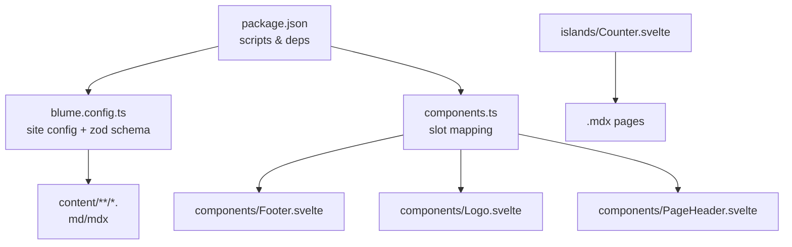
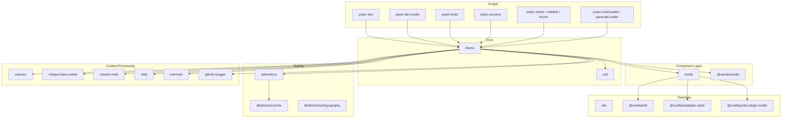
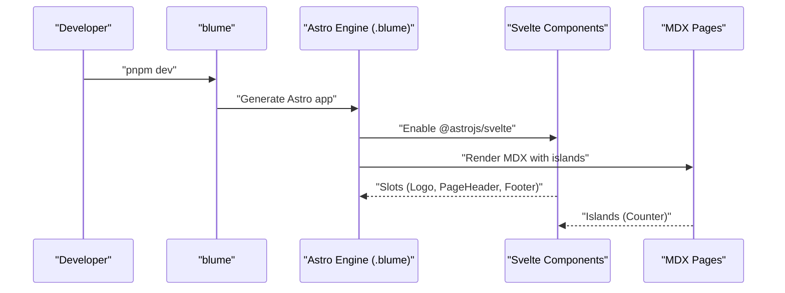
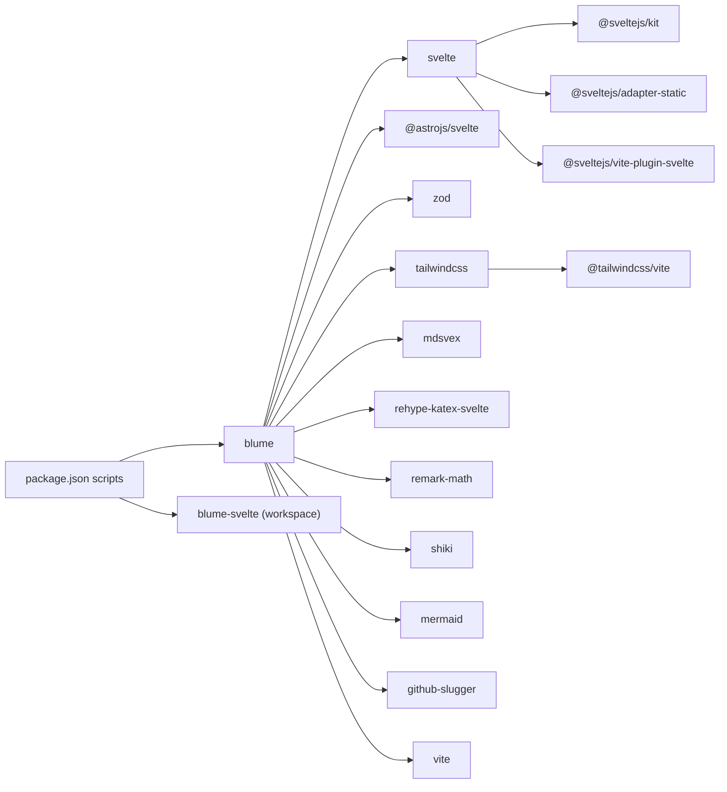

# Package APIs

<cite>
**Referenced Files in This Document**
- [package.json](file://package.json)
- [README.md](file://README.md)
- [blume.config.ts](file://blume.config.ts)
- [components.ts](file://components.ts)
- [Footer.svelte](file://components/Footer.svelte)
- [Logo.svelte](file://components/Logo.svelte)
- [PageHeader.svelte](file://components/PageHeader.svelte)
- [Counter.svelte](file://islands/Counter.svelte)
</cite>

## Table of Contents
1. [Introduction](#introduction)
2. [Project Structure](#project-structure)
3. [Core Components](#core-components)
4. [Architecture Overview](#architecture-overview)
5. [Detailed Component Analysis](#detailed-component-analysis)
6. [Dependency Analysis](#dependency-analysis)
7. [Performance Considerations](#performance-considerations)
8. [Troubleshooting Guide](#troubleshooting-guide)
9. [Conclusion](#conclusion)
10. [Appendices](#appendices)

## Introduction
This document provides comprehensive package API documentation for FractalWiki’s npm scripts and dependencies. It explains all available commands defined in package.json, including development servers (pnpm dev, pnpm dev:svelte), build processes (pnpm build), previewing, type checking, validation, and diagnostics. It also documents the role of each major dependency: blume (core framework), svelte (component layer), zod (validation), tailwindcss (styling), and content processing libraries. Version compatibility requirements, peer dependencies, and build toolchain configuration are covered, along with troubleshooting guidance and migration procedures for updating versions.

## Project Structure
FractalWiki is a Blume site that can run on two engines from one unchanged set of sources:
- Astro engine via blume dev (default)
- SvelteKit engine via blume-svelte dev (Svelte surface)

Key files:
- package.json: npm scripts and dependencies
- blume.config.ts: site configuration, frontmatter schema (zod), navigation, i18n
- components.ts: maps Blume layout slots to Svelte components
- components/*.svelte: server-rendered layout overrides
- islands/*.svelte: interactive islands used in .mdx pages
- content/**/*.md(x): pages and MDX content

**Diagram sources**
- [package.json:1-41](file://package.json#L1-L41)
- [blume.config.ts:1-57](file://blume.config.ts#L1-L57)
- [components.ts:1-27](file://components.ts#L1-L27)
- [Footer.svelte:1-30](file://components/Footer.svelte#L1-L30)
- [Logo.svelte:1-50](file://components/Logo.svelte#L1-L50)
- [PageHeader.svelte:1-76](file://components/PageHeader.svelte#L1-L76)
- [Counter.svelte:1-45](file://islands/Counter.svelte#L1-L45)

**Section sources**
- [README.md:1-124](file://README.md#L1-L124)
- [package.json:1-41](file://package.json#L1-L41)

## Core Components
This section documents the npm scripts and their roles.

- Development servers
  - pnpm dev: Starts the Astro engine via blume dev. Default local port is documented in README.
  - pnpm dev:svelte: Starts the SvelteKit engine via blume-svelte dev. Separate local port documented in README.
- Build and preview
  - pnpm build: Builds the site using blume build; output directory is dist/.
  - pnpm preview: Preview the built site locally.
- Quality and diagnostics
  - pnpm check: Type-checking via blume check.
  - pnpm validate: Validation via blume validate.
  - pnpm doctor: Diagnostics via blume doctor.
- Svelte-specific generation
  - pnpm build:svelte: Build with blume-svelte build.
  - pnpm generate:svelte: Generate assets/code with blume-svelte generate.

Notes:
- Both engines read the same blume.config.ts, content/, and components.ts.
- The generated apps live under .blume/ (Astro) and .blume-svelte/ (SvelteKit).

**Section sources**
- [package.json:5-15](file://package.json#L5-L15)
- [README.md:5-14](file://README.md#L5-L14)
- [README.md:34-38](file://README.md#L34-L38)

## Architecture Overview
The project uses Blume as the core framework, with Svelte as the component layer. Zod validates frontmatter. TailwindCSS provides styling utilities. Content processing includes mdsvex, rehype-katex-svelte, remark-math, shiki, mermaid, and github-slugger.

**Diagram sources**
- [package.json:16-39](file://package.json#L16-L39)
- [blume.config.ts:1-57](file://blume.config.ts#L1-L57)
- [README.md:1-124](file://README.md#L1-L124)

## Detailed Component Analysis

### NPM Scripts API
- pnpm dev
  - Purpose: Start development server for the Astro engine.
  - Underlying command: blume dev.
  - Output: Local development server (port documented in README).
- pnpm dev:svelte
  - Purpose: Start development server for the SvelteKit engine.
  - Underlying command: blume-svelte dev.
  - Output: Local development server (separate port documented in README).
- pnpm build
  - Purpose: Build the site for production.
  - Underlying command: blume build.
  - Output: Static site in dist/.
- pnpm preview
  - Purpose: Preview the built site locally.
  - Underlying command: blume preview.
- pnpm check
  - Purpose: Run type checks.
  - Underlying command: blume check.
- pnpm validate
  - Purpose: Validate configuration and content.
  - Underlying command: blume validate.
- pnpm doctor
  - Purpose: Run diagnostics and environment checks.
  - Underlying command: blume doctor.
- pnpm build:svelte
  - Purpose: Build with the Svelte engine.
  - Underlying command: blume-svelte build.
- pnpm generate:svelte
  - Purpose: Generate assets/code with the Svelte engine.
  - Underlying command: blume-svelte generate.

**Section sources**
- [package.json:5-15](file://package.json#L5-L15)
- [README.md:5-14](file://README.md#L5-L14)
- [README.md:34-38](file://README.md#L34-L38)

### Dependency Roles and Compatibility
- blume (^1.3.1)
  - Role: Core framework providing routing, content collections, markdown/MDX, sidebar, TOC, search, theming, llms.txt, OG, and more.
  - Behavior: Infers Svelte support from .svelte files and enables @astrojs/svelte automatically.
- svelte (^5.56.1)
  - Role: Component layer for both layout slots and islands. Uses Svelte 5 runes ($state, $derived, $props).
- zod (^4.4.3)
  - Role: Frontmatter schema validation in blume.config.ts.
- tailwindcss (^4.3.3)
  - Role: Utility-first CSS framework used by Svelte components through CSS custom properties.
- @tailwindcss/vite (^4)
  - Role: Vite integration for Tailwind v4.
- @tailwindcss/typography (^0.5.20)
  - Role: Typography plugin for prose styles in content.
- @astrojs/svelte (^9.0.0)
  - Role: Enables Svelte rendering within the Astro engine generated by blume.
- @sveltejs/kit (^2.63.0)
  - Role: Framework for the Svelte engine (used by blume-svelte).
- @sveltejs/adapter-static (^3.0.10)
  - Role: Adapter for static site generation with SvelteKit.
- @sveltejs/vite-plugin-svelte (^7.1.2)
  - Role: Vite plugin for Svelte compilation and integration.
- vite (^8.0.16)
  - Role: Build tool and dev server used across the stack.
- mdsvex (^0.12.7)
  - Role: Markdown/MDX processing pipeline for content.
- rehype-katex-svelte (^1.2.0)
  - Role: KaTeX rendering for math in MDX.
- remark-math (^3.0.1)
  - Role: Math parsing for Markdown/MDX.
- shiki (^3.0.0)
  - Role: Syntax highlighting for code blocks.
- mermaid (^11.16.0)
  - Role: Diagrams and flowcharts in MDX.
- github-slugger (^2.0.0)
  - Role: Slug generation for headings and links.

Version compatibility notes:
- Svelte 5 is required for runes usage in components.
- Tailwind v4 requires @tailwindcss/vite v4.
- @astrojs/svelte must be compatible with the installed svelte version.
- @sveltejs/kit and adapter-static should align with the SvelteKit engine used by blume-svelte.

**Section sources**
- [package.json:16-39](file://package.json#L16-L39)
- [blume.config.ts:1-57](file://blume.config.ts#L1-L57)
- [README.md:22-32](file://README.md#L22-L32)

### Build Toolchain Configuration
- blume orchestrates the build and dev workflows, generating an Astro app under .blume/ and enabling @astrojs/svelte automatically when it detects .svelte files.
- For the Svelte engine, blume-svelte generates a SvelteKit app under .blume-svelte/ using @sveltejs/kit and adapter-static.
- Vite powers the build and dev server for both engines.
- mdsvex processes MDX content; rehype-katex-svelte and remark-math handle math; shiki handles syntax highlighting; mermaid renders diagrams.

**Section sources**
- [README.md:22-32](file://README.md#L22-L32)
- [README.md:101-111](file://README.md#L101-L111)
- [package.json:16-39](file://package.json#L16-L39)

### Slot Mapping and Islands
- components.ts maps Blume layout slots to Svelte components:
  - Logo, PageHeader, Footer are overridden with Svelte implementations.
- Layout slots render server-side and ship zero JavaScript unless explicitly given a client mode.
- Islands in islands/ become globally available in .mdx pages without imports and hydrate on client:visible by default.

**Diagram sources**
- [components.ts:1-27](file://components.ts#L1-L27)
- [README.md:22-32](file://README.md#L22-L32)
- [README.md:40-86](file://README.md#L40-L86)

**Section sources**
- [components.ts:1-27](file://components.ts#L1-L27)
- [README.md:40-86](file://README.md#L40-L86)

## Dependency Analysis
The following diagram shows how scripts invoke core packages and how they interrelate.

**Diagram sources**
- [package.json:5-39](file://package.json#L5-L39)

**Section sources**
- [package.json:5-39](file://package.json#L5-L39)

## Performance Considerations
- Layout slots are server-rendered and ship no JavaScript by default, minimizing client payload.
- Islands hydrate lazily (client:visible by default), reducing initial load time.
- Using Tailwind v4 with @tailwindcss/vite improves build performance and tree-shaking.
- mdsvex and rehype plugins process content efficiently; keep content modular to avoid heavy transformations.
- Prefer static generation where possible; use preview only for local testing.

[No sources needed since this section provides general guidance]

## Troubleshooting Guide
Common issues and resolutions:
- Port conflicts between engines
  - Symptom: dev and dev:svelte fail to start due to port collisions.
  - Resolution: Ensure separate ports are used; README documents different ports for each engine.
- Missing or incompatible Svelte version
  - Symptom: Runtime errors related to runes or component compilation.
  - Resolution: Align svelte with ^5.56.1 and ensure @astrojs/svelte and @sveltejs/vite-plugin-svelte are compatible.
- Tailwind v4 configuration
  - Symptom: Styles not applied or build warnings.
  - Resolution: Use @tailwindcss/vite v4 and update any Tailwind directives accordingly.
- MDX math or diagrams not rendering
  - Symptom: Math or mermaid diagrams do not appear.
  - Resolution: Verify rehype-katex-svelte, remark-math, and mermaid are installed and configured via blume.
- Frontmatter validation failures
  - Symptom: Errors during blume validate or build.
  - Resolution: Check zod schema in blume.config.ts and ensure frontmatter matches the defined types.
- Workspace dependency resolution
  - Symptom: blume-svelte workspace:* cannot be resolved.
  - Resolution: Ensure the workspace setup includes blume-svelte or switch to a published version if not present locally.

**Section sources**
- [README.md:5-14](file://README.md#L5-L14)
- [blume.config.ts:29-37](file://blume.config.ts#L29-L37)
- [package.json:16-39](file://package.json#L16-L39)

## Conclusion
FractalWiki leverages blume as the core framework with Svelte as the component layer, supported by robust tooling and content processing libraries. The npm scripts provide straightforward commands for development, building, previewing, and diagnostics across both Astro and SvelteKit engines. Properly aligning dependency versions and understanding the roles of each package ensures smooth development and reliable builds.

[No sources needed since this section summarizes without analyzing specific files]

## Appendices

### Migration Procedures for Updating Versions
- Update blume and blume-svelte together to maintain engine compatibility.
- When upgrading svelte, verify @astrojs/svelte and @sveltejs/vite-plugin-svelte compatibility.
- For Tailwind v4, migrate configurations and directives to match v4 expectations.
- Re-run pnpm validate and pnpm check after updates to catch schema or type mismatches.
- Test both engines (dev and dev:svelte) to ensure consistent behavior.

[No sources needed since this section provides general guidance]