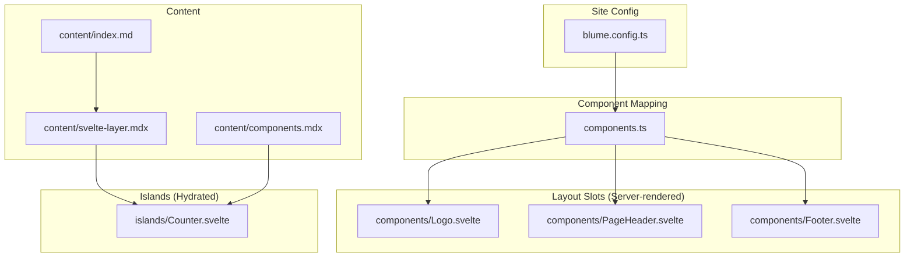
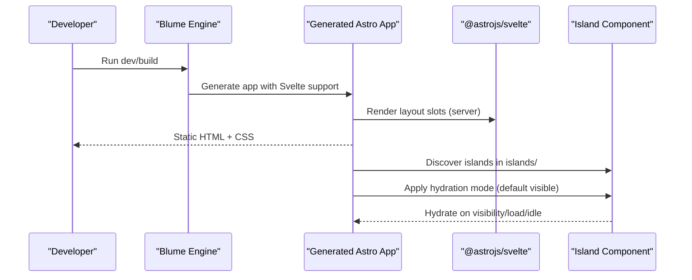
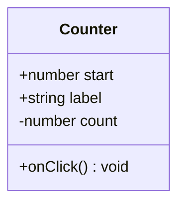
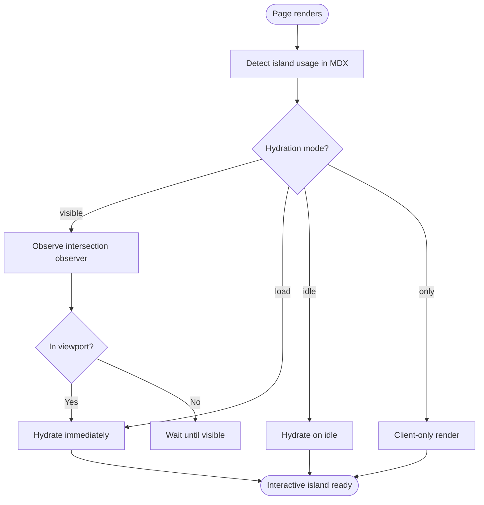
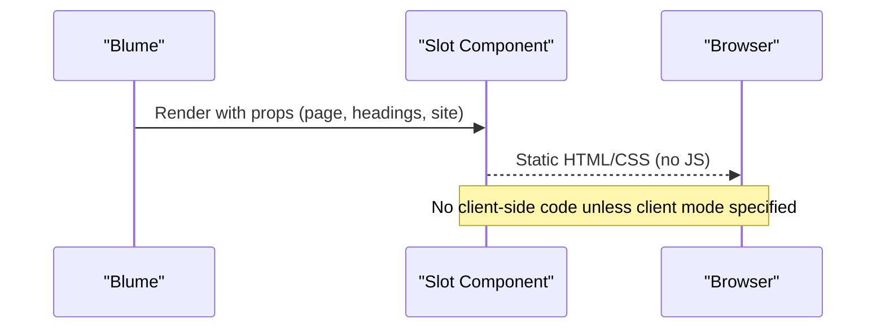
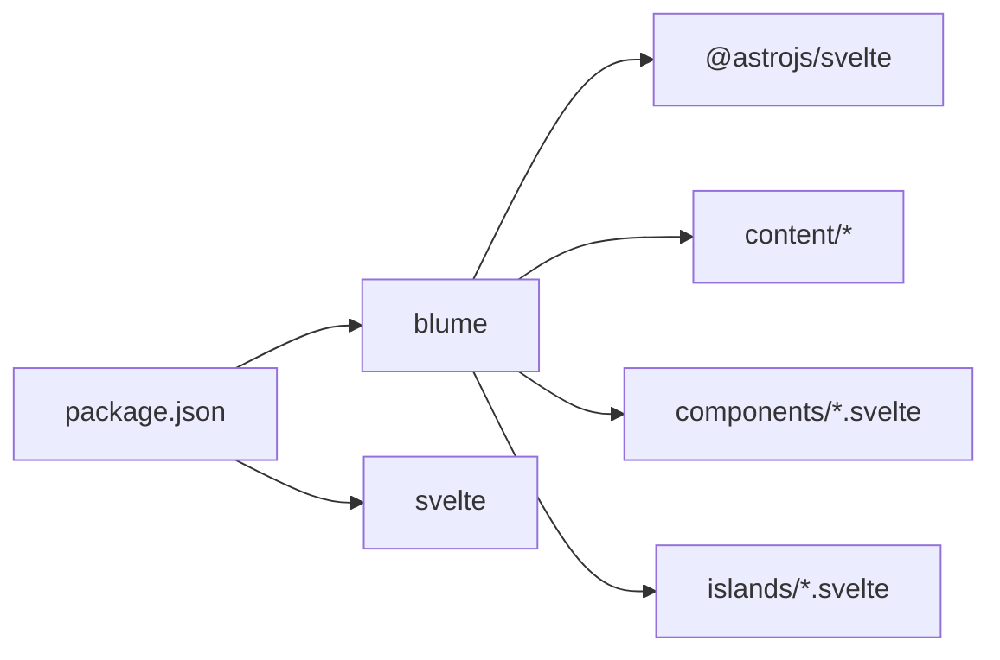

# Advanced Features

<cite>
**Referenced Files in This Document**
- [README.md](file://README.md)
- [blume.config.ts](file://blume.config.ts)
- [components.ts](file://components.ts)
- [package.json](file://package.json)
- [islands/Counter.svelte](file://islands/Counter.svelte)
- [components/Footer.svelte](file://components/Footer.svelte)
- [components/Logo.svelte](file://components/Logo.svelte)
- [components/PageHeader.svelte](file://components/PageHeader.svelte)
- [content/index.md](file://content/index.md)
- [content/components.mdx](file://content/components.mdx)
- [content/svelte-layer.mdx](file://content/svelte-layer.mdx)
</cite>

## Table of Contents
1. Introduction
2. Project Structure
3. Core Components
4. Architecture Overview
5. Detailed Component Analysis
6. Dependency Analysis
7. Performance Considerations
8. Troubleshooting Guide
9. Conclusion
10. Appendices

## Introduction
This document explains advanced features for FractalWiki with Svelte 5 as the component layer. It covers interactive islands using Svelte 5 runes, automatic discovery and hydration strategies (including visibility-based loading), performance optimization techniques such as zero JavaScript by default and progressive enhancement, SEO optimization patterns, analytics integration approaches, debugging techniques for server-rendered components and client-hydrated islands, accessibility best practices, and migration guidance between engines and versions.

## Project Structure
FractalWiki uses Blume to provide routing, content collections, markdown/MDX processing, theming, search, and more. The project swaps Blume’s default Astro components with Svelte components for layout slots and adds interactive islands that hydrate on demand.

**Diagram sources**
- [blume.config.ts:14-56](file://blume.config.ts#L14-L56)
- [components.ts:20-26](file://components.ts#L20-L26)
- [components/Logo.svelte:1-50](file://components/Logo.svelte#L1-L50)
- [components/PageHeader.svelte:1-76](file://components/PageHeader.svelte#L1-L76)
- [components/Footer.svelte:1-30](file://components/Footer.svelte#L1-L30)
- [islands/Counter.svelte:1-45](file://islands/Counter.svelte#L1-L45)
- [content/index.md:1-39](file://content/index.md#L1-L39)
- [content/svelte-layer.mdx:1-68](file://content/svelte-layer.mdx#L1-L68)
- [content/components.mdx:1-125](file://content/components.mdx#L1-L125)

**Section sources**
- [README.md:21-124](file://README.md#L21-L124)
- [blume.config.ts:14-56](file://blume.config.ts#L14-L56)
- [components.ts:1-27](file://components.ts#L1-L27)
- [content/index.md:1-39](file://content/index.md#L1-L39)

## Core Components
- Layout slots are static, server-rendered Svelte components mapped via components.ts. They receive props from Blume and ship no JavaScript unless explicitly requested.
- Islands are any PascalCase .svelte files under islands/. They are globally available in MDX without imports and hydrate according to a default or explicit strategy.

Key responsibilities:
- Logo.svelte: Renders site branding using provided props; uses $derived for computed label.
- PageHeader.svelte: Builds a sections strip from headings prop; uses $derived to filter depth-2 headings.
- Footer.svelte: Displays site title and year; purely presentational.
- Counter.svelte: Interactive island demonstrating Svelte 5 runes ($state, $props).

**Section sources**
- [components/Logo.svelte:1-50](file://components/Logo.svelte#L1-L50)
- [components/PageHeader.svelte:1-76](file://components/PageHeader.svelte#L1-L76)
- [components/Footer.svelte:1-30](file://components/Footer.svelte#L1-L30)
- [islands/Counter.svelte:1-45](file://islands/Counter.svelte#L1-L45)
- [components.ts:20-26](file://components.ts#L20-L26)

## Architecture Overview
Blume generates an Astro app behind the scenes and enables @astrojs/svelte automatically when it detects .svelte files. Layout slots are rendered on the server. Islands are discovered and hydrated based on configuration or defaults.

**Diagram sources**
- [README.md:21-38](file://README.md#L21-L38)
- [blume.config.ts:14-27](file://blume.config.ts#L14-L27)
- [components.ts:1-27](file://components.ts#L1-L27)
- [content/svelte-layer.mdx:25-38](file://content/svelte-layer.mdx#L25-L38)

## Detailed Component Analysis

### Svelte 5 Runes in Islands
The Counter island demonstrates reactive state management with Svelte 5 runes:
- $props() for typed props
- $state for reactive local state
- Event handlers update state reactively

**Diagram sources**
- [islands/Counter.svelte:1-45](file://islands/Counter.svelte#L1-L45)

**Section sources**
- [islands/Counter.svelte:1-45](file://islands/Counter.svelte#L1-L45)

### Automatic Discovery and Hydration Strategies
- Islands are auto-discovered from the islands/ directory and made available in MDX without imports.
- Default hydration is client:visible; can be overridden per island via export const client or descriptor form in components.ts.
- Modes include visible (default), load, idle, only.

**Diagram sources**
- [content/svelte-layer.mdx:25-38](file://content/svelte-layer.mdx#L25-L38)
- [README.md:73-86](file://README.md#L73-L86)

**Section sources**
- [content/svelte-layer.mdx:11-38](file://content/svelte-layer.mdx#L11-L38)
- [README.md:73-86](file://README.md#L73-L86)

### Layout Slots: Zero JavaScript by Default
Layout slots are server-rendered and do not ship JavaScript unless explicitly configured. Examples:
- Logo.svelte uses $derived to compute label from props.
- PageHeader.svelte builds a sections strip from headings prop without JS.
- Footer.svelte renders static content.

**Diagram sources**
- [components/Logo.svelte:1-50](file://components/Logo.svelte#L1-L50)
- [components/PageHeader.svelte:1-76](file://components/PageHeader.svelte#L1-L76)
- [components/Footer.svelte:1-30](file://components/Footer.svelte#L1-L30)
- [components.ts:20-26](file://components.ts#L20-L26)

**Section sources**
- [components/Logo.svelte:1-50](file://components/Logo.svelte#L1-L50)
- [components/PageHeader.svelte:1-76](file://components/PageHeader.svelte#L1-L76)
- [components/Footer.svelte:1-30](file://components/Footer.svelte#L1-L30)
- [components.ts:1-27](file://components.ts#L1-L27)

### MDX Integration Patterns
- Islands are used directly in MDX without imports.
- Props must be serializable.
- Example pages demonstrate usage and engine differences.

**Section sources**
- [content/svelte-layer.mdx:11-24](file://content/svelte-layer.mdx#L11-L24)
- [content/components.mdx:1-125](file://content/components.mdx#L1-L125)
- [content/index.md:15-27](file://content/index.md#L15-L27)

## Dependency Analysis
- Blume orchestrates routing, content, and rendering; it infers Svelte support from .svelte files.
- components.ts maps layout slots to Svelte components.
- package.json lists dependencies including blume, svelte, and related tooling.

**Diagram sources**
- [package.json:16-39](file://package.json#L16-L39)
- [blume.config.ts:14-27](file://blume.config.ts#L14-L27)
- [components.ts:1-27](file://components.ts#L1-L27)

**Section sources**
- [package.json:1-41](file://package.json#L1-L41)
- [blume.config.ts:14-56](file://blume.config.ts#L14-L56)
- [components.ts:1-27](file://components.ts#L1-L27)

## Performance Considerations
- Zero JavaScript by default: Layout slots render statically and ship no client code unless explicitly requested.
- Progressive enhancement: Islands hydrate only when needed (visible, idle, or immediate), minimizing initial payload.
- Selective hydration: Use client modes to defer non-critical interactivity.
- Avoid heavy computations in layout slots; prefer derived values and minimal reactivity.
- Keep island props serializable to reduce serialization overhead.

[No sources needed since this section provides general guidance]

## Troubleshooting Guide
- Server-rendered components:
  - Ensure slot props match expected shapes; use TypeScript types for clarity.
  - If collection data is required in a slot, consider hydrating the slot and using hooks or keep it as an Astro component.
- Client-hydrated islands:
  - Verify hydration mode; use visible for scroll-triggered, load for immediate, idle for deferred, only for client-only scenarios.
  - Check that props are serializable; non-serializable props will fail during hydration.
- Debugging:
  - Use browser dev tools to inspect network payloads and ensure islands are only included on pages that use them.
  - Validate MDX usage of islands and confirm they appear in the generated output.

**Section sources**
- [components/PageHeader.svelte:1-20](file://components/PageHeader.svelte#L1-L20)
- [content/svelte-layer.mdx:25-38](file://content/svelte-layer.mdx#L25-L38)
- [README.md:87-100](file://README.md#L87-L100)

## Conclusion
FractalWiki leverages Blume and Svelte 5 to deliver a high-performance documentation site with interactive islands and static layout slots. By default, pages ship zero JavaScript, with islands hydrating progressively based on visibility or explicit modes. This approach balances performance, developer ergonomics, and user experience while maintaining strong SEO and accessibility foundations.

[No sources needed since this section summarizes without analyzing specific files]

## Appendices

### SEO Optimization Patterns
- Configure deployment.site to enable absolute canonicals, sitemap, and social cards across engines.
- Use frontmatter fields like description for meta descriptions.
- For Open Graph images, rely on Blume’s built-in OG generation where applicable and ensure deployment.site is set correctly.
- Structured data can be added via meta tags or JSON-LD in layout slots if needed.

**Section sources**
- [blume.config.ts:24-27](file://blume.config.ts#L24-L27)
- [content/index.md:1-4](file://content/index.md#L1-L4)

### Analytics Integration Patterns
- Add analytics scripts in layout slots or head injection points provided by Blume/Astro.
- Use event listeners in islands for interaction tracking where appropriate.
- Respect privacy settings and avoid blocking critical rendering.

[No sources needed since this section provides general guidance]

### Accessibility Best Practices
- Provide meaningful aria-labels and roles in components (e.g., Logo includes aria-label).
- Ensure keyboard navigation works for interactive elements.
- Maintain sufficient color contrast and semantic structure.
- Test with screen readers and automated accessibility tools.

**Section sources**
- [components/Logo.svelte:9-10](file://components/Logo.svelte#L9-L10)

### Migration Guides and Breaking Changes
- Upgrading engines:
  - Astro engine: Use blume dev/build; SvelteKit engine: use blume-svelte dev/build.
  - Both engines share the same sources; only the renderer differs.
- Handling breaking changes:
  - Review frontmatter schema updates in blume.config.ts.
  - Ensure slot props remain compatible with updated contracts.
  - Validate island hydration modes and props serialization requirements.

**Section sources**
- [README.md:5-14](file://README.md#L5-L14)
- [blume.config.ts:29-37](file://blume.config.ts#L29-L37)
- [content/svelte-layer.mdx:25-38](file://content/svelte-layer.mdx#L25-L38)