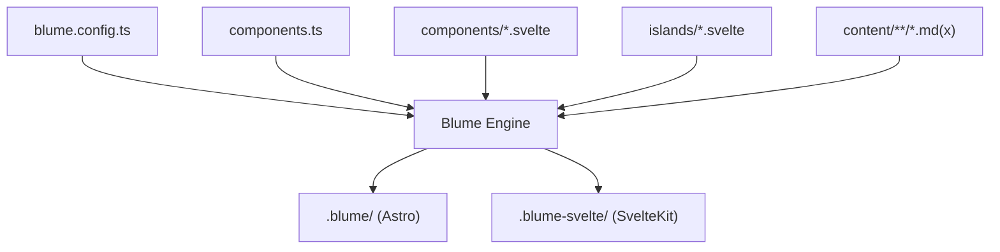
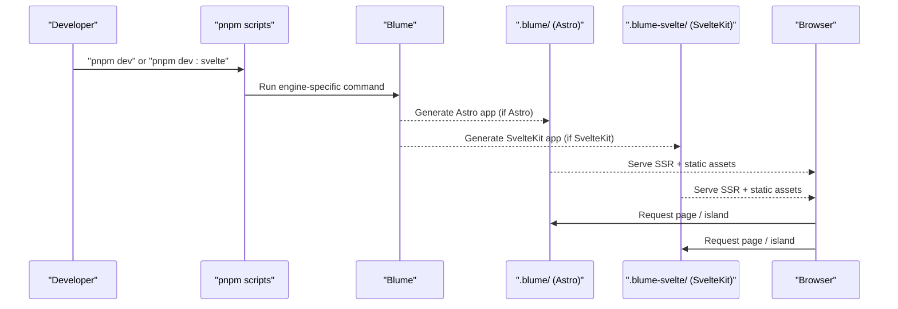
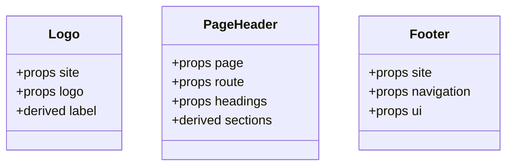
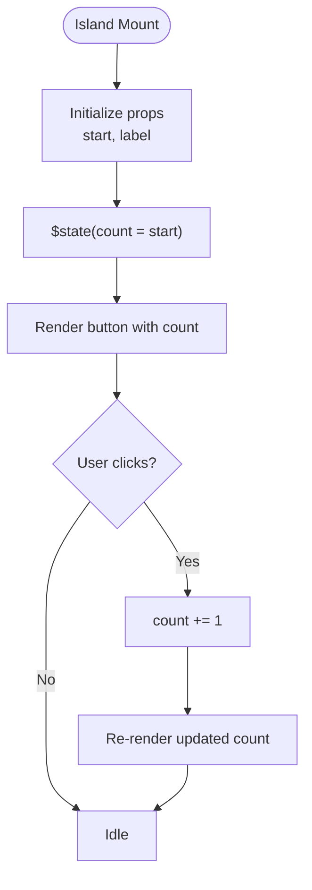
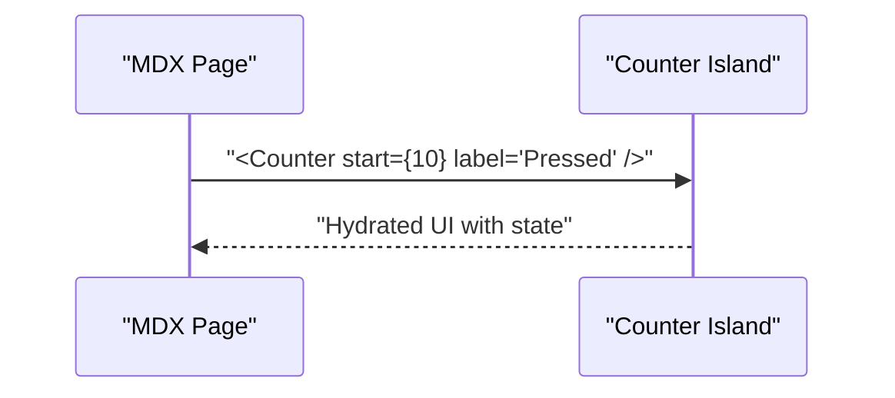
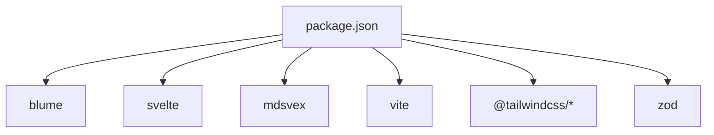

# Debugging and Troubleshooting

<cite>
**Referenced Files in This Document**
- [package.json](file://package.json)
- [blume.config.ts](file://blume.config.ts)
- [components.ts](file://components.ts)
- [README.md](file://README.md)
- [components/Footer.svelte](file://components/Footer.svelte)
- [components/Logo.svelte](file://components/Logo.svelte)
- [components/PageHeader.svelte](file://components/PageHeader.svelte)
- [islands/Counter.svelte](file://islands/Counter.svelte)
- [content/index.md](file://content/index.md)
- [content/components.mdx](file://content/components.mdx)
- [content/svelte-layer.mdx](file://content/svelte-layer.mdx)
</cite>

## Table of Contents
1. Introduction
2. Project Structure
3. Core Components
4. Architecture Overview
5. Detailed Component Analysis
6. Dependency Analysis
7. Performance Considerations
8. Troubleshooting Guide
9. Conclusion

## Introduction
This document provides a comprehensive debugging and troubleshooting guide for FractalWiki development. It covers both server-rendered layout slots and client-hydrated islands, with specific guidance on Svelte runes usage, prop validation, hydration mismatches, and tooling integration (browser devtools, Svelte DevTools, console logging). It also includes build-time error resolution, TypeScript compilation issues, dependency conflicts, performance profiling, memory leak detection, runtime error monitoring, and end-to-end troubleshooting workflows for content processing, rendering, and deployment.

## Project Structure
FractalWiki uses Blume to generate either an Astro or SvelteKit app from the same sources. The project’s key surfaces are:
- Site configuration and frontmatter schema in blume.config.ts
- Layout slot mapping in components.ts
- Server-rendered layout overrides in components/*.svelte
- Hydrated islands in islands/*.svelte
- Content pages in content/**/*.md(x)

**Diagram sources**
- [blume.config.ts:1-57](file://blume.config.ts#L1-L57)
- [components.ts:1-27](file://components.ts#L1-L27)
- [README.md:10-17](file://README.md#L10-L17)

**Section sources**
- [README.md:1-17](file://README.md#L1-L17)
- [blume.config.ts:1-57](file://blume.config.ts#L1-L57)
- [components.ts:1-27](file://components.ts#L1-L27)

## Core Components
- Layout slots (server-rendered): Logo, PageHeader, Footer are registered via components.ts and receive props from Blume. They render on the server and ship no JavaScript unless explicitly hydrated.
- Islands (client-hydrated): Any PascalCase .svelte file under islands/ is globally available in MDX pages. Default hydration is client:visible; props must be serializable.

Key implementation references:
- Slot registration and behavior: [components.ts:1-27](file://components.ts#L1-L27)
- Slot props and derived values: [components/Logo.svelte:1-50](file://components/Logo.svelte#L1-L50), [components/PageHeader.svelte:1-76](file://components/PageHeader.svelte#L1-L76), [components/Footer.svelte:1-30](file://components/Footer.svelte#L1-L30)
- Island example with runes: [islands/Counter.svelte:1-45](file://islands/Counter.svelte#L1-L45)

**Section sources**
- [components.ts:1-27](file://components.ts#L1-L27)
- [components/Logo.svelte:1-50](file://components/Logo.svelte#L1-L50)
- [components/PageHeader.svelte:1-76](file://components/PageHeader.svelte#L1-L76)
- [components/Footer.svelte:1-30](file://components/Footer.svelte#L1-L30)
- [islands/Counter.svelte:1-45](file://islands/Counter.svelte#L1-L45)

## Architecture Overview
The site runs two engines from one source tree:
- Astro engine via blume dev/build/preview
- SvelteKit engine via blume-svelte dev/build/generate

Blume infers Svelte support from .svelte files and wires up the appropriate renderer.

**Diagram sources**
- [package.json:5-14](file://package.json#L5-L14)
- [README.md:10-17](file://README.md#L10-L17)

**Section sources**
- [package.json:1-41](file://package.json#L1-L41)
- [README.md:10-17](file://README.md#L10-L17)

## Detailed Component Analysis

### Layout Slots: Logo, PageHeader, Footer
These components are server-rendered and receive typed props from Blume. Use $props() for prop destructuring and $derived for reactive computations.

**Diagram sources**
- [components/Logo.svelte:1-50](file://components/Logo.svelte#L1-L50)
- [components/PageHeader.svelte:1-76](file://components/PageHeader.svelte#L1-L76)
- [components/Footer.svelte:1-30](file://components/Footer.svelte#L1-L30)

Debugging tips:
- Validate prop shapes using TypeScript types and optional chaining to avoid null/undefined access.
- Ensure computed fields like sections and label are stable and do not cause unnecessary re-renders.
- If a slot needs collection data unavailable at render time, hydrate it or keep it as .astro.

**Section sources**
- [components/Logo.svelte:1-50](file://components/Logo.svelte#L1-L50)
- [components/PageHeader.svelte:1-76](file://components/PageHeader.svelte#L1-L76)
- [components/Footer.svelte:1-30](file://components/Footer.svelte#L1-L30)

### Island: Counter
An interactive component that demonstrates Svelte 5 runes ($state, $props) and default hydration (client:visible).

**Diagram sources**
- [islands/Counter.svelte:1-45](file://islands/Counter.svelte#L1-L45)

Debugging tips:
- Confirm hydration mode if interactivity does not trigger as expected.
- Ensure props passed from MDX are serializable and match expected types.
- Use browser devtools to inspect component state and event handlers.

**Section sources**
- [islands/Counter.svelte:1-45](file://islands/Counter.svelte#L1-L45)

### Content Processing and Usage
Pages demonstrate how islands are used without imports and how MDX integrates with Svelte components.

**Diagram sources**
- [content/svelte-layer.mdx:11-23](file://content/svelte-layer.mdx#L11-L23)
- [islands/Counter.svelte:1-45](file://islands/Counter.svelte#L1-L45)

**Section sources**
- [content/svelte-layer.mdx:11-23](file://content/svelte-layer.mdx#L11-L23)
- [content/components.mdx:1-125](file://content/components.mdx#L1-L125)

## Dependency Analysis
Key dependencies and scripts:
- Blume orchestrates both engines and Svelte integration.
- Svelte 5 powers runes and component model.
- mdsvex and related tools enable MDX features.

**Diagram sources**
- [package.json:16-39](file://package.json#L16-L39)

Common pitfalls:
- Version mismatches between Svelte, @astrojs/svelte, and blume-svelte can cause build errors.
- Ensure zod schemas align with frontmatter expectations.

**Section sources**
- [package.json:16-39](file://package.json#L16-L39)
- [blume.config.ts:29-36](file://blume.config.ts#L29-L36)

## Performance Considerations
- Prefer server-rendered layout slots for static UI to minimize client JS.
- Use islands judiciously; only include interactivity where needed.
- Avoid heavy computations in derived values; memoize when necessary.
- Profile with browser Performance tab and Memory panel to detect leaks.
- Monitor bundle size to ensure islands are tree-shaken and only included on pages that use them.

[No sources needed since this section provides general guidance]

## Troubleshooting Guide

### Development Workflow and Tooling
- Use pnpm dev for the Astro engine and pnpm dev:svelte for the SvelteKit engine.
- Inspect generated apps in .blume/ and .blume-svelte/ to understand how Blume transforms your sources.
- Enable Svelte DevTools in the browser to inspect component trees, props, and state.

**Section sources**
- [package.json:5-14](file://package.json#L5-L14)
- [README.md:10-17](file://README.md#L10-L17)

### Common Issues with Svelte Runes
- $state usage: Ensure state variables are initialized properly and updated within event handlers.
- $derived usage: Keep derived expressions pure and avoid side effects.
- $props usage: Type props explicitly and handle optional properties safely.

Symptoms:
- Unexpected re-renders or stale values.
- Runtime type errors due to missing or incorrect prop types.

Resolution:
- Add explicit TypeScript types to props and state.
- Log intermediate values during development to verify reactivity.

**Section sources**
- [islands/Counter.svelte:6-9](file://islands/Counter.svelte#L6-L9)
- [components/Logo.svelte:4-7](file://components/Logo.svelte#L4-L7)
- [components/PageHeader.svelte:10-20](file://components/PageHeader.svelte#L10-L20)

### Prop Validation and Mismatches
- Verify prop contracts match Blume’s documented payloads for each slot.
- Use optional chaining and defaults to prevent undefined access.
- For MDX islands, ensure props are serializable and correctly typed.

Checklist:
- Confirm slot props: Logo receives site/logo; PageHeader receives page/route/headings; Footer receives site/navigation/ui.
- Validate MDX usage against island prop definitions.

**Section sources**
- [components.ts:20-26](file://components.ts#L20-L26)
- [content/svelte-layer.mdx:56-67](file://content/svelte-layer.mdx#L56-L67)
- [islands/Counter.svelte:6-9](file://islands/Counter.svelte#L6-L9)

### Hydration Mismatches
Symptoms:
- Client-side hydration warnings or errors.
- Interactivity not triggering until manual refresh.

Causes:
- Props not serializable.
- Using window/document on mount without client:only.
- Inconsistent initial state between server and client.

Resolution:
- Set export const client = "only" for components accessing browser APIs on mount.
- Ensure props are simple, serializable values.
- Align initial state across server and client.

**Section sources**
- [content/svelte-layer.mdx:25-37](file://content/svelte-layer.mdx#L25-L37)
- [islands/Counter.svelte:1-45](file://islands/Counter.svelte#L1-L45)

### Build-Time Errors and TypeScript Compilation
Common causes:
- Type mismatches in props or derived values.
- Missing or incompatible dependency versions.
- Frontmatter schema changes not reflected in components.

Resolution steps:
- Run pnpm check to validate types.
- Review zod schema in blume.config.ts and ensure components consume expected fields.
- Pin compatible versions for svelte, @astrojs/svelte, and blume-svelte.

**Section sources**
- [package.json:16-39](file://package.json#L16-L39)
- [blume.config.ts:29-36](file://blume.config.ts#L29-L36)

### Dependency Conflicts
Symptoms:
- Build failures due to peer dependency conflicts.
- Runtime errors from mismatched Svelte versions.

Resolution steps:
- Align svelte version with @sveltejs/vite-plugin-svelte and @astrojs/svelte.
- Use pnpm install to resolve workspace dependencies consistently.
- Remove node_modules and reinstall if necessary.

**Section sources**
- [package.json:16-39](file://package.json#L16-L39)

### Content Processing Errors
Symptoms:
- MDX parsing errors or missing components.
- Frontmatter validation failures.

Resolution steps:
- Validate frontmatter against zod schema in blume.config.ts.
- Ensure MDX syntax is correct and custom components are available.
- Check content file paths and naming conventions.

**Section sources**
- [blume.config.ts:29-36](file://blume.config.ts#L29-L36)
- [content/components.mdx:1-125](file://content/components.mdx#L1-L125)

### Component Rendering Issues
Symptoms:
- Layout slots not appearing or displaying incorrect data.
- Islands not hydrating or showing stale state.

Resolution steps:
- Verify slot registration in components.ts.
- Inspect props passed by Blume and confirm component consumption.
- Use browser devtools to inspect rendered DOM and component state.

**Section sources**
- [components.ts:20-26](file://components.ts#L20-L26)
- [components/Logo.svelte:1-50](file://components/Logo.svelte#L1-L50)
- [components/PageHeader.svelte:1-76](file://components/PageHeader.svelte#L1-L76)
- [components/Footer.svelte:1-30](file://components/Footer.svelte#L1-L30)

### Deployment Problems
Symptoms:
- Build succeeds but preview fails.
- Assets not loading or routes misconfigured.

Resolution steps:
- Run pnpm build and pnpm preview locally to replicate production behavior.
- Verify deployment site URL in blume.config.ts.
- Check environment variables and base path settings.

**Section sources**
- [blume.config.ts:24-27](file://blume.config.ts#L24-L27)
- [package.json:5-14](file://package.json#L5-L14)

### Performance Profiling and Memory Leak Detection
Techniques:
- Use browser Performance tab to record interactions and identify bottlenecks.
- Use Memory tab to capture heap snapshots and look for retained objects.
- Isolate islands to measure their impact on bundle size and runtime.

Best practices:
- Minimize heavy computations in derived values.
- Avoid global state in islands; prefer local state and props.
- Debounce or throttle frequent updates.

[No sources needed since this section provides general guidance]

### Runtime Error Monitoring
Strategies:
- Wrap island event handlers with try/catch and log errors.
- Use console.error for actionable messages during development.
- Integrate error tracking services in production builds.

[No sources needed since this section provides general guidance]

### End-to-End Troubleshooting Workflow
1. Reproduce the issue in both engines (Astro and SvelteKit).
2. Inspect generated apps (.blume/, .blume-svelte/) to understand transformations.
3. Validate props and runes usage in components and islands.
4. Check build logs for type errors and dependency conflicts.
5. Use browser devtools to diagnose hydration and runtime issues.
6. Test content processing and frontmatter schema alignment.
7. Validate deployment configuration and preview output.

[No sources needed since this section summarizes workflow]

## Conclusion
By following the techniques and workflows outlined here, you can efficiently debug and troubleshoot FractalWiki projects. Focus on prop validation, runes correctness, hydration modes, and tooling integration. Leverage browser devtools and Svelte DevTools for deep inspection, and maintain strict type safety and dependency alignment to prevent build-time and runtime issues.

[No sources needed since this section summarizes without analyzing specific files]