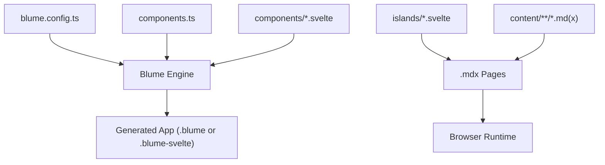
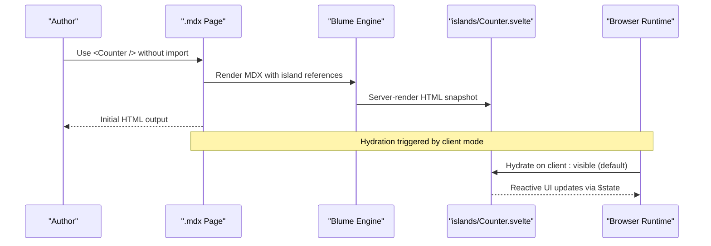
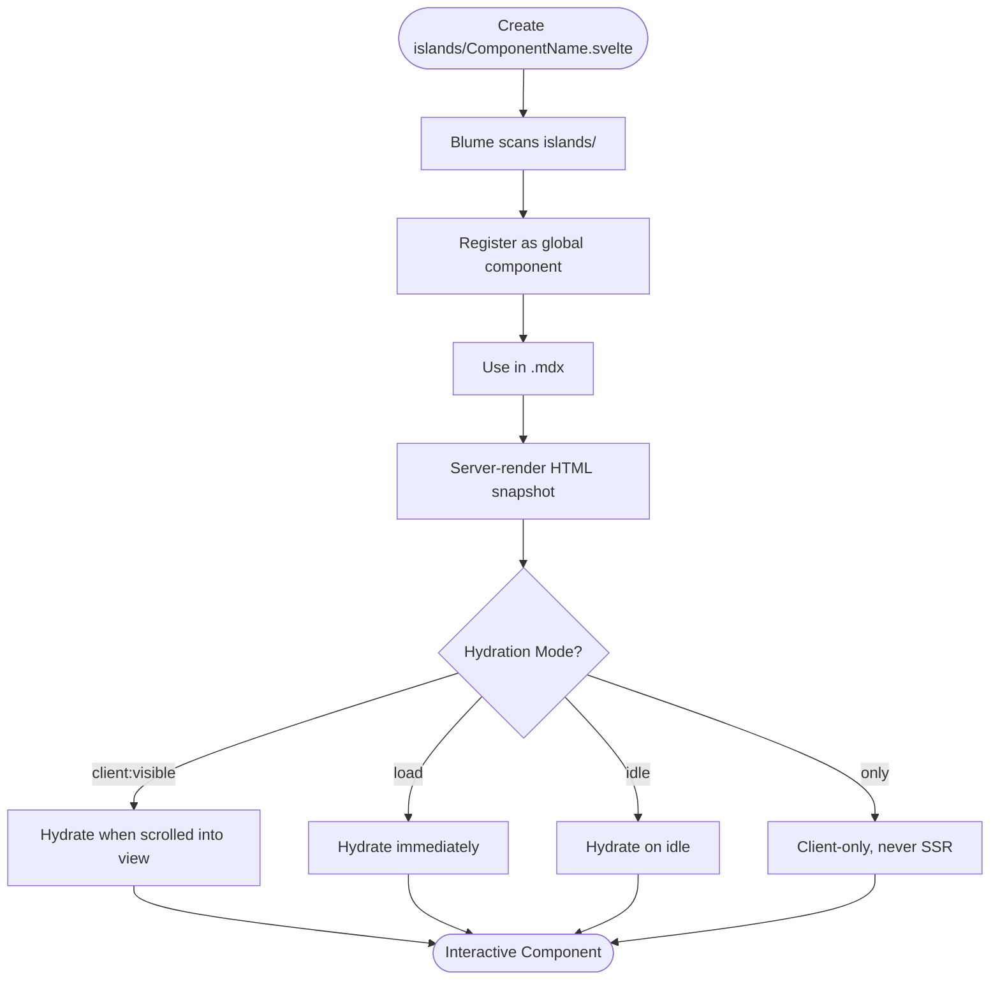
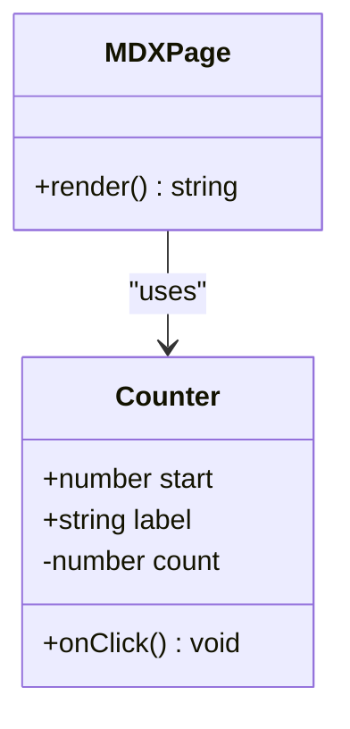
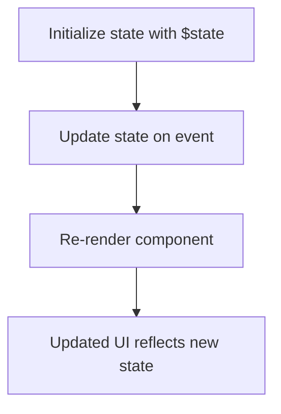
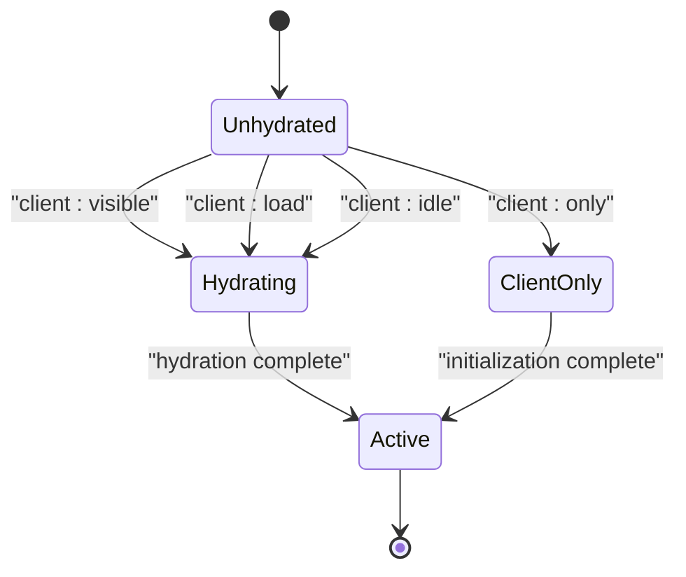
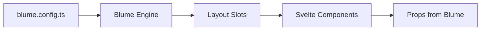
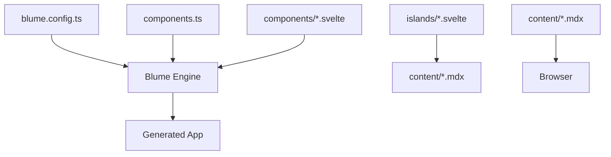

# Interactive Islands

<cite>
**Referenced Files in This Document**
- [README.md](file://README.md)
- [blume.config.ts](file://blume.config.ts)
- [components.ts](file://components.ts)
- [islands/Counter.svelte](file://islands/Counter.svelte)
- [content/svelte-layer.mdx](file://content/svelte-layer.mdx)
- [content/components.mdx](file://content/components.mdx)
- [content/index.md](file://content/index.md)
- [package.json](file://package.json)
- [components/Footer.svelte](file://components/Footer.svelte)
- [components/Logo.svelte](file://components/Logo.svelte)
- [components/PageHeader.svelte](file://components/PageHeader.svelte)
</cite>

## Table of Contents
1. [Introduction](#introduction)
2. [Project Structure](#project-structure)
3. [Core Components](#core-components)
4. [Architecture Overview](#architecture-overview)
5. [Detailed Component Analysis](#detailed-component-analysis)
6. [Dependency Analysis](#dependency-analysis)
7. [Performance Considerations](#performance-considerations)
8. [Troubleshooting Guide](#troubleshooting-guide)
9. [Conclusion](#conclusion)
10. [Appendices](#appendices)

## Introduction
This document explains the interactive island architecture in FractalWiki, where Svelte components placed under islands/ are automatically discoverable and usable in MDX pages without explicit imports. It covers how Blume integrates with Svelte 5 runes for reactive state, automatic hydration strategies (including client:visible), and performance benefits from shipping JavaScript only for components that are actually used. It also documents naming conventions, file structure requirements, props passing, event handling, composition patterns, and integration with Blume’s content system.

## Project Structure
FractalWiki uses a clear separation between layout overrides and interactive islands:
- blume.config.ts configures site metadata, content root, navigation, i18n, and frontmatter schema.
- components.ts maps Blume layout slots to Svelte components.
- components/*.svelte are static layout overrides rendered on the server by default.
- islands/*.svelte are interactive components available globally in .mdx pages.
- content/** contains MDX/Markdown pages that reference islands directly.

**Diagram sources**
- [blume.config.ts:1-57](file://blume.config.ts#L1-L57)
- [components.ts:1-27](file://components.ts#L1-L27)
- [content/index.md:1-39](file://content/index.md#L1-L39)

**Section sources**
- [blume.config.ts:1-57](file://blume.config.ts#L1-L57)
- [components.ts:1-27](file://components.ts#L1-L27)
- [content/index.md:1-39](file://content/index.md#L1-L39)

## Core Components
- Layout slots: Static Svelte components registered in components.ts replace Blume’s built-in Astro components. They render on the server and ship no JavaScript unless explicitly configured otherwise.
- Islands: Any PascalCase .svelte file in islands/ becomes a component usable in any .mdx page without import. Islands hydrate by default on client:visible and ship JavaScript only when used.

Key examples:
- Counter island demonstrates reactive state with Svelte 5 runes ($state) and event handling via inline handlers.
- Layout components like Logo, PageHeader, and Footer show how props are passed from Blume into Svelte components.

**Section sources**
- [README.md:73-85](file://README.md#L73-L85)
- [components.ts:1-27](file://components.ts#L1-L27)
- [islands/Counter.svelte:1-45](file://islands/Counter.svelte#L1-L45)
- [components/Logo.svelte:1-50](file://components/Logo.svelte#L1-L50)
- [components/PageHeader.svelte:1-76](file://components/PageHeader.svelte#L1-L76)
- [components/Footer.svelte:1-30](file://components/Footer.svelte#L1-L30)

## Architecture Overview
The island pattern enables zero-import usage of interactive components within MDX. Blume scans islands/, infers framework support from .svelte files, and wires up @astrojs/svelte automatically. Islands are hydrated lazily based on client mode, optimizing runtime cost.

**Diagram sources**
- [content/svelte-layer.mdx:11-23](file://content/svelte-layer.mdx#L11-L23)
- [islands/Counter.svelte:1-45](file://islands/Counter.svelte#L1-L45)
- [README.md:73-85](file://README.md#L73-L85)

## Detailed Component Analysis

### Island Pattern and Automatic Discovery
- File location: islands/*.svelte
- Naming convention: PascalCase filenames map to global component names in MDX.
- Usage: Reference components directly in .mdx without import statements.
- Hydration: Default is client:visible; can be overridden per island using export const client or descriptor form in components.ts.

**Diagram sources**
- [README.md:73-85](file://README.md#L73-L85)
- [content/svelte-layer.mdx:25-37](file://content/svelte-layer.mdx#L25-L37)

**Section sources**
- [README.md:73-85](file://README.md#L73-L85)
- [content/svelte-layer.mdx:11-23](file://content/svelte-layer.mdx#L11-L23)

### Props Passing and Event Handling
- Props are destructured using Svelte 5 $props() with TypeScript types.
- Events are handled via inline arrow functions or method references.
- Example: Counter island accepts start and label props, increments count on click.

**Diagram sources**
- [islands/Counter.svelte:1-45](file://islands/Counter.svelte#L1-L45)
- [content/svelte-layer.mdx:16-20](file://content/svelte-layer.mdx#L16-L20)

**Section sources**
- [islands/Counter.svelte:1-45](file://islands/Counter.svelte#L1-L45)
- [content/svelte-layer.mdx:16-20](file://content/svelte-layer.mdx#L16-L20)

### Svelte 5 Runes for Reactive State
- $state: Declares reactive variables that trigger re-renders when updated.
- $derived: Computes derived values reactively.
- Example: Counter uses $state for count, Logo uses $derived for label computation.

**Diagram sources**
- [islands/Counter.svelte:6-8](file://islands/Counter.svelte#L6-L8)
- [components/Logo.svelte:4-6](file://components/Logo.svelte#L4-L6)

**Section sources**
- [islands/Counter.svelte:6-8](file://islands/Counter.svelte#L6-L8)
- [components/Logo.svelte:4-6](file://components/Logo.svelte#L4-L6)

### Hydration Strategies
- client:visible (default): Hydrates when component scrolls into viewport.
- load: Hydrates immediately on page load.
- idle: Hydrates when browser is idle.
- only: Client-only rendering, no server-side HTML.

**Diagram sources**
- [content/svelte-layer.mdx:25-37](file://content/svelte-layer.mdx#L25-L37)
- [README.md:83-85](file://README.md#L83-L85)

**Section sources**
- [content/svelte-layer.mdx:25-37](file://content/svelte-layer.mdx#L25-L37)
- [README.md:83-85](file://README.md#L83-L85)

### Integration with Blume’s Content System
- blume.config.ts defines content root, navigation, i18n, and frontmatter schema.
- Components receive props from Blume (e.g., site, page, headings).
- Virtual modules like blume:data are Astro-only; Svelte slots use props instead.

**Diagram sources**
- [blume.config.ts:1-57](file://blume.config.ts#L1-L57)
- [components.ts:1-27](file://components.ts#L1-L27)

**Section sources**
- [blume.config.ts:1-57](file://blume.config.ts#L1-L57)
- [components.ts:1-27](file://components.ts#L1-L27)

## Dependency Analysis
The project has clear dependencies between configuration, components, and content:
- blume.config.ts provides site configuration.
- components.ts registers layout slots.
- islands/*.svelte are independent interactive components.
- content/*.mdx references islands directly.

**Diagram sources**
- [blume.config.ts:1-57](file://blume.config.ts#L1-L57)
- [components.ts:1-27](file://components.ts#L1-L27)
- [content/svelte-layer.mdx:1-68](file://content/svelte-layer.mdx#L1-L68)

**Section sources**
- [blume.config.ts:1-57](file://blume.config.ts#L1-L57)
- [components.ts:1-27](file://components.ts#L1-L27)
- [content/svelte-layer.mdx:1-68](file://content/svelte-layer.mdx#L1-L68)

## Performance Considerations
- Zero JS by default: Layout slots render server-side without JavaScript unless explicitly configured.
- Lazy hydration: Islands hydrate on client:visible by default, reducing initial bundle size.
- Tree-shaking: JavaScript is shipped only for components actually used in pages.
- Efficient reactivity: Svelte 5 runes minimize unnecessary re-renders.

[No sources needed since this section provides general guidance]

## Troubleshooting Guide
Common issues and solutions:
- Component not found: Ensure PascalCase filename in islands/ directory.
- Props not working: Verify prop types match expected interface.
- Hydration timing: Adjust client mode if component needs immediate interaction.
- Astro virtual modules: Avoid importing blume:data in Svelte slots; use props instead.

**Section sources**
- [README.md:87-99](file://README.md#L87-L99)
- [content/svelte-layer.mdx:64-67](file://content/svelte-layer.mdx#L64-L67)

## Conclusion
The island architecture in FractalWiki provides a powerful way to add interactivity to MDX content with minimal overhead. By leveraging Svelte 5 runes, automatic discovery, and intelligent hydration strategies, developers can create responsive components that enhance user experience while maintaining optimal performance. The clear separation between layout slots and islands ensures maintainability and scalability.

[No sources needed since this section summarizes without analyzing specific files]

## Appendices

### Practical Examples

#### Basic Island Usage
Reference an island component in MDX without imports:
- Path: [content/svelte-layer.mdx:16-20](file://content/svelte-layer.mdx#L16-L20)

#### Props and Events
Pass props and handle events in island components:
- Path: [islands/Counter.svelte:6-14](file://islands/Counter.svelte#L6-L14)

#### Hydration Configuration
Set custom hydration modes:
- Path: [content/svelte-layer.mdx:25-37](file://content/svelte-layer.mdx#L25-L37)

#### Layout Slot Integration
Register layout components in components.ts:
- Path: [components.ts:20-26](file://components.ts#L20-L26)

**Section sources**
- [content/svelte-layer.mdx:16-20](file://content/svelte-layer.mdx#L16-L20)
- [islands/Counter.svelte:6-14](file://islands/Counter.svelte#L6-L14)
- [content/svelte-layer.mdx:25-37](file://content/svelte-layer.mdx#L25-L37)
- [components.ts:20-26](file://components.ts#L20-L26)